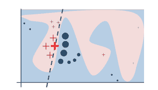
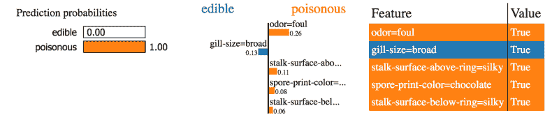
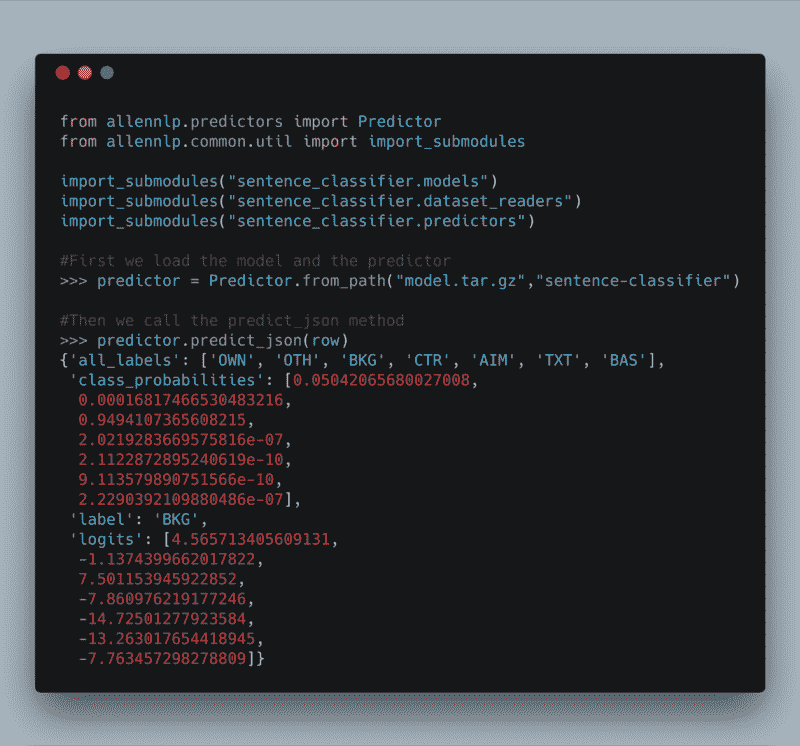
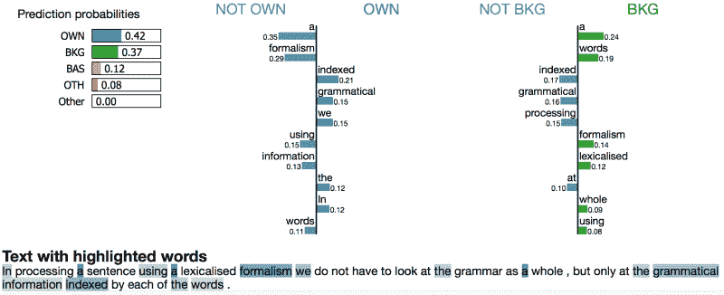
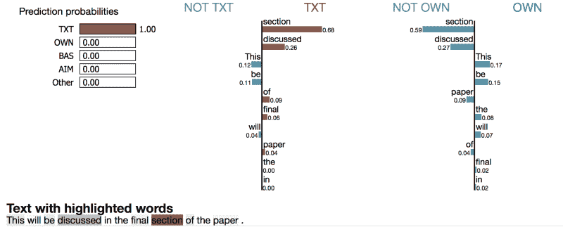
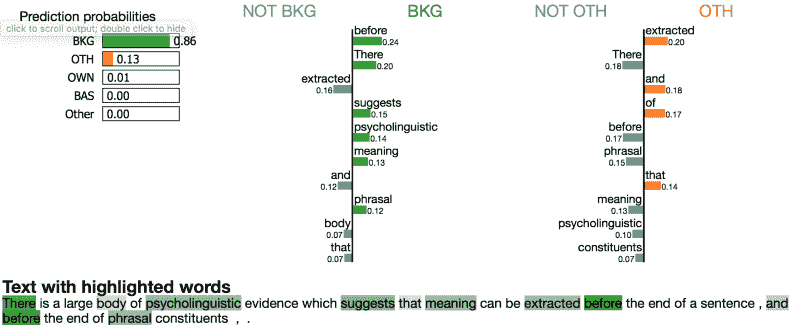

# 如何通过用石灰解释预测来改进您的机器学习模型

> 原文：<https://www.freecodecamp.org/news/how-to-improve-your-machine-learning-models-by-explaining-predictions-with-lime-7493e1d78375/>

作者德博拉·梅斯基塔

# 如何通过用石灰解释预测来改进您的机器学习模型

#### 增加用户的信任度，更快地发现 bug


With LIME we can have discussions like this about our models with everyone (thanks [Štefan](https://unsplash.com/@cikstefan) for the pic!)

尽管我们喜欢从不犯错的想法，但每个软件都可能包含错误。假设我们可能在现实世界中使用机器学习模型来做决策，我们代码中的一个 bug 可能是非常危险的。仅仅依靠预测准确性可能不是一个好主意，因为如果我们得到一个好的准确性分数，我们甚至可能不会考虑到我们的数据管道中有一个错误。

[https://www.youtube.com/embed/veiLCvcLIg8](https://www.youtube.com/embed/veiLCvcLIg8)

大多数机器学习算法都是黑盒，但 [LIME](https://github.com/marcotcr/lime) 有一个大胆的价值主张:**解释任何预测模型的结果**。该工具可以解释用文本、分类或连续数据训练的模型。今天我们将解释一个模型的预测，这个模型被训练来对科学文章的句子进行分类。

首先让我们了解石灰是如何工作的。然后我会告诉你如何建立一个深度学习模型来对句子进行分类(使用 AllenNLP)并用 LIME 解释预测。

### 局部可解释的模型不可知解释(LIME)

当算法不尝试使用模型的决策函数时，将使用模型不可知预测。LIME 使用**局部保真度**标准:

> [……]为了使解释有意义，它必须至少是局部可信的，即**它必须对应于模型在被预测实例附近的行为**。— [里贝罗、马尔科·图利奥、萨梅尔·辛格和卡洛斯·盖斯特林](https://arxiv.org/abs/1602.04938)

为了创造这个实例附近，石灰扰乱它将解释的实例。作者还指出**局部保真度并不意味着全局保真度**:

> […] **在全球范围内重要的特性在本地环境中可能并不重要，反之亦然**。虽然全局保真意味着局部保真，但识别可解释的全局保真解释对于复杂模型来说仍然是一个挑战。— [里贝罗、马尔科·图利奥、萨梅尔·辛格和卡洛斯·盖斯特林](https://arxiv.org/abs/1602.04938)

下图展示了一个展示石灰如何工作的玩具示例。这摘自[介绍算法](https://arxiv.org/abs/1602.04938)的论文。



The red and blue areas represent the model complex decision function, which is unknown to LIME. The bold red cross is the data instance we want to explain.

红色的十字和蓝色的圆圈是 LIME 随机统一创建的示例实例。LIME 获得对这些实例的预测，并通过与被解释的实例的接近程度对它们进行加权——粗体的红叉。在图像中，接近度由每个十字和每个圆的**大小**表示。虚线代表的解释是局部的，但不是全局的。

这是用石灰制作的蘑菇分类:



Explanation for categorical data

该模型预测蘑菇是否有毒。我们可以看到,`odor=foul`表示有毒的蘑菇。

> 由于我们根据原始训练分布扰动每个分类特征抽取样本，因此对此的解释方式是:**如果气味不是恶臭的，平均而言，该预测将少 0.26 个“有毒的”**——[表格数据教程](https://marcotcr.github.io/lime/tutorials/Tutorial%20-%20continuous%20and%20categorical%20features.html)

现在让我们看看如何使用该工具。

### 用石灰解释预测

有三种类型的解释者:

*   **LimeTabularExplainer** :解释对表格或矩阵数据的预测
*   **limimageexplainer**:解释对图像数据的预测
*   **LimeTextExplainer** :解释文本分类器

在本文中，我们将使用 **LimeTextExplainer。**这里有[所有其他讲解者的教程](https://github.com/marcotcr/lime)。

目前，该工具将解释限制为文档中出现的单词，[，如这里所解释的](https://github.com/marcotcr/lime/blob/226c758cdc58d77b534278d30e2c83438ecd865a/lime/lime_text.py#L292)。

为了构建 LimeTextExplainer，我们只需要提供类名，也就是标签。解释一个实例意味着我们需要传递实例数据**和**一个提供预测的函数。为此，我们需要一个训练有素的模型。让我们使用 AllenNLP 构建一个。

### 艾伦 LP

[**AllenNLP**](http://allennlp.org/) 是一个为自然语言处理建立深度学习模型的框架。**这是一个神奇的工具。**我仍然喜欢它如何让构建深度学习模型的任务变得如此简单。

我们将要建立的模型使用单词嵌入来编码输入，并且网络具有 LSTM 细胞。

如果你需要了解更多关于 LSTM 和 RNN 细胞的知识，可以看看我写的另一篇文章。**我还会在**更详细地解释【AllenNLP 是如何工作的。

有了这个框架，我们在一个 JSON 文件中定义了模型架构。这是我们模型的架构:

```
{
  "dataset_reader": {
    "type": "az_papers"
  },
  "train_data_path": "../../data/AZ_distribution/train/",
  "model": {
    "type": "sentence_classifier",
    "text_field_embedder": {
      "tokens": {
        "type": "embedding",
        "pretrained_file": "https://s3-us-west-2.amazonaws.com/allennlp/datasets/glove/glove.6B.100d.txt.gz",
        "embedding_dim": 100,
        "trainable": false
      }
    },
    "title_encoder": {
      "type": "lstm",
      "bidirectional": true,
      "input_size": 100,
      "hidden_size": 100,
      "num_layers": 1,
      "dropout": 0.2
    },
    "sentence_encoder": {
      "type": "lstm",
      "bidirectional": true,
      "input_size": 100,
      "hidden_size": 100,
      "num_layers": 1,
      "dropout": 0.2
    },
    "classifier_feedforward": {
      "input_dim": 400,
      "num_layers": 2,
      "hidden_dims": [200, 7],
      "activations": ["relu", "linear"],
      "dropout": [0.2, 0.0]
    }
  },
  "iterator": {
    "type": "bucket",
    "sorting_keys": [["sentence", "num_tokens"], ["title", "num_tokens"]],
    "batch_size": 64
  },
  "trainer": {
    "num_epochs": 40,
    "patience": 10,
    "cuda_device": -1,
    "grad_clipping": 5.0,
    "validation_metric": "+accuracy",
    "optimizer": {
      "type": "adagrad"
    }
  }
}
```

如果你是 AllenNLP 的新手，这可能没有任何意义。这篇文章的目标是展示如何使用石灰，所以我们不会深究。我试图在这篇文章中解释更多关于 AllenNLP 的内容。当然，[训练模型的全部代码都在这里](https://github.com/dmesquita/explaining_predictions_with_LIME)。

数据集为原[议论文分区语料库【AZ 语料库】](https://www.cl.cam.ac.uk/~sht25/AZ_corpus.html)。它由 80 篇 AZ 注释的计算语言学会议文章组成，最初摘自 arXiv。每个句子都有这样一个标签:

*   BKG:一般科学背景
*   OTH:对他人作品的中性描述
*   OWN:对自己新作品的中性描述
*   目标:陈述当前文件的特定目标
*   TXT:当前论文的文本组织陈述(在第一章中，我们介绍…)
*   CTR:对其他作品的对比或比较陈述；明确提及其他工作的缺点
*   BAS:声明自己的工作基于其他工作

为了训练模型，我们使用以下命令:

```
python3 run.py train experiments/the_file_presented_before.json  
--include-package newsgroups.dataset_readers 
--include-package newsgroups.models 
-s /tmp/our_model 
```

### 解释模型预测

为了预测每个句子的类别，我们使用论文的`title`和`sentence`本身。对于 AllenNLP，我们是这样做的:



Making predictions with AllenNLP

正如我前面所说的，`LimeTextExplainer.explain_instance()`的两个关键参数是实例本身和一个返回每个类的预测概率的函数——就像 scikit-learn 的 [predict_proba](http://scikit-learn.org/stable/modules/generated/sklearn.ensemble.RandomForestClassifier.html#sklearn.ensemble.RandomForestClassifier.predict_proba) 函数。在这里，这个函数获取一列 **d** 字符串，并输出一个带有预测概率的( **d** ， **n_classes** ) NumPy 数组。

该算法通过删除单个单词的所有出现并获得新出现的预测概率来干扰输入数据。我只对干扰输入的`sentence`部分的单词感兴趣，所以我是这样定义函数的:

```
#For each perturbed sentence we get the predict_proba from AllenNLP

predict_function = lambda x: np.array([predictor.predict_json(json.loads('{"title": "Incremental Interpretation of Categorial Grammar","sentence":"'+s+'"}'))['class_probabilities'] for s in x])
```

然后我们导入 LIME，设置`class_names`，调用 `explain_instance`方法:

```
from lime.lime_text import LimeTextExplainer

explainer = LimeTextExplainer(class_names=['OWN', 'OTH', 'BKG', 'CTR', 'AIM', 'TXT', 'BAS'])

row = json.loads('{"title": "Incremental Interpretation of Categorial Grammar", "sentence": "In processing a sentence using a lexicalised formalism we do not have to look at the grammar as a whole , but only at the grammatical information indexed by each of the words ."}')

exp = explainer.explain_instance(row["sentence"], predict_fn, num_features=10,top_labels=2)

#Show the results in notebook
exp.show_in_notebook(text=False)
```

这是结果:



这个句子被归类为“自己的——作者作品的描述”。我们可以看到为什么:单词“索引”、“语法”和“我们”。

看起来“the”这个词和我们自己有很高的相关性。这可能仅仅是因为**局部保真度**的缘故，也许去掉停用词是个好主意。

让我们来看看其他例子:



This one was easy to classify



Explanation for a general scientific background sentence

### 外卖食品

看到 LIME 的能力，我认为**能够理解预测背后的原因是每个机器学习项目的必要条件** **。**尤其是当我们的兴趣不仅仅是考虑结果的准确性时。

这些解释可以帮助用户相信预测，但也可以帮助我们——数据科学家——识别错误或不按预期工作的事情。

我正在做一个使用分类数据的项目。因为我使用 LIME 来解释预测，所以我能够在过程的早期发现一个 bug。预测的原因是没有意义的，这使我深入挖掘代码并找到错误。如果我只依赖模型的准确性，我会花很长时间来找到错误，因为模型有相当好的准确性分数。

**所以** **如果你正在构建机器学习模型，请尝试一下 LIME！**要了解更多信息，你可以[阅读报纸](https://arxiv.org/abs/1602.04938)和[查看 GitHub 上的回购](https://github.com/marcotcr/lime)。

如果你在从事 NLP 和深度学习，也要检查一下 [AllenNLP](https://allennlp.org/tutorials) 。

本文的所有代码都可以在这里找到。感谢您的阅读！？

如果你觉得这篇文章有帮助，如果你点击？？并在网上分享。

关注我，获取更多关于数据科学和机器学习的文章。