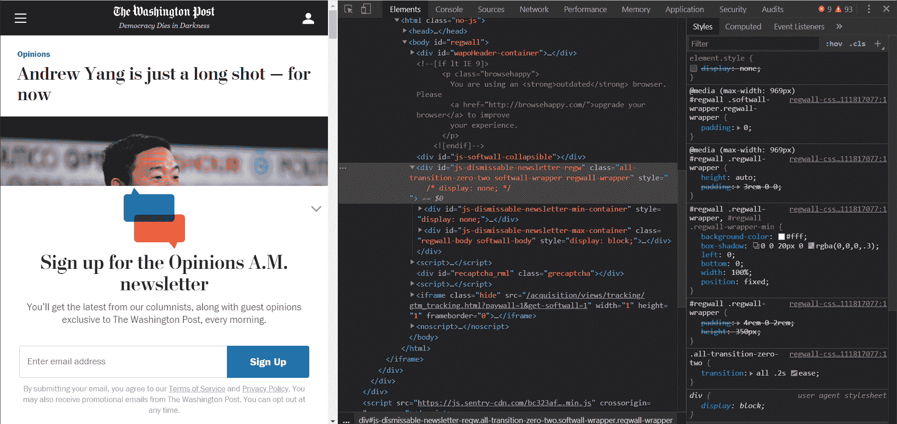
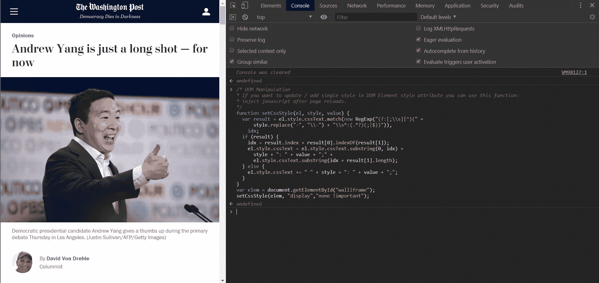
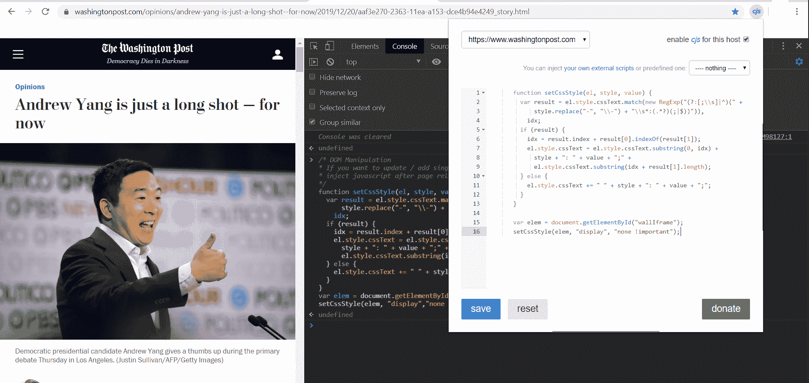

# 如何注入 JavaScript 代码自动操纵网站

> 原文：<https://www.freecodecamp.org/news/how-to-inject-javascript-code-to-manipulate-websites-automatically/>

作为互联网的开发者和用户，我们经常会遇到显示许多弹出窗口的网站，从订阅请求到付费墙、广告到通知等等。

很多时候，我们每天使用这些网站做各种事情，一遍又一遍地看到那些弹出窗口会变得陈旧！

开发人员可以通过进入控制台，找到选择器，通过添加或修改 CSS 或 JavaScript 来操纵网站的[文档对象模型](https://en.wikipedia.org/wiki/Document_Object_Model) (DOM)，从而绕过这些问题。

但现在，由于谷歌 Chrome 及其扩展商店，任何人都可以自动向任何网站注入代码。我们将在这个小指南中一步一步地完成这个过程。

### 1.安装扩展以注入代码

以下仅适用于使用[谷歌 Chrome](https://google.com/chrome) 的情况。安装扩展[自定义网站 JavaScript】。这个小小的扩展允许你在任何网站上自动运行 JavaScript，并且它保存代码以备将来在你的网络浏览器中访问。](https://chrome.google.com/webstore/detail/custom-javascript-for-web/poakhlngfciodnhlhhgnaaelnpjljija?hl=en)

首先，访问经常出现令人讨厌的弹出窗口的网站。对于本教程，我使用华盛顿邮报的网站:



Screenshot showing The Washington Post’s website with an article mentioning Andrew Yang, also Chrome’s developer tools.

### 2.定位 DOM 元素并创建注入代码

按 F12 打开你的 Chrome 开发者工具，然后识别弹出的元素。

在这个例子中，ID 为`wallIframe`的`iframe`元素包含了一个弹出窗口，它的背景有些褪色。

现在，我们将使用一个小的 JavaScript 片段来添加自定义 CSS，并检查我们是否可以隐藏弹出窗口。

```
/* DOM Manipulation
* If you want to update / add single style in DOM Element style attribute you can use this function:
* inject javascript after page reloads.
*/

function setCssStyle(el, style, value) {
  var result = el.style.cssText.match(new RegExp("(?:[;\\s]|^)(" +
      style.replace("-", "\\-") + "\\s*:(.*?)(;|$))")),
    idx;
  if (result) {
    idx = result.index + result[0].indexOf(result[1]);
    el.style.cssText = el.style.cssText.substring(0, idx) +
      style + ": " + value + ";" +
      el.style.cssText.substring(idx + result[1].length);
  } else {
    el.style.cssText += " " + style + ": " + value + ";";
  }
}
var element = document.getElementById("wallIframe");
setCssStyle(element, "display","none !important");
```

如你所见，在上面的代码中，我们突出显示了元素`wallIframe`，并通过添加内联 CSS 隐藏了它。

### 3.测试注入代码

在 Chrome 开发者控制台中测试你的代码，确保它能正常工作。



Screenshot showing The Washington Post’s website with an article mentioning Andrew Yang, also Chrome’s developer tools.

正如您在上面看到的，代码是有效的。

现在是时候将它添加到扩展中了，[为网站定制 JavaScript】，并测试代码在未来的访问中是否有效。要添加它，左键单击地址栏上的扩展图标并添加自定义片段，然后单击保存。](https://chrome.google.com/webstore/detail/custom-javascript-for-web/poakhlngfciodnhlhhgnaaelnpjljija?hl=en)

该页面将立即重新加载，以尝试和测试您添加的代码。



Screenshot showing The Washington Post’s website with an article mentioning Andrew Yang, also Chrome’s developer tools.

## 4.注射码没用，现在怎么办？

测试后，iframe 并没有像我们在控制台中测试时那样消失。原因之一可能是 iframe 在页面加载 X 秒后加载。

我们可以查看网络日志，看看是不是这样。但是为了节省时间，我们将尝试在我们的原始代码片段中添加一个超时功能，看看是否有帮助。

```
setTimeout(
     function() {
       function setCssStyle(el, style, value) {
         var result = el.style.cssText.match(new RegExp("(?:[;\\s]|^)(" +
             style.replace("-", "\\-") + "\\s*:(.*?)(;|$))")),
           idx;
         if (result) {
           idx = result.index + result[0].indexOf(result[1]);
           el.style.cssText = el.style.cssText.substring(0, idx) +
             style + ": " + value + ";" +
             el.style.cssText.substring(idx + result[1].length);
         } else {
           el.style.cssText += " " + style + ": " + value + ";";
         }
       }

       var element = document.getElementById("wallIframe");
       setCssStyle(element, "display", "none !important");
     }, 10000);
```

现在代码在执行前等待 10 秒，然后*瞧*它完美地工作了*。*

您还可以添加一个事件侦听器来等待页面完全加载。

### 5.最后的想法

例如:

```
document.addEventListener("DOMContentLoaded", function() { 
    // Your function goes here
}
```

但是，如果我们在 X 秒后添加弹出代码，上面的功能就不起作用了，所以最好坚持超时功能。

您还可以使用该扩展来添加许多其他很酷的片段，例如阻止广告、阻止弹出窗口、增加网站的标准字体、提高响应能力、更新外观等等。一旦添加了 JavaScript 代码片段，它们将在以后访问这些网站时一直运行。

> 特别感谢来自 freeCodeCamp 的 Abbey Rennemeyer 在准备本文时提供的编辑反馈。

**免责声明:**本文表达的观点仅代表作者个人观点，不代表卡内基梅隆大学或其他(直接或间接)与作者相关的公司的观点。这些文章并不是最终产品，而是当前思想的反映，同时也是讨论和改进的催化剂。

你可以在:[我的个人网站](https://www.robertoiriondo.com/)、[媒体](https://medium.com/@robiriondo)、 [Instagram](https://www.instagram.com/robiriondo/hl=en) 、 [Twitter](https://twitter.com/robiriondo?lang=en) 、[脸书](https://www.facebook.com/robiriondo/)、 [LinkedIn](https://www.linkedin.com/in/robiriondo) 或者通过我的 [SEO 公司](https://www.daibuilds.com/seo-services/)找到我。