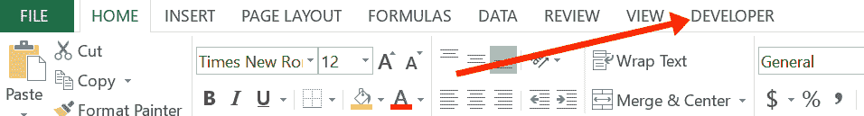
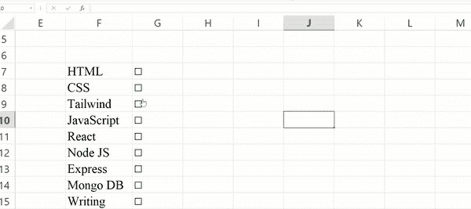

# 如何在 Excel 中插入复选框

> 原文：<https://www.freecodecamp.org/news/how-to-insert-a-checkbox-in-excel/>

Microsoft Excel 是一个动态数据分析工具，几乎可以用来做任何事情。从图表、图形和财务分析到交互式表单和待办事项列表，它让您无所不包。

如果您想使用 Excel 制作待办事项列表、交互式表单或可打印表单，那么您可能需要插入一个复选框。

在本文中，我将向您展示如何使用 Developer 选项卡在 Excel 中插入复选框。

在 Excel 中，默认情况下不显示开发人员工具，所以您可能会问…

## 如何在 Excel 中启用开发人员工具？

**第一步:**右键点击菜单栏上的任意位置，选择“自定义功能区”。

**第二步:**在主标签下，勾选“开发者”，点击确定。

现在开发者标签页将显示在菜单栏中:

## 如何在 Excel 中插入复选框

确保 developer 选项卡现在显示在菜单栏中后，您现在可以通过 3 次单击来插入复选框。

**步骤 1:** 点击开发者标签，选择插入。

**第二步:**在“表单控件”下，选择勾号符号。

**第四步:**点击要插入复选框的单元格。

这绝对不是你想要的复选框。

要将其移动到单元格中，按住键盘上的控制键，单击并拖动到所需的单元格:

如果您不想让文本出现在那里，请再次按住 control 键并点按包含复选框的单元格，然后使用退格键删除文本。

## 如何在 Excel 中复制复选框

**第一步:**点击一个空单元格。

**步骤 2:** 使用必要的滚动按钮(向上、向左、向右或向下)将绿色框移动到包含复选框的单元格。

**第三步:**按住 shift 键，选择想要复选框的列，按`Control` + `D`。

## 如何将复选框链接到 Excel 中的单元格

**第一步:**右键点击包含复选框的单元格，选择“格式控制…”。

**第二步:**点击单元格链接前面的单元格图标。

**第三步:**选择要链接到复选框的单元格，再次点击单元格图标，点击确定。

现在，任何时候您选中那个框，TRUE 就会出现在单元格中，当您取消选中它时，FALSE 就会出现:

如果需要该功能，您可以对其他复选框重复该过程。

## 结论

在本文中，您已经看到在 Excel 中插入复选框并不麻烦。

这对于使用 Excel 时的工作效率有着至关重要的影响，尤其是当您需要选择和取消选择表单中的选项时。

感谢您的阅读。