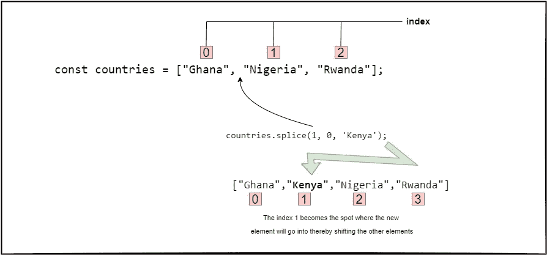

# 如何在 JS 中将一个元素插入到一个数组中

> 原文：<https://www.freecodecamp.org/news/how-to-insert-an-element-into-an-array-in-javascript/>

数组数据类型是处理有序值列表时最常用的数据类型之一。

每个值被称为一个具有唯一`id`的元素。它存储可以通过单个变量访问的各种数据类型的元素。

实际上，一个数组可以保存一个用户列表，我们可能需要在数组的最后一个元素之后、第一个元素之前或者在数组中任何指定的位置添加一个或多个元素。

这篇文章将向你展示如何使用 JavaScript 在数组中插入一个元素。如果您赶时间，下面是我们将在本文中深入讨论的方法:

```
// Add to the start of an array
Array.unshift(element);

// Add to the end of an array
Array.push(element);

// Add to a specified location
Array.splice(start_position, 0, new_element...);

// Add with concat method without mutating original array
let newArray = [].concat(Array, element); 
```

*   当你想在数组末尾添加一个元素时，使用`push()`。
*   如果你需要在数组的开头添加一个元素，使用`unshift()`。
*   如果你想添加一个元素到数组的特定位置，使用`splice()`。
*   最后，当您想要维护您的原始数组时，您可以使用`concat()`方法。

## 如何用`unshift()`方法推到数组的开头

在 JavaScript 中，使用`unshift()`方法将一个或多个元素添加到数组的开头，并在添加新元素后返回数组的长度。

如果我们有一个国家数组，并且想要在“尼日利亚”之前添加一个国家，该国家当前位于第一个索引`0`，我们可以使用`unshift()`方法来实现，如下所示:

```
const countries = ["Nigeria", "Ghana", "Rwanda"];

countries.unshift("Kenya");

console.log(countries); // ["Kenya","Nigeria","Ghana","Rwanda"] 
```

正如我们所说的，我们也可以使用`unshift()`方法添加多个元素:

```
const countries = ["Nigeria", "Ghana", "Rwanda"];

countries.unshift("South Africa", "Mali", "Kenya");

console.log(countries); // ["South Africa","Mali","Kenya","Nigeria","Ghana","Rwanda"] 
```

在我们对`unshift()`方法的解释中，我们也说过它返回新数组的长度，这是真的:

```
const countries = ["Nigeria", "Ghana", "Rwanda"];

let countriesLength = countries.unshift("South Africa", "Mali", "Kenya");

console.log(countriesLength); // 6 
```

## 如何用`push()`方法推到数组的末尾

`push()`方法类似于`unshift()`方法，因为它将一个元素添加到数组的末尾而不是开头。它返回新数组的长度，像`unshift()`方法一样，可以用来添加多个元素。

让我们再次尝试同样的例子，但是这次使用`push()`方法将它们添加到数组的末尾:

```
const countries = ["Nigeria", "Ghana", "Rwanda"];

countries.push("Kenya");

console.log(countries); // ["Nigeria","Ghana","Rwanda","Kenya"]

countries.push("South Africa", "Mali");

console.log(countries); // ["Nigeria","Ghana","Rwanda","Kenya","South Africa","Mali"] 
```

就像我们说过的，我们可以用它来得到新数组的长度:

```
const countries = ["Nigeria", "Ghana", "Rwanda"];

let countriesLength = countries.push("Kenya");

console.log(countriesLength); // 4 
```

## 如何用`splice()`方法推到数组中的指定位置

到目前为止，我们只看到了如何将元素添加到数组的开头或结尾。但是您可能想知道如何将元素添加到数组中的特定位置。嗯，可以用`splice()`的方法。

`splice()`方法是一种通用方法，通过在数组的指定位置移除、替换或添加元素来改变数组的内容。本节将介绍如何使用这种方法将元素添加到特定位置。

例如，考虑以下国家数组，其中包含按字母顺序排列的三个元素(国家):

```
const countries = ["Ghana", "Nigeria", "Rwanda"]; 
```

假设我们想添加“肯尼亚”，根据字母顺序，它应该放在第二个位置，索引`1`(在加纳之后，尼日利亚之前)。在这种情况下，我们将使用具有以下语法的`splice()`方法:

```
Array.splice(start_position, 0, new_element...); 
```

*   `start_position`指定了我们想要在数组中插入新元素的位置的索引。如果有多个元素，它指定插入的元素将从哪里开始。
*   如果我们想要添加到数组中，我们将第二个参数设置为零(`0`)，指示`splice()`方法不要删除任何数组元素。
*   以下参数或元素可能不止一个，因为这些是我们要添加到数组中指定位置的元素。

例如，让我们将“肯尼亚”放在我们国家数组中的“加纳”之后:

```
const countries = ["Ghana", "Nigeria", "Rwanda"];

countries.splice(1, 0, 'Kenya');

console.log(countries); // ["Ghana","Kenya","Nigeria","Rwanda"] 
```



正如我们对其他方法所做的那样，我们也可以添加多个元素:

```
const countries = ["Ghana", "Nigeria", "Rwanda"];

countries.splice(1, 0, 'Kenya', 'Mali');

console.log(countries); // ["Ghana","Kenya","Mali","Nigeria","Rwanda"] 
```

注意，前面的方法返回新数组的长度，但是拼接方法改变了原始数组。它不移除任何元素，因此返回一个空数组。

## 如何用`concat()`方法将元素推入数组

我们可以使用`concat()`方法将元素添加到一个数组中，而不改变原始数组。相反，如果我们不希望原始数组受到影响，创建一个新的是一个更好的方法。

我们可以使用这种方法根据元素的放置位置将元素添加到数组的开头和结尾:

```
const countries = ["Ghana", "Nigeria", "Rwanda"];

let newCountries = [].concat("Mali", countries, "Kenya");

console.log(newCountries); // ["Mali","Ghana","Nigeria","Rwanda","Kenya"] 
```

`concat()`方法还允许我们将两个(或更多)数组连接成一个新数组:

```
const africanCountries = ["Ghana", "Nigeria", "Rwanda"];
const europeanCountries = ["Germany", "France", "spain"];

let countries = [].concat(africanCountries, europeanCountries);

console.log(countries); // ["Ghana","Nigeria","Rwanda","Germany","France","spain"] 
```

## 包扎

在本文中，我们学习了使用`splice()`方法将元素推入数组的开始、结束或任何位置的各种方法。

我们还了解到,`concat()`方法允许我们在不改变原始数组的情况下推送元素。

使用任何适合你需要的方法。

编码快乐！