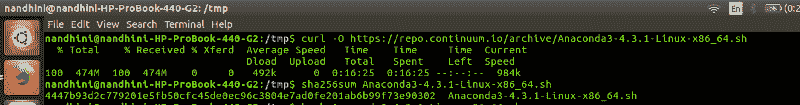
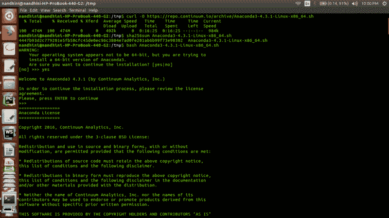
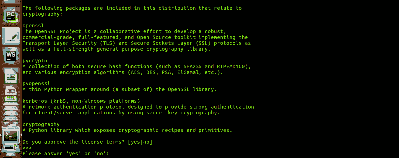
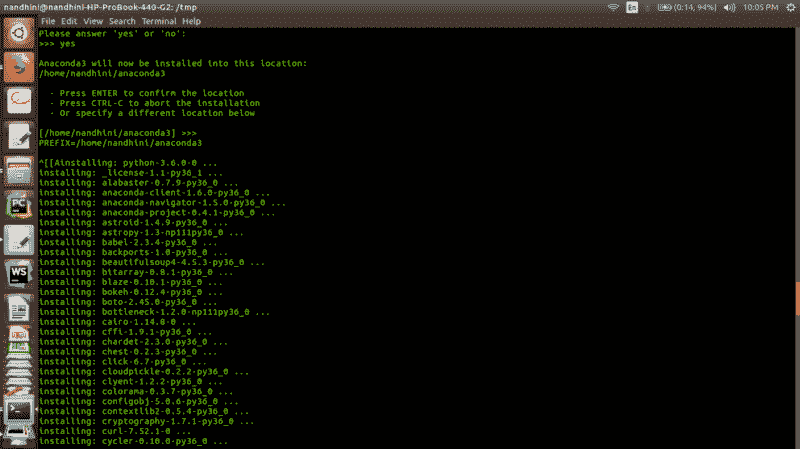

# Anaconda 简介:什么是 Anaconda，以及如何安装它

> 原文：<https://www.freecodecamp.org/news/how-to-install-anaconda-on-ubuntu-16-04-64-bit-6f1c4675ce44/>

作者:Nandhini Saravanan

# Anaconda 简介:什么是 Anaconda，以及如何安装它

#### Anaconda 及其在 Ubuntu 16.04 (64 位)上安装的简单指南。


[Anaconda Logo](https://en.wikipedia.org/wiki/Anaconda_(Python_distribution))

嘿大家好。我写这篇文章是为了指导你如何在 Ubuntu 版本中安装 Anaconda。此外，它还涵盖了关于 Anaconda 的各种细节以及使用它的领域。

### 首先，Anaconda 是什么？

在探究 Anaconda 的真正含义和它是关于什么的之前，我们将首先了解 conda。

引用康达官方博客:

> Conda 是一个运行在 Windows、macOS 和 Linux 上的**开源包管理系统**和环境管理系统。

> Conda 快速安装、运行和更新软件包及其依赖项。Conda 可以在本地计算机上轻松创建、保存、加载和切换环境。

> 它是为 **Python** 程序创建的，但它可以**为任何语言打包和分发软件**。

摆在桌面上的下一个问题是:为什么康达，突然？我们都知道那是一个软件包管理系统，用来安装和管理用 Python 写的软件包。

这也有其局限性。它只能用于 Python 包。

`pip`专注于 Python，忽略了非 Python 库的依赖，如 HDF5、MKL、LLVM，它们的源代码中没有安装文件。

简单地说:

`pip`是一个软件包管理器，方便了 **python 软件包**的安装、升级和卸载。它适用于虚拟的 **python** 环境。

`Conda`是**任意软件**(安装、升级、卸载)的包管理器。它与虚拟的**系统**环境一起工作。

Conda 是一个打包工具和安装程序，它的目标不仅仅是`pip`所做的:处理 Python 包之外的库依赖*以及 Python 包本身。*

康达还创造了一个虚拟环境。

#### 阿纳康达是如何出现的？

Conda 完全是用 Python 编写的，这使得它更容易在 Python 虚拟环境中使用。再者，我们可以把 Conda 用于 C 库，R 包，Java 包等等。

它安装二进制文件。`conda build`工具从源代码构建包，而`conda install`从构建的 conda 包安装东西。

Conda 是 Anaconda 的包管理器，Anaconda 是由 Continuum Analytics 提供的 Python 发行版。用一句简短的话来描述 Anaconda 是这样的:

> ***Anaconda 是 python 和 R 发行版。它旨在提供数据科学任务所需的一切(python 方面的)。***

Anaconda 是一组二进制文件，包括 Scipy、Numpy、Pandas 及其所有依赖项。

Scipy 是一个统计分析包。

Numpy 是一个数值计算包。

**Pandas** 是一个数据抽象层，公开了一种合并和转换数据的方法。

Anaconda 帮助我们在一次拍摄中完成所有这些。

Anaconda 二进制文件是一个安装程序，它在您的系统中构建所有这些包及其依赖项。

更多关于 Anaconda 的信息，请访问它的官方博客:[https://anaconda.org/](https://anaconda.org/)

### 安装更简单

安装文件有时会非常麻烦，但是 Anaconda 比您想象的要友好得多。我更喜欢 Ubuntu，因为安装只需要几个强有力的命令和良好的网络连接。感觉轻松了很多。下面是安装 Anaconda 的后续步骤。

(整个安装过程只能在 64 位计算机上运行)。

#### 步骤 1:下载 Anaconda bash 脚本

从他们的官方网站下载最新版本的 Anaconda 安装程序 bash 脚本。它可以通过运行 curl 命令来下载。如果您的系统中没有安装 curl，可以通过运行下面的命令来安装它。

```
sudo apt-get updatesudo apt-get install curl
```

转到/tmp 文件夹。

```
cd /tmp
```

安装 curl 后，使用它运行以下命令:

```
curl -O https://repo.continuum.io/archive/Anaconda3-4.3.1-Linux-x86_64.sh
```

安装通常需要几分钟，因为它的大小约为 500 MB。请等待整个下载过程完成。


Anaconda install process

所附的屏幕截图是在脚本下载后拍摄的。请确保您有一个强大的连接，否则可能会发生下载错误。

#### 步骤 2:验证完整性

为了验证安装程序的数据完整性，我们使用一种叫做 SHA-2(安全哈希算法)的加密哈希算法。

```
sha256sum Anaconda3-4.3.1-Linux-x86_64.sh
```

执行命令后，将在下一行中生成校验和。



Verifying data integrity using checksum

#### 步骤 3:运行 bash 脚本

我们快到了。软件包下载完毕，我们只需通过输入以下命令来运行脚本。

```
bash Anaconda3-4.3.1-Linux-x86_64.sh
```

正常的验证步骤会询问您是否想要安装 Anaconda。键入`yes`以便继续安装。



After running the bash script

#### 步骤 4:安装加密库

这是先前过程的一部分。安装程序会询问用户是否要安装所有的加密库。输入`yes`，你就可以开始了。参考下面的屏幕截图。你会得到类似的细节。



Cryptographic Libraries

#### 第五步:确认位置

最后一步是确认放置所有 Anaconda 包的路径。指定路径后，按 Enter 键就完成了！Anaconda 将通过安装您需要的所有必需品来开始施展它的魔力！



Anaconda Path Set up

#### 步骤 6:激活并验证

为了激活安装，我们应该通过键入以下命令来获取`~/.bashrc`文件:

```
source ~/.bashrc
```

使用`conda`命令验证您的安装。

```
conda list
```

将显示通过 Anaconda 安装可用的所有包的输出。

#### 我写关于生活课程、编码、技术和书籍的故事。要阅读更多内容，请在[推特](https://twitter.com/snandhini98)和[媒体上关注我。](http://medium.com/@nandhus05)