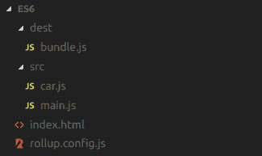
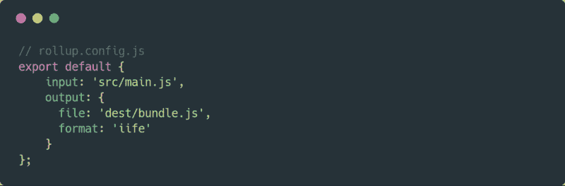
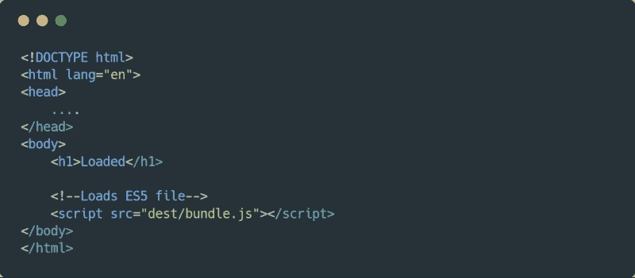
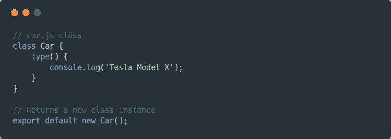
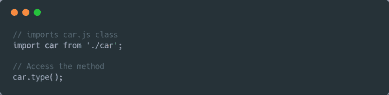

# 如何快速设置 ES6 环境

> 原文：<https://www.freecodecamp.org/news/how-to-install-and-run-es6-quickly-b3cb115ea3dd/>

你可能知道，浏览器开始赶上 ES6 了。然而，并不是一切都像预期的那样顺利，这可能是一个耗时且繁琐的问题。如果出了问题，试图确定问题是出在代码上还是浏览器上并不是一个容易的过程。

但是不要担心，我将向您展示如何快速安装和编写 ES6 代码，最重要的是，让它兼容所有支持 ES5 的浏览器。

#### ES5 至 ES6

为了写 ES6 代码，我们需要安装一些可以编译成 ES5 的东西。我们将使用`Rollup`。它将小段代码编译成更大更复杂的东西，比如一个库或应用程序。这允许你使用 OOP(面向对象编程),这使得你的代码看起来更干净，结构化和模块化，以及其他有用的功能。澄清一下，JS 是面向对象的，但不是像 Java、C++、C#等那样的基于类的面向对象语言，直到 ES6 发布。

否则，在 ES5 的 **include 类**方面，最接近 OOP 的方法是使用 IIFE(立即调用函数表达式)，或者安装外部库。但是当你有一个支持 OOP 范例的核心语言时，为什么还要依赖外部资源呢？许多最广泛使用的编程语言已经支持它(如 C++、Java、C#和 PHP)。

#### 为什么选择 ES6？

就我个人而言，我使用它是因为它允许我将代码组织到单独的文件中，这使得代码的伸缩和维护更加容易。

例如，在我的 HTML 中，我有一个加载`main.js`的`script`，在`main.js`中，我使用`import`和`export`语句加载多个`JS`文件。我只需要一个脚本(代码更少)，而不是在我的 HTML 文件中有多个脚本。

#### 先决条件

*   Linux 或 macOS(基于 Debian)
*   NPM(软件包管理器)已安装
*   基本 CLI 知识

### 第一步:安装汇总

为了使用`Rollup`，我们必须在全球范围内安装它。记得用`sudo`。这允许你在任何项目中使用`Rollup`命令。

### 第二步:文件结构

在你已经全局安装了`Rollup`之后，下一步是设置文件夹结构，并在你的项目中创建两个文件夹`src`和`dest`。另外，创建`index.html`。

*   `src` → ES6 文件(您将在其中编写代码)
*   `dest` →生成 ES5(ES6 的编译版本)

Project ES6 folder structure

请记住，`bundle.js`文件是在执行`Rollup`命令时自动生成的。这个我们以后再说。

### 第三步:创建一个配置文件

创建一个新文件，命名为`rollup.config.js`。然后添加以下代码:

Configuration file for rollup.config.js

确保`input`和`output`源路径与您的文件夹结构一致，并且该文件位于主文件夹中。

### 第四步:加载 HTML 格式的脚本文件

我们几乎准备好了，但是首先我们需要在 HTML 模板中链接到正确的源文件。这将加载从 ES6 编译而来的 ES5 文件。

HTML template loads ES6 script

### 第五步:设置 JS 文件

为了验证`Rollup`命令是否有效，我们需要建立一个简单的 OOP 结构。我们将创建一个`car.js`类，并将`default export`转换为`main.js`。

记住，这个文件导出了`car.js`类的一个新实例，这允许直接访问方法，而不是在`main.js`类中写`const car = new Car()`。

由于我是一个懒惰的软件工程师，处理代码的几个额外字符很费时间:)

car.js class

接下来，将`car.js`类导入到`main.js`中，以便访问该方法的`type()`。

main.js class

### 第六步:将 ES6 编译成 ES5

要执行我们创建的配置文件，运行这个命令`$ rollup -c`或`$ rollup --config`——两者是相同的。

运行其中一个命令后，通过浏览器打开`index.html`，然后在浏览器上打开 inspect ( `ctrl + shift + I`，进入`console`。如果你看到文本`"Tesla Model S"`，这意味着一切工作顺利。

请记住，每次对 ES6 文件进行更改时，都必须通过运行命令进行更新。

### 可选择的

因为已经全局安装了`Rollup`，所以不需要有文件`rollup.config.js`就可以编译 ES6。它做完全相同的事情:

`$ rollup src/main.js — o dest/bundle.js — f iife`

就个人而言，我会推荐运行第六步中所示的`$ rollup -c`,因为需要的代码更少。记住，在运行这个命令时，必须包含文件`rollup.config.js` 。

*如果你觉得这个简短的 ES6 安装方法很有用，请评论并鼓掌。这是善业。*