# Arch Linux 手册——初学者学习 Arch Linux

> 原文：<https://www.freecodecamp.org/news/how-to-install-arch-linux/>

如果你问一群开发者 Linux 是什么，他们中的大多数可能会说它是一个开源操作系统。有更多技术知识的人大概会称之为内核。

然而，对我来说，Linux 不仅仅是一个操作系统或内核。对我来说，这是自由。根据我的需要组装操作系统的自由，这就是 Arch Linux 的用武之地。

根据他们的[维基](https://wiki.archlinux.org/title/Arch_Linux)，

> Arch Linux 是一个独立开发的 x86-64 通用 GNU/Linux 发行版，它遵循滚动发布模型，努力提供大多数软件的最新稳定版本。
> 
> 默认安装是一个最小的基本系统，由用户配置为仅添加特意需要的内容。

换句话说，Arch Linux 是一个针对 x86-64 架构优化的发行版，面向有经验的 Linux 用户。它让您完全负责和控制您的系统。

您可以选择您想要的包、内核(是的，有多个)、引导加载程序、桌面环境等等。

你听过有人说，

> 哦——对了，我用的是 Arch Linux！

这是因为在机器上安装 Arch Linux 需要您对 Linux 发行版的不同部分如何工作有适当的了解。所以在您的系统上运行 Arch Linux 可以证明您对 Linux 的理解。

从经验上讲，安装 Arch Linux 与安装 Fedora 或 Ubuntu 之类的东西没有太大区别。只是您必须手动完成各个步骤，而不是让安装人员为您完成这些工作。但是一旦你完成了这个过程，你就会开始理解其他发行版一般是如何工作的。

在本文中，我将向您介绍在您的机器上安装和配置 Arch Linux 的整个过程。最后，我还将讨论一些常见任务和故障排除技巧。

所以跟我来，我会告诉你兔子洞有多深。

## 目录

*   [我做的一些假设](#some-assumptions-i-m-making)
*   [如何创建可引导的 Arch Linux USB 驱动器](#how-to-create-a-bootable-arch-linux-usb-drive)
*   [如何准备安装 Arch Linux 的电脑](#how-to-prepare-your-computer-for-installing-arch-linux)
*   [如何安装 Arch Linux](#how-to-install-arch-linux)
    *   [如何设置控制台键盘布局和字体](#how-to-set-the-console-keyboard-layout-and-font)
    *   [如何验证引导模式](#how-to-verify-the-boot-mode)
    *   [如何连接互联网](#how-to-connect-to-the-internet)
    *   [如何更新系统时钟](#how-to-update-the-system-clock)
    *   [如何对磁盘进行分区](#how-to-partition-the-disks)
    *   [如何格式化分区](#how-to-format-the-partitions)
    *   [如何挂载文件系统](#how-to-mount-the-file-systems)
    *   [如何配置镜像](#how-to-configure-the-mirrors)
    *   [如何安装 Arch Linux 基础系统](#how-to-install-arch-linux-base-system)
*   [如何配置 Arch Linux](#how-to-configure-arch-linux)
    *   [如何生成 Fstab 文件](#how-to-generate-the-fstab-file)
    *   [如何使用 Arch-Chroot 登录新安装的系统](#how-to-login-to-the-newly-installed-system-using-arch-chroot)
    *   [如何配置时区](#how-to-configure-the-time-zone)
    *   [如何配置本地化](#how-to-configure-the-localization)
    *   [如何配置网络](#how-to-configure-the-network)
    *   [如何设置 Root 密码](#how-to-set-the-root-password)
    *   [如何创建非 root 用户](#how-to-create-a-non-root-user)
    *   [如何安装微码](#how-to-install-microcode)
    *   [如何安装和配置引导加载程序](#how-to-install-and-configure-a-boot-loader)
*   [如何安装 Xorg](#how-to-install-xorg)
*   [如何安装显卡驱动](#how-to-install-graphics-drivers)
*   [如何安装桌面环境](#how-to-install-a-desktop-environment)
    *   [如何安装 GNOME](#how-to-install-gnome)
    *   [如何安装等离子](#how-to-install-plasma)
*   [如何完成安装](#how-to-finalize-the-installation)
*   [如何在桌面环境之间切换](#how-to-switch-between-desktop-environments)
*   [如何使用 Pacman 管理软件包](#how-to-manage-packages-using-pacman)
    *   [如何使用 Pacman 安装软件包](#how-to-install-packages-using-pacman)
    *   [如何使用 Pacman 移除软件包](#how-to-remove-packages-using-pacman)
    *   [如何使用 Pacman 升级软件包](#how-to-upgrade-packages-using-pacman)
    *   [如何使用 Pacman 搜索软件包](#how-to-search-for-packages-using-pacman)
*   [如何在 Arch Linux 中使用 AUR](#how-to-use-aur-in-arch-linux)
    *   [如何使用助手安装软件包](#how-to-install-packages-using-a-helper)
    *   [如何手动安装包](#how-to-install-packages-manually)
*   [如何解决常见问题](#how-to-troubleshoot-common-problems)
*   [如何使用活拱 ISO 作为救援媒体](#how-to-use-the-live-arch-iso-as-a-rescue-media)
*   [延伸阅读](#further-reading)
*   [结论](#conclusion)

## 我做的一些假设

在我进入教程的核心之前，我想澄清一些事情。为了使整篇文章易于理解，我对你和你的系统做了以下假设:

*   您已经基本了解了 Arch Linux
    *   [Arch Linux](https://wiki.archlinux.org/title/Arch_Linux)
    *   [常见问题解答](https://wiki.archlinux.org/title/Frequently_asked_questions)
    *   [与其他分布相比的 Arch】](https://wiki.archlinux.org/title/Arch_compared_to_other_distributions)
*   您的计算机使用的是 UEFI，而不是 BIOS
*   您有一个足够大(4GB)的 USB 驱动器来启动 Linux
*   你有安装 Linux (Ubuntu/Fedora)的经验
*   你有足够的空间在硬盘或固态硬盘上安装 linux

差不多就是这样。如果你具备以上所有条件，你就可以开始了。

## 如何创建可引导的 Arch Linux USB 驱动器

要下载 Arch Linux，请前往[https://archlinux.org/download/](https://archlinux.org/download/)下载最新版本(在撰写本文时为 2022.01.01)。ISO 的大小应该在 870 兆字节左右。

下载后，你需要把它放在你的 USB 中。你可以使用 [Fedora Media Writer](https://getfedora.org/en/workstation/download/) 程序来实现。在您的系统上下载并安装该应用程序。现在连接您的 USB 驱动器并打开应用程序:


点击“自定义图像”并使用文件浏览器选择下载的 Arch Linux ISO 文件。

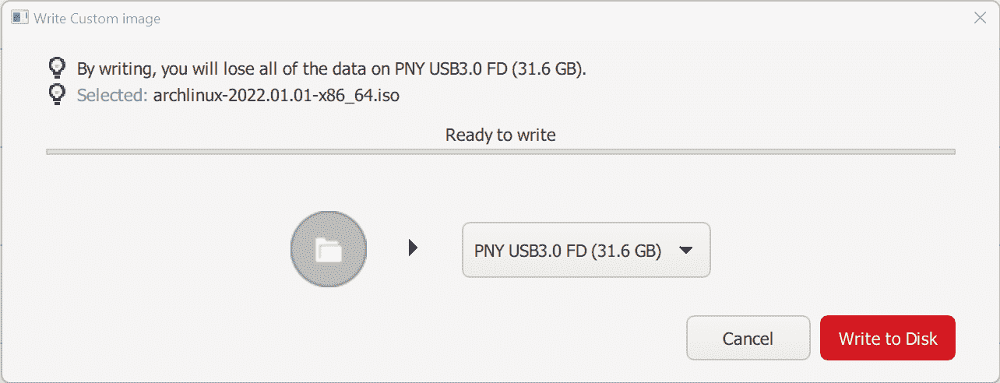

该应用程序现在将让您选择一个连接的 USB 驱动器。如果您的机器上连接了多个 USB 驱动器，请务必小心选择正确的驱动器。现在点击“写入磁盘”按钮，等待过程结束。

## 如何准备安装 Arch Linux 的计算机

在这一步中，您必须对您的系统进行一些更改，否则 Arch Linux 可能无法正常引导或运行。

您必须做的第一个更改是在 UEFI 配置中禁用安全引导。此功能有助于防止启动过程中的恶意软件攻击，但它也会阻止 Arch Linux 安装程序启动。

如何禁用此功能的详细说明因您的主板或笔记本电脑品牌而异。这次你得自己去网上搜索才能找到正确的方法。

您应该禁用的第二件事只有在您将 Arch Linux 与 Windows 一起安装时才相关。有一个 Windows 功能称为快速启动，它通过部分休眠来减少计算机的启动时间。

这通常是一个很好的特性，但是它会阻止双引导配置中的任何其他操作系统在这个过程中访问硬盘。

要禁用此功能，请打开“开始”菜单并搜索“选择电源计划”，如下所示:

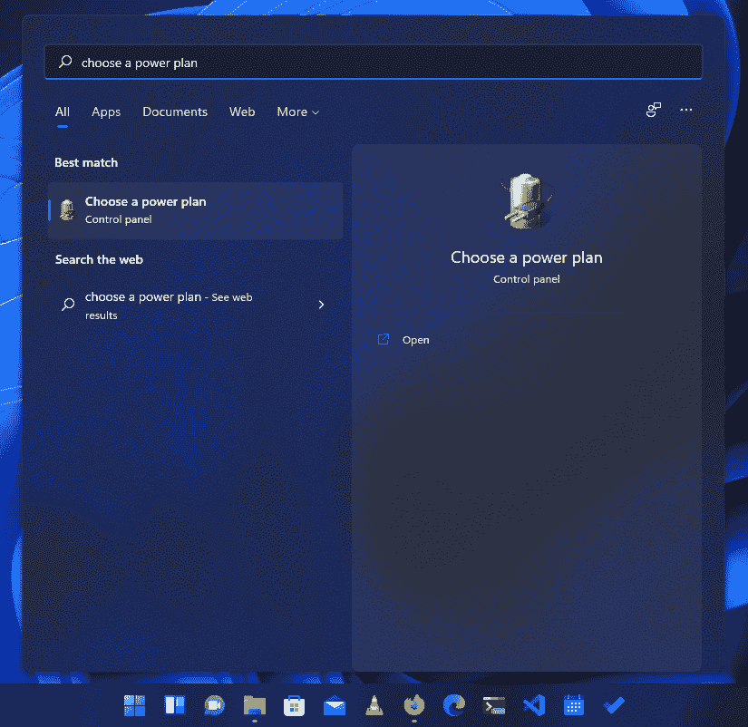

然后在下一个窗口中，点击左侧边栏中的“选择电源按钮的功能”:

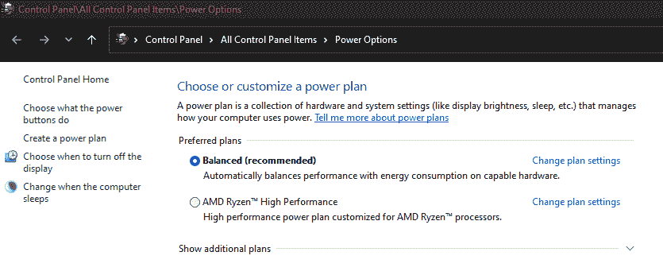

然后在下一个窗口，你会看到一个“关机设置”列表和“打开快速启动(推荐)”选项应该显示为只读。

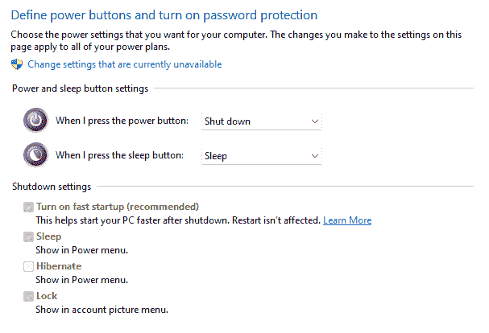

单击顶部的“更改当前不可用的设置”,然后您应该能够更改设置。

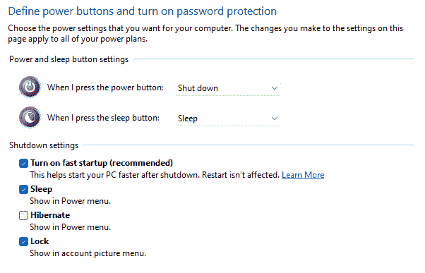

取消选中“打开快速启动(推荐)”选项，然后按底部的“保存更改”按钮。从现在开始，启动过程可能会花费一些额外的时间，但这都是值得的。

在本文中，我将安装 Arch Linux 作为我的默认操作系统。所以我会把整个磁盘空间分配给它。

然而，如果你想把它和 Windows 一起安装，我有一篇关于这个主题的文章。在那篇文章中，有一个[章节](https://www.freecodecamp.org/news/how-to-dual-boot-any-linux-distribution-with-windows/#how-to-create-additional-partitions-for-installing-linux)详细讨论了分区过程。

## 如何安装 Arch Linux

假设您有一个可引导的 USB 驱动器，并且您的计算机配置正确，那么您必须从 USB 驱动器引导。从 USB 驱动器引导的过程因机器而异。

在我的机器上，在引导过程中按 F12 键会将我带到可引导设备列表。从那里，我可以选择我的可启动 USB 驱动器。你可能已经知道适合你的电脑的技术，或者你可能需要研究一下。

一旦您成功登录到已连接的可引导设备列表，选择您的 USB 驱动器进行引导，应该会出现以下菜单:

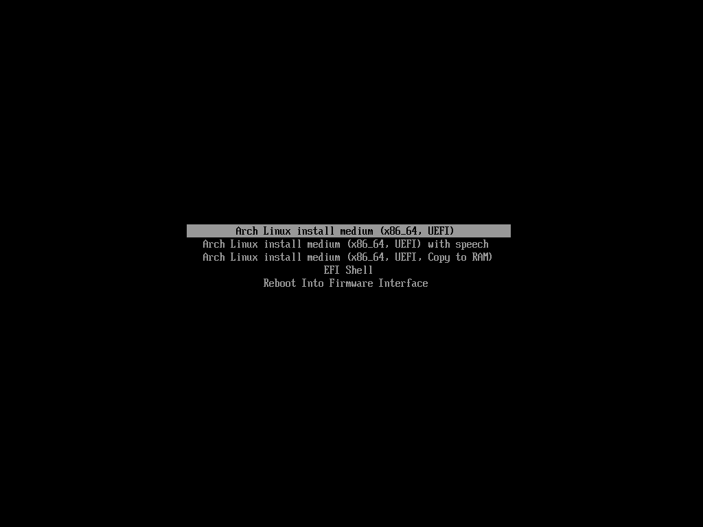

从列表中选择第一个，等待 Arch 安装程序完成启动。一旦完全启动，您将看到如下内容:

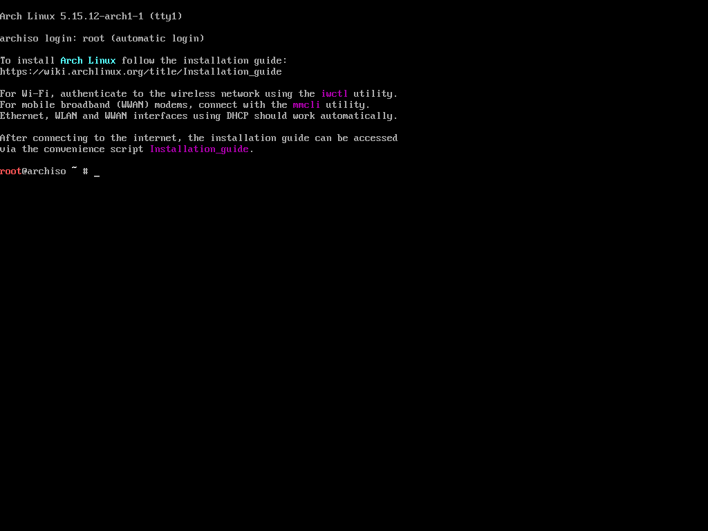

就是这样。你只能得到这些。与您可能熟悉的其他操作系统不同，Arch 安装程序没有任何图形用户界面来自动化安装。

相反，它需要您投入时间和精力，一点一点地配置发行版的每个部分。这听起来可能令人生畏，但是，说实话，如果你明白你在做什么，安装 Arch Linux 是非常有趣的。

### 如何设置控制台键盘布局和字体

正如我已经说过的，Arch 安装程序没有图形用户界面，所以需要大量的输入。配置你的键盘布局和一个好看的字体可以让安装过程不那么令人沮丧。

默认情况下，控制台假定您有标准的美国键盘布局。这对大多数人来说应该没问题，但是万一你碰巧有一个不同的，你可以换成那个。

所有可用的键映射通常以`map.gz`文件的形式保存在`/usr/share/kbd/keymaps`目录中。您可以使用`ls`命令查看它们的列表:

```
ls /usr/share/kbd/keymaps/**/*.map.gz 
```

这将列出所有可用的键映射:

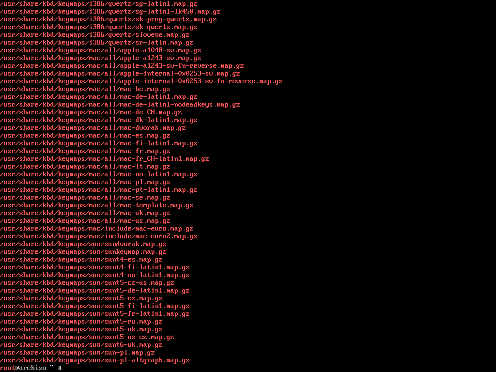

例如，如果你有 Mac-US 键盘布局，从这个列表中找到相应的`map.gz`文件，也就是`mac-us.map.gz`文件。

您可以使用`loadkeys`命令加载所需的键映射。要将`mac-us.map.gz`设置为默认值，执行以下命令:

```
loadkeys mac-us
```

如果您不喜欢默认字体，也可以更改控制台字体。就像键盘映射一样，控制台字体保存在`/usr/share/kbd/consolefonts`中，您可以使用`ls`命令将其列出:

```
ls /usr/share/kbd/consolefonts
```

这将列出所有可用的字体:

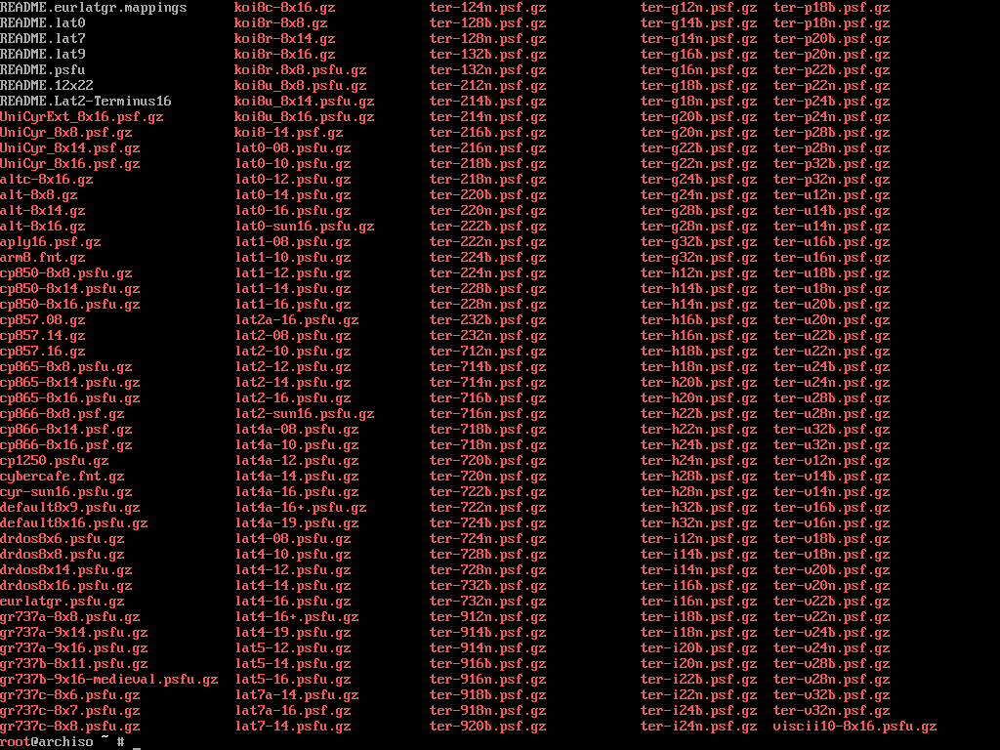

您现在可以使用`setfont`命令来设置其中一个。例如，如果您想将`drdos8x16`设置为默认值，执行以下命令:

```
setfont drdos8x16
```

`loadkeys`和`setfont`命令都是包含基本 Linux 键盘工具的`kbd`包的一部分。他们有很棒的[文档](https://kbd-project.org/#documentation)，所以如果你想了解更多，请随意查看。

### 如何验证引导模式

现在你已经配置好了你的控制台，下一步是确保你是在 UEFI 模式下启动的，而不是在 BIOS 模式下。

老实说，这一步对我来说似乎是不必要的，因为它实际上是在实时启动菜单中显示`x86_64 UEFI`。不过还是看在官方拱门[安装指南](https://wiki.archlinux.org/title/installation_guide#Verify_the_boot_mode)的份上吧。

要验证引导模式，请执行以下命令:

```
ls /sys/firmware/efi/efivars
```

如果你在 UEFI 模式下，它会在你的屏幕上列出一堆文件:

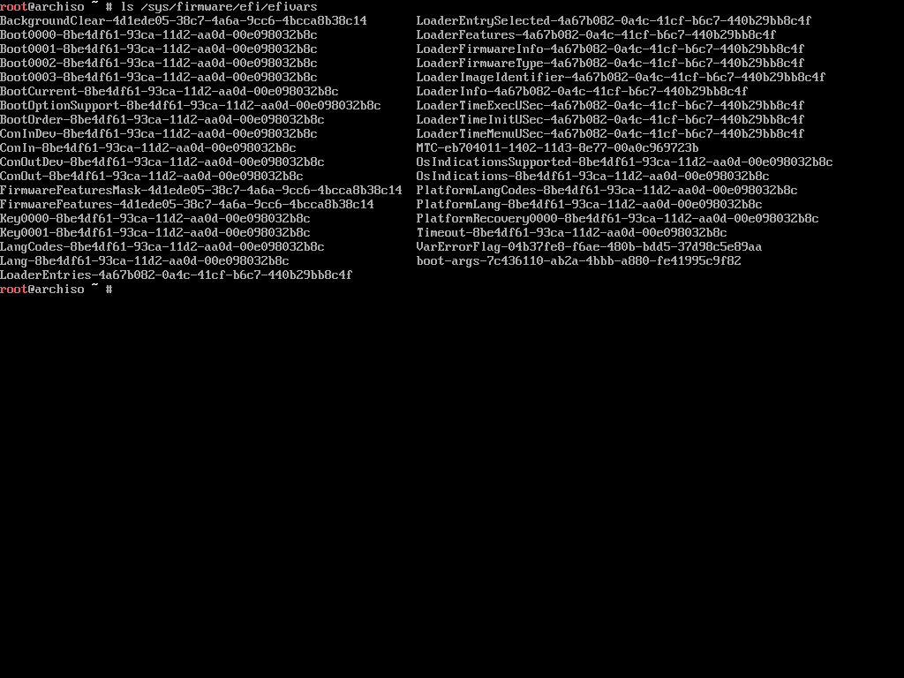

在 BIOS 引导的情况下，`efi`目录甚至不存在于`/sys/firmware`目录中。如果你在 UEFI 模式下，(如果你正确地遵循了每件事，你应该是)继续下一步。

### 如何连接到互联网

与许多其他实时发行版不同，Arch live 环境没有内置所有必需的包。它包含许多最基本的包，您可以用它们来安装系统的其余部分。因此，一个有效的互联网连接是必须的。

如果你使用的是有线网络，那么你应该从一开始就有一个可用的互联网连接。要进行测试，请 ping 任何一个公共地址:

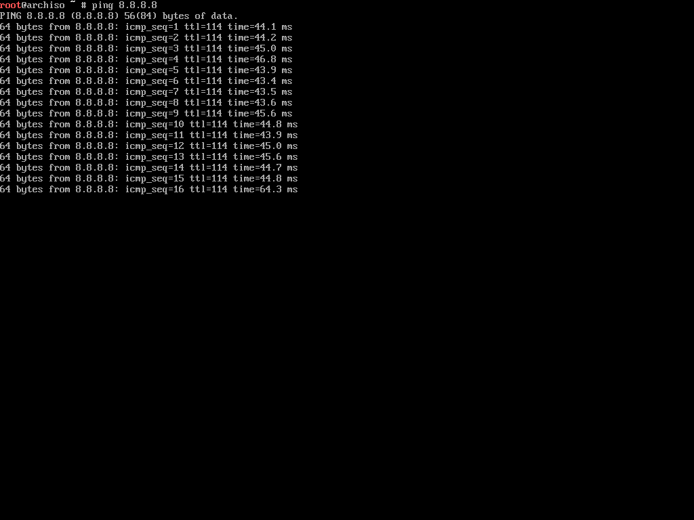

我使用 VirtualBox 制作这些截图，因此互联网连接与有线连接完美配合。但是如果你有无线连接，事情就有点棘手了。

实时环境带有`iwd`或 [iNet 无线守护进程](https://wiki.archlinux.org/title/Iwd)包。您可以使用此包连接到附近的无线网络。

首先，执行以下命令:

```
iwctl
```

这将启动一个交互式提示，如下所示:

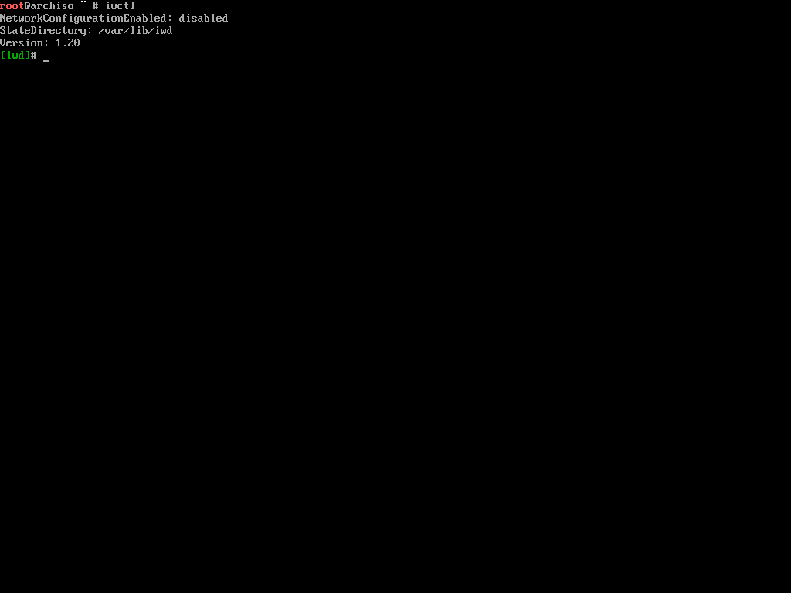

现在执行以下命令查看可用无线设备列表:

```
device list
```

这将显示可用无线设备的列表。我所说的无线设备是指任何连接到计算机的无线适配器。让我们假设`wlan0`是设备名称。

要使用找到的设备扫描附近的无线网络，请执行以下命令:

```
# station <device> scan

station wlan0 scan
```

您可能认为该命令会打印出所有附近网络的列表，但事实并非如此。要查看网络列表，请执行以下命令:

```
# station <device> get-networks

station wlan0 get-networks
```

现在假设您的家庭网络名为`Skynet`，您可以通过执行以下命令连接到它:

```
# station <device> connect <SSID>

station wlan0 connect Skynet
```

`iwctl`程序会提示你输入 wi-fi 密码。小心地把它放进去，一旦连接到网络，通过写`exit`并按回车键退出程序。再次尝试 fine 一个公共地址，确保互联网工作正常。

### 如何更新系统时钟

在 Linux 中，NTP 或网络时间协议用于通过网络同步计算机系统时钟。您可以使用`timedatectl`命令在 Arch live 环境中启用 NTP:

```
timedatectl set-ntp true
```

该命令将开始输出一些输出，几秒钟后。如果没有看到命令光标再次出现，请尝试按 Enter 键。在过去，我曾几次面临这种不便。

### 如何对磁盘分区

这可能是整个安装过程中最敏感的一步——因为如果你弄乱了分区，你就会丢失宝贵的数据。因此，我的建议是不要立即跟进这一部分。相反，先读完整个部分，然后跟着读。

要开始分区过程，您必须首先了解连接到电脑的不同磁盘。您可以使用`fdisk`，它是一个对话框驱动的程序，用于创建和操作分区表。

```
fdisk -l
```

该命令将列出计算机上所有可用设备的分区表。

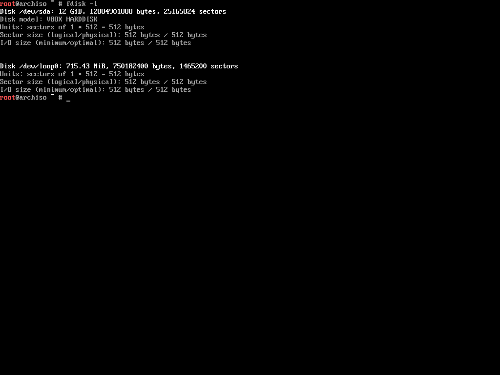

如你所见，有两个设备连接到我的电脑(实际上是虚拟机)。根据您拥有的设备数量，此列表可能会更长，因此在查看列表时，请忽略任何以`rom`、`loop`或`airoot`结尾的设备。您不能使用这些设备进行安装。

所以我们只剩下了`/dev/sda`装置。请记住，这在您的机器上可能完全不同。例如，如果您有 NVME 驱动器，您可能会看到`/dev/nvme0n1`。

一旦决定使用哪个设备，最好检查一下该设备中是否有任何现有的分区。为此，您可以使用同一个`fdisk`命令的以下变体:

```
fdisk /dev/sda -l
```

记得用现有的替换`/dev/sda`。这个命令将列出给定设备中的所有分区。


虽然这个设备中没有分区，但在现实生活中，您可能已经创建了分区。这些分区将显示为`/dev/sda1`、`/dev/sda2`或者在 NVME 驱动器的情况下显示为`/dev/nvme0n1p1`、`/dev/nvme0n1p2`等等。

程序可以做的不仅仅是列出分区。咨询[相应的 ArchWiki 页面](https://wiki.archlinux.org/title/Fdisk)以了解使用该程序可以执行的任务。

还有另一个程序`cfdisk`，它是一个基于[诅咒-(编程库)](https://en.wikipedia.org/wiki/Curses_(programming_library))的 Linux 磁盘分区表操纵器。它在功能上与`fdisk`相似，但是基于 curses 意味着它有一个更容易使用的接口。

执行以下命令，在您的首选设备上启动`cfdisk`:

```
cfdisk /dev/sda
```

记得用现有的替换`/dev/sda`。如果设备有先前创建的分区表，那么`cfdisk`将直接显示分区列表。否则，您将开始选择分区表类型:

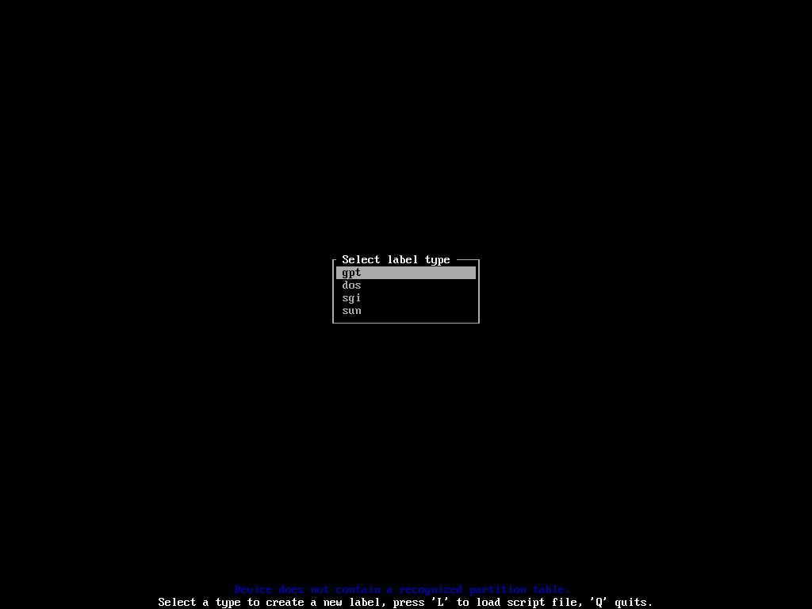

为基于 UEFI 的系统选择`gpt`。接下来，您将进入设备上的分区和空闲空间列表:

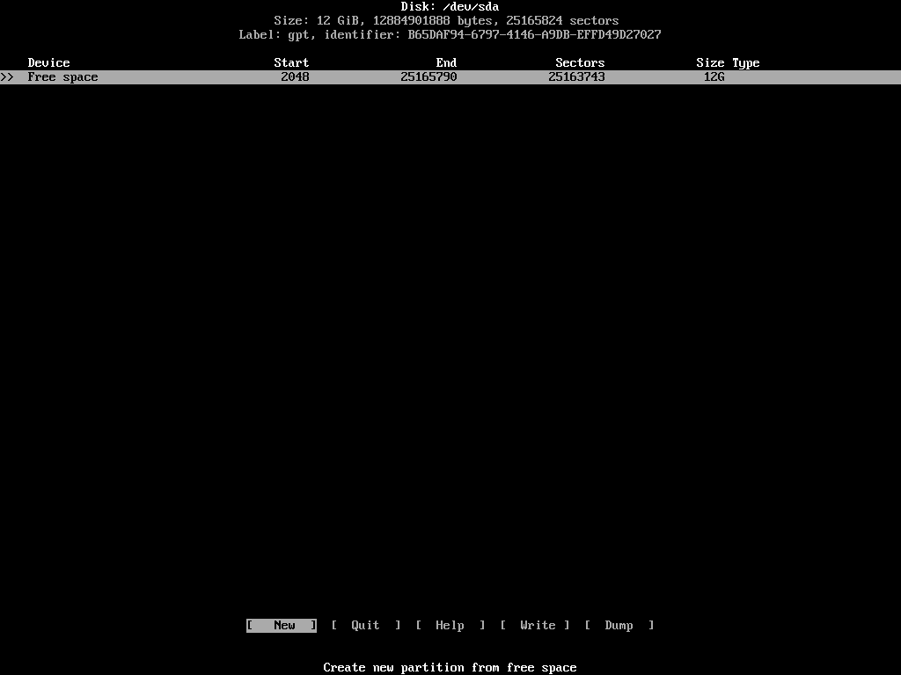

您可以使用上/下箭头键沿设备列表垂直移动，使用左/右箭头键沿不同的操作水平移动。

要安装 Arch 或任何其他 Linux 发行版，您需要三个独立的分区。它们如下:

*   EFI 系统分区–用于存储 UEFI 固件所需的文件。
*   ROOT–用于安装发行版本身。
*   交换——用作 RAM 的溢出空间。

确保列表中突出显示正确的分区/空闲空间，并选择`[ New ]`操作。

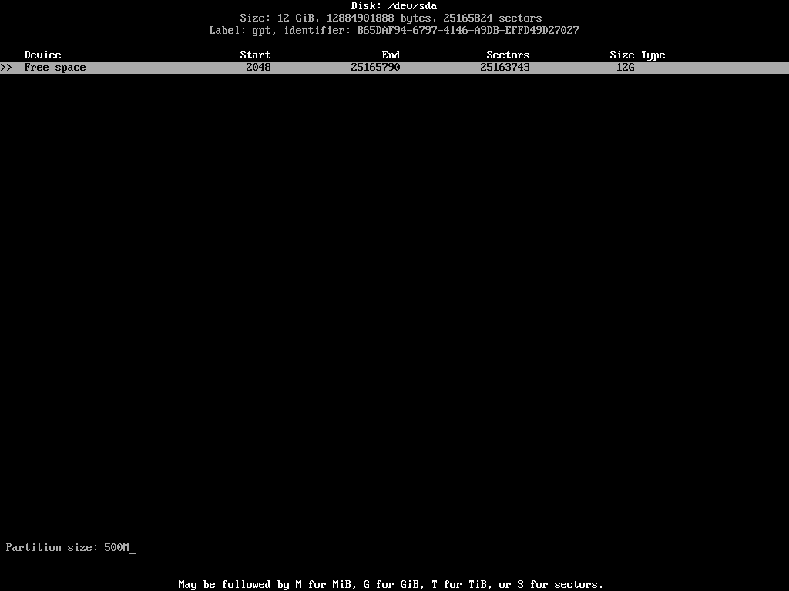

放置所需的分区大小。您可以用 M 表示兆字节，G 表示吉字节，T 表示太字节。

对于 EFI 系统分区，您应该分配至少 500MB。一旦你把你想要的大小，按下回车键完成。更新后的分区列表可能如下所示:


EFI 系统分区是一种特殊类型的分区。它必须是特定的类型和格式。要更改默认类型，请突出显示新创建的分区，并从操作列表中选择`[ Type ]`。

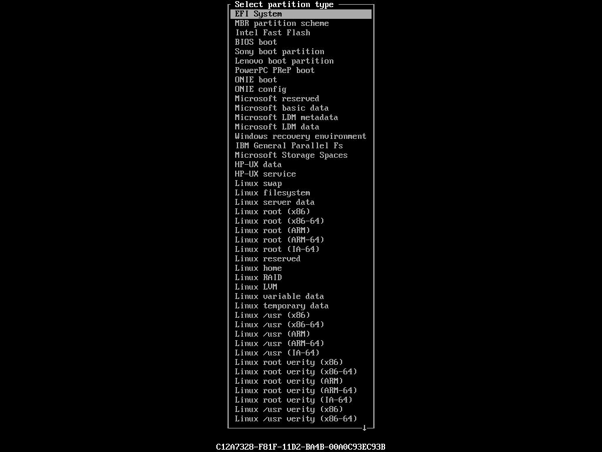

从这一长串类型中，突出显示`EFI System`并按回车键。列表中的分区类型应该相应地更新:

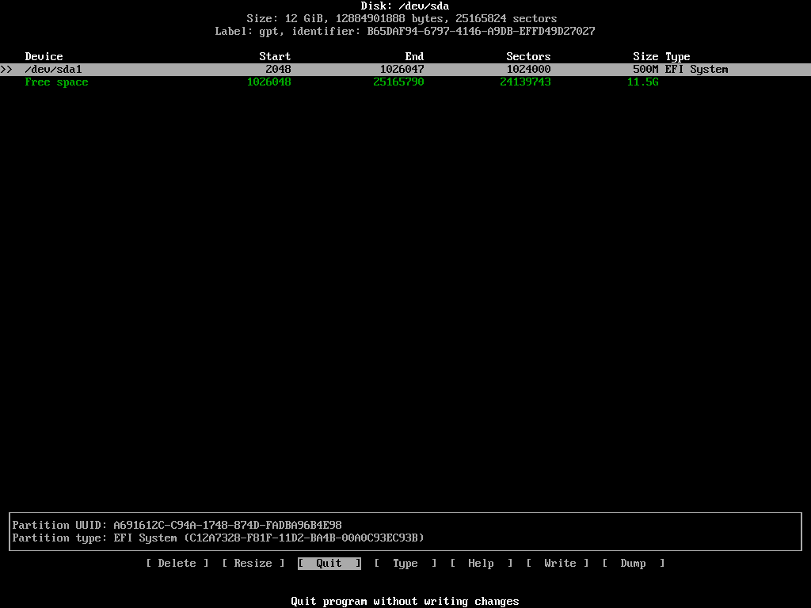

接下来是根分区。突出显示剩余的空闲空间，并再次选择`[ New ]`。这次给这个分区分配 10GB。根分区的理想大小取决于您的需要。就我个人而言，我给所有 Linux 安装的根分区分配了至少 100GB。

您不需要更改该分区的类型。默认的`Linux filesystem`就可以了。

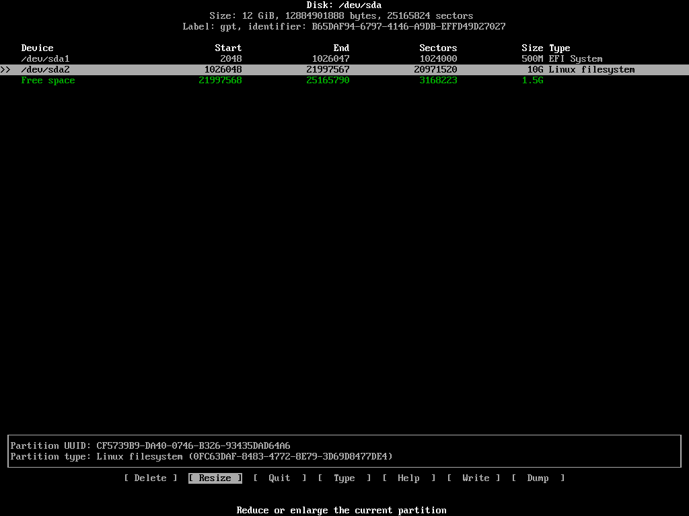

用剩余空间创建最后一个分区，并从菜单中将其类型更改为`Linux swap`:

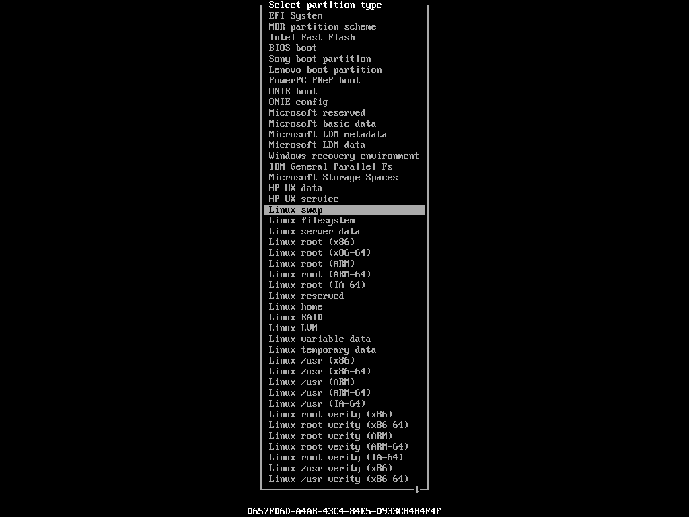

交换分区的理想大小是有争议的。就我个人而言，我的机器上没有交换分区。我拥有的物理内存量绰绰有余。但是如果以后我觉得需要的话，我会用`swapfile`来代替。无论如何，设备的最终状态应该如下:

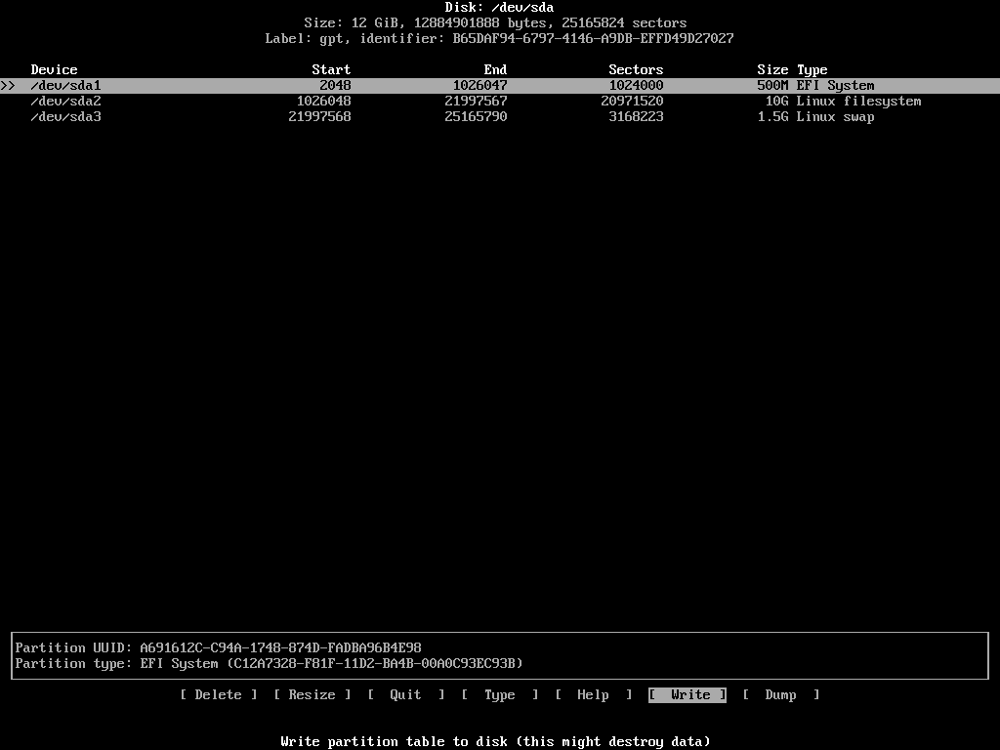

如果您对设置满意，从动作列表中突出显示`[ Write ]`,然后点击 Enter。该程序将询问您是否想要保存这些更改。如果你同意，你必须写下`yes`并按下回车键。一旦分区表被修改，选择`[ Quit ]`退出程序。

我想对那些试图在 Windows 旁边安装 Arch Linux 的人提一点，在这种情况下，EFI 系统分区应该已经存在于您的设备中。所以别碰那个。只需创建其他分区并继续前进。

### 如何格式化分区

现在您已经创建了必要的分区，您必须相应地格式化它们。你可以使用`mkfs`和`mkswap`程序来实现。在格式化之前，通过执行以下命令最后查看一下您的分区列表:

```
fdisk /dev/sda -l
```

这次您将看到三个新创建的分区及其详细信息:

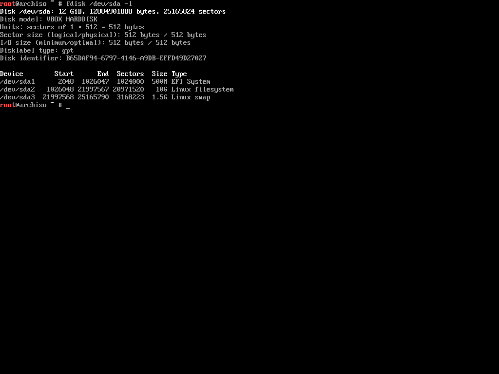

记下设备名称，如`/dev/sda1`、`/dev/sda2`、`/dev/sda3`等。EFI 系统分区必须采用 FAT32 格式。执行以下命令以 FAT32 格式格式化分区:

```
mkfs.fat -F32 /dev/sda1
```

下一个是根分区。它可以有多种格式，但是我更喜欢在我所有的 Linux 文件系统中使用 EXT4。使用以下命令格式化 EXT4 中的分区:

```
mkfs.ext4 /dev/sda2
```

根据您的分区大小，此操作可能需要一些时间才能完成。最后，交换分区。使用以下命令格式化:

```
mkswap /dev/sda3
```

至此，您已经完成了为安装准备分区的过程。

### 如何挂载文件系统

既然已经创建并格式化了分区，就可以挂载它们了。您可以使用带有适当挂载点的`mount`命令来挂载任何分区:

```
# mount <device> <mount point>

mount /dev/sda2 /mnt
```

我希望您记得,`/dev/sda2`分区是作为根分区创建的。Linux 中的`/mnt`挂载点是用来临时挂载存储设备的。因为我们只需要挂载分区来安装 Arch Linux，所以`/mnt`挂载点是完美的。

在交换分区的情况下，您不会像其他分区那样挂载它。您必须告诉 Linux 显式地使用这个分区作为交换分区。为此，请执行以下命令:

```
swapon /dev/sda3
```

您可能已经猜到了，`swapon`命令告诉系统在这个设备上进行交换。我们将在后面的小节中使用 EFI 系统分区。目前，安装这两个分区就足够了。

### 如何配置镜像

在您的机器上安装 Arch Linux 之前，还有最后一个步骤，那就是配置镜像。镜像是位于世界各地不同点的服务器，用于服务附近的人口。

安装程序附带了 Reflector，这是一个 Python 脚本，用于检索最新的镜像列表(Arch Linux 镜像状态页面)。要打印出最新的镜像列表，只需执行以下命令:

```
reflector
```

如果您的互联网连接速度较慢，您可能会遇到如下错误信息:

```
failed to rate http(s) download (https://arch.jensgutermuth.de/community/os/x86_64/community.db): Download timed out after 5 second(s).
```

当默认超时(5 秒)低于下载信息所用的实际时间时，就会发生这种情况。

您可以通过使用`--download-timeout`选项来解决这个问题:

```
reflector --download-timeout 60
```

现在 reflector 会等整整一分钟才开始尖叫。屏幕上会出现一长串镜子:

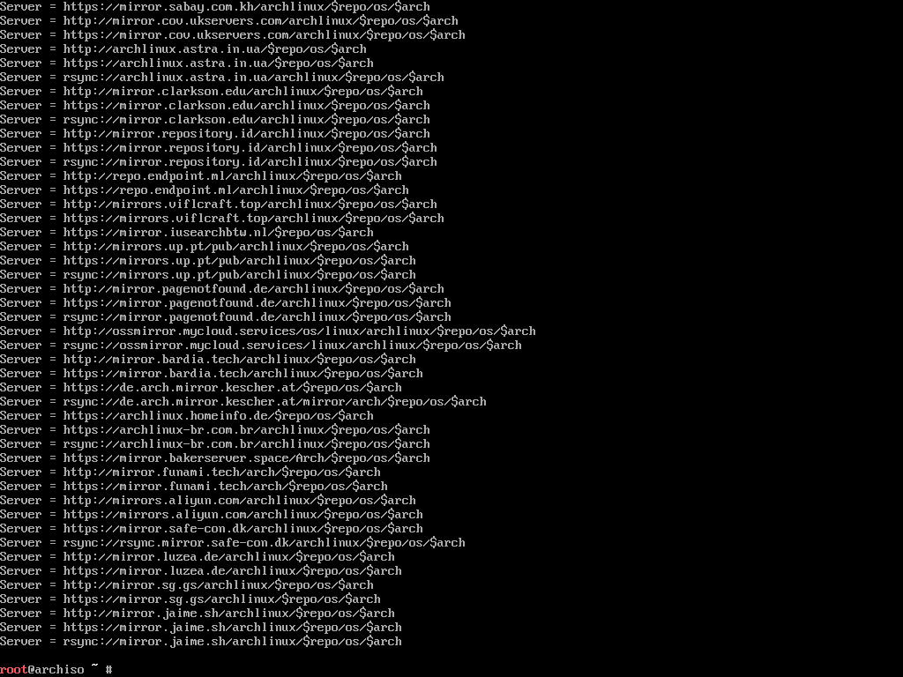

浏览整个列表来寻找附近的镜子将是一件痛苦的事情。这就是为什么 reflector 可以为您做到这一点。

Reflector 可以基于过多的给定约束生成一个镜像列表。例如，我想要一个最近 12 小时内同步的镜像列表，这些镜像位于印度或新加坡(这两个地方离我的位置最近)，并按下载速度对镜像进行排序。

事实证明，反射器可以做到这一点:

```
reflector --download-timeout 60 --country India,Singapore --age 12 --protocol https --sort rate
```

找到的服务器将像以前一样列出:

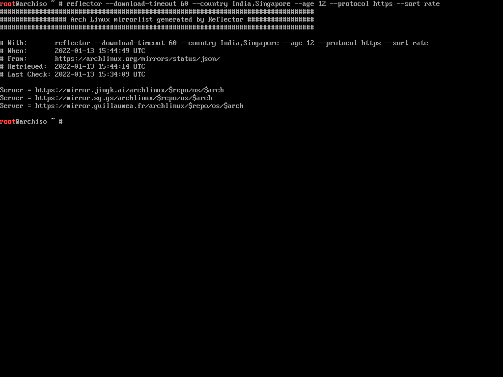

像这样打印出镜像列表是不够的。您必须将列表保存在`/etc/pacman.d/mirrorlist`位置。Arch Linux 的默认包管理器 Pacman 使用这个文件来了解镜像。

在覆盖默认镜像列表之前，请先制作一份副本:

```
cp /etc/pacman.d/mirrorlist /etc/pacman.d/mirrorlist.bak
```

现在使用`--save`选项执行反射器命令，如下所示:

```
reflector --download-timeout 60 --country India,Singapore --age 12 --protocol https --sort rate --save /etc/pacman.d/mirrorlist
```

该命令将生成镜像列表并覆盖默认列表。现在您已经准备好安装基础 Arch Linux 系统了。

### 如何安装 Arch Linux 基础系统

在安装基本系统之前，根据新的镜像列表更新包缓存是一个好主意。为此，请执行以下命令:

```
pacman -Sy
```

构建 Linux 的`pacman`程序就像`apt`对于 Ubuntu 或者`dnf`对于 Fedora 一样。`-S`选项表示同步，相当于`apt`或`dnf`包管理器中的`install`。

一旦更新过程完成，您就可以使用`pacstrap`脚本来安装 Arch Linux 系统。执行以下命令开始安装过程:

```
pacstrap /mnt base base-devel linux linux-firmware sudo nano ntfs-3g networkmanager
```

`pacstrap`脚本可以将包安装到指定的新根目录。您可能还记得，根分区被挂载在`/mnt`挂载点上，所以这就是您将在这个脚本中使用的。然后您将传递您想要安装的软件包名称:

*   `base`–定义基本 Arch Linux 安装的最小软件包集。
*   `base-devel`–从源代码构建软件所需的一组软件包。
*   `linux`–内核本身。
*   `linux-firmware`–通用硬件的驱动程序。
*   `sudo`–您想以 root 权限运行命令吗？
*   一个带有一些增强功能的 pico 编辑器克隆。
*   `ntfs-3g`–使用 NTFS 驱动器所需的 NTFS 文件系统驱动程序和实用程序。
*   `networkmanager`–为自动连接到网络的系统提供检测和配置。

我想澄清一下，这份七个一揽子计划的清单并不是强制性的。要安装一个功能性的 Arch Linux，您只需要`base`、`linux`和`linux-firmware`包。但是考虑到你还需要其他的，为什么不一次把它们都抓回来。

根据您的互联网连接，安装过程可能需要一段时间。坐下来放松，直到`pacstrap`完成它的任务。完成后，您将看到如下内容:

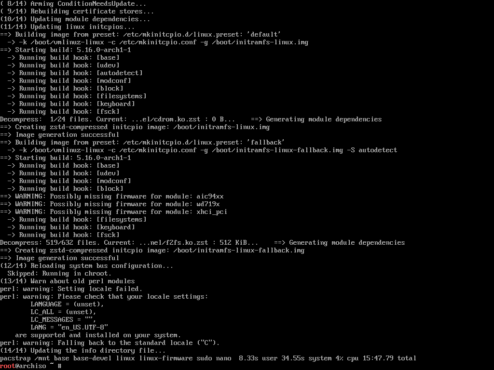

祝贺您，您已经成功地在您的计算机上安装了 Arch Linux。现在剩下要做的就是配置系统。

## 如何配置 Arch Linux

安装 Arch Linux 没那么难吧？事实上，在我看来，安装它比配置它要简单得多。这里有很多事情要做。所以让我们开始吧。

### 如何生成 Fstab 文件

根据[拱门](https://wiki.archlinux.org/title/Fstab)，

> `fstab`文件可用于定义磁盘分区、各种其他块设备或远程文件系统应该如何装入文件系统。

在 Ubuntu 或 Fedora 等其他发行版中，这是在安装过程中自动生成的。然而在 Arch 上，你必须手动操作。为此，请执行以下命令:

```
genfstab -U /mnt >> /mnt/etc/fstab
```

`genfstab`程序可以检测给定挂载点下的所有当前挂载，并以 fstab 兼容格式打印到标准输出。所以`genfstab -U /mnt`将输出`/mnt`挂载点下的所有当前挂载。我们可以使用`>>`操作符将输出保存到`/mnt/etc/fstab`文件中。

### 如何使用 Arch-Chroot 登录新安装的系统

现在，您登录的是实时环境，而不是新安装的系统。

要继续配置新安装的系统，您必须先登录。为此，请执行以下命令:

```
arch-chroot /mnt
```

`arch-chroot` bash 脚本是`arch-install-scripts`包的一部分，让你无需重启就可以切换到新安装系统的`root`用户。多酷啊！

### 如何配置时区

一旦切换到 root，首先要配置的是时区。要查看所有可用区域的列表，请执行以下命令:

```
ls /usr/share/zoneinfo
```

所有主要区域都应该在目录中。

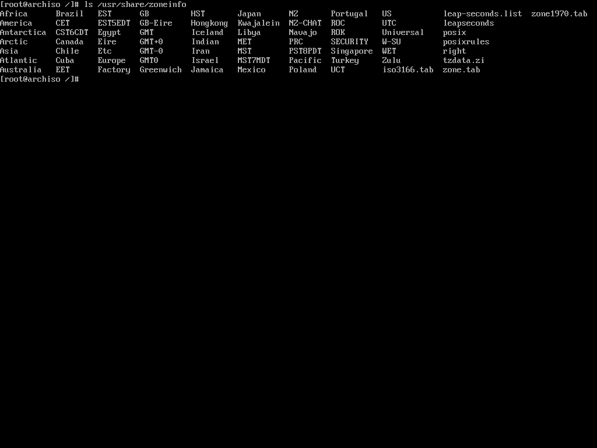

我住在孟加拉国的达卡，它位于亚洲区内。如果我列出亚洲的内容，我应该看到达卡在那里:


要将亚洲/达卡设为我的默认时区，我必须在`/etc/localtime`位置创建一个文件的符号链接:

```
ln -sf /usr/share/zoneinfo/Asia/Dhaka /etc/localtime
```

`ln`命令用于创建符号链接。`-sf`选项分别表示软和力。

### 如何配置本地化

现在你必须配置你的语言。Arch Linux 也有一个简单的方法来设置它。

首先，您必须根据您的本地化编辑`etc/locale.gen`文件。在 nano 文本编辑器中打开文件:

```
nano /etc/locale.gen
```

您会看到一长串语言:

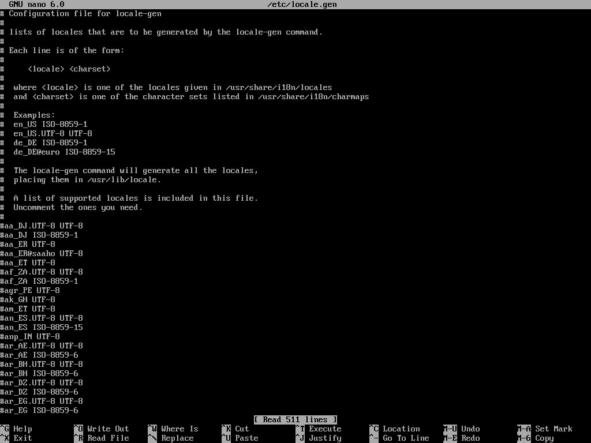

您必须取消对想要启用的语言的注释。我通常只需要英语和孟加拉语。所以我将定位`en_US.UTF-8 UTF-8`、`bn_BD UTF-8`和`bn_IN UTF-8`语言。按 Ctrl + O 保存文件，按 Ctrl + X 组合键退出 nano。

现在，您必须执行以下命令:

```
locale-gen
```

`locale-gen`命令将读取您的`/etc/locale.gen`文件并相应地生成语言环境。


现在您已经启用了多种语言，您必须告诉 Arch Linux 默认使用哪种语言。为此，打开`/etc/locale.conf`文件，向其中添加以下行:

```
LANG=en_US.UTF-8
```

这就是你所要做的配置你的语言环境。您可以随时返回到`/etc/locale.gen`文件，在其中添加或删除语言。只要记住无论什么时候运行`locale-gen`就行了。

除了语言环境之外，如果您在安装的第一步中对您的控制台键映射进行了任何更改，那么您现在可能想要持久化它们。为此，打开`/etc/vconsole.conf`文件并在其中添加您喜欢的键映射。

例如，如果您在第一步中将默认键映射更改为`mac-us`，那么您可能希望将下面一行添加到`vconsole.conf`文件中:

```
KEYMAP=mac-us
```

现在，每次使用虚拟控制台时，它都会有正确的键映射，您不必每次都进行配置。

### 如何配置网络

在任何 Linux 发行版中手动配置网络都是很棘手的。所以我才建议你在系统安装的时候安装`networkmanager`包。如果你照我说的做了，你就没事了。否则，使用`pacman`立即安装软件包:

```
pacman -S networkmanager
```

Pacman 是一个包经理。稍后你会学到更多。现在让我们为您的计算机设置主机名。主机名是为识别网络上的机器而创建的唯一名称，写在`/etc/hostname`文件中。

用 nano 打开文件，在里面写上你的主机名。你可以用任何东西来识别你的机器。我通常使用我的设备品牌或型号作为我的主机名，因为我使用的是 legion 笔记本电脑，所以我将简单地编写以下内容:

```
legion
```

本地主机名解析由`nss-myhostname`(systemd 提供的一个 NSS 模块)提供，无需编辑`/etc/hosts`文件。默认情况下，它是启用的。

但是有些软件可能还是会直接读取`/etc/hosts`文件。在 nano 中打开该文件，并向其中添加以下行:

```
127.0.0.1        localhost
::1              localhost
127.0.1.1        legion
```

确保用您的主机名替换`legion`。现在，您可以安装上述软件包了:

```
pacman -S networkmanager
```

通过执行以下命令启用`NetworkManager`服务:

```
systemctl enable NetworkManager
```

确保写`NetworkManager`而不是`networkmanager`作为服务名。如果命令成功，网络管理器将从现在开始自动启动并执行它的任务。

### 如何设置 Root 密码

您可能想为 root 用户设置一个密码，为什么不呢？为此，请执行以下命令:

```
passwd
```

`passwd`命令允许您更改用户的密码。默认情况下，它影响当前用户的密码，也就是现在的`root`。

它会要求输入新密码和确认密码。小心地输入它们，确保不要忘记密码。

### 如何创建非超级用户

长期使用您的 Linux 系统作为根用户并不是一个好主意。所以创建一个非 root 用户很重要。要创建新用户，请执行以下命令:

```
useradd -m -G wheel farhan
```

`useradd`命令允许您创建一个新用户。确保用你想用的名字替换我的名字。`-m`选项表示您也希望它创建相应的主目录。`-G`选项会将新用户添加到`wheel`组，这是 Arch Linux 中的管理用户组。

现在您可以再次使用`passwd`命令为新创建的用户设置密码:

```
passwd farhan
```

该程序将提示您输入新密码和密码确认。同样，不要忘记用你用过的名字替换我的名字。

最后，您必须为这个新用户启用`sudo`特权。为此，使用 nano 打开`/etc/sudoers`文件。打开后，找到以下行并取消注释:

```
# %wheel ALL=(ALL) ALL
```

这个文件实质上意味着`wheel`组中的所有用户都可以通过提供他们的密码来使用`sudo`。点击 Ctrl + O 保存文件，点击 Ctrl + X 退出 nano。现在新用户将能够在必要时使用`sudo`。

### 如何安装微码

根据 [PCMag](https://www.pcmag.com/encyclopedia/term/microcode) ，

> 复杂指令集计算机(CISC)中的一组基本指令。微码驻留在独立的高速存储器中，并作为机器指令和计算机电路级之间的翻译层。微码使计算机设计者能够创建机器指令，而不必设计电子电路。

英特尔和 AMD 等处理器制造商经常发布处理器的稳定性和安全性更新。这些更新对系统的稳定性至关重要。

在 Arch Linux 中，微码更新可以通过官方软件包获得，每个用户都应该安装在他们的系统上。

```
# for amd processors
pacman -S amd-ucode

# for intel processors
pacman -S intel-ucode
```

仅仅安装这些包是不够的。你必须确保你的引导程序正在加载它们。您将在下一节中了解它。

### 如何安装和配置引导加载程序

根据[维基百科](https://en.wikipedia.org/wiki/Bootloader)，

> bootloader，也称为 boot loader 或 boot manager 和 bootstrap loader，是一种负责引导计算机的计算机程序。

bootloader 的内部结构超出了本文的范围，所以我将继续安装过程。如果您过去使用过任何其他的 Linux 发行版，您可能会遇到 GRUB 菜单。

GRUB 是最受欢迎的引导程序之一。虽然有很多选项可用，但我将演示 GRUB 的安装，因为这是大多数人可能会使用的。

要安装 GRUB，您必须首先安装两个软件包。

```
pacman -S grub efibootmgr
```

如果你和其他操作系统一起安装，你还需要`os-prober`包:

```
pacman -S os-prober
```

这个程序将搜索你的系统上已经安装的操作系统，并将它们作为 GRUB 配置文件的一部分。

现在，您必须挂载几节之前创建的 EFI 系统分区。为此，您必须首先创建一个`efi`目录:

```
mkdir /boot/efi
```

根据[维基百科](https://en.wikipedia.org/wiki//boot/)，

> 在 Linux 和其他类似 Unix 的操作系统中，`/boot/`目录保存用于引导操作系统的文件。

这个目录存在于所有类似 Unix 的操作系统中。上面提到的命令在`/boot`目录中创建了一个名为`efi`的目录。创建目录后，您必须在该目录中挂载您的 EFI 系统分区。

```
mount /dev/sda1 /boot/efi
```

我希望您记得我们在分区阶段将`/dev/sda1`设备格式化为 EFI 系统分区。请确保为您的设备使用正确的版本。

现在，我们将使用`grub-install`命令在新挂载的 EFI 系统分区中安装 GRUB:

```
grub-install --target=x86_64-efi --bootloader-id=grub
```

您可以或多或少地逐字使用这个命令。你可以把`--bootloader-id`改成更有表现力的，比如`arch`或者别的什么。如果安装没有任何错误地完成，那么您必须生成 GRUB 配置文件。


如果你和其他操作系统一起安装，你必须在生成配置文件之前启用`os-prober`。为此，请在 nano 文本编辑器中打开`/etc/default/grub`文件。找到以下行并取消注释:

```
#GRUB_DISABLE_OS_PROBER=false
```

这应该是上述文件中的最后一行，所以只需滚动到底部并取消注释即可。


现在执行以下命令来生成配置文件:

```
grub-mkconfig -o /boot/grub/grub.cfg
```

`grub-mkconfig`命令生成 GRUB 配置文件，并将其保存到给定的目标位置。在这种情况下，`/boot/grub/grub.cfg`是目标位置。

该命令还会考虑您之前安装的微码以及您计算机上的任何其他现有操作系统。

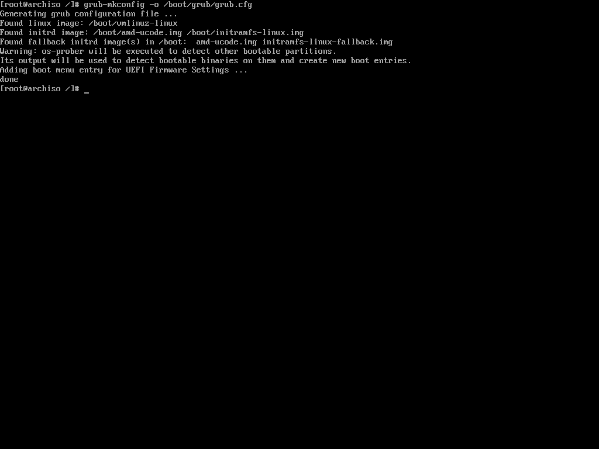

祝贺您，您现在有了一个可工作的 Arch Linux 安装。此时，您可以退出 Arch-Chroot 环境，卸载分区，然后重新启动。但是我会建议你多呆一会儿，并设置好图形用户界面。

## 如何安装 Xorg

要在您的系统上运行带有图形用户界面的程序，您必须安装一个 X Window 系统实现。最常见的是 Xorg。

要安装 Xorg，请执行以下命令:

```
pacman -S xorg-server
```

等到安装完成，然后继续安装必要的图形驱动程序。

## 如何安装图形驱动程序

在 Arch Linux 上安装图形驱动程序非常简单。你只需安装你的图形处理单元所需的软件包，然后就可以收工了。

```
# for nvidia graphics processing unit
pacman -S nvidia nvidia-utils

# for amd discreet and integrated graphics processing unit
pacman -S xf86-video-amdgpu

# for intel integrated graphics processing unit
pacman -S xf86-video-intel
```

如果您需要进一步的帮助，请随时查看[archi wiki](https://wiki.archlinux.org/title/Xorg)页面。

## 如何安装桌面环境

现在您已经安装了 Xorg 和必要的图形驱动程序，您已经准备好安装一个桌面环境，如 GNOME、Plasma 或 XFCE。

Arch Linux 支持一长串桌面环境，但是我只尝试了 GNOME 和 Plasma。我将演示如何安装这两个中的任何一个。

### 如何安装 GNOME

要安装 GNOME，你必须安装`gnome`包。为此，请执行以下命令:

```
pacman -S gnome
```

在安装过程中，您将有多种选择选择`pipwire-session-manager`和`emoji-font`包。在两个提示中按 Enter 键接受默认值。安装可能需要一些时间才能完成。

这个`gnome`包带有 GDM 或者 Gnome 显示管理器。您可以通过执行以下命令来启用该服务:

```
systemctl enable gdm
```

这就是让 GNOME 在你的 Arch 系统上运行所需要做的一切。

### 如何安装等离子

KDE 等离子装置与 GNOME 并没有太大的不同。你需要安装与等离子相关的包，而不是 GNOME。

```
pacman -S plasma plasma-wayland-session
```

如果你有一个 NVIDIA 显卡，那么避免安装`plasma-wayland-session`并使用普通的旧 X11。我拥有两台采用 NVIDIA GPUs 的设备，在使用 Wayland 时，它们都显示出不稳定性。

在安装过程中，你会得到多个选择`ttf-font`、`pipwire-session-manager`和`phonon-qt5-backend`包。确保选择`noto-fonts`作为您的`ttf-font`，并接受其他两个的默认值。

和 GNOME 中的`gdm`一样，Plasma 自带的`sddm`是默认的显示管理器。执行以下命令来启用该服务:

```
systemctl enable sddm
```

这就是让 Plasma 在您的 Arch Linux 系统上运行所需要做的全部工作。

## 如何完成安装

现在您已经安装了 Arch Linux 并完成了所有必要的配置步骤，您可以重新启动到新安装的系统。为此，首先要走出 Arch-Chroot 环境:

```
exit
```

接下来，卸载根分区以确保没有挂起的操作:

```
umount -R /mnt
```

现在重新启动机器:

```
reboot
```

等到你看到 GRUB 菜单。

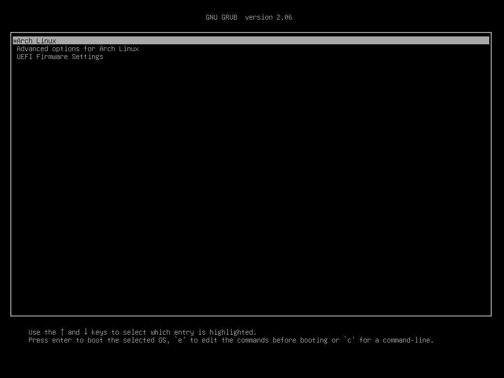

从列表中选择 Arch Linux，等待系统完成启动。

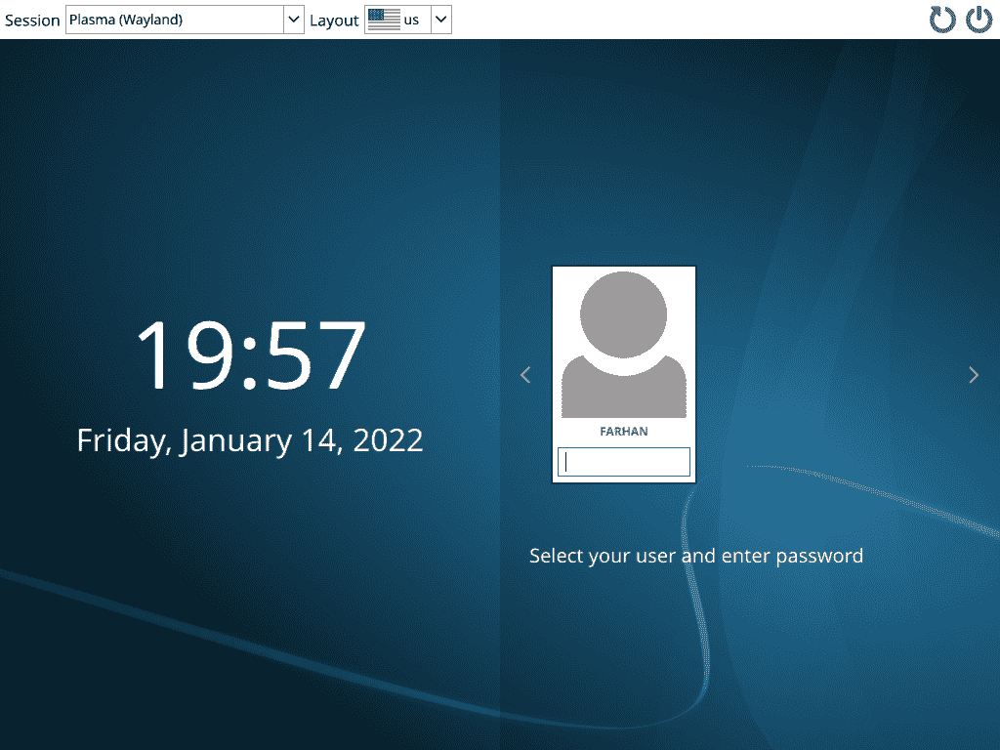

使用您的用户凭证登录，瞧！

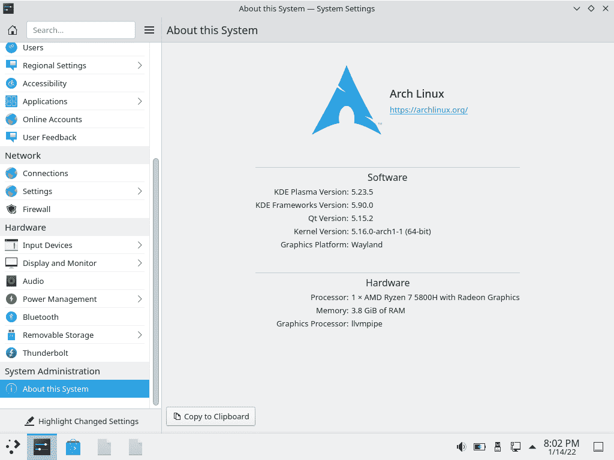

您闪亮的新 Arch Linux 系统已经准备好创造奇迹了。

## 如何在桌面环境之间切换

与其他与其默认桌面环境紧密耦合的发行版不同，Arch 是灵活的。您可以随时切换到另一个桌面环境。

为此，请先注销当前会话。


如你所见，我目前正在使用等离子。现在切换到 TTY2 按 Ctrl + Alt + F2 组合键。您将看到一个控制台登录提示:

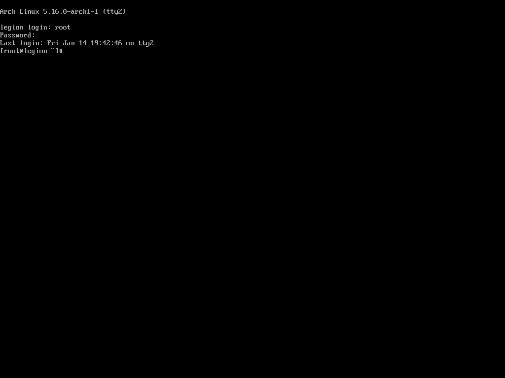

使用根凭证登录并禁用`sddm`显示管理器。

```
systemctl disable sddm
```

然后卸载之前安装的与血浆相关的软件包:

```
sudo pacman -Rns plasma plasma-wayland-session
```

卸载软件包后，安装 GNOME 所需的软件包:

```
pacman -S gnome
```

然后根据您之前阅读的部分执行安装。安装完`gnome`包后，启用`gdm`显示管理器:

```
systemctl enable gdm
```

重启电脑。

```
reboot
```

等到 Arch Linux 系统完成引导。

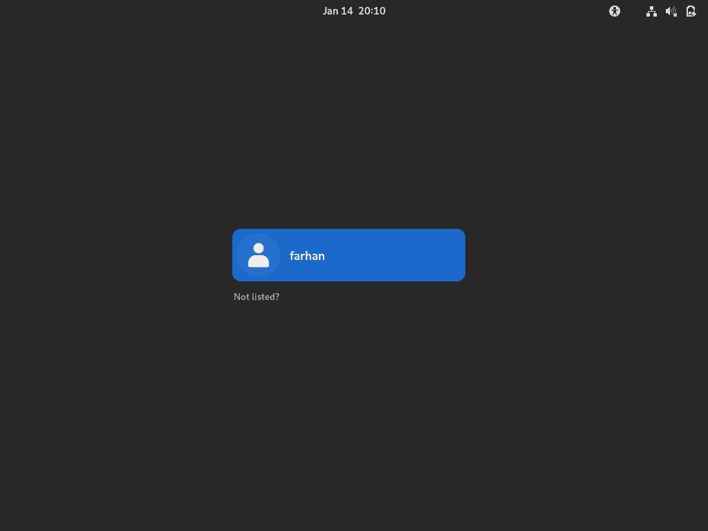

瞧，华丽的 Gnome 显示管理器。使用您的凭据登录。

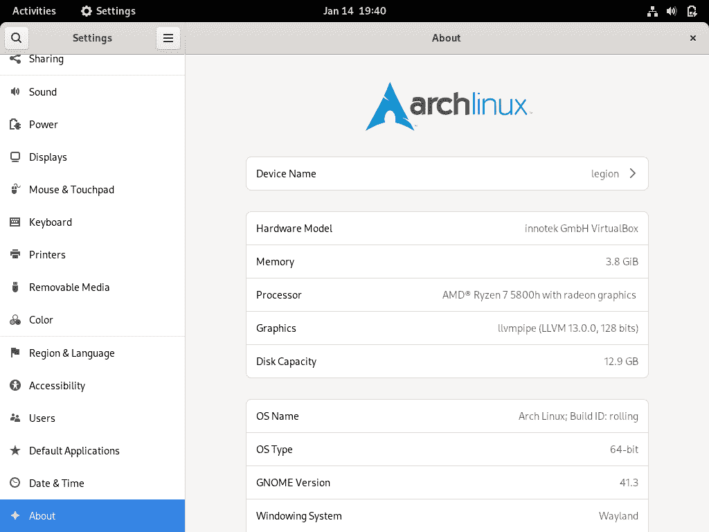

你可以随心所欲地在桌面环境之间切换，但是我建议你选择其中一个。此外，我不建议同时安装多个。

## 如何使用 Pacman 管理软件包

您已经使用 pacman 安装了许多软件包。相当于 Ubuntu 中的 apt，Fedora 中的 dnf 这样的包管理器。

在本节中，我将向您介绍一些日常可能需要的常见 pacman 命令。

### 如何使用 Pacman 安装软件包

要使用 pacman 安装软件包，可以使用以下命令语法:

```
# sudo pacman -S <package name>

sudo pacman -S rust
```

您可以安装多个软件包，如下所示:

```
# sudo pacman -S <package name> <package name>

sudo pacman -S rust golang
```

您还可以指定要从中安装软件包的存储库，如下所示:

```
# sudo pacman -S <package repository>/<package name>

sudo pacman -S extra/rust
```

在这个命令中，`-S`选项意味着 synchronize，这相当于 apt 或 dnf 包管理器中的 install。

### 如何使用 Pacman 移除软件包

要使用 pacman 删除软件包，可以使用以下语法:

```
# sudo pacman -R <package name>

sudo pacman -R rust
```

这将删除包，但会留下依赖项。通过执行以下命令，您可以删除任何其他程序包都不需要的具有依赖关系的程序包:

```
# sudo pacman -Rs <package name>

sudo pacman -Rs rust
```

Pacman 经常在删除某些应用程序时保存重要的配置文件。您可以使用以下语法覆盖此行为:

```
# sudo pacman -Rn <package name>

sudo pacman -Rn rust
```

平时想卸载什么东西的时候都会用`sudo pacman -Rns`。我想展示的最后一件事是如何移除孤儿包。

在 Ubuntu 中,`sudo apt autoremove`命令卸载任何不必要的包。Arch 中的等效命令是:

```
sudo pacman -Qdtq | pacman -Rs -
```

这将从以前安装的软件包中清除任何剩余的软件包。

### 如何使用 Pacman 升级软件包

要升级系统中的所有软件包，可以使用以下语法:

```
sudo pacman -Syu
```

在这个命令中，`S`选项同步包，`y`刷新本地包缓存，`u`更新系统。这就像终极升级命令，我每天至少运行一次。

### 如何使用 Pacman 搜索软件包

要在数据库中搜索包，可以使用以下语法:

```
# sudo pacman -Ss <package name>

sudo pacman -Ss rust
```

这将打印出在数据库中找到的带有该搜索词的所有软件包，还会显示是否已经安装了其中的任何软件包。

如果您想检查某个软件包是否已经安装，可以使用以下命令:

```
# sudo pacman -Qs <package name>

sudo pacman -Qs rust
```

当您想卸载一个软件包但不知道它的确切名称时，这很有用。

## 如何在 Arch Linux 中使用 AUR

据[是 FOSS](https://itsfoss.com/aur-arch-linux/) ，

> AUR 代表拱形用户库。它是一个面向基于 Arch 的 Linux 发行版用户的社区驱动的存储库。它包含名为 PKGBUILDs 的包描述，允许您使用 makepkg 从源代码编译一个包，然后通过 PAC man(Arch Linux 中的包管理器)安装它。

AUR 是 Arch Linux 最吸引人的特性之一。由于 AUR，Arch Linux 的包数几乎和 Debian 持平。您已经使用了`pacman`来安装了各种包。遗憾的是，你不能用它来安装 AUR 的软件包。

你必须安装一个 AUR 助手。Arch Linux 不支持这些助手，建议您学习如何手动构建包。我将在这里解释这两种技术。如果您了解助手是如何工作的，您也将能够手动完成它。

### 如何使用助手安装软件包

在可用的和当前维护的 AUR 助手中，我喜欢`yay`或另一个酸奶包。是用 Go 写的，相当扎实。

不能像其他包一样安装`yay`。你必须得到源代码并编译程序。你将需要`git`和`base-devel`包来这样做。假设您已经在 Arch Linux 安装期间安装了`base-devel`:

```
pacman -S git
```

从 GitHub 中克隆 yay 库，并将`cd`放入其中:

```
git clone https://aur.archlinux.org/yay.git && cd yay
```

要从源代码构建和安装 yay，请执行以下命令:

```
makepkg -si
```

makepkg 脚本自动化了包的构建过程。`-si`选项代表同步依赖和安装。第一个选项将安装所需的依赖项(在本例中是 Golang ),后一个选项将安装构建的包。

构建过程完成后，makepkg 将要求安装确认和您的密码。仔细输入您的密码，让安装完成。

检查 yay 是否已正确安装:

```
yay --version

# yay v11.1.0 - libalpm v13.0.1
```

现在让我们用 yay 安装一些东西。您可能想要安装的一个常见包是 [visual-studio-code-bin](https://aur.archlinux.org/packages/visual-studio-code-bin/) 包。为此，请执行以下命令:

```
yay -S visual-studio-code-bin
```

不像吃豆人，你不应该和须藤一起跑。Yay 将查找给定的包，并询问您是否希望看到差异:

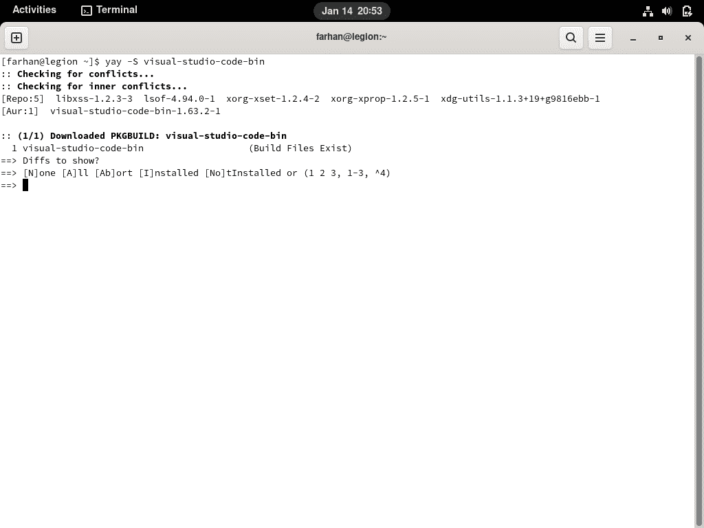

AUR 的所有软件仓库都附带了一个 PKGBUILD 文件，其中包含了构建这个包的指令。Yay 有一个很好的特性，它显示了自上次以来 PKGBUILD 文件中发生了什么变化。

现在，我将选择`N`表示无，然后按回车键。Yay 现在将寻找依赖项，并询问您的密码来安装它们。

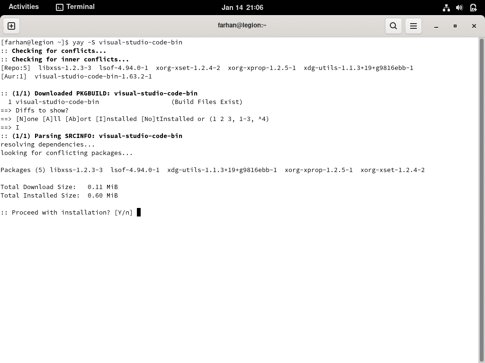

确认安装并提供您的密码。Yay 将安装依赖项并开始构建包。一旦构建完成，yay 将安装这个包，并在必要的地方提示您输入密码。

安装完成后，在应用程序启动器中搜索 Visual Studio 代码:

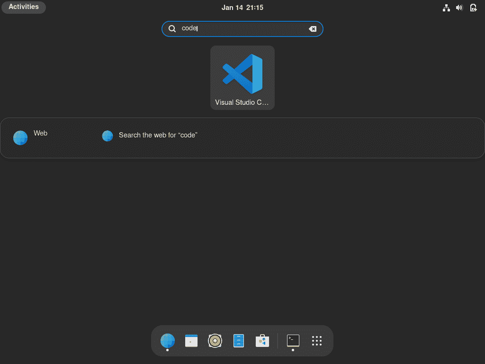

祝贺您安装了来自 AUR 的第一个软件包。Yay 的命令几乎和 pacman 一样，所以如果你能用 pacman 做一些事情，你也应该能用 yay 做同样的事情。

事实上，yay 也可以像 pacman 一样从官方的 Arch Linux 库安装包。但是我建议你只在必要的时候使用 yay 来安装来自 AUR 的软件包，其他的都用 pacman。

### 如何手动安装软件包

正如我在上一节所说的，ArchWiki 建议避免任何 AUR 助手，手动安装来自 AUR 的软件包。我现在告诉你怎么做。

确保你已经安装了`git`和`base-devel`包。如果没有，使用`pacman`来安装它们。

为了演示，我们这次安装 Spotify。首先访问 spotify 包的 AUR 页面-[https://aur.archlinux.org/packages/spotify/](https://aur.archlinux.org/packages/spotify/)，并从那里复制“Git 克隆 URL”。

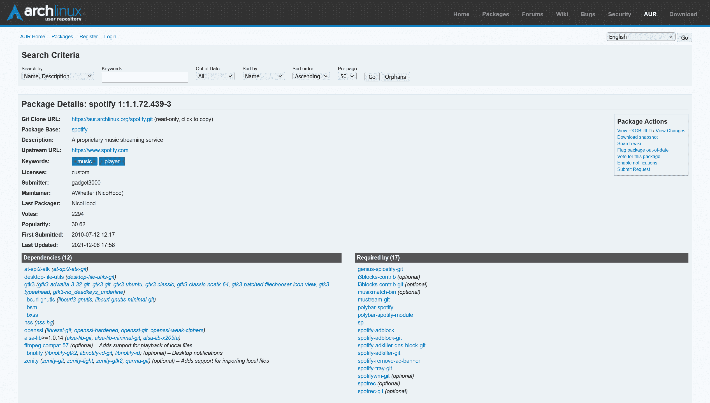

该页面甚至列出了您需要的所有依赖项。将存储库克隆到您的计算机上:

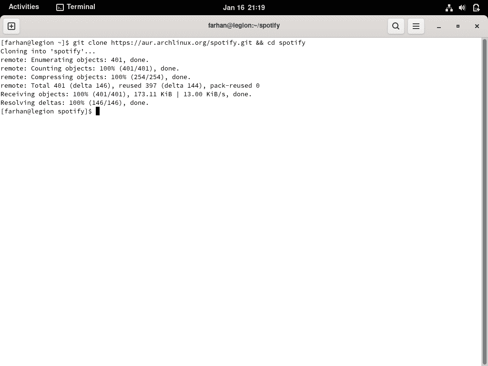

每个 AUR 存储库都附带一个 PKGBUILD 文件，其中包含构建包的指令。每当您从 AUR 安装一个包时，使用类似于`cat`的命令检查 PKGBUILD 文件是一个好主意:

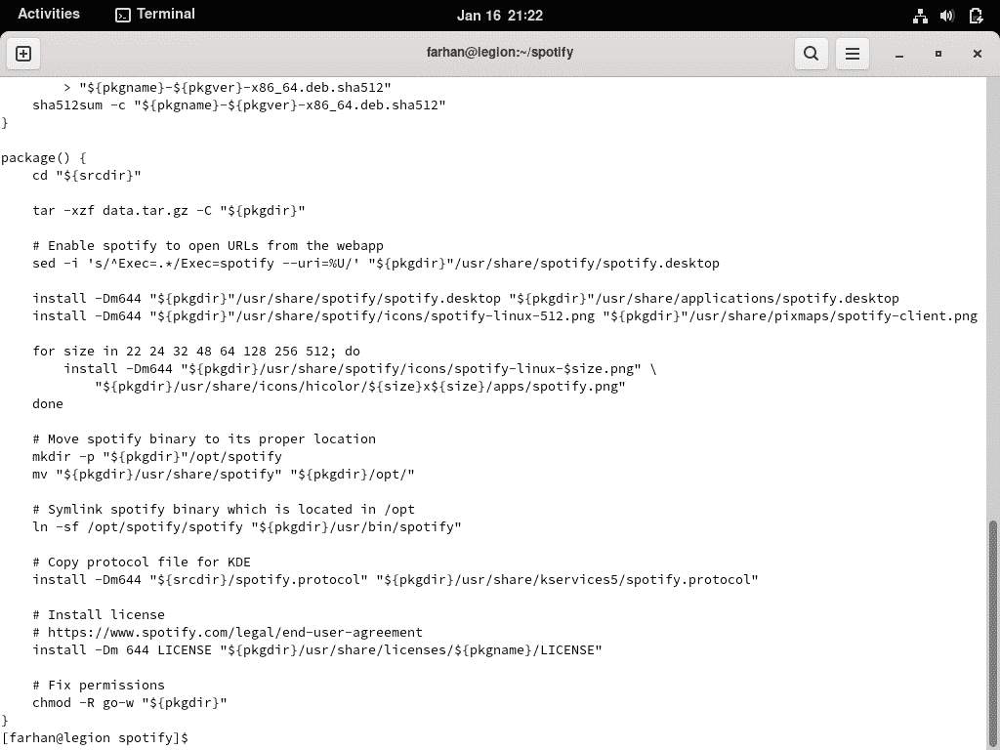

确保文件里没有有害的东西。一旦您满意了，使用`makepkg`来安装任何依赖项，构建包，并安装它。理想情况下，不应该有任何问题，但有时，事情可能会发生意想不到的转折。

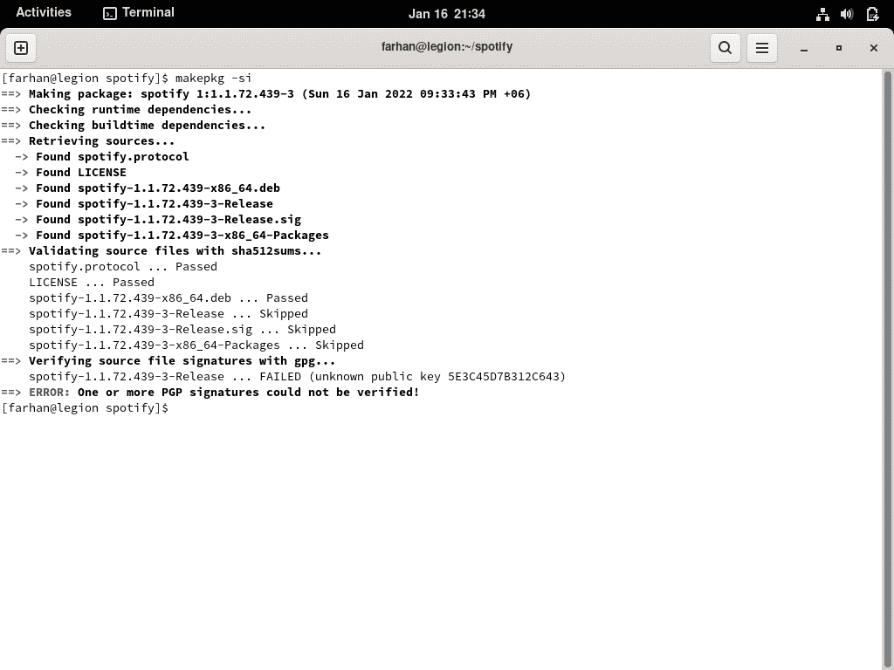

在这些情况下，请返回相应的 AUR 页面，查看用户评论。就像在这种情况下，我发现了下面的固定评论:

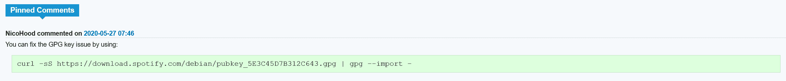

原来这个包要求您将 Spotify for Linux gpg 密钥添加到用户 kyechain。该命令使用`curl`下载 gpg 密钥，并将其作为`gpg --import`命令的输入:

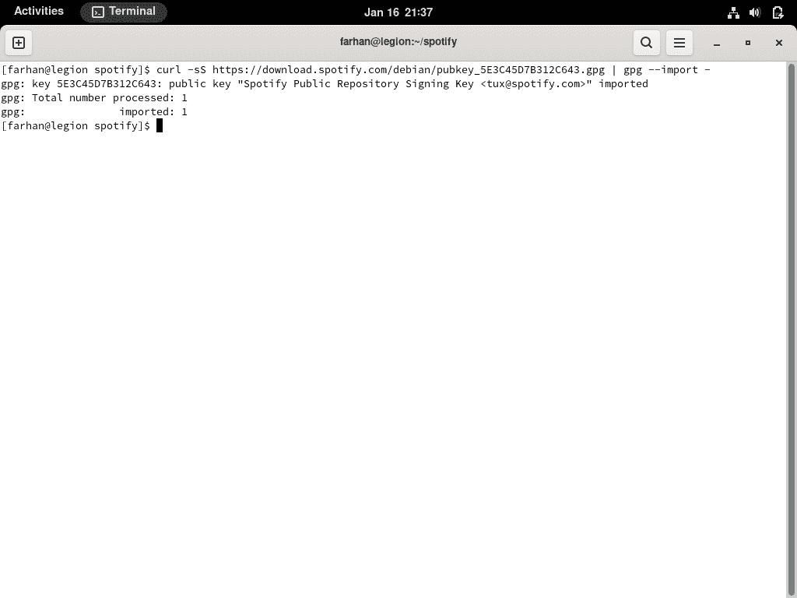

再次尝试执行`makepkg -si`,这一次一切都会正常工作:

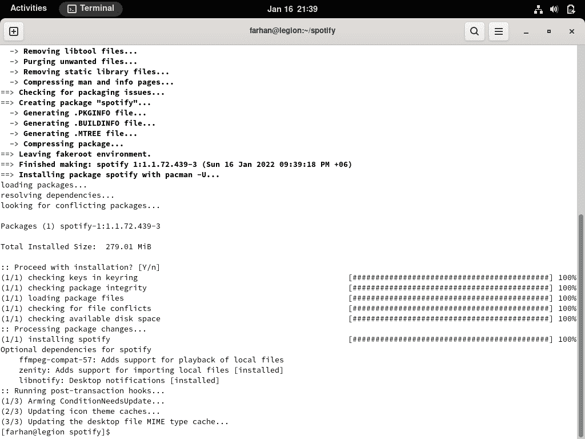

看，告诉过你！手动安装包经常涉及到这样的故障排除，但帮助几乎总是在评论角附近。让我们现在欣赏一些音乐。

## 如何解决常见问题

看，我已经在我所有的设备上使用 Arch 几年了，但是我仍然遇到问题。幸运的是，当你陷入困境时，有一些很好的地方可以寻求帮助:

*   [ArchWiki](https://wiki.archlinux.org/)
*   [Arch Linux 论坛](https://bbs.archlinux.org/)
*   [r/archlinux](https://www.reddit.com/r/archlinux/)

在很大程度上，维基应该有你正在寻找的信息。事实上，如果你正在使用笔记本电脑，并且很难让某些东西工作，那么有一个完整的 wiki [类别](https://wiki.archlinux.org/title/Category:Laptops)专门针对不同的笔记本电脑。所以看看维基吧。

如果维基不能解决你的问题，那么问问论坛和子网站的其他用户。但是无论何时你这样做，一定要先做好你的研究，并在文章中尽可能多的描述。如果其他用户不得不向你询问更多的信息，这真的很烦人，而且也会降低你得到答案的机会。

## 如何使用活拱 ISO 作为救援媒体

不管人们怎么说，只要你知道你在做什么，Arch Linux 是非常稳定的。如果你着手安装你在 AUR 遇到的每一个时髦的软件包，或者不停地切换不同的内核而不知道它们是干什么用的，你的系统可能无法启动。

在这些情况下，您可以使用您的实时 USB 驱动器作为救援媒体。为此，请将可启动 USB 重新连接到您的计算机，并启动到实时环境中。在那里，如果你想的话，配置时间、键映射和字体。

然后使用`fdisk`列出您所有的分区，并找到存放您的 Arch Linux 安装的分区。在我的例子中，它是`/dev/sda2`分区。像以前一样挂载分区:

```
mount /dev/sda2 /mnt
```

现在使用 Arch-Chroot 作为根用户登录。

```
arch-chroot /mnt
```

现在卸载你安装的坏的软件包或者回到过去工作的内核版本等等。完成后，退出 Arch-Chroot 环境，卸载分区，然后重新启动:

```
exit
umount -R /mnt
reboot
```

如果电脑启动正常，那么恭喜你。否则，试试维基、论坛或子编辑。如果没有工作，你可能要做一个全新的安装。

## 进一步阅读

如果你已经走了这么远，那么你已经读了很多书——但这还不是全部。这整本手册是通过结合维基、论坛和子编辑的信息写成的。我列出了一些我认为你应该阅读的维基页面。

*   [安装指南](https://wiki.archlinux.org/title/Installation_guide)
*   [网络配置](https://wiki.archlinux.org/title/Network_configuration)
*   [一般性建议](https://wiki.archlinux.org/title/General_recommendations)
*   [桌面环境](https://wiki.archlinux.org/title/Desktop_environment)
*   吃豆人
*   [拱形建筑系统](https://wiki.archlinux.org/title/Arch_Build_System)
*   [makepkg](https://wiki.archlinux.org/title/makepkg)
*   [应用列表](https://wiki.archlinux.org/title/List_of_applications)

现在想不出更多了，但是我会更新这个列表。

## 结论

我衷心感谢您花时间阅读这篇文章。我希望你已经享受了这段时间，并且不仅对 Arch 而且对 Linux 有了更多的了解

除了这本书，我还在 [freeCodeCamp](https://www.freecodecamp.org/news/author/farhanhasin/) 上免费写过关于其他复杂主题的长篇手册。

这些手册是我的使命的一部分，为每个人简化难以理解的技术。这些手册中的每一本都需要花费大量的时间和精力来编写。

如果你喜欢我的写作，想让我保持动力，可以考虑在 [GitHub](https://github.com/fhsinchy/) 上离开 starts，并在 [LinkedIn](https://www.linkedin.com/in/farhanhasin/) 上为我的相关技能背书。

我总是乐于接受 Twitter 或 T2 LinkedIn 上的建议和讨论。用直接信息打击我。

最后，考虑与他人分享资源，因为

> 在开源领域，我们强烈地感觉到，要真正做好一件事，你必须让很多人参与进来。——莱纳斯·托瓦尔兹

直到下一个，保持安全，继续学习。