# 如何在数字海洋 VPS 上安装 cpanel/whm

> 原文：<https://www.freecodecamp.org/news/how-to-install-cpanel-whm-on-a-digital-ocean-vps-8146eb83f70a/>

迈克尔·乌马纳

# **如何在数字海洋 VPS 上安装 cpanel/whm**


photo credits: pexels.com

#### **简介**

在本文中，我将带我们一步一步地在数字海洋 VPS 上安装 cpanel/whm。注意，这些步骤可以用来在任何 VPS 上安装 cpanel/whm，但是对于这篇文章，我将使用数字海洋 VPS。

选择一个可靠的托管平台来托管您的项目可能是一项艰巨的任务。事实上，在我最终同意使用数字海洋之前，我花了大量的时间浏览评论和特写。

#### 为什么是数字海洋

*   他们的 VPS 价格是最好的之一——低至每月 5 美元。
*   漂亮的管理界面
*   非常积极的支持
*   高性能服务器。

#### 为什么我们要安装 cpanel/whm

Cpanel 是一个基于网络的服务器控制面板，使网站管理变得轻而易举。它包括许多功能，如创建邮件、服务器安全、域管理、数据库等等，这些功能简化了开发人员的工作。通过点击[链接](https://cpanel.com/demo/)，你可以看到它是如何工作的演示。

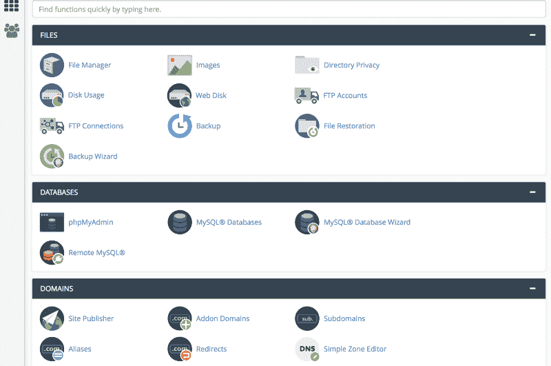

cpanel dashboard

#### 使用数字海洋建立帐户

首先，你需要在数字海洋开户。注册这个链接，[https://bit.ly/2JvuZ2V](https://bit.ly/2JvuZ2V)，会在你的账户中存入 10 美元供你使用，它还会给我一些推荐信用。真的不多，但是聊胜于无。

如果你是学生或者认识学生，注册 Github 的学生包，你将额外获得 50 美元用于你的数字海洋账户。

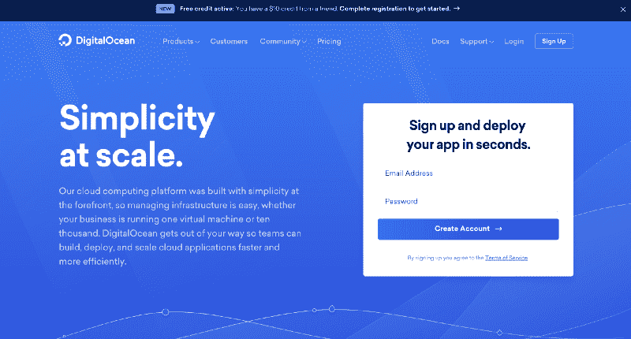

digital ocean signup form

#### 创建一个液滴

一旦你登录到你的仪表板，去右上角，点击下拉菜单上的创建按钮，然后选择水滴。

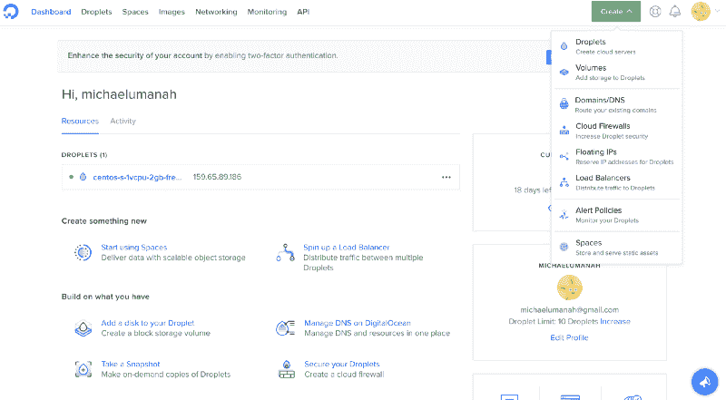

digital ocean dashboard

Droplet 是数字海洋服务器的名称，您将在安装和设置 cpanel 时使用它。

然后它会带你到一个屏幕，让你选择一个图像。点击 centOS。我们这样选择是因为 WHM/cPanel 运行在 CentOS 服务器上。

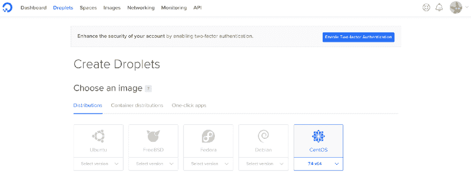

向下滚动，你可以选择你想要的水滴大小。您可以选择任何您认为合适的配置，但是请记住，cpanel 网站上说明的安装 cpanel 的最低配置是 1gb ram 和 20gb 磁盘空间。

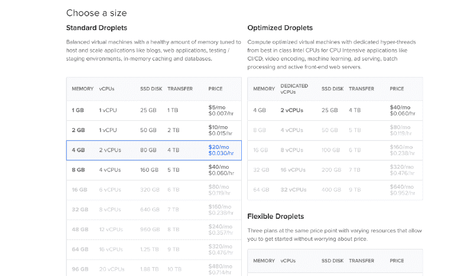

您也可以选择块存储来备份数据。

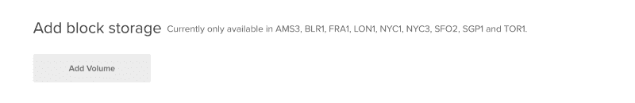

向下滚动，您将被要求选择一个数据中心区域。如果您的大多数网站都面向某个特定的国家，那么在大多数用户访问您的网站的地方附近安装一台本地服务器会很有帮助。

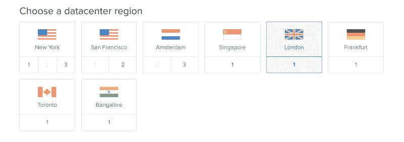

再往下，您可以选择其他选项。在这里，我通常选择专用网络、IPv6 和监控。


确保您的主机名是 HOSTNAME.YOURDOMAIN.COM

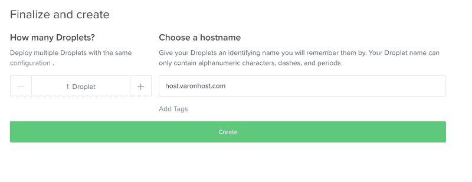

完成后，Digital Ocean 将开始创建您的 droplet，并通过电子邮件向您发送 SSH 密钥，让您能够以 root 用户身份访问您的服务器。

#### 在你的 droplet 上安装 Cpanel。

一旦你收到邮件，就意味着你的服务器已经准备好了，你可以开始在上面安装 cpanel/whm 了。您需要注意邮件中的以下内容:

*   水滴名称
*   Droplet IP 地址
*   Droplet 用户名(将成为 root 用户)
*   Droplet 密码(首次登录时会要求您更改)

我们需要能够远程访问我们的服务器，在上面运行一些命令。

对于 Mac 用户来说，使用终端就可以轻松做到这一点。在 Mac 上打开终端，并键入以下命令。

```
ssh root@162.345.323.09
```

上面的数字应该是发送到您的电子邮件的 droplet IP 地址。

然后，它会提示您输入可以复制和粘贴的密码，然后单击 enter。

请注意，当输入或粘贴密码时，该字段不会显示，所以只需在粘贴后单击 enter 即可。

对于 Windows 用户，我推荐使用 PuTTY(你可以在这里下载[)。这是一个免费软件，你可以用它来获得对服务器的外壳访问。](https://www.putty.org/)

安装油灰并打开后，您将会看到以下内容。

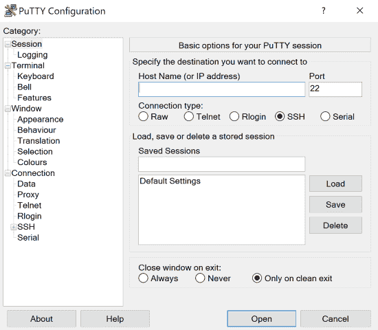

您只需在此处添加您的主机名(或 Droplet IP 地址)并点按“打开”。

您将以“root”身份登录，然后复制并粘贴您之前记下的密码。

注意:要在 Windows 上复制和粘贴，只需右击鼠标并按回车键。出于安全原因，PuTTY 不会显示您的密码，但它确实存在。

默认情况下，数字海洋会要求您重置密码。只需输入您当前的密码，然后您想要的密码，并按下回车键。

#### 安装 cPanel

安装 cpanel 非常容易，我们只需在服务器上运行几个命令。我们首先通过运行以下命令来安装 perl，为 cpanel 安装准备我们的服务器。

```
sudo yum install perl
```

安装 perl 之后，我们需要再做一个预备步骤。cPanel 对于确保安装它的服务器具有完全合格的域名非常挑剔。为此，我们需要为它提供一个有效的主机名。您可以输入一个临时名称，然后在安装 cPanel 后进行更正。

```
hostname  host.example.com
```

**注意:最后一个命令应该是您自己的主机名。**

我们现在已经完成了预安装，因此我们将开始实际的 cpanel 安装。我们从安装 screen 和 wget 开始。

```
sudo yum install screen wget
```

一旦安装了 screen 和 wget，我们就可以通过键入以下命令来启动一个新的 screen 会话。

```
screen
```

打开屏幕后，我们可以使用这个命令开始安装 cpanel。

```
wget -N http://httpupdate.cPanel.net/latest
```

完成后，我们可以通过键入命令来启动脚本。

```
sh latest
```

脚本可能需要 1 -3 个小时来执行，所以你必须耐心等待，直到它完成。

#### 设置您的新 cpanel 帐户。

哇，我们终于在服务器上安装了 cpanel。接下来就是在上面配置基本设置了。

#### 访问您的服务器

要访问您的服务器，请在您的浏览器上进入[https://YOUR DROPLET IP:2087](https://YOURDROPLETIP:2087,)，并输入您的用户名和 root 密码。

```
eg: https://162.345.323.09:2087
```

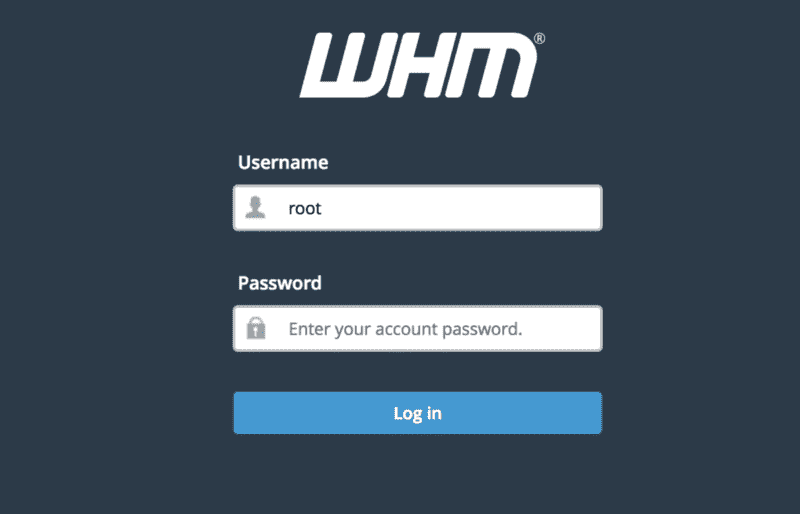

一旦您登录，我们现在需要添加 WHM 的基本功能，并同意他们的许可条款。

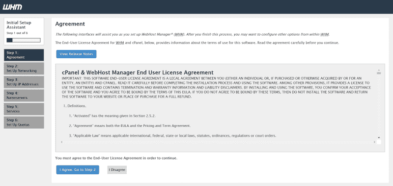

接下来，输入您的联系电子邮件，并继续下一步。您不必更改其他设置。

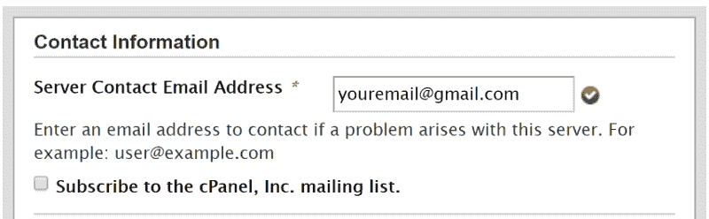

跳过下一步。

确保您的名称服务器配置设置为绑定，并向下滚动选择您的名称服务器。

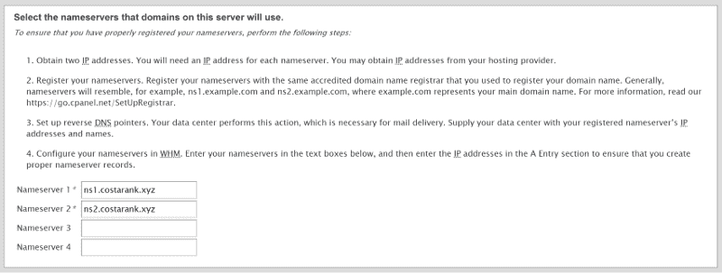

将您的 FTP 服务器设置设为纯 FTPD——这是所有 cPanel 系统的默认设置。完成后，进入下一步。

选择使用文件系统配额，然后单击完成。


你完了！WHM 现已安装完毕。您可以开始创建帐户和添加域名了。

#### Cpanel/whm 许可证

要在您的服务器上使用 cpanel/whm，您需要购买许可证。但是因为你正在一个新的服务器上安装 cpanel，你将有 15 天的免费试用期。之后，你将不得不添加一个许可证，否则你将被锁在 whm 之外。

从 cpanel 购买 VPS whm/cpanel 许可证每月需要花费 20 美元。但是如果你需要节省一些钱，你可以点击[这个链接](https://www.buycpanel.com/)从 cpanel 的授权经销商“购买 cpanel”购买同样的许可证，每月只需 15 美元。

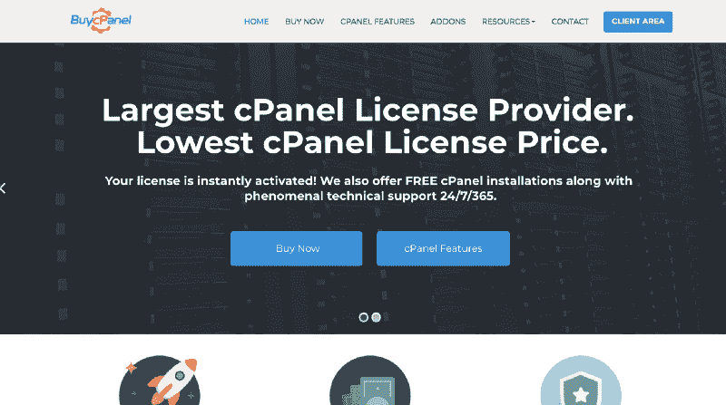

buycpanel home page

点击链接后，记得选择 whm/cpanel VPS 许可证，然后你就可以添加任何你喜欢的插件了。然后继续付款。

真的就那么简单。如果您在安装过程中遇到任何问题或建议，您可以添加评论，我会尽快回复您。