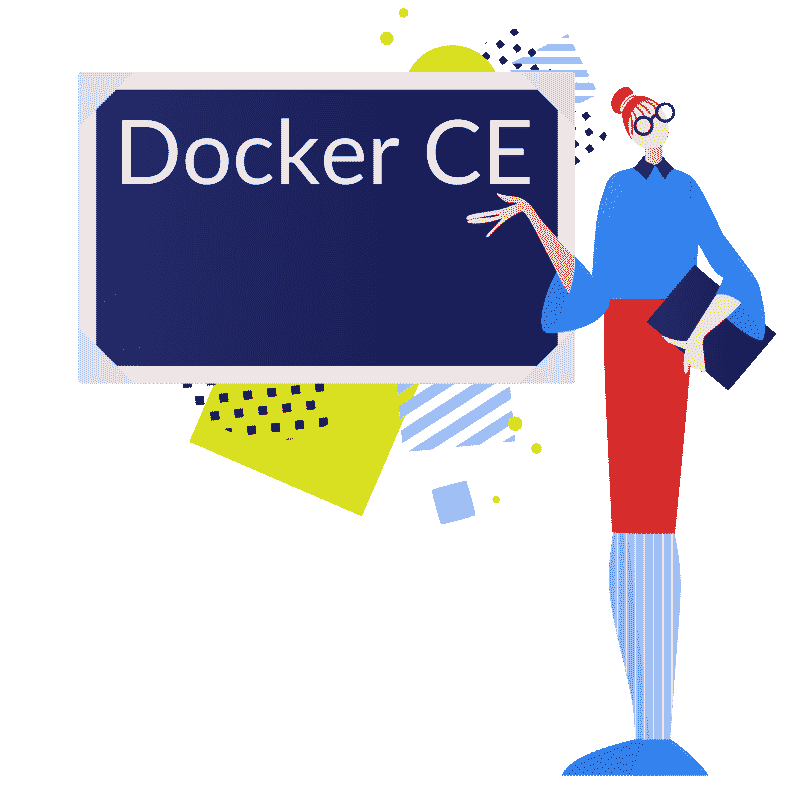
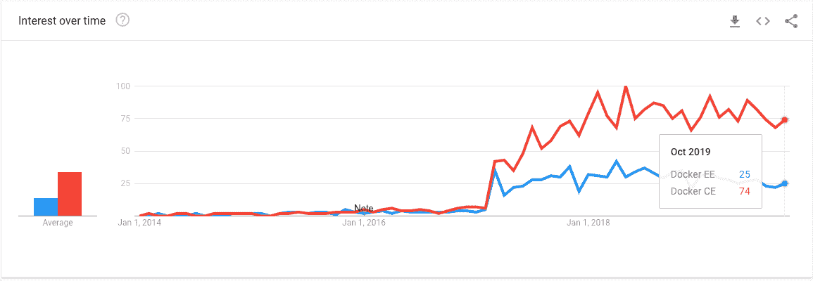
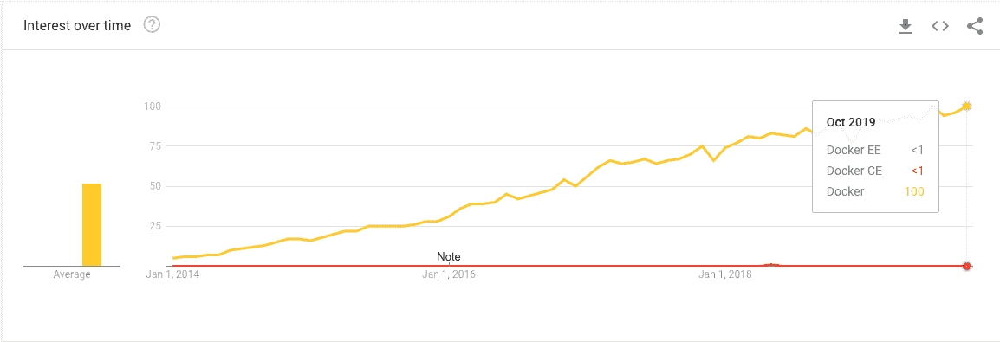
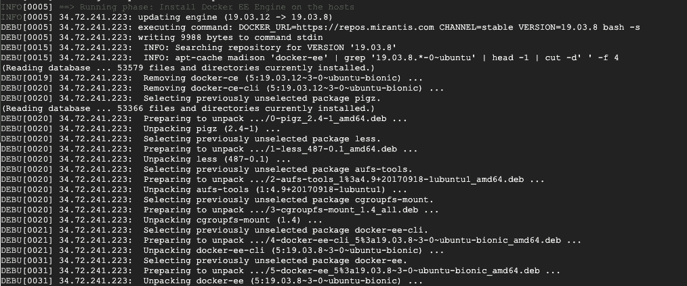
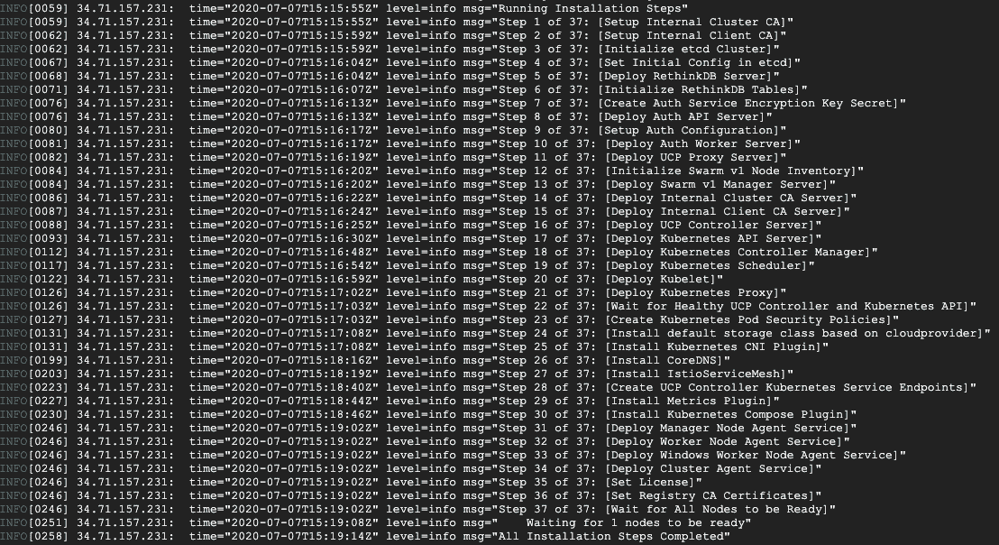
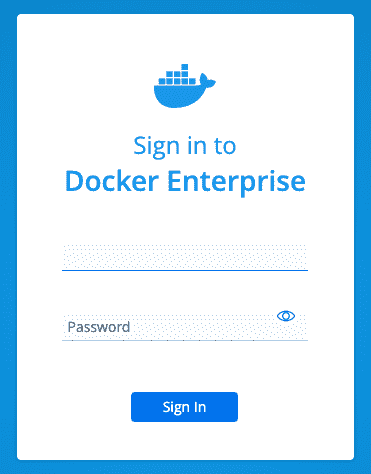
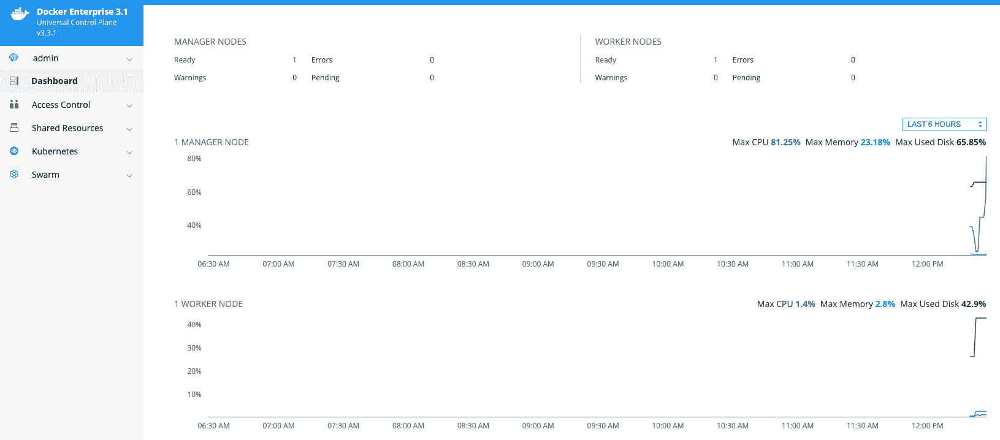

# 如何在 Ubuntu 18.04 上安装 Docker[CE 和 EE 指南]

> 原文：<https://www.freecodecamp.org/news/how-to-install-docker-on-ubuntu-18-04-guide-for-both-ce-and-ee/>

[回到 2017 年](https://www.docker.com/blog/docker-enterprise-edition/)，Docker 推出了其平台的两个不同版本:Docker-CE 和 Docker-EE。但是你知道他们的区别吗？



Docker CE(社区版)是经典的 OSS(开源软件)Docker 引擎。包括完整的 Docker 平台，非常适合开始构建容器应用程序的开发人员和 DIY 操作团队。

如果你像我一样是一个狂热的开发者，你可能已经使用 Docker 有一段时间了。我想说这很可能是你用过的版本，因为它是免费的！


另一方面，Docker EE 是 CE 的高级版本。它具备 CE 的所有功能，外加许多企业级功能。

任何附赠的东西都是[不是免费的吧](https://hub.docker.com/editions/enterprise/docker-ee-server-ubuntu/purchase)？所以从 750 美元/月的基本计划到 2000 美元/月的高级计划。无论如何，价格与你对企业产品的期望相当。

> 请与他们的销售团队联系，查看最新价格。

## CE 与 EE 对接器-详细信息

让我们快速比较一下一段时间内 Docker EE 和 Docker CE 的利息:



Now Docker EE vs Docker CE vs Docker:



从我的经验来看，搜索 just Docker 的用户寻找的是 ce 版。这让我们看到 Docker EE 用得少多了。但是我确信在一些健壮的用例中使用它是有意义的。

因为我是一个开源爱好者，我所有的经验都来自于使用 Docker CE edition，所以写这篇文章是一次体验 Docker EE 的美妙经历。

简单介绍完之后，让我们动手吧。


## 准备 Ubuntu 18.04 机器

作为第一步，我们将通过运行一些常用命令来准备土壤。

所有命令都将在全新的 Ubuntu 18.04 机器上执行，这次我选择了谷歌云平台作为演示环境。

### 创建虚拟机

让我们从使用 Ubuntu 18.04 映像创建一个全新的虚拟机开始:

```
gcloud compute instances create ubuntu-fcc-demo \
--zone=us-central1-c \
--machine-type=n1-standard-1 \
--image=ubuntu-minimal-1804-bionic-v20200703a \
--image-project=ubuntu-os-cloud \
--boot-disk-size=10GB \
--boot-disk-type=pd-standard
```

现在使用 ssh 连接到它:

```
gcloud compute ssh ubuntu-fcc-demo --zone=us-central1-c
```

设置公用相关性:

```
sudo apt-get update

sudo apt-get install \
   apt-transport-https \
   ca-certificates \
   curl \
   gnupg-agent \
   software-properties-common
```

## 在 Ubuntu 18.04 上安装 ce dock

### 从 https://get.docker.com 安装

安装脚本允许您在支持的 linux 发行版上快速安装最新的 Docker-CE 版本。我不建议依赖这个脚本来部署到生产系统。从[对接-安装](https://github.com/docker/docker-install):

```
curl -sSL https://get.docker.com/ | sh
```

这个命令的美妙之处在于它将检查您的 linux 发行版并运行正确的指令来让 Docker CE 为您运行。

您可以通过运行以下命令来测试一切正常:

```
sudo docker run hello-world

# output
Hello from Docker!
This message shows that your installation appears to be working correctly.
```


### 从 Docker 存储库安装

这一个有更多的步骤，但却是 Docker 官方文件推荐的方法(我们甚至检查了他们的 [GPG 关键指纹](https://en.wikipedia.org/wiki/Public_key_fingerprint) t)。

首先，添加 Docker 的官方 GPG 键:

```
curl -fsSL https://download.docker.com/linux/ubuntu/gpg \
| sudo apt-key add -
```

然后验证钥匙的指纹:

```
sudo apt-key fingerprint 0EBFCD88
```

寻找指纹`9DC8 5822 9FC7 DD38 854A  E2D8 8D81 803C 0EBF CD88`。这确保了密钥没有被篡改。

接下来，建立一个 docker **stable** 仓库:

```
sudo add-apt-repository \
   "deb [arch=amd64] https://download.docker.com/linux/ubuntu \
   $(lsb_release -cs) \
   stable"
```

`$(lsb_release -cs)`命令返回 Ubuntu 发行版。在我们的例子中，我们使用了`bionic`。

现在安装 Docker 引擎:

```
 sudo apt-get update
 sudo apt-get install docker-ce docker-ce-cli containerd.io
```

并通过运行以下命令来测试一切正常:

```
sudo docker run hello-world

# output
Hello from Docker!
This message shows that your installation appears to be working correctly.
```


基于[docs.docker.com](https://docs.docker.com/engine/install/ubuntu/)的说明。

## 在 Ubuntu 18.04 上安装 EE 坞站

### 使用 Mirantis Launchpad CLI 安装

要使用 Docker EE，您需要一个试用/购买版本。Docker 禁用了在他们的网站上获得试用订阅的选项，现在你需要联系他们的销售团队[来获得试用账户](https://hub.docker.com/editions/enterprise/docker-ee-server-ubuntu)。

环顾四周，我发现，自从 [Mirantis 收购 Docker Enterprise](https://techcrunch.com/2019/11/13/mirantis-acquires-docker-enterprise/) 以来，获得 Docker EE 试用账户的方式已经发生了变化。你需要去[米兰提斯网站](https://www.mirantis.com/software/docker/download/)，申请后，你可以立即下载。

在撰写本文时，安装程序目前是测试版软件。如果有不同的方法安装 Docker EE，请联系我们。我很想改进这篇文章！

Mirantis Launchpad CLI 工具(" **launchpad** ")是评估和体验 [Docker Enterprise](https://www.mirantis.com/software/docker/docker-enterprise/) (查看 [launchpad GitHub](https://github.com/Mirantis/launchpad) )的新的、更好的方式。

### 下载启动板 CLI

从[下载 Launchpad](https://github.com/Mirantis/launchpad/releases/latest) 开始。对于 Ubuntu 18.04，我使用的是 [launchpad-darwin-x64](https://github.com/Mirantis/launchpad/releases/download/0.12.0/launchpad-darwin-x64) 版本。

如果您没有从虚拟机下载它，这里有一个将它上传到虚拟机的命令:

```
gcloud compute scp launchpad-linux-x64 ubuntu-fcc-demo:~/launchpad \
  --zone=us-central1-c
```

接下来，验证安装:

```
# Give it writting permission
chmod +x launchpad

# Verify the installation
./launchpad version

# output
version: 0.12.0
commit: 4492884
```

然后注册您的用户:

```
launchpad register
```

通过注册提供的信息用于分配评估许可证，并为产品的使用提供帮助。

接下来，设置您的`cluster.yaml`配置。

这一步是花费我最多时间的一步。您需要设置 3 台机器:

*   管理机器:执行 launchpad 命令的机器。
*   工作机:将运行您的工作负载。
*   Manager machine:包含管理仪表板，您可以在其中访问许多配置和指标。

他们在 Go `launchpad`二进制方面做得很好。棘手的部分在基础设施设置中。幸运的是，他们已经有一些[地形脚本](https://github.com/Mirantis/launchpad/tree/master/examples/terraform)来帮助它。

因为在撰写本文时，还没有针对 GCP 的选项，所以我不得不手动设置基础设施。管理机器连接到 Worker 和 Manager 节点来设置许多步骤，所以要确保正确设置了 ssh 密钥。

ssh 密钥这一步花了我一些时间才弄明白，我甚至[在他们的回购中提出了一个问题](https://github.com/Mirantis/launchpad/issues/30)，但我很快就解决了它。所以如果你有类似的问题，一定要检查一下。

关于你可以在配置文件中使用的每个属性，都有一个真正详细的文档。

现在是引导集群的时候了。

一旦设置了`cluster.yaml`配置，就可以运行 apply 命令:

```
launchpad --debug apply
```

您应该会看到类似这样的内容:

**运行阶段:在主机上安装 Docker EE 引擎**



这就是我可以说他们在抽象所有设置步骤方面做得非常好的地方。

Go `launchpad`二进制执行 37 个步骤。



最后，您应该会看到这样一条消息:

```
INFO[0021] ==> Running phase: UCP cluster info
INFO[0021] Cluster is now configured. You can access your cluster admin UI at: https://34.71.157.231 \
INFO[0021] You can also download the admin client bundle with the following command: launchpad download-bundle --username <username> --password <password> 
```

现在，要测试一切是否正常，请进入集群管理 UI:



Admin login UI

登录后，您将看到集群管理用户界面:



Admin dashboard


我玩了一点它的一些功能，总的来说它们很棒。它们提供易于使用的访问控制和经认证的 Docker 图像。

这些说明基于本[入门指南](https://github.com/Mirantis/launchpad/blob/master/docs/getting-started.md)。

## ****包皮**起******

在本文中，我们看到了如何在 Ubuntu 18.04 上为 CE 和 EE 版本设置 Docker。

自从 [Mirantis 收购 Docker Enterprise](https://techcrunch.com/2019/11/13/mirantis-acquires-docker-enterprise/) 以来，我们发现 Launchpad 是客户尝试 Docker Enterprise 许可证的最新方式。

总的来说，开发人员/部署体验非常好，因为为 Docker EE 准备环境的几乎所有步骤都是自动化的。Docker 似乎正在寻求这一过程的日益自动化，这真是太好了！

*来自[图标 8](https://icons8.com/) 的 的插图

如果你觉得这很有帮助，或者希望挑战或扩展这里提出的任何问题，请随时通过 [Twitter](https://twitter.com/mesmacosta) 或 [Linkedin](https://www.linkedin.com/in/mesmacosta) 与我联系。我们连线吧！