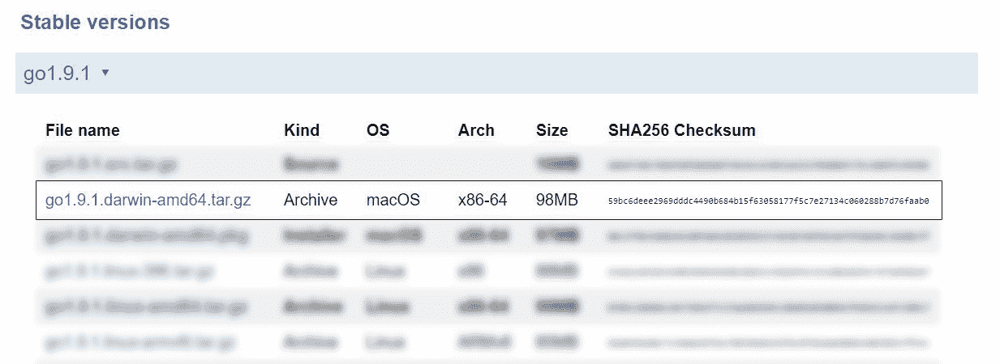

# 如何使用 Pacman 在 Arch Linux 中安装 Go

> 原文：<https://www.freecodecamp.org/news/how-to-install-go-in-arch-linux-using-pacman/>

使用 Arch Linux 包管理器(`pacman`)是安装 Go 最简单的方法。基于快速提供新软件版本的 Arch Linux 理念，您将获得最新版本的 Go。

在安装 Go 软件包之前，您必须更新系统和所有已安装的软件包。不过，在更新你的系统及其软件包之前，记得先查看一下 [Arch Linux 主页](https://www.archlinux.org/)。你为防止包装破损而采取的任何不寻常的措施都会列在那里的一个帖子里。

一旦您确认更新系统是安全的，只需运行以下命令:

```
$ sudo pacman -Syu
```

请记住，`-S`标志用于安装单个软件包或软件包列表，`y`选项刷新所有 Arch Linux 软件包的列表，而`u`选项升级所有过期的软件包。

在您的系统完全更新后，使用以下命令安装 Go:

```
$ sudo pacman -S go
```

### 检查 Go 的安装和版本

要检查 Go 是否安装成功，请运行:

```
$ go version
> go version go1.13.8 linux/amd64
```

这将把 Go 的安装版本打印到控制台，同时确保安装顺利进行。

## 关于 Go 的更多信息:

[在这个免费视频课程中学习围棋](https://www.freecodecamp.org/news/go-golang-course/)

[如何使用 Go 和 Vue.js 构建照片订阅源](https://www.freecodecamp.org/news/how-to-build-a-photo-feed-with-go-and-vue-js-9d7f7f39c1b4/)

## 关于 Arch Linux 的更多信息:

[如何从头安装 Arch Linux】](https://www.freecodecamp.org/news/installing-arch-linux-from-scratch-b595095ddd48/)

## 额外收获:如何在 Ubuntu / Linux Mint 上安装 Go:

使用 Ubuntu 的源码包管理器(`apt`)是安装 Go 最简单的方法。当 Arch Linux 的`pacman`处于前沿时，使用`apt`及其变种安装的包通常落后几个版本。

这种方法的好处是稳定性——虽然你不能安装任何软件包的最新和最好的版本，但你可以肯定你的系统不会崩溃。

首先，使用以下命令更新您的系统:

```
$ sudo apt update
$ sudo apt upgrade
```

然后运行以下命令安装 Go:

```
$ sudo apt install golang-go
```

### 检查 Go 的安装和版本

要检查 Go 是否已成功安装，请打开您的终端并运行:

```
$ go version
```

这将打印已安装的 Go to 控制台版本。

## 额外收获:如何在 macOS 上安装 Go:

### **使用软件包安装程序在 Mac OS X 中安装 Go**

从 [golang 的下载页面](https://golang.org/dl/)，获取 Mac 包安装程序(以。pkg)并运行它。


### 检查 Go 的安装和版本

要检查 Go 是否已成功安装，请打开您的终端并运行:

```
$ go version
```

这将打印已安装的 Go to 控制台版本。

### 使用 tarball 在 Mac OS X 安装 Go

你可以从 [golang 下载页面](https://golang.org/dl/)的最新稳定版获得 Mac OS tarball 存档的链接。



### 安装过程

在这个安装过程中，我们将使用撰写本文时的最新稳定版本(Go 1.9.1)。对于较新或较旧的版本，只需替换第一步中的链接。查看 [golang 下载页面](https://golang.org/dl/)查看当前可用的版本。

##### **安装 Go 1.9.1**

```
$ curl -O https://storage.googleapis.com/golang/go1.9.1.darwin-amd64.tar.gz
$ sudo tar -C /usr/local -xzf go1.9.1.darwin-amd64.tar.gz
$ export PATH=$PATH:/usr/local/go/bin
```

### 检查 go 的安装和版本

要检查 Go 是否安装成功，请使用:

```
$ go version
```

这将打印已安装的 Go to 控制台版本。