# 如何在电脑上安装 Kali Linux

> 原文：<https://www.freecodecamp.org/news/how-to-install-kali-linux/>

Kali Linux(以前称为 BackTrack)是一个开源的 Linux 发行版，由进攻性安全公司开发和资助。

这基本上是一个道德黑客的梦想操作系统，因为它内置了你需要的大部分工具。从 Metasploit 到 JohntheRipper，再到独一无二的 Aircrack-ng，这款操作系统应有尽有。

但是历史课已经上够了。让我们直接开始学习如何在您的计算机上安装 Kali Linux。

# 要求

在我们继续之前，您应该知道这是在裸机系统上安装的过程，您应该非常小心。

如果您希望双启动您的机器，您将需要分区您的硬盘驱动器给 Kali 至少 20 GB 的硬盘空间，然后安装在该分区。

现在你需要一些制作这幅杰作的材料:

1.  一台计算机(最低要求:20GB 硬盘空间、2GB 内存、英特尔酷睿 i3 或 AMD E1 同等产品)
2.  u 盘(6 GB 或更大)
3.  一个卡利。iso 文件
4.  Rufus(创建可引导驱动器)
5.  一个真正冷静的头脑(相信我，你会需要它的，🥶)

# 如何一步一步地在你的电脑上安装 Kali Linux

### 步骤 1:下载 iso 文件

去 kali.org 点击下载按钮。

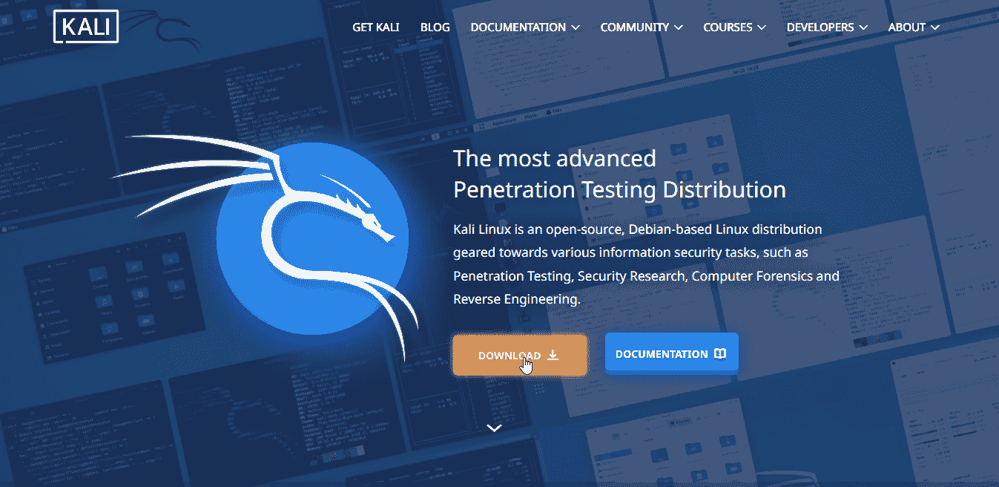

The Kali Homepage | Credit: kali.org

你试图得到的是一个 iso 文件，这只是一种打包软件的方式。操作系统通常是这样打包的(但也有恶意软件，所以要小心你从哪里得到它们💀).

在这里你有很多选择，但要选择“裸机”。这里有 64 位、32 位和苹果 M1 的选项(虽然我不知道为什么最后一个存在)。选择适用于您系统的选项卡，并下载安装程序。对于激流爱好者来说，激流也是可以的。

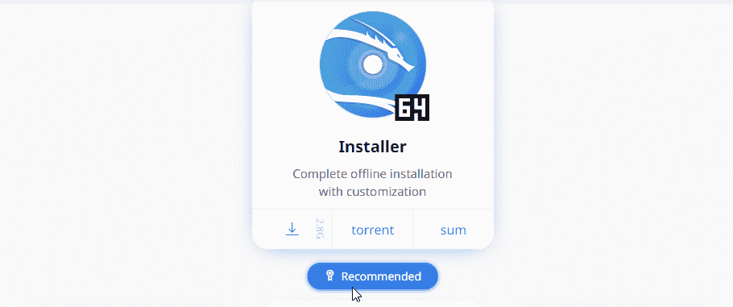

The Installer option | Credit: kali.org

### 步骤 2:创建可引导驱动器

你可以从 [rufus.ie](https://www.freecodecamp.org/news/p/6d73416e-2b28-475d-b6b2-7c5dc3964de9/rufus.ie) 下载 Rufus(截至本文撰写时，Rufus 3.18)。为了使棒可引导，我们将运行 Rufus 并做一些更改。

连接记忆棒，并在“设备”选项下选择它。在“引导选择”下，选择您新下载的 Kali iso 文件。现在是棘手的部分。

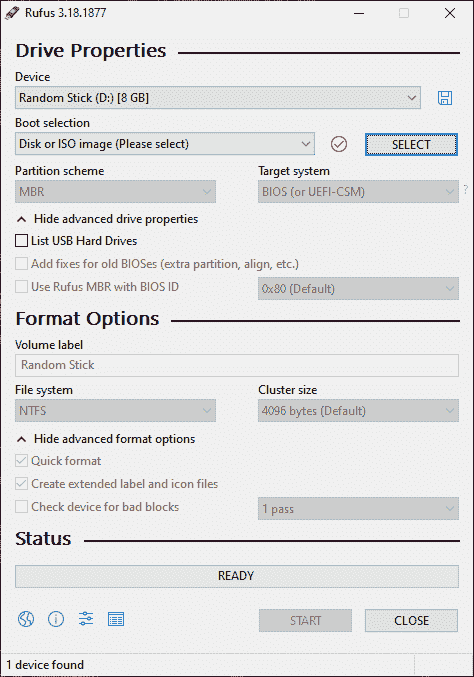

The Rufus Software | Credit: Mercury

在我们继续之前，一个快速的教训:分区方案/表是硬盘保存数据的格式。把它想象成你的视频文件保存在. mp4 或。mkv–它们都是视频，但格式不同。

大多数计算机有下列格式之一:GPT (GUID 分区表)或 MBR(主引导记录)。如果您在这里选择了错误的选项，您可能无法启动您的驱动器。

总结:选择 MBR 选项，如果计算机是旧的或使用传统的 BIOS。选择 GPT，如果它是一个较新的电脑，并使用 UEFI 的 BIOS。如果驱动器没有出现在启动菜单中，请切换到另一个选项并重试。

您也可以转到高级驱动器属性，并选中“为旧 BIOS 添加修复程序”复选框。如果你的电脑很旧的话，这将会使硬盘与你的电脑更加兼容。我说的老，是指古代👴。

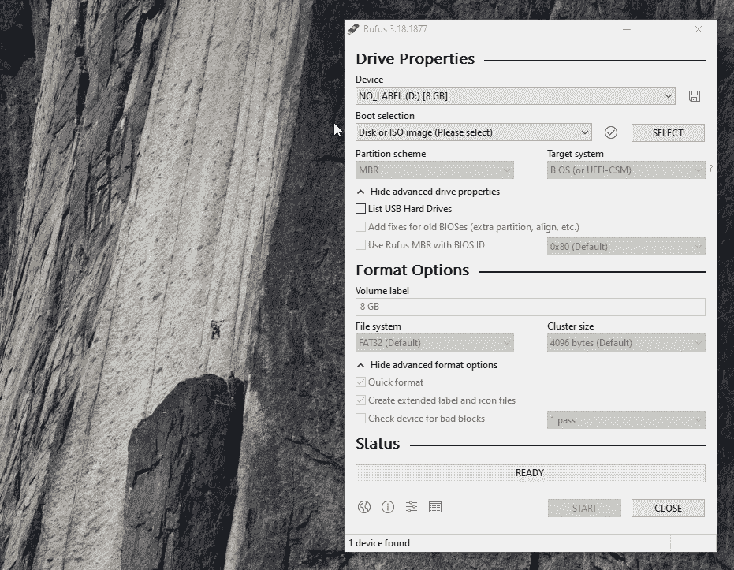

How to prepare the USB stick | Credit: Mercury

现在回到简单的基础上，您可以保留默认的格式选项。点击开始按钮，等待图像被写入记忆棒(这需要一些时间，所以，放松😌).

### 步骤 3:访问 Kali 安装程序菜单

要从新的 Kali 盘启动计算机，如果在 BIOS 设置中启用了安全启动，您需要禁用它。

你可能需要对如何访问你的 BIOS 和启动菜单做一些研究。它通常包括在计算机开始启动时发送垃圾信息(持续按下)键盘上的某个键。

如前所述，如果你是双引导，记下你为 Kali 做的分区大小，这样你就不会覆盖你的其他操作系统😢).

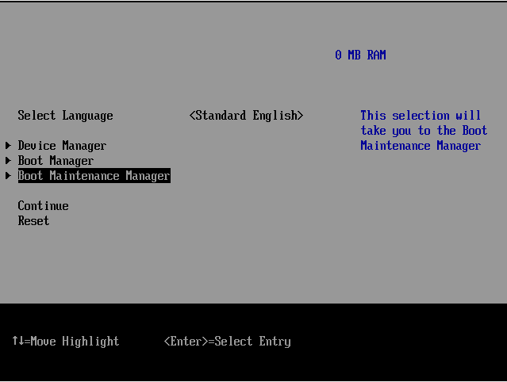

A Legacy BIOS | Credit: VMware

禁用安全引导后，我们终于可以引导到驱动器。启动时，你必须进入启动菜单，然后选择你刚刚做的棒。您应该会看到 Kali 安装程序菜单。

The Kali Installer Menu | Credit: Mercury

注:您也可以在 BIOS 菜单中编辑引导菜单配置，但这是永久性的，可能需要在安装后进行更改。通常最好在启动计算机时找到访问启动菜单的方法，因为这只是一个临时配置。

安装程序菜单只允许键盘输入，所以你必须使用箭头键，回车和 Esc 来导航。

### 步骤 4:开始安装

选择图形化安装，现在您可以使用鼠标了。在以下菜单中选择您的首选语言、区域和键盘布局:

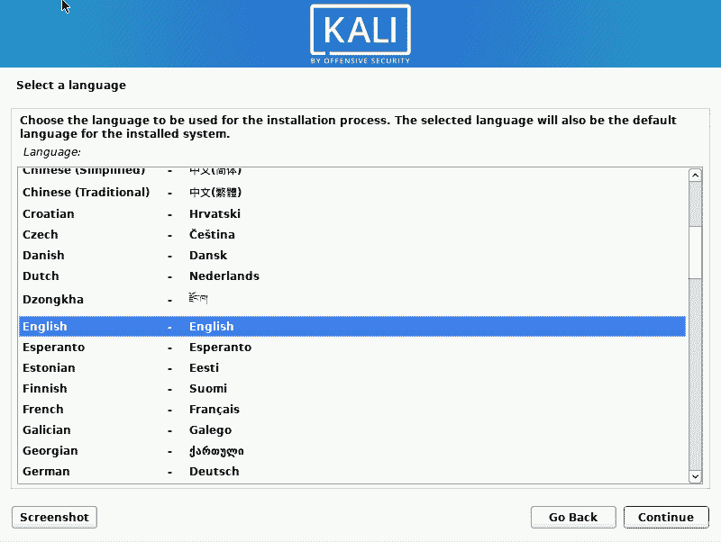

Language Menu | Credit: Mercury

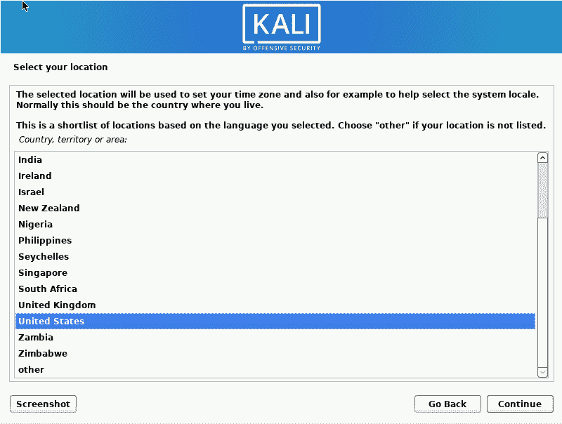

Region Menu | Credit: Mercury

您的计算机将尝试进行一些网络配置，但您可以轻松跳过这一步，因为脱机安装不需要它。

填写主机名，因为这将在公共网络上标识您的计算机。你可以跳过域名部分，因为这是不必要的。接下来，键入新用户帐户的全名。

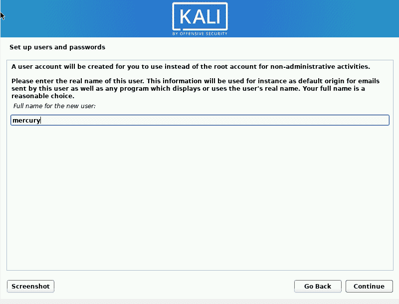

Full Name setup | Credit: Mercury

快速课程:在终端上，Linux 允许你用命令发送和接收电子邮件。然而，如今 Gmail 和雅虎让发送邮件变得容易多了。你可能一辈子都用不到这个功能。

接下来，输入你账户的用户名(这可能是你的黑客别名😎).

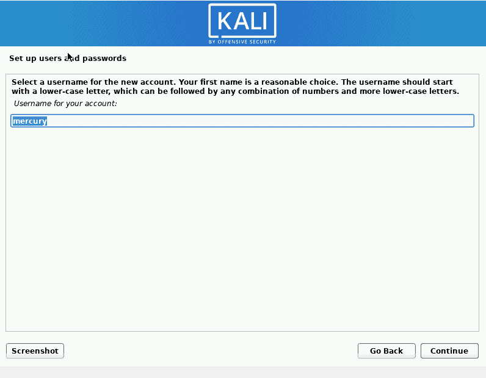

Username setup | Credit: Mercury

在下一个菜单中选择一个强密码。

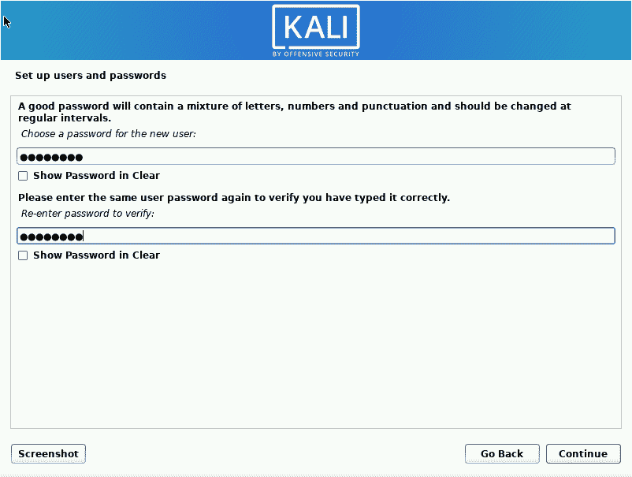

Password setup | Credit: Mercury

选择您的时区。这一点很重要，因为它可能会影响安装后的网络配置。

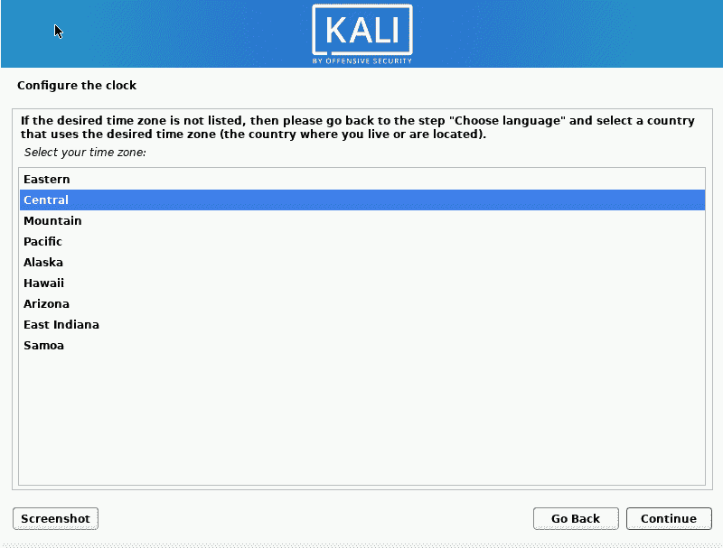

Time zone setup | Credit:

### 第五步:设置储物空间

接下来是选择分区方法。现在对于前面提到的冷静头脑。如果你想为 Kali 格式化整个硬盘，引导选项将是最好的。

LVM(逻辑卷管理)是一个允许您拥有相对灵活的分区的特性。这意味着您可以在操作系统运行时扩展、收缩甚至合并分区。这是一个非常漂亮的功能。

如果有人未经授权访问您的硬盘，加密 LVM 功能可以保护您的数据安全。请注意，这里有一个权衡:你的硬盘会比没有加密时慢。所以大多数人选择“引导使用整个磁盘”选项。

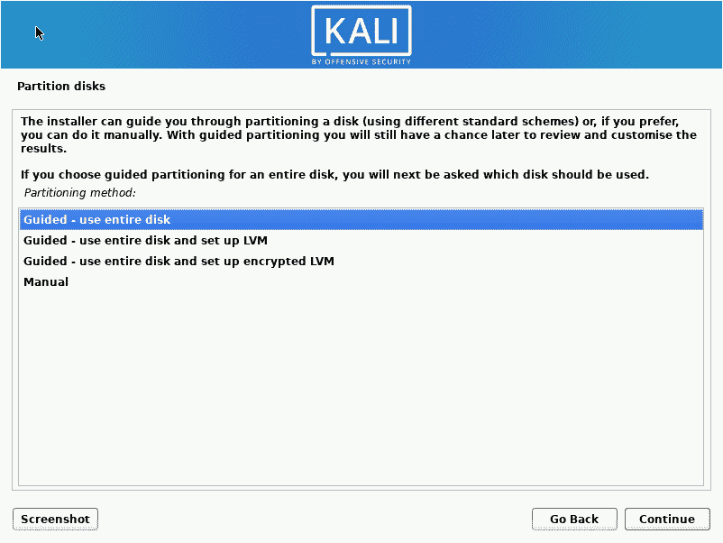

Partitioning method setup | Credit: Mercury

但是，如果您是双引导，您将需要选择手动选项并进行必要的配置。这里我选择使用整个磁盘选项。

选择要安装 Kali 的硬盘。我使用的是虚拟机，所以我唯一的选择是一个 21 GB 的小硬盘。

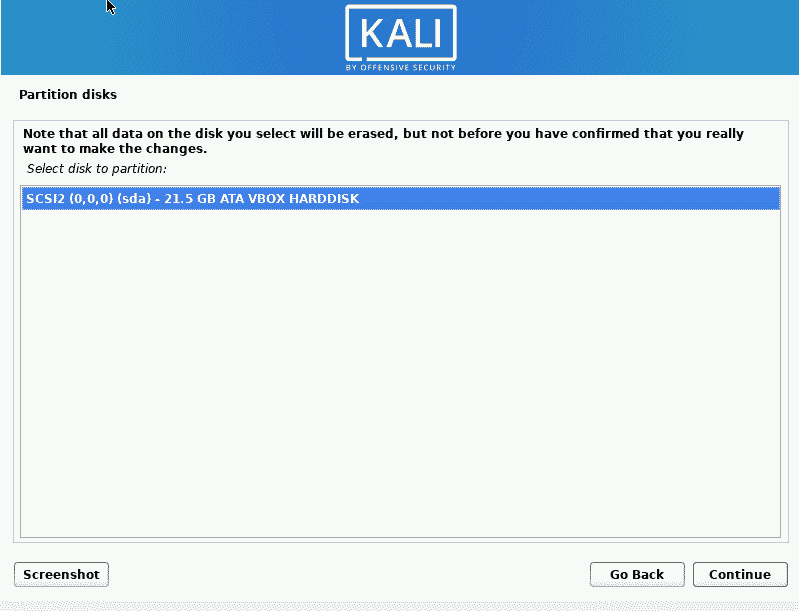

Hard Disk selection | Credit: Mercury

选择文件的分区方式。每个选项的不同之处在于将某些重要的目录分隔在不同的分区中(在后面的文章中会详细介绍)。

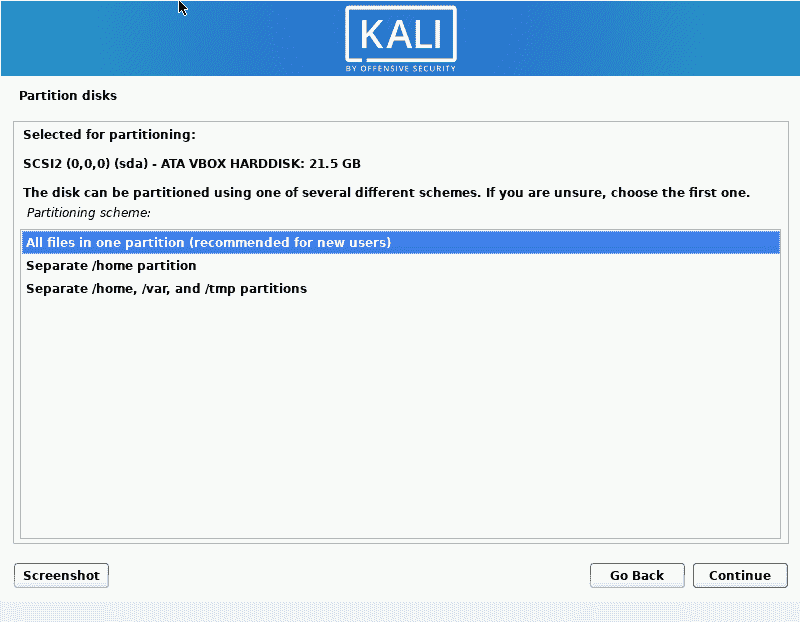

Partitioning Scheme | Credit: Mercury

完成分区更改。

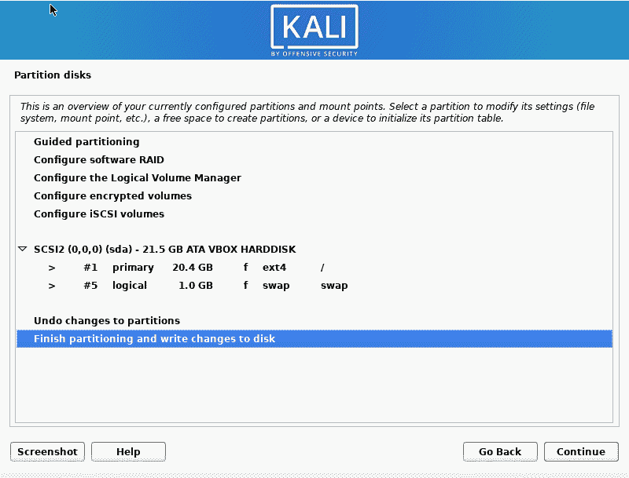

Partition changes info | Credit: Mercury

选择“是”将更改写入磁盘。

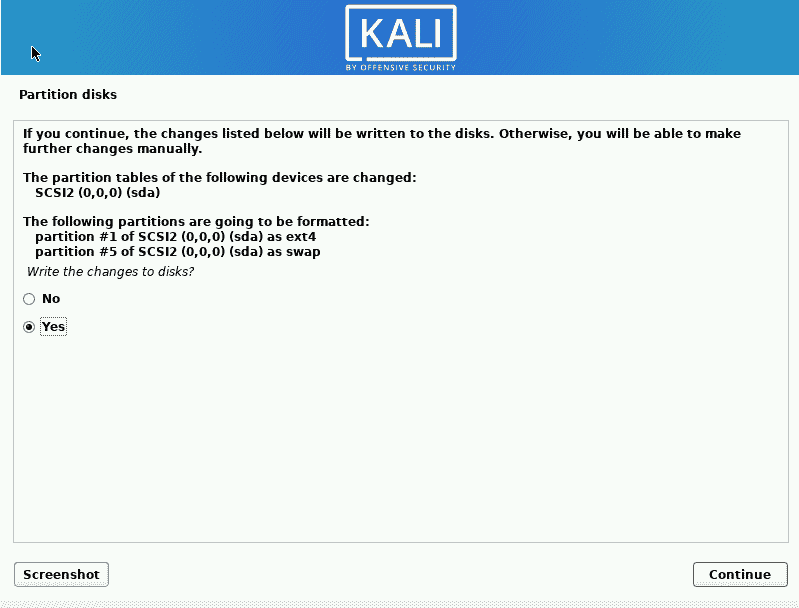

Partition Changes verification | Credit: Mercury

### 第五步:选择软件和桌面外观

现在，选择你想安装的软件。检查桌面环境和工具选项集合，因为这些将帮助你避免以后不得不安装很多东西。

桌面环境基本上就是用户眼中的桌面。Kali 提供 Xfce(最常见)、Gnome 和 KDE。我对 Gnome 很着迷，所以我选择了那个选项。你仍然可以安装所有三个，然后配置你的电脑选择你喜欢的一个。

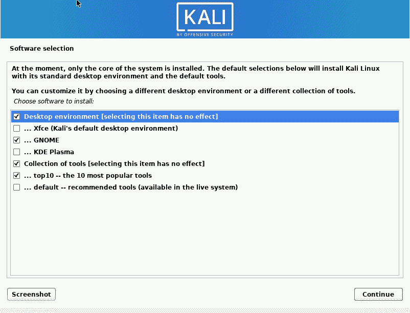

Software Installation Menu | Credit: Mercury

你可以检查第六个框来安装 Kali 上最流行的 10 个工具。这些是:
1。[air crack-ng](https://en.wikipedia.org/wiki/Aircrack-ng)2。[硬石膏](https://portswigger.net/burp)
3。[Crackmapexec](https://mpgn.gitbook.io/crackmapexec/)4。[九头蛇](https://en.wikipedia.org/wiki/Hydra_(software))
5。Johntheripper (jtr)
6。 [Metasploit](https://en.wikipedia.org/wiki/Metasploit_Project)
7。[Nmap](https://en.wikipedia.org/wiki/Nmap)
8。[响应者](https://medium.com/mii-cybersec/gaining-credentials-easily-with-responder-tool-b821f33e342b)
9。[Sqlmap](https://sqlmap.org/)10。 [Wireshark](https://en.wikipedia.org/wiki/Wireshark)

作为一名黑客，你迟早肯定会需要其中的一个，所以最好勾选这个复选框。如果你想在你的系统上安装一大堆工具，你可以选择“默认-推荐工具”框，但是请注意这将花费大量的时间和空间。点击继续并等待。

快速提示:一般建议您只在计算机上安装您绝对需要的工具。这是因为额外的工具可能会降低您的计算机速度，您可能会浪费您从未使用过的数据更新工具，并且如果有一个活跃的漏洞逍遥法外，您可能会更容易受到攻击。

### 步骤 6:安装 GRUB 引导程序

GRUB 引导加载程序是一个软件，它允许你在计算机启动时选择从哪个操作系统启动。对于单启动读取器和双启动读取器，这里的最佳选项是“是”。

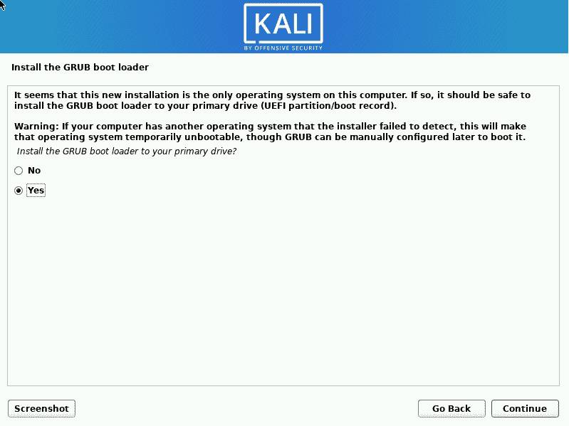

Grub Bootloader setup | Credit: Mercury

选择您的硬盘。

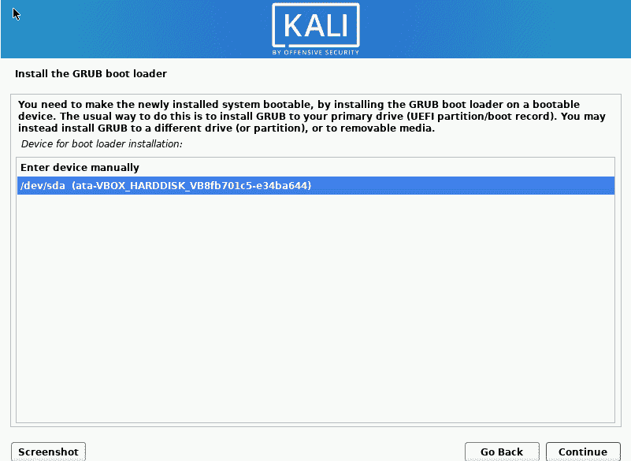

Grub Bootloader setup | Credit: Mercury

任务已完成🎉🥂.您已经成功安装了 Kali Linux 操作系统。点击继续清理并重新启动您的计算机。

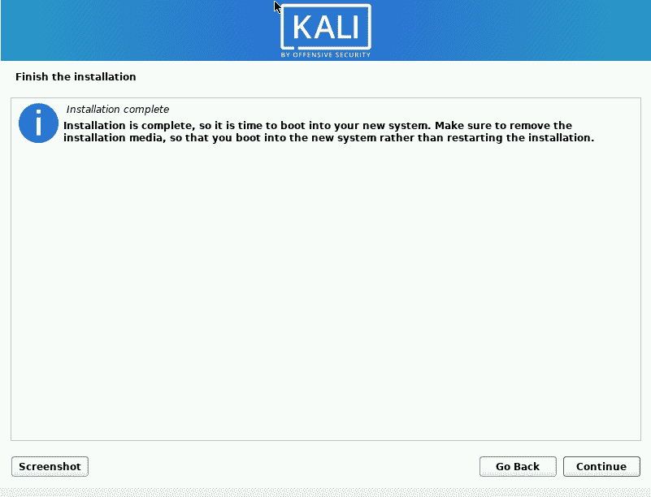

Grub Bootloader setup | Credit: Mercury

注:如果您执行了双引导，您可能需要更改引导菜单，在 Windows 之前先加载 Kali，以便您可以选择使用哪个操作系统。

一旦启动，你的屏幕应该如下图所示。

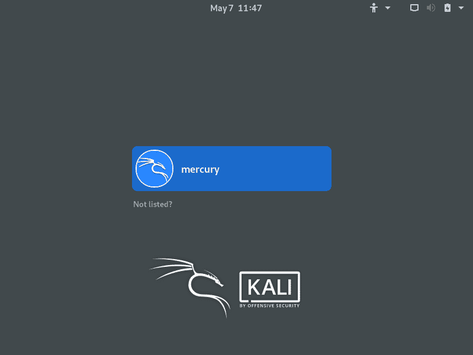

Login screen | Credit: Mercury

如果你安装了 xfce 桌面环境，你必须输入你的用户名，输入你的密码，你应该有一个好看的桌面。

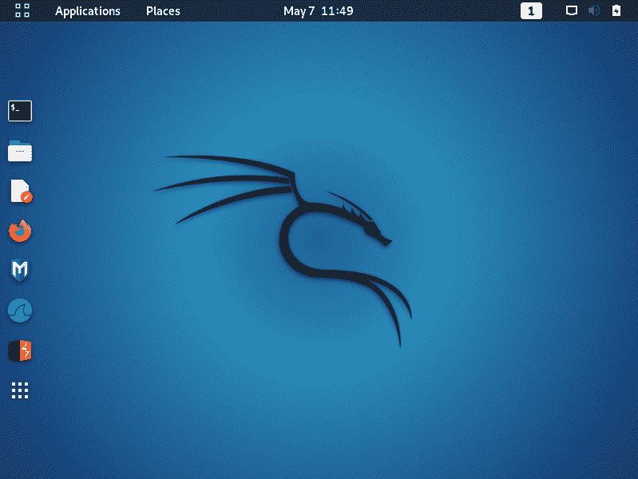

Kali Linux Desktop | Credit: Mercury

## 结论

好了，让我们快速回顾一下我们所做的事情:

1.  下载了 iso 文件
2.  创建了可引导驱动器
3.  已访问 Kali 安装程序菜单
4.  开始安装
5.  设置存储
6.  已安装 GRUB 引导程序

最后，享受你的新操作系统。黑客快乐！🙃

### 有用的资源

1.  卡利网站:[kali.org](http://kali.org)
2.  你可以在这篇 freeCodeCamp 文章中了解 MBR 和 GPT 的[区别。](https://www.freecodecamp.org/news/mbr-vs-gpt-whats-the-difference-between-an-mbr-partition-and-a-gpt-partition-solved/)
3.  这里有一篇来自 Kali Linux 的关于如何改变你的桌面环境的文章

### 承认

感谢 [Chinaza Nwukwa](https://www.linkedin.com/in/chinaza-nwukwa-22a256230/) 、 [Holumidey Mercy](https://www.linkedin.com/in/mercy-holumidey-88a542232/) 、 [Georgina Awani](https://www.linkedin.com/in/georgina-awani-254974233/) 以及我的家人，感谢他们为我撰写这篇文章提供的灵感、支持和知识。你们才是真正的 MVP。