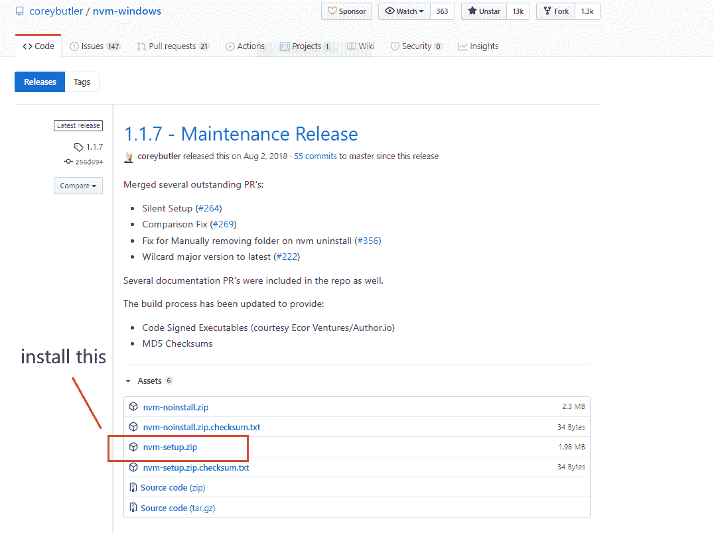

# 如何使用 NVM 在 MacOS、Linux 或 Windows 机器上安装 Node

> 原文：<https://www.freecodecamp.org/news/how-to-install-node-in-your-machines-macos-linux-windows/>

在你开始在 NodeJS 中制作超级棒的应用之前，你必须安装它。幸运的是，安装 NodeJS 超级简单。

在本教程中，我们将介绍如何在

*   macOS/linux
*   Windows 操作系统

一旦安装了 NodeJS/NPM，就可以用一个命令轻松升级/降级到任何节点版本。下面的视频教程向您展示了如何在您的机器上下载 NodeJS。

## Mac OS 和 Linux 安装指南

[https://www.youtube.com/embed/TmT_CGFnUuM?feature=oembed](https://www.youtube.com/embed/TmT_CGFnUuM?feature=oembed)

打开新的终端。键入以下内容并按 enter 键:

```
curl -o- https://raw.githubusercontent.com/nvm-sh/nvm/v0.35.3/install.sh | bash 
```

关闭您的终端，然后打开一个新的终端并键入以下内容:

```
nvm ls 
```

您将看到类似这样的内容:

```
system
iojs -> N/A (default)
node -> stable (-> N/A) (default)
unstable -> N/A (default)
nvm_list_aliases:36: no matches found: /Users/adeelimran/.nvm/alias/lts/* 
```

接下来在您的终端中键入:

```
nvm install 12.18.1 
```

一旦安装完毕，就可以使用了。要使用此版本，只需在您的终端中键入以下内容:

```
nvm use 12.18.1 
```

现在它已经安装好了，让我们通过执行以下操作来检查它:

```
node --v
```

This will output "v12.18.1" (which is the NodeJS version you just installed)

就这样，你完成了。玩得开心。

现在，如果将来出于某种原因您想要卸载 NVM(节点版本管理器),只需打开您的终端并键入以下内容:

```
rm -rf $NVM_DIR ~/.npm ~/.bower 
```

## Windows 安装指南

[https://www.youtube.com/embed/QWdSDo9V1Ho?feature=oembed](https://www.youtube.com/embed/QWdSDo9V1Ho?feature=oembed)

### 

首先，进入`nvm-windows`仓库发布部分[https://github.com/coreybutler/nvm-windows/releases](https://github.com/coreybutler/nvm-windows/releases)。选择最新版本。

接下来选择`nvm-setup.zip`文件并下载。



文件下载完成后，解压并点击安装程序，然后按照步骤操作。(我用的是 [7zip](https://www.7-zip.org/) for。zip 文件解压，因为它是免费的。)

然后检查`nvm`是否正确安装，打开一个新的命令提示终端并输入`nvm`。一旦验证安装完毕，您就可以继续下一步。

像这样使用`nvm`安装 NodeJS:

```
nvm install <version_number> // let's assume it's 12.18.1
```

版本可以是 NodeJS 版本，也可以是“latest”(最新的稳定版本)。

为了使用您刚刚安装的特定节点版本，只需在您的终端中键入以下内容:

```
nvm use 12.18.1;
```

使用 node -v 检查节点版本。这应该会在您的终端中输出 v12.18.1。

如果要安装 Node 的另一个版本，请对不同的版本重复这些步骤。

现在，您的机器上应该已经运行了 NodeJS 的工作版本。快乐的编码人。:)

如果你觉得这个指南有帮助，请告诉我。在[推特](https://twitter.com/adeelibr)(【twitter.com/adeelibr】T2)上给我留言。