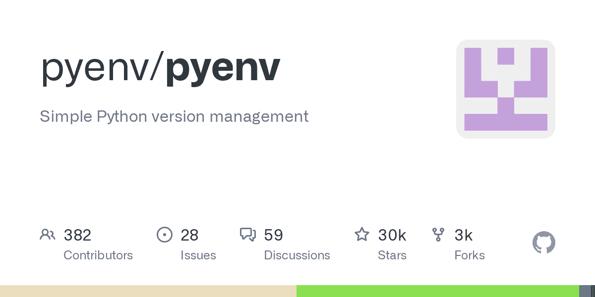
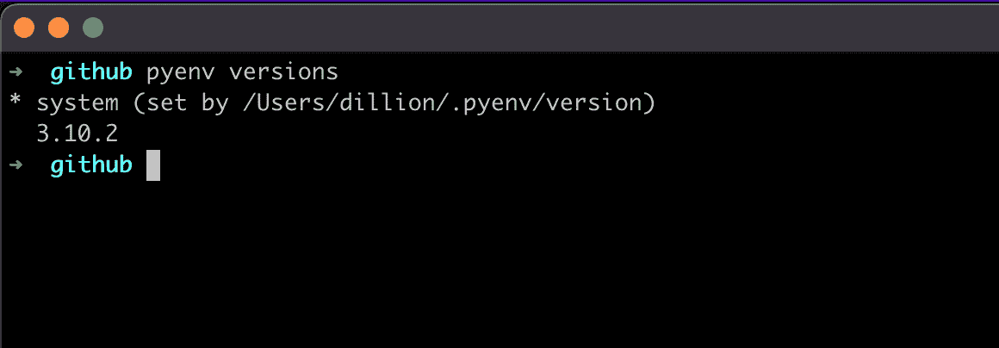

# 如何在 Mac 上安装 Python 3 并使用 Pyenv 更新版本——Mac OS home brew 命令指南

> 原文：<https://www.freecodecamp.org/news/how-to-install-python-3-on-mac-and-update-the-python-version-macos-homebrew-command-guide/>

使用 Python 时，您可能会为不同的项目安装不同的版本。但有时这会影响代码的执行，因为它可能没有使用正确的版本。

在本文中，我们将学习如何安装新的 Python 版本(在我们的例子中是 Python 3 ),以及如何将这个版本设置为代码执行的活动版本。

## 安装 Pyenv

[GitHub - pyenv/pyenv: Simple Python version managementSimple Python version management. Contribute to pyenv/pyenv development by creating an account on GitHub.pyenvGitHub](https://github.com/pyenv/pyenv)

如果你熟悉 NodeJS，你会知道`nvm`用于管理不同环境中的节点版本。`pyenv`Python 做了同样的事情——它是一个版本管理工具。

该工具可帮助您在需要不同版本 Python 的不同环境中工作。

使用[自制软件](https://brew.sh/)通过以下命令安装`pyenv`:

下面是在 Mac 上安装 Python 3 的命令:

```
brew install pyenv
```

确保您遵循文档中安装 pyenv 的[其余步骤。](https://github.com/pyenv/pyenv#homebrew-in-macos)

## 安装 Python 3

有了`pyenv`的安装，你就不需要再用 Homebrew 安装 Python 了(可能你已经在做了)。您可以使用以下语法使用`pyenv`安装 Python:

```
pyenv install [version]
```

版本参数遵循语义版本化，即“major.minor.patch”。

对于 Python 3，假设我们要安装`3.10.2`。然后我们将使用这个命令:

```
pyenv install 3.10.2
```

要查看我们拥有的 Python 版本列表，我们使用以下命令:

```
pyenv versions
```

就我而言，我有:



Currently installed python versions on my system

从上面的截图中，星号显示了当前活动的 Python 版本，这是默认的系统版本:

```
python --version
# Python 2.7.18
```

要将新安装的版本设置为默认版本，下面是如何做的([以及其他许多方法](https://github.com/pyenv/pyenv#choosing-the-python-version)):

```
pyenv global 3.10.2

python --version
# Python 3.10.2
```

如果您的 python 版本保持不变，您必须确保添加了您在文档中可以看到的所需的 init 命令:[Basic GitHub check out–2。为 Pyenv](https://github.com/pyenv/pyenv#basic-github-checkout) 配置您的 shell 环境

有了所有这些，现在就可以使用 Python 3 了。

## 更新 Python 版本

随着更多版本的发布，您可能需要更新您的版本。您可以通过安装新版本来更新您的版本，使其成为您的全局默认版本，并可以选择卸载旧版本。

以下是相关的命令:

```
pyenv install new.python.version

pyenv global new.python.version

pyenv uninstall old.python.version
```

感谢您的阅读！我希望您现在已经安装了对您最有用的 Python 版本。