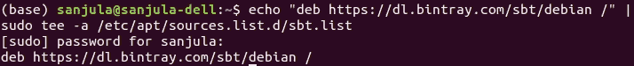
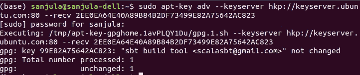
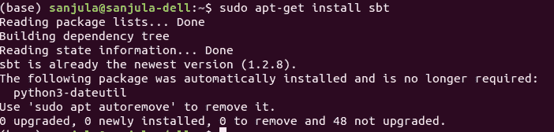

# 如何在 Linux 上安装 sbt

> 原文：<https://www.freecodecamp.org/news/how-to-install-sbt-on-linux/>

### 介绍

嗨！我是 [Sanjula](https://www.linkedin.com/in/sanjula-madurapperuma/) ，在本指南中我希望教你如何在 Linux 上安装 sbt。

我们开始吧！

### 什么是 sbt？

sbt 是用于 Scala 和 Java 项目的开源、跨平台构建工具。

它的一些主要特点是:

*   支持连续编译、测试和部署。
*   原生支持编译 Scala 代码。
*   使用 Ivy 进行依赖管理。
*   能够使用 DSL(特定领域语言)构建用 Scala 编写的描述。

### 安装 sbt 的步骤

*   首先，您必须确保安装了 JDK。sbt 推荐 Oracle JDK 8 或 OpenJDK 8。
*   打开一个终端，输入下面的命令，它将指向 sbt 的 debian 发行版，并将 sbt 添加到 sources 列表中。

```
echo "deb https://dl.bintray.com/sbt/debian /" | sudo tee -a /etc/apt/sources.list.d/sbt.list
```



Figure-2: Adding sbt URL to sources list

*   接下来，输入下面的命令，将 scala 的密钥添加到 apt 用来认证包的密钥列表中。

```
sudo apt-key adv --keyserver hkp://keyserver.ubuntu.com:80 --recv 2EE0EA64E40A89B84B2DF73499E82A75642AC823
```



Figure-3: Adding sbt to key list used by apt

*   现在从存储库中下载包列表，以确保最新版本的包及其依赖项的信息列表在本地得到更新
*   最后运行下面的命令来安装 sbt.sudo apt-get install sbt



Figure-4: I already have sbt installed :)

****恭喜恭喜！！！**** 您现在已经在您的 Linux PC 上安装了 sbt 构建工具！现在，您可以轻松地使用 Scala 和 Java 项目。

****同时，你**可以分享**这篇文章如果你喜欢，或者 c** 联系我**有任何问题。也请在****[****LinkedIn****](https://www.linkedin.com/in/sanjula-madurapperuma/)****查看我的个人资料，并在**T******witter********上关注我！****