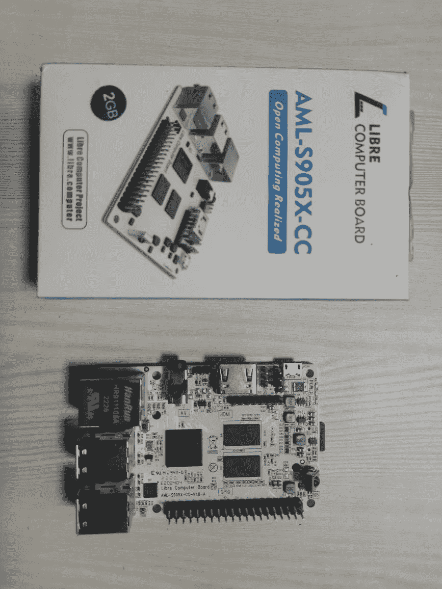
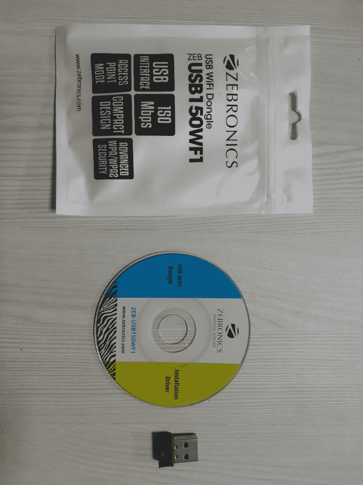
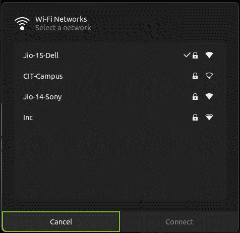
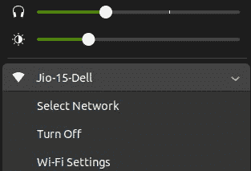

# 如何在 AML-S905X-CC(乐土豆)上安装 Wifi 适配器驱动程序

> 原文：<https://www.freecodecamp.org/news/how-to-install-wifi-adapter-driver-on-aml-s905x-cc-le-potato/>

如果你是一名开发人员，你可能对 Raspberry Pi 很熟悉。但你可能不知道 Libre 电脑 AML-S905X-CC——也叫 Le Potato。

疫情期间出现芯片短缺，导致树莓酱价格上涨。其他世界事件也使树莓 Pis 的价格暴涨，少数型号的制造甚至已经停止。你可以在这里阅读更多相关信息[。](https://www.raspberrypi.com/news/supply-chain-shortages-and-our-first-ever-price-increase/)

正因为如此，我觉得对于我想做的项目来说，切换到 Raspberry Pi 是一个不错的选择。

乐土豆在外观、配置等等方面都和树莓派很像。它还能够运行许多操作系统，如 Ubuntu、Debian、Raspbian、Android 等。

但遗憾的是，它没有预装 wifi 模块，而 Raspberry Pi 预装了 wifi 模块。

在本文中，我将为您提供清晰的分步说明，以便在运行 **Ubuntu OS** 的 Le Potato 中安装外置 wifi 适配器驱动程序。对于那些运行其他操作系统的用户，你可以尝试下面的步骤，但是我不能保证它一定有效。

让我们快速看一下我的配件。

##### 这是我的乐土豆设备:



Le Potato Device

##### 这是我的 Zebronics 外部 Wifi 适配器:



Zebronics External Wifi Adapter

## 试错法——什么没有奏效

在我找到最终的解决方案并最终安装 wifi 驱动程序并能够使用 wifi 适配器访问互联网之前，我尝试了许多方法。但是都没有成功。

以下是我一路走来尝试的:

1.  我尝试安装随 wifi 适配器一起提供的光盘上给出的驱动程序。但是，我无法理解他们要求我遵循的步骤，最后以许多错误而告终。
2.  我从 Zebronics 官方网站下载了这个设备的驱动程序。这同样没有得到好的回报。
3.  我试着从很多人从 Realtek 源分叉的 GitHub 上安装一些开源驱动。这也没有达到预期的效果。

最后，我从 Ubuntu Q &论坛上找到了答案，并且第一次尝试就成功安装了。虽然最初步骤不是很清楚，但我还是设法弄明白了。所以我在这里解释一下怎么做。

## 如何在 Ubuntu 中安装乐土豆的 Wifi 适配器驱动

按照以下步骤在您的设备上安装驱动程序:

### 安装依赖项

第一步是安装所需的软件。

您需要为您的系统架构安装`git`、`dkms`、`build-essential`和`linux-headers`。

您可以用一个命令将它们全部安装在一起:

```
sudo apt-get install -y build-essential git dkms linux-headers-$(uname -r)
```

Install the pre-requisite softwares

如果您在运行上述命令时得到提示(是/否)，只需点击`y`(这基本上是同意在您的系统中安装软件)。

### 下载驱动程序源

某些设备的驱动程序将不提供任何可安装/可执行格式。在这种情况下，您应该直接在机器上下载、编译和安装源代码。可惜这个司机也属于这一类。

我们可以从 GitHub 下载这个驱动的源码。在您的终端中运行以下命令下载源代码:

```
git clone https://github.com/kelebek333/rtl8188fu
```

Download the driver source

### 构建并安装驱动程序

在构建和安装驱动程序之前，您需要了解 Linux 中的`dkms`命令。如果你了解`dkms`，可以跳过这一段，进入下一段。

DKMS 代表动态内核模块支持。它是一个程序/框架，允许你安装内核模块的补充版本。一个包可以被编译并安装到内核树中。在安装新的 Ubuntu 内核映像包时，DKMS 会被自动调用，所以添加到 DKMS 的模块会自动被更新。

这是我们在上一步中下载的源包。我们需要添加、编译和安装源码包到我们的内核树中。

按顺序运行以下命令来添加、编译和安装驱动程序包:

#### 将源代码添加到内核

```
sudo dkms add ./rtl8188fu
```

Terminal command to add source package to kernel tree

#### 编译源代码包

```
sudo dkms build rtl8188fu/1.0
```

Terminal command to build/Compile the source package

#### 将软件包安装到内核树中

```
sudo dkms install rtl8188fu/1.0
```

Terminal command to install the package into kernel tree

#### 复制固件

编译后的二进制固件文件应该被复制到 Linux 中的默认固件位置，即`/lib/firmware`。

**固件**是实现硬件和软件之间通信的软件。它给机器指令，使硬件功能。

运行以下命令复制编译后的固件:

```
sudo cp ./rtl8188fu/firmware/rtl8188fufw.bin /lib/firmware/rtlwifi/
```

Terminal command to copy compiled binary firmware file

### 在内核上禁用节能和自动挂起模式

禁用 wifi 驱动程序的省电和自动挂起模式总是一个好主意。因此，在更新内核时，您也需要默认添加这个选项。您可以将此配置添加到`/etc/modprobe.d/`目录下的`.conf`文件中。

我们在`/etc/modprobe.d`目录中创建这个 conf 文件，因为我们需要加载这个定制模块的持久化更改。

您使用`rtw_power_mgnt`标志来控制省电模式:

*   0 -禁用节能
*   1 -使用 minPS 省电
*   2 -使用 maxPS 省电

您使用`rtw_enusbss`标志来控制自动挂起模式:

*   0 -禁用自动挂起
*   1 -启用自动挂起

运行以下命令创建一个`.conf`文件并存储选项:

```
sudo mkdir -p /etc/modprobe.d/
sudo touch /etc/modprobe.d/rtl8188fu.conf
echo "options rtl8188fu rtw_power_mgnt=0 rtw_enusbss=0" | sudo tee /etc/modprobe.d/rtl8188fu.conf
```

Terminal commands to create a conf file to disable power saving and auto suspend modes for wifi driver

### 将现有模块列入黑名单

您必须将之前尝试安装的模块列入黑名单。

**注意:**将一个模块列入黑名单将不允许它被自动加载，但是如果另一个未列入黑名单的模块依赖于它或者如果它被手动加载，则该模块可能被加载。

让我们假设您已经添加了一个名为`rtl8188au`的模块。然后，您需要通过在`/etc/modprobe.d/blacklist.conf`文件的末尾添加下面一行来将其列入黑名单。

```
blacklist rtl8188au
```

Blacklist a module

如果你还没有添加任何这样的模块，你可以忽略黑名单部分。

### 重新加载模块

你需要重新加载模块，使其开始工作。

下面是重新加载我们现在添加的模块的命令:

```
sudo modprobe -rv rtl8188fu && sudo modprobe -v rtl8188fu
```

Terminal command to reload a module

你完了！你应该可以在运行 Ubuntu 操作系统的 Le Potato 上看到启用的 wifi。如果你看不到它，重启你的系统，一切都会好的。



Trying to connect to a network after installing the driver



Connected to my wifi network

## 结论

在本文中，我们已经完成了为外部 wifi 适配器安装驱动程序的步骤。

这些是将任何外部模块添加到内核中所需要遵循的确切(基本)步骤。

订阅我的[时事通讯](https://5minslearn.gogosoon.com/)可以收到更多这样有见地的文章，它们会直接发送到你的收件箱。