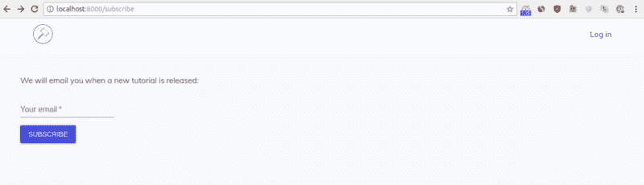
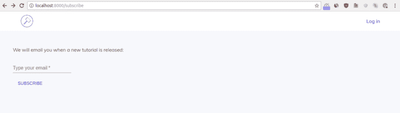
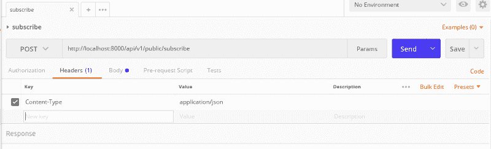
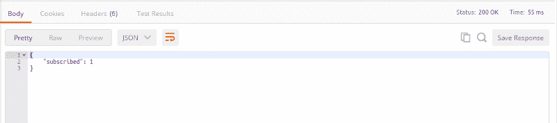
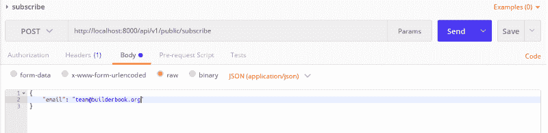
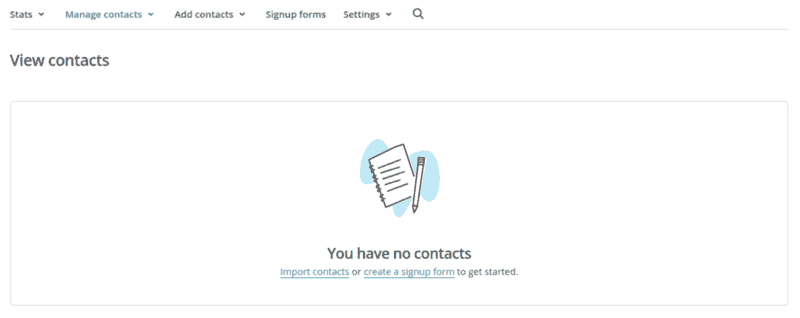
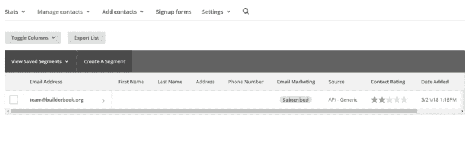
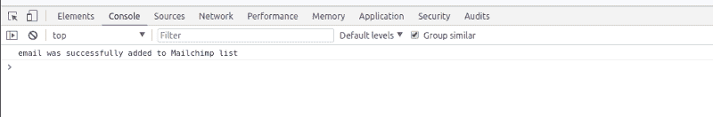

# 如何在 JavaScript web 应用程序中集成 MailChimp

> 原文：<https://www.freecodecamp.org/news/how-to-integrate-mailchimp-in-a-javascript-web-app-2a889fb43f6f/>

帖木儿(马体)

# 如何在 JavaScript web 应用程序中集成 MailChimp


Image [source](https://mailchimp.com/about/brand-assets/).

如果你是做内容营销的博主、出版商或企业主，拥有一份简讯是必须的。在本教程中，您将学习如何将 Mailchimp 集成到一个简单的 JavaScript 应用程序中。您最终将构建一个供访客用户订阅时事通讯的表单。

我为初级/中级职业 web 开发人员写了这篇教程。教程*假设了 React、JavaScript 和 HTTP* 的一些基础知识。

您将从一个样板应用程序开始本教程，逐渐向其中添加代码，最后测试 Mailchimp API 集成。

样板应用程序是用 React、Material-UI、Next、Express、Mongoose 和 MongoDB 构建的。这里有更多关于[样板文件](https://github.com/builderbook/builderbook/tree/master/boilerplate)的信息。

如上所述，我们的目标是创建一个允许访客用户订阅 MailChimp 时事通讯的功能。用户通过手动将他们的电子邮件地址添加到您网站上的表单来订阅。以下是客户端(浏览器)和服务器之间将发生的数据交换的概述:

*   用户将他们的电子邮件地址添加到表单中，然后点击`submit`
*   点击会触发一个客户端 API 方法，将电子邮件地址从用户的浏览器发送到您的应用服务器
*   客户端 API 方法向唯一的快速路由发送 POST 请求
*   快速路由将电子邮件地址传递给服务器端 API 方法，该方法向 Mailchimp 的服务器发送 POST 请求
*   该电子邮件地址已成功添加到您的 Mailchimp 列表中

具体来说，在本教程结束时，您将实现以下目标:

*   创建一个带有订阅表单的`Subscribe`页面
*   使用`fetch()`方法定义一个名为`subscribeToNewsletter()`的 API 方法
*   定义一条快速路线`'/subscribe'`
*   定义一个向 Mailchimp 的 API 服务器发送 POST 请求的`subscribe()` API 方法
*   以访客用户的身份与 Postman 测试这个数据交换

### 入门指南

对于本教程，我们将使用位于 [builderbook repo](https://github.com/builderbook/builderbook) 的 [1-start](https://github.com/builderbook/builderbook/tree/master/tutorials/1-start) 文件夹中的代码。如果你没有时间在本地运行这个应用，我把这个示例应用部署在:【https://mailchimp.builderbook.org/subscribe 

要在本地运行应用程序:

*   使用以下命令将 builderbook repo 克隆到您的本地计算机:

```
git clone git@github.com:builderbook/builderbook.git
```

*   在`1-start`文件夹中，运行`yarn`或`npm install`，安装`package.json`中列出的所有软件包。

为了将 Mailchimp API 添加到我们的应用程序中，我们将安装并了解以下软件包:

*   [同构获取](https://github.com/matthew-andrews/isomorphic-fetch)
*   [主体解析器](https://github.com/expressjs/body-parser)
*   [请求](https://github.com/request/request)

让我们从组装`Subscribe`页面开始。除了学习 Mailchimp API，您还将熟悉 React 应用程序的框架 [Next.js](https://github.com/zeit/next.js) 。

Next.js 的一个关键特性是初始页面加载的服务器端呈现。其他功能包括路由、预取、热代码重新加载、代码分割和预配置的 webpack。

### 订阅页面

我们将使用[扩展](https://developer.mozilla.org/en-US/docs/Web/JavaScript/Reference/Classes/extends)将`Subscribe`组件定义为 [ES6 类](https://developer.mozilla.org/en-US/docs/Web/JavaScript/Reference/Classes)的子组件。

而不是:

```
const Subscribe = React.createClass({})
```

我们将使用:

```
class Subscribe extends React.Component {}
```

我们不会显式指定`ReactDOM.render()`或`ReactDOM.hydrate`，因为 Next.js 在内部实现了两个。

我们的`Subscribe`页面组件的高级结构是:

```
import React from 'react';// other imports
```

```
class Subscribe extends React.Component {  onSubmit = (e) => {    // check if email is missing, return undefined    // if email exists, call subscribeToNewsletter() API method  };
```

```
render() {    return (      // form with input and button    );  }}
```

```
export default Subscribe;
```

在`1-start`的`pages`文件夹下创建一个`subscribe.js`文件。将上述代码添加到该文件中。我们将继续填充`// other imports`部分。

我们的表单只有两个元素:(1)电子邮件地址的输入元素和(2)按钮。由于我们的样板应用程序与 Material-UI 集成在一起，我们将使用 Material-UI 库中的 [TextField](https://material-ui-next.com/demos/text-fields/) 和 [Button](https://material-ui-next.com/demos/buttons/) 组件。将这两个导入添加到您的`subscribe.js`文件中:

```
import TextField from 'material-ui/TextField';import Button from 'material-ui/Button';
```

将`TextField`和`Button`组件放入一个`<fo` rm >元素中；

```
<form onSubmit={this.onSubmit}>  <p>We will email you when a new tutorial is released:</p>  <TextField    type="email"    label="Your email"    style={styleTextField}    required  />  <p />  <Button variant="raised" color="primary" type="submit"&gt;    Subscribe  </Button></form>
```

你可以看到我们给`TextField`和`Button`组件都传递了一些道具。关于你可以通过的道具的完整列表，请查看[文本域道具](https://material-ui-next.com/api/text-field/)和[按钮道具](https://material-ui-next.com/api/button)的官方文档。

我们需要获得在`TextField`中指定的电子邮件地址。为了访问`TextField`的值，我们将 React 的 [ref 属性](https://reactjs.org/docs/refs-and-the-dom.html#adding-a-ref-to-a-dom-element)添加到它:

```
inputRef={(elm) => {  this.emailInput = elm;}}
```

我们通过以下方式获取该值:

```
this.emailInput.value
```

两个音符:

*   我们没有使用`ref="emailInput"`，因为 React 文档建议使用上下文对象`this`。在 JavaScript 中，`this`用于访问上下文中的对象。如果您正确地配置了 Eslint，您将会看到这个[规则](https://github.com/yannickcr/eslint-plugin-react/blob/master/docs/rules/no-string-refs.md)的 Eslint 警告。
*   我们没有使用`ref`，而是使用了`inputRef`，因为`TextField`组件不是一个`input` HTML 元素。`TextField`是 Material-UI 的组件，使用`inputRef`道具代替`ref`。

在我们定义我们的`onSubmit`函数之前，让我们运行我们的应用程序，看看我们的表单。此时，您的代码应该类似于:`pages/subscribe.js`

```
import React from 'react';import Head from 'next/head';import TextField from 'material-ui/TextField';import Button from 'material-ui/Button';
```

```
import { styleTextField } from '../components/SharedStyles';import withLayout from '../lib/withLayout';
```

```
class Subscribe extends React.Component {  onSubmit = (e) => {    // some code  };
```

```
render() {    return (      <div style={{ padding: '10px 45px' }}>        <Head>          <title>Subscribe</title>          <meta name="description" content="description for indexing bots" />        </Head>        <br />        <form onSubmit={this.onSubmit}>          <p>We will email you when a new tutorial is released:</p>          <TextField            inputRef={(elm) => {              this.emailInput = elm;            }}            type="email"            label="Your email"            style={styleTextField}            required          />          <p />          <Button variant="raised" color="primary" type="submit">            Subscribe          </Button>        </form>      </div>    );  }}
```

```
export default withLayout(Subscribe);
```

一些注意事项:

*   在 Next.js 中，可以使用`Head`指定页面标题和描述。看上面我们是怎么用的。
*   我们添加了一个`styleTextField`样式。我们在`components/SharedStyles.js`中保留了这种风格，因此它是可重用的，可以导入到任何组件或页面中。
*   我们用`withLayout`包装了`Subscribe`组件。高阶组件`withLayout`确保页面获得一个`Header`组件，并在初始加载时在服务器端呈现。

我们在`/subscribe`路径上访问`Subscribe`页面，因为 Next.js 根据页面在`pages`文件夹中的文件名为页面创建路径。

用`yarn dev`启动你的应用程序，然后转到`[http://localhost:8000/subscribe](http://localhost:8000/subscribe:)`



表单看起来和预期的一样。尝试更改传递给`TextField`和`Button`组件的不同属性的值。例如，将`label`道具的文本改为`Type your email`，将`variant`道具的按钮改为`flat`:



在我们继续之前，点击`Header`中的`Log in`链接。请注意页面顶部的加载进度条。我们用[进程](https://github.com/rstacruz/nprogress)实现了这个栏，我们将在等待代码向 Mailchimp 列表发送电子邮件地址时显示它。

我们的下一步是定义`onSubmit`函数。该函数的目的是从`TextField`获取电子邮件地址，将该电子邮件地址传递给 API 方法`subscribeToNewsletter`，然后调用该方法。

在我们调用`subscribeToNewsletter(email)`之前，让我们防止我们的`<fo` rm >元素和 d `efine`电子邮件的默认行为:

*   防止[向服务器](https://developer.mozilla.org/en-US/docs/Learn/HTML/Forms/Sending_and_retrieving_form_data)发送表单数据的默认行为:

```
e.preventDefault();
```

*   让我们定义一个局部变量`email`。如果`this.emailInput`和`this.emailInput.value`都存在，则其值为`this.emailInput.value`，否则为空:

```
const email = (this.emailInput && this.emailInput.value) || null;
```

*   如果`email`为空，函数应该返回 undefined:

```
if (this.emailInput && !email) {  return;}
```

到目前为止，我们已经:

```
onSubmit = (e) => {  e.preventDefault();
```

```
const email = (this.emailInput && this.emailInput.value) || null;
```

```
if (this.emailInput && !email) {    return;  }
```

```
// call subscribeToNewsletter(email)};
```

为了调用我们的 API 方法`subscribeToNewsletter(email)`，让我们一起使用`async/await`构造和`try/catch`。我们在我们的书的[中详细介绍了异步回调、`Promise.then`和`async/await`。](https://builderbook.org/books/builder-book/authentication-hoc-promise-async-await-static-method-for-user-model-google-oauth#async-await)

要使用`async/await`，在匿名箭头函数前添加`async`,如下所示:

```
onSubmit = async (e) =>
```

提供`subscribeToNewsletter(email)`应该会返回一个承诺(确实如此——我们在本教程的后面使用 JavaScript 的返回承诺的`fetch()`方法来定义这个方法)。你可以在`subscribeToNewsletter(email)`前加上`await`:

```
await subscribeToNewsletter({ email })
```

您将获得:

```
onSubmit = async (e) => {  e.preventDefault();
```

```
const email = (this.emailInput && this.emailInput.value) || null;
```

```
if (this.emailInput && !email) {    return;  }
```

```
try {    await subscribeToNewsletter({ email });
```

```
if (this.emailInput) {      this.emailInput.value = '';    }  } catch (err) {    console.log(err); //eslint-disable-line  }};
```

JavaScript 将在带有`await subscribeToNewsletter({ email });`的那一行暂停，只有在`subscribeToNewsletter({ email })`返回一个带有成功或错误消息的响应后才继续。

在成功的情况下，让我们用以下内容来清理我们的表单:

```
if (this.emailInput) {    this.emailInput.value = '';  }
```

在我们定义我们的`subscribeToNewsletter` API 方法之前，让我们做一个 UX 改进。使用`NProgress.start();`开始装棒，使用`NProgress.done();`完成装棒；

```
onSubmit = async (e) => {  e.preventDefault();
```

```
const email = (this.emailInput && this.emailInput.value) || null;
```

```
if (this.emailInput && !email) {    return;  }
```

```
NProgress.start();
```

```
try {    await subscribeToNewsletter({ email });
```

```
if (this.emailInput) {      this.emailInput.value = '';    }
```

```
NProgress.done();  } catch (err) {    console.log(err); //eslint-disable-line    NProgress.done();  }};
```

通过这一更改，提交表单的用户将会看到进度条。

您的`Subscribe`页面的代码应该类似于:`pages/subscribe.js`

```
import React from 'react';import Head from 'next/head';import TextField from 'material-ui/TextField';import Button from 'material-ui/Button';import NProgress from 'nprogress';
```

```
import { styleTextField } from '../components/SharedStyles';import withLayout from '../lib/withLayout';import { subscribeToNewsletter } from '../lib/api/public';
```

```
class Subscribe extends React.Component {  onSubmit = async (e) => {    e.preventDefault();
```

```
const email = (this.emailInput && this.emailInput.value) || null;
```

```
if (this.emailInput && !email) {      return;    }
```

```
NProgress.start();
```

```
try {      await subscribeToNewsletter({ email });
```

```
if (this.emailInput) {        this.emailInput.value = '';      }
```

```
NProgress.done();      console.log('non-error response is received');    } catch (err) {      console.log(err); //eslint-disable-line      NProgress.done();    }  };
```

```
render() {    return (      <div style={{ padding: '10px 45px' }}>        <Head>          <title>Subscribe</title>          <meta name="description" content="description for indexing bots" />        </Head>        <br />        <form onSubmit={this.onSubmit}>          <p>We will email you when a new tutorial is released:</p>          <TextField            inputRef={(elm) => {              this.emailInput = elm;            }}            type="email"            label="Your email"            style={styleTextField}            required          />          <p />          <Button variant="raised" color="primary" type="submit">            Subscribe          </Button>        </form>      </div>    );  }}
```

```
export default withLayout(Subscribe);
```

用`yarn dev`启动你的应用程序，确保你的页面和表单看起来和预期的一样。提交表单还不行，因为我们还没有定义 API 方法`subscribeToNewsletter()`。

### subscribeToNewsletter API 方法

您可能已经从`pages/subscribe.js`的导入部分注意到了，我们将在`lib/api/public.js`定义`subscribeToNewsletter()`。我们将`subscribeToNewsletter()`放在`lib`文件夹中，使其*可以被普遍*访问，这意味着这个 API 方法将在客户端(浏览器)和服务器上都可用。我们这样做是因为在 Next.js 中，页面代码在初始加载时在服务器端呈现，在后续加载时在客户端呈现。

在我们的例子中，当用户*点击浏览器上的按钮*来调用`subscribeToNewsletter()`时，这个方法将只在客户端运行。但是假设您有一个获取博客文章列表的`getPostList` API 方法。要在服务器上呈现一个包含帖子列表的页面，你必须让`getPostList`普遍可用。

回到我们的 API 方法`subscribeToNewsletter()`。正如我们在本教程的介绍中所讨论的，我们的目标是在客户机和服务器之间建立数据交换。换句话说，我们的目标是为我们的应用程序构建一个内部 API。这就是为什么我们称`subscribeToNewsletter()`为 API 方法。

`subscribeToNewsletter()`的目的是*发送一个请求*到一个叫做 API 端点的特定路由上的服务器，然后接收一个响应。我们在这里详细讨论 HTTP 和请求/响应[。](https://builderbook.org/books/builder-book/server-database-session-header-and-menudrop-components#http)

为了理解本教程，您应该知道一个将数据传递给服务器并且不需要任何数据返回的请求是用`POST`方法发送的。通常，请求的`body`包含数据(在我们的例子中，是电子邮件地址)。

除了发送请求，我们的`subscribeToNewsletter()`方法应该等待响应。响应不必包含任何数据——它可以是一个带有一个参数`{ subscribed: 1 }`或`{ done: 1 }`或`{ success: 1 }`的简单对象。

为了同时发送请求和接收响应，我们使用了`fetch()`方法。在 JavaScript 中， [fetch()](https://developers.google.com/web/updates/2015/03/introduction-to-fetch) 是一个全局方法，用于通过发送请求和接收响应在网络上获取数据。

我们使用`isomorphic-fetch`包使`fetch()`在我们的节点环境中可用。用以下内容安装此软件包:

```
yarn add isomorphic-fetch
```

下面是来自[包的自述文件](https://github.com/matthew-andrews/isomorphic-fetch#usage)的用法示例:

```
fetch('//offline-news-api.herokuapp.com/stories')	.then(function(response) {		if (response.status >= 400) {			throw new Error("Bad response from server");		}		return response.json();	})	.then(function(stories) {		console.log(stories);	});
```

让我们用这个例子来编写一个可重用的`sendRequest`方法，它采用`path`和其他一些`options`，传递一个请求对象(具有`method`、`credentials`和`options`属性的对象)，并调用`fetch()`方法。`fetch()`将`path`和请求对象作为参数:

```
async function sendRequest(path, options = {}) {  const headers = {    'Content-type': 'application/json; charset=UTF-8',  };
```

```
const response = await fetch(    `${ROOT_URL}${path}`,    Object.assign({ method: 'POST', credentials: 'include' }, { headers }, options),  );
```

```
const data = await response.json();
```

```
if (data.error) {    throw new Error(data.error);  }
```

```
return data;}
```

与来自`isomorphic-fetch`的例子不同，我们使用了我们最喜欢的`async/await`结构，而不是`Promise.then`(为了更好的代码可读性)。

[Object.assign()](https://developer.mozilla.org/en-US/docs/Web/JavaScript/Reference/Global_Objects/Object/assign) 是*从三个更小的对象:`{ method: 'POST', credentials: 'include' }`、`{ headers }`和`options`中创建一个新对象*的方法。默认情况下，对象`options`是空的，但是它可以是，例如，请求的`body`属性。由于我们需要传递一个电子邮件地址，我们的例子确实使用了`body`属性。

您可能已经从代码中注意到了，我们需要定义`ROOT_URL`。我们可以为`ROOT_URL`编写考虑到`NODE_ENV`和`PORT`的条件逻辑，但是为了简单起见，我们将其定义为:

```
const ROOT_URL = 'http://localhost:8000';
```

是时候在`sendRequest`方法的帮助下定义我们的`subscribeToNewsletter`方法了:

```
export const subscribeToNewsletter = ({ email }) =>  sendRequest('/api/v1/public/subscribe', {    body: JSON.stringify({ email }),  });
```

正如您所看到的，我们将`{ body: JSON.stringify({ email }), }`作为一个`options`对象来传递，以便将一个电子邮件地址添加到请求对象的主体中。

我们还选择了`/api/v1/public/subscribe`作为我们的`path`，这是我们内部 API 的 API 端点，它将用户电子邮件地址添加到我们的 Mailchimp 列表中。

综合起来，`lib/api/public.js`的内容应该是:`lib/api/public.js`

```
import 'isomorphic-fetch';
```

```
const ROOT_URL = 'http://localhost:8000';
```

```
async function sendRequest(path, options = {}) {  const headers = {    'Content-type': 'application/json; charset=UTF-8',  };
```

```
const response = await fetch(    `${ROOT_URL}${path}`,    Object.assign({ method: 'POST', credentials: 'include' }, { headers }, options),  );
```

```
const data = await response.json();
```

```
if (data.error) {    throw new Error(data.error);  }
```

```
return data;}
```

```
export const subscribeToNewsletter = ({ email }) =>  sendRequest('/api/v1/public/subscribe', {    body: JSON.stringify({ email }),  });
```

干得好达到这一点！我们定义了我们的`subscribeToNewsletter` API 方法，该方法向 API 端点`/api/v1/public/subscribe`发送请求并接收响应。

用`yarn dev`启动你的应用，添加一个电子邮件地址，然后提交表格。在您的浏览器控制台(`Developer tools > Cons` ole)中，您将看到一个预期的`ed POST` 404 错误:


该错误意味着请求已成功发送到服务器，但服务器没有找到所请求的内容。这是预料中的行为，因为我们*没有*编写任何当请求被发送到相应的 API 端点时向客户端发送响应的服务器代码。换句话说，我们没有创建快速路由`/api/v1/public/subscribe`来处理我们使用`subscribeToNewsletter` API 方法发送的 POST 请求。

### 快速路由/订阅

快速路由指定了当 API 方法从客户端向路由的 API 端点发送请求时执行的函数。在我们的例子中，当我们的 API 方法向 API 端点`/api/v1/public/subscribe`发送一个请求时，我们希望服务器通过执行一些功能的快速路由来处理这个请求。

您可以使用类`express.Router()`和语法`router.METHOD()`根据用户类型将快速路线模块化成小组:

```
const router = express.Router();router.METHOD('API endpoint', ...);
```

如果你想了解更多，请查看 [express 上的官方快递文件。路由器()](https://expressjs.com/en/guide/routing.html#express-router)和[路由器。方法()](http://expressjs.com/en/api.html#router.METHOD)。

但是，在本教程中，我们将使用以下代码，而不是模块化代码:

```
server.METHOD('API endpoint', ...);
```

并将上面的代码直接放入我们在`server/app.js`的主服务器代码中。

您已经有足够的信息来创建一条基本的快速路线:

*   该方法是 POST
*   API 端点为`/api/v1/public/subscribe`
*   通过写`onSubmit`和`subscribeToNewsletter`，你知道了一个匿名箭头函数
*   通过写`onSubmit`，你知道了`try/catch`结构

将所有这些知识放在一起，您会得到:

```
server.post('/api/v1/public/subscribe', (req, res) => {  try {    res.json({ subscribed: 1 });    console.log('non-error response is sent');  } catch (err) {    res.json({ error: err.message || err.toString() });  }});
```

几个注意事项:

*   我们编写了`error: err.message || err.toString()`来处理两种情况:当错误是字符串类型时，以及当错误是对象时。
*   为了测试我们的快速路线，我们添加了这样一行:

```
console.log(‘non-error response is sent’);
```

将上述快速路线添加到该行后的`server/app.js`:

```
const server = express();
```

考验的时候到了！

我们推荐使用 [Postman 应用程序](https://chrome.google.com/webstore/detail/postman/fhbjgbiflinjbdggehcddcbncdddomop?hl=en)来测试请求-响应循环。

请看 Postman 中请求属性的快照:



您需要指定至少三个属性(类似于我们编写`subscribeToNewsletter` API 方法时的情况):

*   选择发布方法
*   指定 API 端点的完整路径:`[http://localhost:8000/api/v1/public/subscribe](http://localhost:8000/api/v1/public/subscribe)`
*   添加一个值为`application/json`的`Content-Type`标题

确保您的应用正在运行。从`yarn dev`开始。现在点击邮递员上的`Send`按钮。

如果成功，您将看到以下两个输出:

1.  在 Postman 上，您会看到响应代码为 200，正文如下:



2.您的终端打印:


干得好，你刚刚写了一条有效的快递路线！

在这一点上，您展示了两个事件在您的应用程序中成功地发生了:一个请求被发送，一个响应被接收。然而，我们*没有*将一个电子邮件地址传递给我们快速路线中的一个函数。为此，我们需要访问`req.body.email`，因为这是我们在定义`subscribeToNewsletter` API 方法时保存电子邮件地址的地方:

```
const email = req.body.email;
```

随着 ES6 对象的析构，它变得更短:

```
const { email } = req.body;
```

如果`email`局部变量不存在，那么让我们发送一个带有错误的响应并返回 undefined(用空白`return`退出):

```
if (!email) {  res.json({ error: 'Email is required' });  return;}
```

同样，修改`console.log`语句以打印出`email`。

经过这些修改后，您将获得:

```
server.post('/api/v1/public/subscribe', async (req, res) => {  const { email } = req.body;
```

```
if (!email) {    res.json({ error: 'Email is required' });    return;  }
```

```
try {    res.json({ subscribed: 1 });    console.log(email);  } catch (err) {    res.json({ error: err.message || err.toString() });  }});
```

让我们来测试一下。打开 Postman，向我们的请求添加一个属性:`body`，值为`team@builderbook.org`。确保您选择了`raw > J`子数据格式:



确保您的应用程序正在运行，然后单击`Send`按钮。

看看 Postman 上的响应和终端的输出:

1.  邮递员将显示`Loading...`但永远不会完成
2.  终端输出错误:`TypeError: Cannot read property 'email' of undefined`

显然，`email`变量是未定义的。要从`req.body`中读取`email`属性，您需要一个实用程序将请求的`body`对象从 Unicode 解码为 JSON 格式。这个工具叫做`bodyParser`，[在这里了解更多](https://github.com/expressjs/body-parser#bodyparserjsonoptions)。

安装`bodyParser`:

```
yarn add body-parser
```

使用以下内容将其导入到`server/app.js`:

```
import bodyParser from 'body-parser';
```

在服务器上挂载 JSON `bodyParser`。在您的快速路线`const server = express();`和*之后*之前添加以下线路:

```
server.use(bodyParser.json());
```

使用外部`bodyParser`包的一个替代方法是使用内部 Express 中间件 [express.json()](https://expressjs.com/en/4x/api.html#express.json) 。为此，删除`bodyParser`的导入代码，并将上面的代码行替换为:

```
server.use(express.json());
```

我们准备好测试了。确保您的应用程序正在运行，然后单击 Postman 上的`Send`按钮。

看看 Postman 和你的终端上的回复:

1.  邮递员成功输出:`"subscribed": 1`
2.  终端这次没有错误，而是打印:`team@builderbook.org`

很好，现在请求的`body`被解码，并在 Express route 的函数`req.body`中可用。

您已成功将第一个内部 API 添加到此应用程序中！客户端和服务器之间的数据交换工作正常。

在我们之前编写的 Express route 中，我们希望调用并等待一个`subscribe`方法，该方法将 POST 请求从我们的服务器发送到 Mailchimp 的服务器。在本教程的下一部分，也是最后一部分，我们将讨论并编写`subscribe`方法。

### 方法 subscribe()

我们编写了在服务器和用户浏览器之间进行适当数据交换的代码。然而，要将用户的电子邮件地址添加到 Mailchimp 列表中，我们需要发送一个*服务器到服务器*的 POST 请求。从*我们的服务器*向 *Mailchimp 的服务器*发送请求。

为了发送服务器到服务器的请求，我们将使用`request`包。安装它:

```
yarn add request
```

与任何请求一样，我们需要确定要包含哪个 API 端点和哪些请求属性(`headers`、`body`等等):

*   创建一个`server/mailchimp.js`文件。
*   导入`request`。
*   用这些属性定义`request.post()` (POST 请求):`uri`、`headers`、`json`、`body`和回调。

`server/mailchimp.js`:

```
import request from 'request';
```

```
export async function subscribe({ email }) {  const data = {    email_address: email,    status: 'subscribed',  };
```

```
await new Promise((resolve, reject) => {    request.post(      {        uri: // to be discussed        headers: {          Accept: 'application/json',          Authorization: // to be discussed,        },        json: true,        body: data,      },      (err, response, body) => {        if (err) {          reject(err);        } else {          resolve(body);        }      },    );  });}
```

所有属性都是不言自明的，但是我们应该讨论`uri`(或 API 端点)和`Authorization`头:

1.`uri`。在本章的前面，我们选择了`http://localhost:8000/api/v1/public/subscribe`作为我们的 API 端点。我们可以为内部 API 选择任何路径。然而，Mailchimp 的 API 是外部的。因此，我们应该检查官方文档，找到将电子邮件地址添加到列表中的 API 端点。阅读更多关于向列表添加成员的[API](http://developer.mailchimp.com/documentation/mailchimp/reference/lists/members/)。API 端点是:

```
https://usX.api.mailchimp.com/3.0/lists/{LIST_ID}/members
```

区域`usX`是一个子域。按照以下步骤查找 API 端点的子域:

*   注册或登录 Mailchimp
*   转到`Account > Extras > API keys > Your` API 键
*   您的 API 密钥可能看起来像`xxxxxxxxxxxxxxxxxxxxxxxxxxxxxx-us17`

这意味着该地区是`us17`，您的应用程序将向 Mailchimp 子域发送请求:

```
https://us17.api.mailchimp.com/3.0/lists/{LIST_ID}/members
```

变量`LIST_ID`是你的 Mailchimp 账户中特定列表的列表 ID。要找到`List ID`，请遵循以下步骤:

*   在您的 Mailchimp 仪表盘上，转到`Lists > click the list name > Settings > List name and`默认值
*   找到章节`List ID`
*   从这个部分得到`xxxxxxxxxx`值，它就是你的`LIST_ID`

2.`Authorization`表头。我们需要将我们的`API_KEY` inside `Authorization`头发送到 Mailchimp 的服务器。这告诉 Mailchimp 的服务器，我们的应用程序被授权发送请求。点击 ( `headers.Authorization`)了解更多[授权头。`Authorization`标题的语法:](https://developer.mozilla.org/en-US/docs/Web/HTTP/Headers/Authorization)

```
Authorization:
```

*   在我们的案例中:

```
Authorization: Basic apikey:API_KEY
```

`API_KEY`必须是 base64 编码的。以这个[为例](https://stackoverflow.com/questions/14573001/nodejs-how-to-decode-base64-encoded-string-back-to-binary)。

编码后:

```
Authorization: `Basic ${Buffer.from(`apikey:${API_KEY}`).toString(‘base64’)}`
```

要找到`API_KEY`:

*   在您的 Mailchimp 仪表板上，转到`Account > Extras > API keys > Your` API 密钥
*   您的 API 密钥可能看起来像`xxxxxxxxxxxxxxxxxxxxxxxxxxxxxx-us17`

我们将在哪里存储`listId`和`API_KEY`值？你可以将所有的环境变量存储在一个`.env`文件中，并用 [dotenv](https://github.com/motdotla/dotenv) 包来管理它们。然而，为了专注于本教程，我们将值直接添加到我们的`server/mailchimp.js`文件中:

```
const listId = 'xxxxxxxxxx';const API_KEY = 'xxxxxxxxxxxxxxxxxxxxxxxxxxxxxx-us17';
```

插入上面的代码片段:

```
import request from 'request';
```

```
export async function subscribe({ email }) {  const data = {    email_address: email,    status: 'subscribed',  };
```

```
const listId = 'xxxxxxxxxx';  const API_KEY = 'xxxxxxxxxxxxxxxxxxxxxxxxxxxxxx-us17';
```

```
await new Promise((resolve, reject) => {    request.post(      {        uri: `https://us17.api.mailchimp.com/3.0/lists/${listId}/members/`,        headers: {          Accept: 'application/json',          Authorization: `Basic ${Buffer.from(`apikey:${API_KEY}`).toString('base64')}`,        },        json: true,        body: data,      },      (err, response, body) => {        if (err) {          reject(err);        } else {          resolve(body);        }      },    );  });}
```

记得给`listId`和`API_KEY`加上实数值。

### 测试

是时候测试整个 MailChimp 订阅流程了。

我们从`server/mailchimp.js`导出了我们的`subscribe`方法，但是我们还没有将该方法导入/添加到`server/app.js`的快速路线中。为此:

*   导入到`server/app.js`时使用:

```
import { subscribe } from ‘./mailchimp’;
```

*   向快速路线添加一个`async/await`构造，因此我们调用*并等待`subscribe`方法的*。像这样修改下面的代码片段:

```
server.post('/api/v1/public/subscribe', async (req, res) => {  const { email } = req.body;  if (!email) {    res.json({ error: 'Email is required' });    return;  }
```

```
 try {    await subscribe({ email });    res.json({ subscribed: 1 });    console.log(email);  } catch (err) {    res.json({ error: err.message || err.toString() });  }});
```

我们能够用`await`代替`subscribe`,因为这个方法返回一个承诺。回想一下`subscribe`的定义——它和`new Promise()`有一条线。

让我们给来自`pages/subscribe.js`的`onSubmit`函数添加一个`console.log`语句。打开你的`pages/subscribe.js`文件，像这样添加`console.log`:

```
try {  await subscribeToNewsletter({ email });
```

```
if (this.emailInput) {    this.emailInput.value = '';  }    NProgress.done();  console.log('email was successfully added to Mailchimp list');} catch (err) {  console.log(err); //eslint-disable-line  NProgress.done();}
```

此时，我们可以跳过用 Postman 测试。相反，让我们启动我们的应用程序，填写表单，提交表单，并检查电子邮件是否被添加到 Mailchimp 列表中。此外，我们将看到浏览器控制台的输出。

用`yarn dev`启动你的应用。转到`http://localhost:8000/subscribe`。看看 Mailchimp 仪表盘上的空列表:



填写表格，点击`Subscribe`。使用 Mailchimp 列表刷新页面:



浏览器控制台打印:



如果你没有在本地运行这个应用，你可以在我为这个教程部署的应用上测试:[https://mailchimp.builderbook.org/subscribe](https://mailchimp.builderbook.org/subscribe)。您将收到一封测试电子邮件，确认 MailChimp API 工作正常。

嘣！您刚刚学习了两项强大的技能:为您的 JavaScript web 应用程序构建内部和外部 API。

当你完成本教程时，你的代码应该与 [1-end](https://github.com/builderbook/builderbook/tree/master/tutorials/1-end) 文件夹中的代码相匹配。这个文件夹位于我们 [builderbook repo](https://github.com/builderbook/builderbook) 的`tutorials`目录下。

如果你觉得这篇文章有用，可以考虑给我们的 [Github repo](https://github.com/builderbook/builderbook) 打个星，看看我们的[书](https://builderbook.org/book)，在那里我们详细讨论了这个和许多其他主题。

如果你正在开发一个软件产品，看看我们的 [SaaS 样板](https://github.com/async-labs/saas)和 [Async](https://async-await.com/) (团队沟通哲学和软件工程师小团队的工具)。