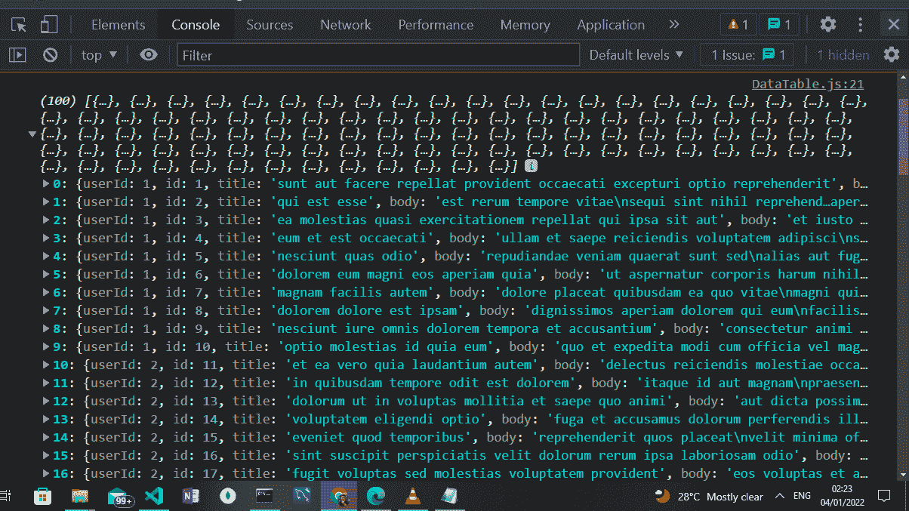
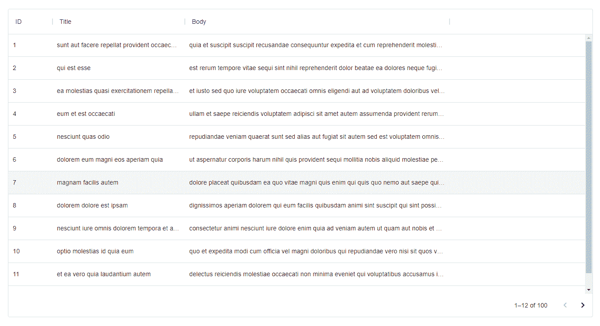

# 如何使用 REST API 中的数据将材质 UI 数据网格集成到 React 中

> 原文：<https://www.freecodecamp.org/news/how-to-integrate-material-ui-data-grid-in-react-using-data-from-a-rest-api/>

Material UI 的数据网格是一个强大而灵活的数据表。它使您可以轻松显示数据并执行现成的功能，如编辑、排序、过滤、分页等。

在本文中，我们将讨论为什么您应该在您的项目中使用**材质 UI** 中的**数据网格**。然后我们还将介绍如何安装和设置数据网格，使用和集成 RESTful API，启用分页以及排序和过滤。

## 目录

*   [数据网格简介](#introduction-to-data-grid)
*   [为什么使用材质 UI 数据网格](#why-use-the-material-ui-data-grid)
*   [React 和 Material UI 数据网格的安装和设置](#how-to-install-and-setup-react-and-material-ui-data-grid)
*   [API 集成和消费](#api-integration-and-consumption)
*   [在物料 UI 数据网格中显示 API 结果](#how-to-display-the-api-results-in-the-material-ui-data-grid)
*   [结论](#conclusion)

观看下面这篇文章的视频版本，或者在我的 [YouTube 频道](https://www.youtube.com/watch?v=S_mgSHCWCmA&t=15s)上观看:

[https://www.youtube.com/embed/S_mgSHCWCmA?start=15&feature=oembed](https://www.youtube.com/embed/S_mgSHCWCmA?start=15&feature=oembed)

## 数据网格简介

根据物料 UI 文档，**数据网格**是一个

> *快速可扩展的 React 数据表和 React 数据网格。这是一个功能丰富的组件，可在麻省理工学院或商业版本*。

基本上，默认情况下，Material UI 中的数据网格具有一些功能，如编辑、排序、过滤、更新、分页、导出等。

该团队还计划实现其他功能，如 Excel 导出、范围选择、分组、透视和聚合。

出于本教程的目的，我们将使用名为 **JSONPlaceholder** 的公共 REST API 来实现数据网格的一些特性

## 为什么使用材质 UI 数据网格

您可能希望使用材料用户界面数据网格有一些重要原因:

*   易接近
*   用户交互
*   数据显示

#### 易接近

数据网格提供了辅助功能，如单元格突出显示。也就是说，使用键盘可以访问每个单元格。

它还提供了其他功能，如键盘导航，通过使用键盘上的某些键来改变表格单元格的焦点，以及密度属性来确定表格的行和列高度。

#### 用户交互

在交互方面，数据网格提供了一个内置的特性，比如默认的行选择。这允许用户通过鼠标点击或使用某些键盘快捷键来选择某些行。

材料 UI 中的数据网格支持单行和多行选择，能够禁用选择某些行或所有行，复选框选择等等。

#### 数据显示

数据网格提供了一个内置功能，允许将数据导出为 CSV 格式。

此外，可以通过单击列标题来操作数据。这将触发排序和过滤功能。

另一个默认的基本特性是滚动，这在普通的表格中是没有的。

## 如何安装和设置 React 和 Material UI 数据网格

要在 React 中创建新项目，需要安装 [Node.js](https://nodejs.org/en/download/) 。这将使我们能够在终端中访问 npm。然后，我们可以通过运行以下命令，使用 npm 安装并使用 Create React App 来创建我们的项目:

```
npm i create-react-app 
```

下一步是通过运行下面的命令从终端创建一个新的 React 项目:

```
npx create-react-app data-grid 
cd data-grid 
npm start 
```

上面我们创建了一个名为`data-grid`的新项目。然后，我们导航到新创建的项目目录，并使用 *npm 启动项目。*

默认情况下，我们的项目将在浏览器中的 localhost:3000 上运行。

最后，我们需要使用下面的命令安装两个包，分别是**材质 UI** 和**数据网格**:

```
npm install @mui/x-data-grid @mui/material 
```

## API 集成和消费

为了集成我们的 API，我们需要在 src 目录中创建一个新的文件和文件夹，这是在我们使用 Create-React-App 生成项目时为我们创建的。我们将这个新文件夹命名为**表**，文件命名为 **DataGrid.js** 。

最后，我们的文件夹结构应该是这样的:

```
> src 
    > Table 
        > DataGrid.js 
.gitignore 
package-lock.json 
package.json 
README 
```

在 DataGrid.js 文件中，我们将使用一个功能组件。在这个功能组件中，我们将在 React 中实现以下一些默认特性:

*   使用状态挂钩
*   useEffect hook
*   获取 API

#### useState 挂钩

React 中的 **useState** 钩子是一个内置函数，帮助我们跟踪功能组件中的状态。

#### useEffect 挂钩

**useEffect** 钩子允许我们处理功能组件中的副作用。这些副作用包括更新 DOM、从 RESTful API 获取数据、定时器事件等等。

#### 获取 API

JavaScript 中的 **Fetch API** 允许 web 浏览器向 web 服务器发出 HTTP 请求。该请求可以是以 JSON 或 XML 格式发送和接收数据的任何 API。

既然我们已经探索了钩子和 Fetch API 的概念，那么让我们在 DataGrid.js 文件中生成一个样板函数组件:

```
import React from 'react'

const DataGrid= () => {
  return (
    <div>

    </div>
  )
}

export default DataGrid 
```

下一步是使用来自 [JSON 占位符](https://jsonplaceholder.typicode.com/posts)的 REST API。

为此，我们需要做的第一件事是导入 useState 和 useEffect 挂钩:

```
import React, { useState, useEffect } from 'react' 
```

然后我们使用 useState 钩子创建一个变量:

```
const [tableData, setTableData] = useState([]) 
```

上面的****tableData*****作为 getter，而****setTableData*****作为 setter。**

**最后，为了访问我们的数据，我们将使用 useEffect 钩子和 Fetch API:**

```
**`useEffect(() => {
  fetch("https://jsonplaceholder.typicode.com/posts")
    .then((data) => data.json())
    .then((data) => setTableData(data))
}, [])
 console.log(tableData)`** 
```

 **上面，我们可以看到在 useEffect 钩子内部，我们做了三件事:

*   首先，在 useEffect 钩子内部，我们使用 Fetch 来消费 JSON 占位符 REST API
*   然后，我们将得到的响应转换成 JSON 格式
*   最后，我们将响应中的数据传递给我们之前创建的名为 setTableData 的 setter

为了确保我们得到正确的响应，我们将得到的数据记录到控制台中。为了在控制台中看到结果，我们需要将我们的 **DataGrid.js** 导入到我们的 **App.js** 文件中:

```
import './App.css';
import DataGrid from './Table/DataGrid';

function App() {
  return (
    <div className="App">
      <DataGrid />
    </div>
  );
}

export default App; 
```

然后我们得到下面的结果，它由一个数组中的 100 个对象组成:



JSON Data in the Console

## 如何在材料 UI 数据网格中显示 API 结果

为了在 Material UI 数据网格中显示我们的 API 结果，我们需要将数据网格包导入我们的 DataGrid.js 文件:

```
import { DataGrid } from '@mui/x-data-grid' 
```

然后，我们为数据网格表的标题部分设置配置:

```
const columns = [
  { field: 'id', headerName: 'ID' },
  { field: 'title', headerName: 'Title', width: 300 },
  { field: 'body', headerName: 'Body', width: 600 }
] 
```

正如你在上面看到的，它在一个对象数组中，包含一个 ****id**** 、 ****标题**** 和一个 ****主体、**** ，这与我们从 REST API 得到的结果一致。

最后，我们将 DataGrid 组件引入我们的 return 语句:

```
<div style={{ height: 700, width: '100%' }}>
     <DataGrid
       rows={tableData}
       columns={columns}
       pageSize={12}
     />
   </div> 
```

上面，我们在 DataGrid 组件中有三个属性:

*   第一个是 ****行******属性。我们对 row 属性所做的是传递从 REST API 中获得的结果，这些结果包含在名为 tableData 的 getter 中**
*   **第二个属性叫做 ****列**** 。这是包含数据网格标题的对象数组，其中包含 id、标题和正文。**
*   **最后一个属性是页面大小。这有助于我们设置一次可以显示的数据量的限制。如您所见，我们将其设置为 12——结果的其余部分默认分页。**

**最后，我们的 DataGrid.js 文件应该看起来像这样:**

```
`import React, { useState, useEffect } from 'react'
import { DataGrid } from '@mui/x-data-grid'

const columns = [
  { field: 'id', headerName: 'ID' },
  { field: 'title', headerName: 'Title', width: 300 },
  { field: 'body', headerName: 'Body', width: 600 }
]

const DataGrid = () => {

  const [tableData, setTableData] = useState([])

  useEffect(() => {
    fetch("https://jsonplaceholder.typicode.com/posts")
      .then((data) => data.json())
      .then((data) => setTableData(data))

  }, [])

  console.log(tableData)

  return (
    <div style={{ height: 700, width: '100%' }}>
      <DataGrid
        rows={tableData}
        columns={columns}
        pageSize={12}
      />
    </div>
  )
}

export default DataGrid` 
```

 **浏览器中的结果也应该类似于下图:



Data Grid Table Result

在我们上图的结果中值得注意的一点是，当我们单击数据表的标题部分( *id，title，body* )时，我们有一个现成的排序和过滤功能。

## 结论

在本文中，我们学习了 Material UI 中的 DataGrid、React 钩子、REST API 消耗等等。

另外，本文代码的链接可以在 [GitHub](https://github.com/desoga10/data-grid) 上找到。

如果你喜欢这篇文章，请订阅我的 [YouTube 频道](https://www.youtube.com/TheCodeAngle)以示支持，在那里我创建了关于 web 开发技术的精彩教程，如 JavaScript、React、Angular、Node.js 等等。

如果你对这篇文章或其他编程相关的问题有任何反馈或问题，可以在 Twitter [@thecodeangle](https://twitter.com/thecodeangle) 上找到我。****