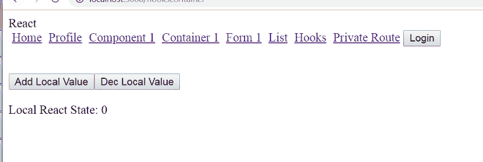
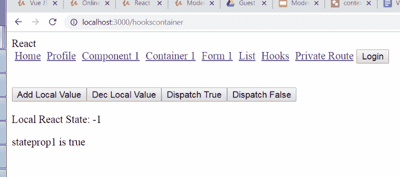

# 如何在不改变 Redux 代码的情况下将 React 钩子集成到项目中

> 原文：<https://www.freecodecamp.org/news/how-to-integrate-react-hooks-into-your-project-without-changing-your-redux-code-974e6f70f0b0/>

在本教程中，我们将讨论如何在不改变 Redux 代码(Redux 和 actions)的情况下将 React 钩子集成到 React Redux 项目中。

为了节省时间，我们可以从一个基本的 React Redux 应用程序开始，而不是从头开始构建。这将允许您并排查看之前和之后的代码，并使应用程序的集成更加容易。

你也可以在 twitter 上关注我，了解更多教程:[这里](https://twitter.com/iqbal125sf)

**启动器代码:**

[**Iqbal 125/modern-react-app-sample**](https://github.com/iqbal125/modern-react-app-sample)
[*在 GitHub 上创建账号，为 Iqbal 125/modern-react-app-sample 开发做贡献。*github.com](https://github.com/iqbal125/modern-react-app-sample)

#### 使用 React 的正确版本

我们要做的第一件事是确保我们有 React 的正确版本。在撰写本文时，create-react-app 没有给出正确的版本。所以你能做的就是使用 create-react-app，然后进入你的 package.json，输入正确的版本。所以只要把 React 和 React-dom 改成 16.8 版就行了。保存文件并删除节点模块文件夹。运行 npm install，您就可以开始了。

```
{
  "name": "app2",
  "version": "0.1.0",
  "private": true,
  "dependencies": {
    "auth0-js": "^9.8.2",
    "history": "^4.7.2",
    "react": "^16.8.0",
    "react-dom": "^16.8.0",
    "react-redux": "^6.0.0",
    "react-router": "^4.3.1",
    "react-router-dom": "^4.3.1",
    "react-scripts": "2.1.1",
    "redux": "^4.0.1"
  },
```

#### 将 React 类重构为 React 挂钩

所以我们要做的第一件事是将一个 React 类组件重构为一个 React 钩子。让我们打开我们的 App.js 文件，并将其转换为一个钩子，因此将您的 App.js 重构为以下内容:

```
import React, { Component } from 'react';
import Routes from './routes';

const App = () => {

    return(
      <div>
      React
      <Routes />
      </div>
    )
}

export default App;
```

所以基本上只要把类变成箭头函数，删除 render 方法就行了。就这样，你现在已经创建了一个 React 钩子！

#### 设置另一个挂钩

同样，我们可以设置另一个钩子，我们将把它设置在一个名为 Hooks 的文件夹中。

因此，在 hooks 目录中创建一个 hooks_container.js 文件，并像这样设置它:

```
import React, { useState } from 'react';

const HooksContainer = () => {

    return(
      <div>

      </div>
    )
}

export default HooksContainer;
```

#### useState()挂钩

我们现在将开始用 useState()钩子设置一些基本的非全局组件状态。

useState()挂钩类似于 React setState()函数。它是用数组析构来设置的，其中数组中的第一个元素是状态值，第二个元素是改变状态的函数。

让我们创建基本的增量和减量按钮，看看使用状态是如何工作的。

像这样设置按钮:

```
import React, { useState } from 'react';

const HooksContainer = () => {

  const [value, setValue] = useState(0)

  const incrementValue = () => {
    setValue(value + 1 )
  }

  const decrementValue = () => {
    setValue(value - 1 )
  }

    return(
      <div>
        <button onClick={() => incrementValue()}> Add Local Value </button>
        <button onClick={() => decrementValue()}> Dec Local Value </button>
        <br />
        <div>
          Local React State: {value}
        </div>
      </div>
    )
}

export default HooksContainer;
```

注意，我们不必在任何地方使用“props”或“state”关键字，我们可以直接使用变量和函数名。这是 React 钩子如此容易使用的原因之一。

你的应用应该看起来像这样。



你应该能够自由地增加或减少这个数字。

现在我们对 useState()的工作原理有了一个基本的概念，我们可以开始做一些稍微复杂一点的事情了。

#### useReducer() hook

我们现在可以开始设置 useReducer()挂钩了。

在使用 useReducer()钩子之前，我们必须首先设置 Reducer。这些动作实际上可以保持原样。我们对减速器的改动非常小。我们所要做的就是更改导出语句，而不是导出 default。我们必须导出缩减器和初始状态。

为了节省时间，只需在 reducer 文件中创建一个名为 hooks_reducer.js 的新 reducer，并从 Reducer1 中复制代码。您应该会看到如下所示的内容:

```
 import * as ACTION_TYPES from '../actions/action_types'

export const initialState = {
  stateprop1: false,
}

export const HooksReducer1 = (state = initialState, action) => {
    switch(action.type) {
      case ACTION_TYPES.SUCCESS:
        return {
          ...state,
          stateprop1: true
        }
      case ACTION_TYPES.FAILURE:
        return {
          ...state,
          stateprop1: false
        }
      default:
        return state
    }
}
```

现在只需将这个 reducer 及其初始状态导入 hooks_container.js .并将它们都传递给 useReducer()钩子。

```
 import * as HooksReducer1 from '../store/reducers/hooks_reducer';

...

const [state, dispatch] = useReducer(HooksReducer1.HooksReducer1, HooksReducer1.initialState)
```

我们还要创建 2 个按钮，将 stateprop1 从 false 更改为 true，然后再次更改为 false。我们还可以创建一个三元表达式，根据 stateprop1 是真还是假来显示文本。请记住，stateprop1 与我们在 HookReducer1 中设置的是同一个，但是我们是在容器中进行更新的。

我们使用相同的预先存在的动作来更新 reducer。请注意，在注释中，我留下了两种调度操作的替代方法。他们都在做同样的事情。返回一个类型为成功字符串的 javascript 对象。

因此，您的代码应该如下所示:

```
import React, { useState } from 'react';
import * as ACTIONS from '../store/actions/actions';
import * as HooksReducer1 from '../store/hooks_state/reducer1_hooks';

const HooksContainer = () => {

  const [state, dispatch] = useReducer(HooksReducer1.HooksReducer1, HooksReducer1.initialState)
  const [value, setValue] = useState(0)

  const incrementValue = () => {
    setValue(value + 1 )
  }

  const decrementValue = () => {
    setValue(value - 1 )
  }

  const handleDispatchTrue = () => {
    //    dispatch(type: "SUCCESS")
    //    dispatch(ACTIONS.SUCCESS)
    dispatch(ACTIONS.success())
  }

  const handleDispatchFalse = () => {
    //     dispatch(type: "FAILURE")
    //    dispatch(ACTIONS.FAILURE)
    dispatch(ACTIONS.failure())
  }

    return(
      <div>
        <button onClick={() => incrementValue()}> Add Local Value </button>
        <button onClick={() => decrementValue()}> Dec Local Value </button>
        <button onClick={() => handleDispatchTrue()}>Dispatch True </button>
        <button onClick={() => handleDispatchFalse()}>Dispatch False </button>
        <br />
        <br />
        <div>
          Local React State: {value}
        </div>
        <div>
        {state.stateprop1
          ? <p> stateprop1 is true </p>
          : <p> stateprop1 is false </p>
        }
        </div>
      </div>
    )
}

export default HooksContainer;
```

您的应用程序应该如下所示，并且您应该能够从 hooks 容器中更改 stateprop1:



当我们转到另一个组件时，您会注意到一个问题:状态没有保存。这是因为即使我们使用了动作和减少器，状态仍然是本地组件状态，而不是全局可用的。为了使状态全局可用，我们实际上必须使用 React 上下文，我们将在接下来的几节中设置它。

#### 设置动作和减速器

在我们设置上下文之前，让我们设置我们将使用的动作和缩减器。因此，让我们向名为 stateprop2 的 HooksReducer1 添加第二个属性，并将其设置为 0。

我们现在需要设置动作和动作类型来处理这个新的状态。

首先，让我们为 stateprop2 创建两种操作类型:

```
 export const INC_GLOBAL_STATE = "INC_GLOBAL_STATE"

export const DEC_GLOBAL_STATE = "DEC_GLOBAL_STATE"
```

然后我们可以在我们的动作文件中创建 2 个动作创建器来处理这些动作类型。

```
 export const inc_global_state = () => {
  return {
  type: ACTION_TYPES.INC_GLOBAL_STATE
  }
}

export const dec_global_state = () => {
  return {
  type: ACTION_TYPES.DEC_GLOBAL_STATE
  }
}
```

最后，我们需要设置我们的减速器，看起来应该是这样的:

```
import * as ACTION_TYPES from '../actions/action_types'

export const initialState = {
  stateprop1: false,
  stateprop2: 0
}

export const HooksReducer1 = (state = initialState, action) => {
    switch(action.type) {
      case ACTION_TYPES.SUCCESS:
        return {
          ...state,
          stateprop1: true
        }
      case ACTION_TYPES.FAILURE:
        return {
          ...state,
          stateprop1: false
        }
      case ACTION_TYPES.INC_GLOBAL_STATE:
        return {
          ...state,
          stateprop2: state.stateprop2 + 1
        }
      case ACTION_TYPES.DEC_GLOBAL_STATE:
        return {
          ...state,
          stateprop2: state.stateprop2 - 1 
        }
      default:
        return state
    }
}
```

#### 反应上下文

接下来，我们必须设置上下文对象。只需创建另一个 context.js 文件，并按如下方式设置它:

```
import React from 'react';

const Context = React.createContext({
  prop1: false
})

export default Context;
```

注意，这里的 prop1 是不相关的。我们将在 App.js 文件中覆盖它。我们只是提供了 prop1 来初始化上下文对象。所有更新和读取我们状态的代码都将在 App.js 文件中完成。

接下来，让我们将这个上下文对象导入到 App.js 文件中。还要导入 HooksReducer1 和动作，因为我们将在这里使用它们。

让我们也像以前一样设置 useReducer。

```
import React, { useReducer } from 'react';
import Routes from './routes';
import Context from './utils/context';
import * as ACTIONS from './store/actions/actions';
import * as HooksReducer1 from './store/reducers/hooks_reducer';

const App = () => {
  const [valueGlobal, dispatchActionsGlobal] = useReducer(HooksReducer1.HooksReducer1, HooksReducer1.initialState)

...
```

接下来，我们需要创建两个函数来分派我们刚刚创建的动作创建器。这些函数将递增和递减 stateprop2。

我们还需要用一个<context.provider>组件来包装我们的路线。这让我们有了一个全球性的国家。<context.provider>组件将所有状态传递给子组件。因为 App.js 是根组件，所以状态会传递给应用程序中的每个组件，这就是为什么状态是全局的。</context.provider></context.provider>

国家本身包含在一个叫做“价值”的道具中。这一切都类似于 React-Redux 中看到的<provider>组件和“store”道具。</provider>

然后，我们需要将状态和动作调度作为属性传递给 value prop。这里我们需要 3 个属性:一个用于增加状态值的函数，一个用于减少状态值的函数，一个用于保存实际的状态值。

您的 App.js 文件将如下所示:

```
import React, { useReducer } from 'react';
import Routes from './routes';
import Context from './utils/context';
import * as ACTIONS from './store/actions/actions';
import * as HooksReducer1 from './store/reducers/hooks_reducer';

const App = () => {
  const [valueGlobal, dispatchActionsGlobal] = useReducer(HooksReducer1.HooksReducer1, HooksReducer1.initialState)

    const incrementGlobalValue = () => {
      dispatchActionsGlobal(ACTIONS.inc_global_state() )
    }

    const decrementGlobalValue = () => {
      dispatchActionsGlobal(ACTIONS.dec_global_state() )
    }

    return(
      <div>
        React
        <Context.Provider
                  value={{
                    valueGlobalState: valueGlobal,
                    addGlobalValue: () => incrementGlobalValue(),
                    decGlobalValue: () => decrementGlobalValue()
                  }}>
            <Routes />
          </Context.Provider>
      </div>
    )
}

export default App;
```

我有意让所有的函数和属性名保持不同，这样当我们在子组件中使用上下文时，就可以更容易地看到所有内容的来源。

现在，所有子组件都可以访问 value prop 中定义的所有属性，因此我们有了一个全局状态！

#### 通过 useContext()挂钩在子组件中使用上下文。

让我们回到钩子容器，使用我们刚刚设置的这些函数和状态。

为了在钩子容器中使用上下文，我们首先需要导入它并将整个上下文对象传递到 useContext 钩子中。像这样:

```
 ...

import Context from '../utils/context';

const HooksContainer = () => {
  const context = useContext(Context)

...
```

接下来，我们可以通过上下文变量直接访问我们在 value prop 中设置的属性。

```
...    

<button onClick={() => context.addGlobalValue()}> Add Global Value </button>
<button onClick={() => context.decGlobalValue()}> Dec Global Value </button>

...
```

记住 addGlobalValue()是我们在 App.js 中提供给 value prop 的*属性*的名称。它不是用于调度动作的函数的名称，也不是我们在 App.js 中的 useReducer()钩子中设置的函数的名称。

通过上下文访问状态值的方式如下:

```
...

<p>Global Value: {context.valueGlobalState.stateprop2}</p>

...
```

与调度操作类似，valueGlobalState 是提供给 value prop 的属性名。我们必须从 valueGlobalState 属性中用点标记法访问 stateprop2，因为 valueGlobalState 包含来自 HooksReducer1 的整个 intialState，包括 stateprop1。

如果您现在进行测试，您将会看到状态会更新，甚至在您转到另一个组件之后仍然存在，从而允许您复制 Redux 功能并拥有一个全局状态。

您可以使用这种模式为所有 Redux 代码进行扩展。

**最终代码:**

[**Iqbal 125/react-hooks-基础**](https://github.com/iqbal125/react-hooks-basic)
[*通过在 GitHub 上创建账号贡献给 Iqbal 125/react-hooks-基础开发。*github.com](https://github.com/iqbal125/react-hooks-basic)

#### 摘要

所以这里有一个如何做的概念性总结(需要基本的 React hooks 知识):

动作根本不需要改变。减速器也不需要更换。只需导出初始状态和缩减器，而不仅仅是缩减器。不要在 reducer 文件的底部使用“导出默认值”。

将缩减器及其初始状态导入到根 App.js 文件中。调用根 App.js 文件中的 useReducer()钩子，并将其保存在一个变量中。类似于 useState 钩子，数组析构中的第一个元素是状态值，第二个元素是改变状态的函数。然后将导入的 reducer 和 initialState 传递给 useReducer()钩子。根据需要导入尽可能多的 Reducer，并将它们分别传递给一个单独的 useReducer()钩子。

照常将操作导入 App.js。调度操作也完全相同。不使用 mapDispatchToProps()函数，而是从 useReducer()钩子调用中的更改状态函数(数组析构中的第二个元素)调度操作。

设置并初始化 React。在另一个文件中创建 Context()函数，并将其导入 App.js。然后用<context.provider>包装<routes>。对于提供程序中的值属性，每个状态通常需要 3 个属性。1 属性将状态设置为新值，1 属性传入实际状态，1 属性将状态设置回默认值。</routes></context.provider>

然后，要使用组件中的状态，首先从 context.js 导入上下文对象，然后将它传递给 useContext()钩子，并将其保存在一个名为“Context”的变量或您喜欢的任何变量中。然后，要访问 state 属性，只需将变量命名为“context”。然后是 value prop 中属性集的名称，接着是 reducer 的 initialState 中属性集的名称。要分派操作，只需执行“context”然后调用属性名。

一旦这样做了，您的上下文状态是全局可用的，并将与您现有的 React Redux 代码一起工作。

要获得本教程的 100%免费视频版本和更多深入的 React Hooks 内容，请查看我的 Udemy 课程或 Youtube 播放列表:

[https://www . udemy . com/react-hooks-with-react-redux-migration](https://www.udemy.com/react-hooks-with-react-redux-migration)

[https://www . YouTube . com/watch？v = l8 ODM-kodpa&list = plmc 67 xeat-yplhhdpoj 5 vakceznr 8s 0b](https://www.youtube.com/watch?v=l8ODM-KoDpA&list=PLMc67XEAt-ywplHhDpoj5vakceZNr8S0B)