# 如何使用 React Native 和 Expo 将 Redux 集成到您的应用程序中

> 原文：<https://www.freecodecamp.org/news/how-to-integrate-redux-into-your-application-with-react-native-and-expo-ec37c9ca6033/>

Redux 是 React 本地生态系统的重要组成部分。如果你的世界围绕着 JavaScript，你可能听说过 Redux。在阅读本教程的其余部分并继续学习之前，请记住您只是在学习 Redux，因为它会让事情变得更简单，而不是更困难。现在让我们了解一下为什么您的应用程序中需要 Redux。

### 需要 Redux

如果没有合适的方法来处理数据，在现实世界中构建 React 或 React 本机应用程序可能会变得复杂。如果在任何一点上数据没有得到管理，事情将会失去控制。如果您熟悉 React 或 React Native，您会知道处理数据的默认方式是将数据保持在组件状态，并将其作为道具传递给子组件。

状态和属性是控制组件中数据的仅有的两种方式。Props 是**属性的简称。**在 React 世界里遵循一个简单的规则，就是我们不应该变异或者改变道具的值。在 React 中，数据流是单向的。也就是说，数据总是可以从父组件传递到子组件。请看下面这个简单的例子:

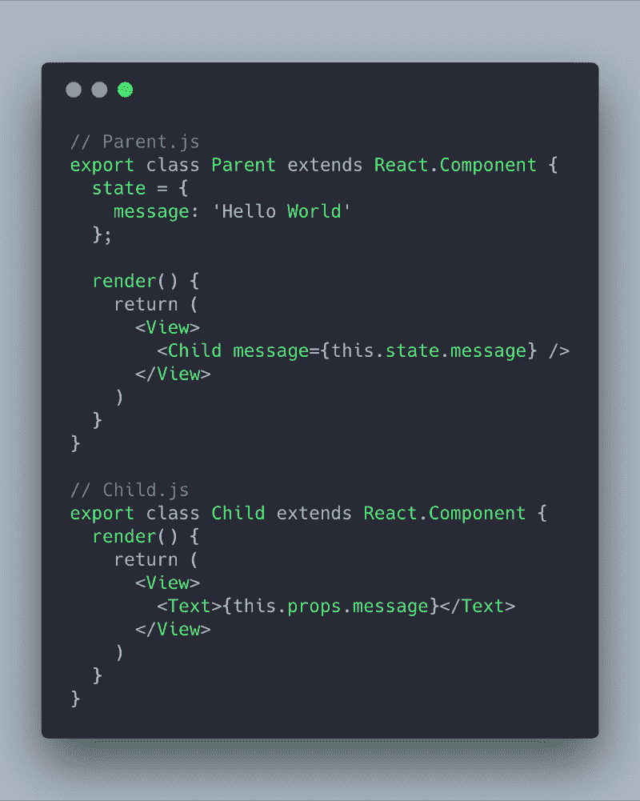

在上面的例子中，我们在不同的文件中创建了两个组件(父组件和子组件)。父组件由呈现子组件的视图组成。在子组件中，视图呈现来自 props 的文本消息。传入消息作为父组件状态中的数据可用。

这样，子组件可以与其他父组件一起重用，这样每个父组件都可以有自己的数据要呈现。请注意，我们在任何时候都没有修改`this.props`的值。

国家是用来改变数据的。这是状态存在于每个组件中的唯一原因。每当我们想改变状态时，我们在组件内使用`this.setState()`方法。此方法重新呈现组件及其所有子组件以反映更改。这在 React 和 React Native 中类似地工作，但是内部是不同的。

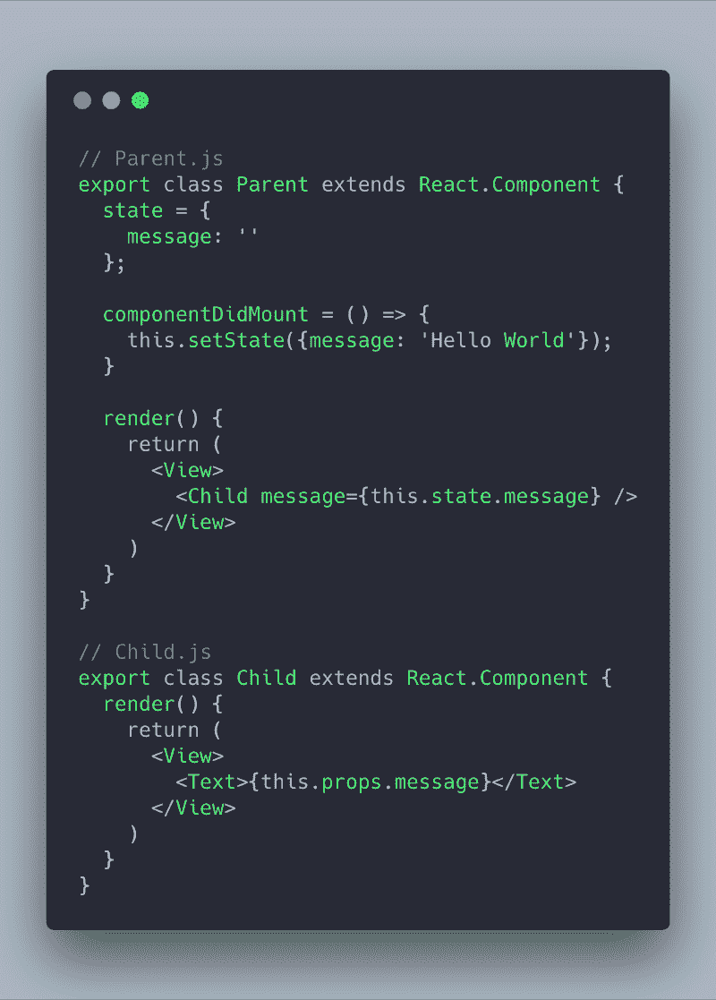

既然我们可以在 React 原生应用中如此高效地管理状态和道具，为什么 Redux 是必要的呢？嗯，上面的例子代表了最低限度，而不是一个实时场景。想象一下像 Instagram 或 Twitter 这样的应用程序。您有不同的屏幕，每个屏幕可能依赖于一个或两个组件，如我们示例中的父组件和可重用子组件。很难跟踪每个组件的状态。

Redux 是最广泛采用的处理数据的方式之一。它支持将状态作为一个全局属性共享，整个 React 本机应用程序可以使用和接收 props 形式的状态。这就是所谓的在 Redux 中创建商店。Redux 通过将状态移到一个地方来简化状态。

Redux 使用一种叫做上下文的底层反应机制。我们不打算详述什么是上下文，因为这超出了本文的范围。我只是想让你知道幕后没有什么神奇的事情发生。

请记住以下术语，因为我们将在下面的教程中看到它们的实际应用:

*   行动
*   还原剂
*   商店

学习 Redux 的关键是练习。我现在不想分享太多的信息和压倒一切的事情。因此，让我们从创建一个演示应用程序来学习 Redux 开始。

### 构建番茄应用程序

#### Expo-CLI 入门？

为了构建这个应用程序，我将使用由 [Expo](https://www.freecodecamp.org/news/how-to-integrate-redux-into-your-application-with-react-native-and-expo-ec37c9ca6033/undefined) 团队推出的最新工具，名为 [expo-cli](https://www.npmjs.com/package/expo-cli) 。将其作为一个全局依赖项安装，然后使用它初始化一个新的 React 本地项目。

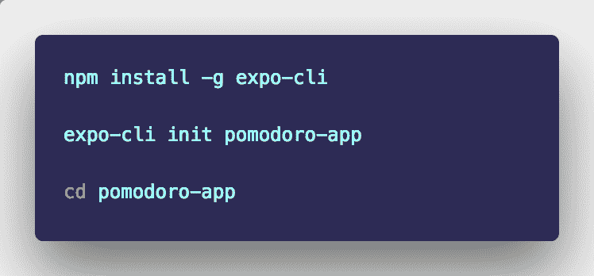

要查看在这个初始状态下是否一切正常，请运行以下命令。

将会出现以下界面提示您。花些时间浏览一下。如果你以前使用过 Expo XDE 或 Create-React-Native-App 构建应用程序，你会发现变化不大，只是现在 Expo-CLI 使用了 Chrome 浏览器。

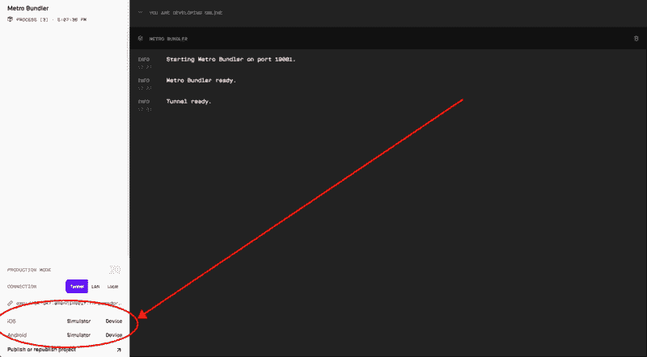

选择一个能够运行 Expo 客户端的模拟器或设备，如上图所示。如果你看到下面的屏幕，这意味着我们的 React 本地项目已经初始化，没有任何困难。

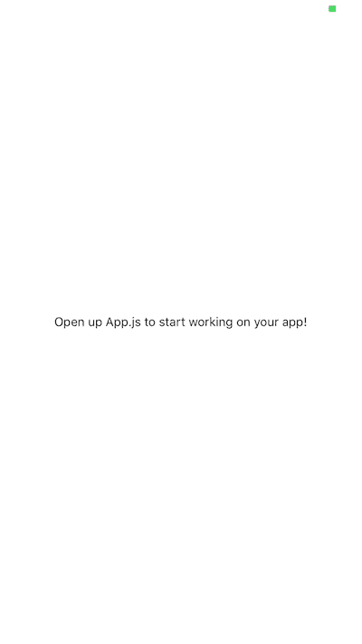

这样，在`components`目录中创建以下文件和文件夹。稍后我将讨论为什么我们遵循这个目录结构。现在，我们的初始设置已经完成，我们可以开始构建我们的应用程序了。

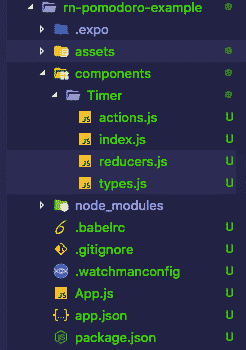

#### 计时器组件⏱

首先，我们将创建一个哑计时器组件，并将其与`App.js`连接。将以下代码添加到`Timer/index.js`:

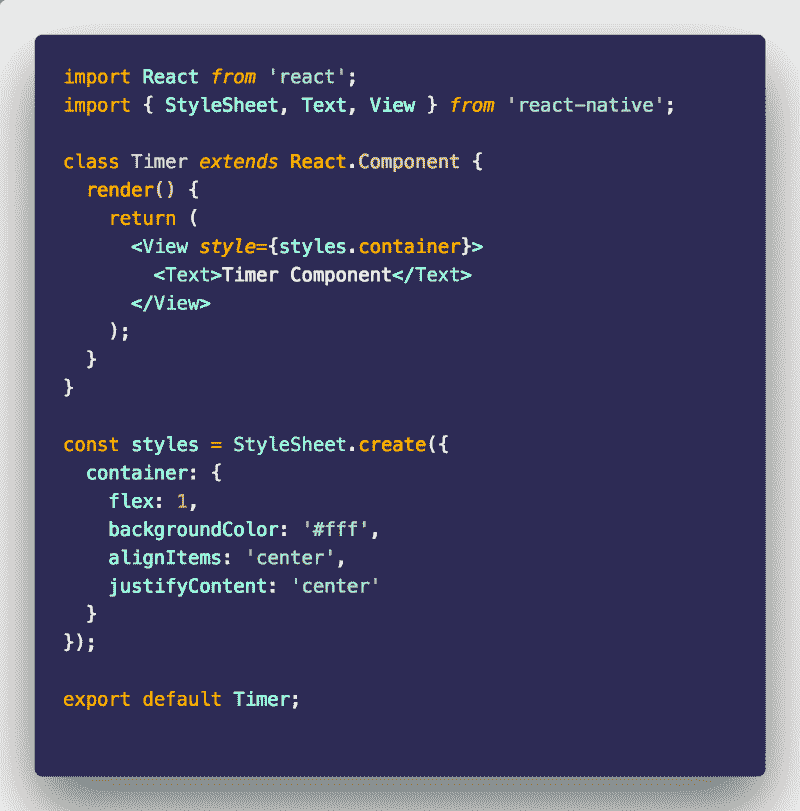

接下来，修改`App.js`文件:

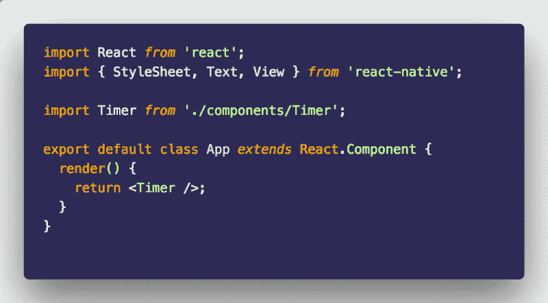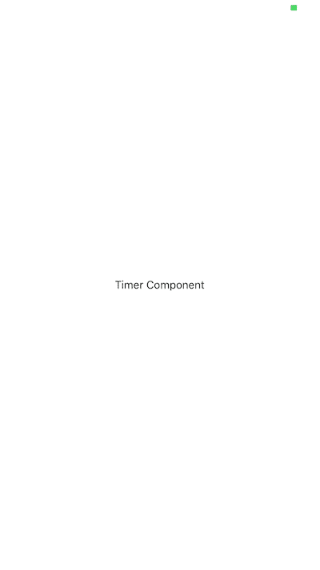

我们现在将制作一个静态计时器组件来看看事情是如何进行的。我们将从修改`StatusBar`开始。然后我们从`react-native`库中定义两个`Text`元素来指定实际的计时器将显示在哪里，以及启动和停止计时器的按钮将显示在哪里。目前，两者都是文本字段。

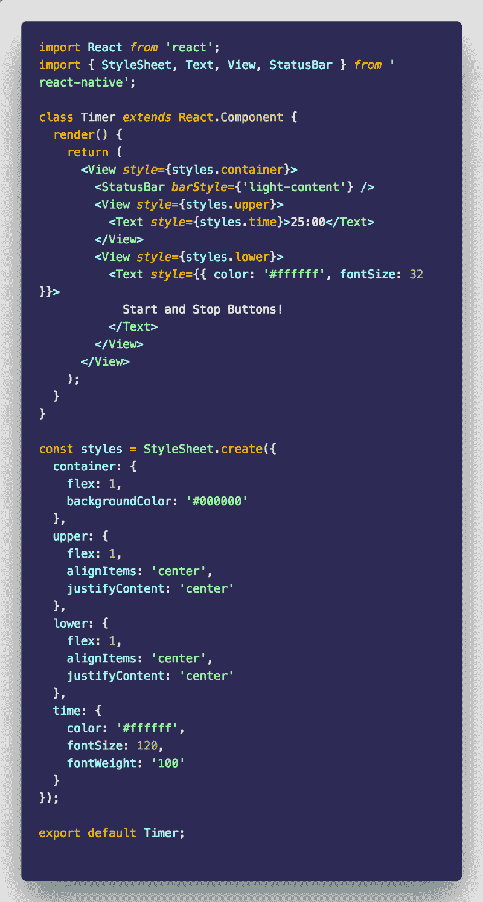

#### 添加按钮？

在本节中，我们将用实际的按钮替换显示`Start and Stop Buttons!`的部分。我们将使用`TouchableOpactiy`来完成这项工作。一个`TouchableOpacity`组件充当了一个包装器，让视图正确地响应触摸。每当用户触摸时，被包装的视图(或者我们例子中的按钮)的不透明度就会降低。

我们创建一个可重用的组件，因为我们需要两个按钮:开始和停止。

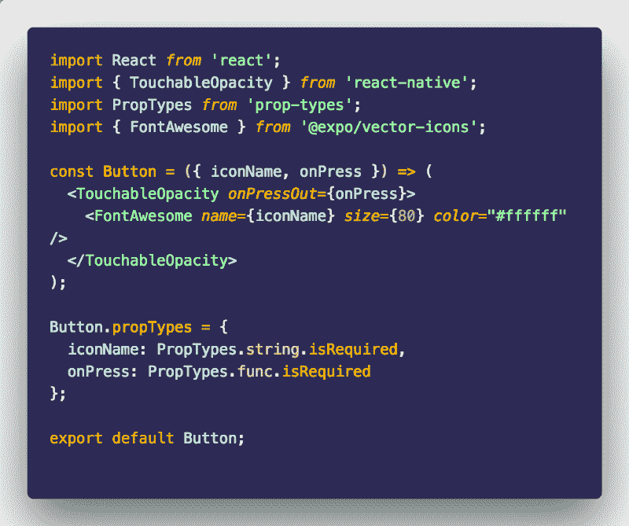

这是一个无状态组件，所以它没有类——我们只需要它来表示我们应用程序 UI 中的按钮。我们还从`@expo/vector-icons`导入了 FontAwesome 图标，它是 react-native-vector-icons 的一个分支，直接来自 expo SDK。无需将其作为独立的依赖项安装。为了显示一个图标，我们需要定义它的`size`。

最后，在上面的无状态组件中，我们定义了`propTypes`。我将在另一篇文章中讨论我们应该如何以及为什么在 React 本机应用程序中使用 PropTypes。

在移动应用程序中，事件由触摸触发。为了处理这些事件，我们将使用`onPress`。这里我们只有两个事件，开始和停止。我们应用程序中的两个按钮都将使用不同于`onPress`的`onPressOut`。每当用户释放触摸时(当用户停止按下按钮时)，就会调用`onPressOut`。它在`onPress`之前被调用，在像我们这样的情况下更准确，我们需要用户一完成就按下按钮来启动或停止定时器。

我们现在将在计时器组件中需要这个`Button`组件。

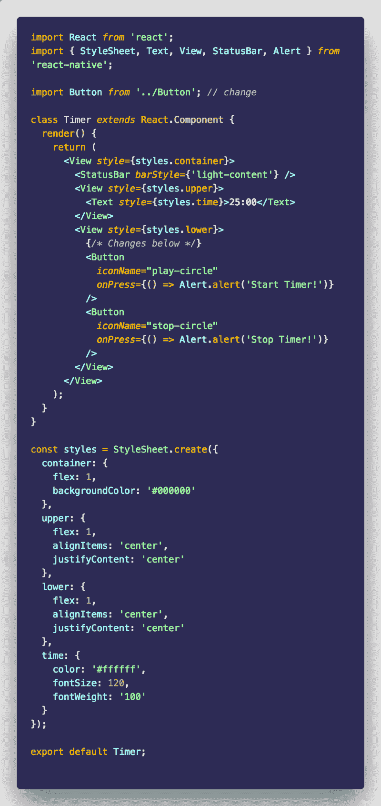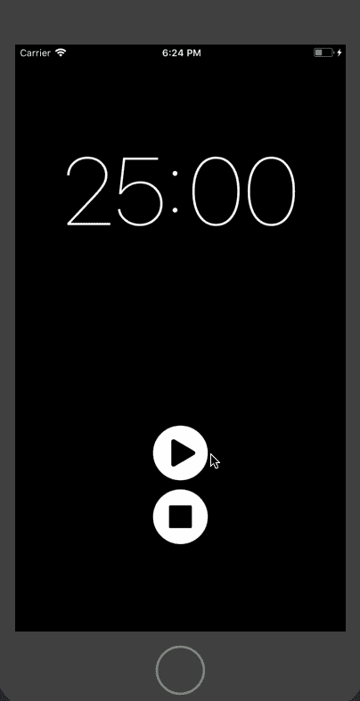

### 集成 Redux？

到目前为止，我们的计时器应用程序除了显示一个最小的 UI 之外没有做任何事情。为了让它工作，我们从添加一些必要的 Redux 依赖项开始。

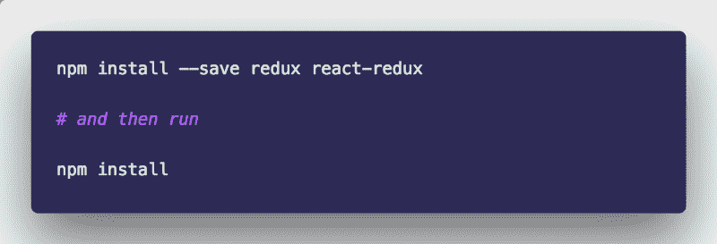

现在，让我们开始在我们的应用程序中集成 Redux。

#### 行动？

在 Redux 中，整个应用程序的状态由一个 JavaScript 对象表示。把这个对象看作是只读的，因为我们不能直接对这个状态(以树的形式表示)进行修改。我们需要这样做。

动作就像 Redux 中的事件。它们可以以鼠标点击、按键、定时器或网络请求的形式被触发。提到的每个事件的性质是可变的。动作是一个 JavaScript 对象。要定义一个动作，有一个要求:每个动作必须有自己的类型属性。我们在一个名为`types.js`的文件中定义这些类型:

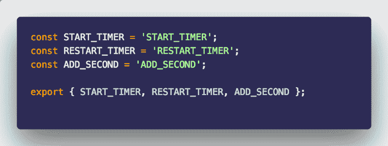

到目前为止，我们的应用程序只需要三个动作。任何动作的类型都是字符串值，并被定义为常量。

在文件`actions.js`中，我们将需要这些类型来定义动作创建者。动作创建者是创建动作的功能。

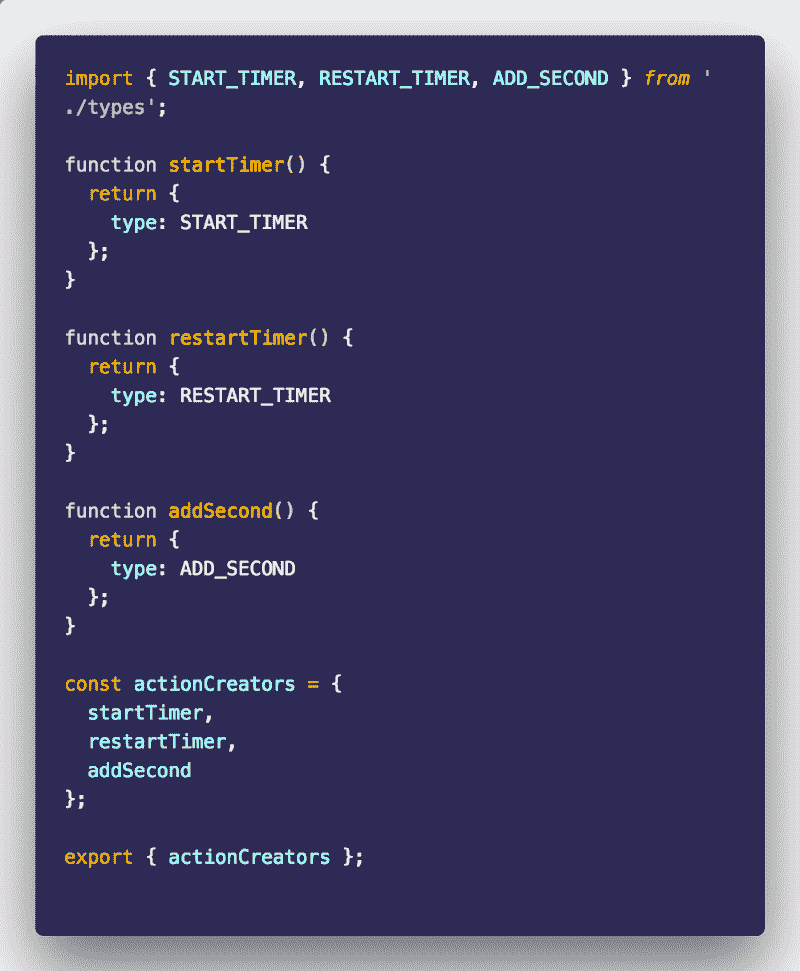

#### 减速器？

动作的接受者被称为缩减者。每当一个动作被触发时，应用程序的状态就会改变。应用程序状态的处理由 reducers 完成。

归约器是一个纯粹的函数，它根据初始状态或前一个状态计算下一个状态。如果状态不变，它总是产生相同的输出。它有两个输入，state 和 action 必须返回默认状态。

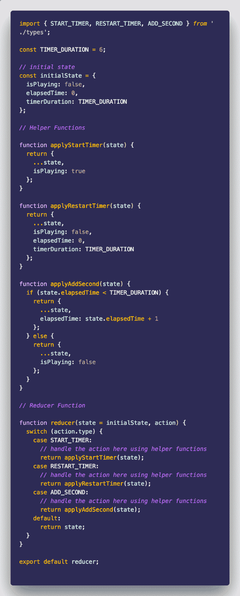

在我们的初始状态，我们定义了三个属性:`isPlaying`、`elapsedTime`和`timerDuration`。出于测试目的，定时器目前的默认值为 6(秒)，但我们稍后将更改的实际值为`25`(或 1500 秒)。

然后有三个辅助函数:

*   `applyStartTimer`将启动计时器
*   `applyRestartTimer`将停止定时器功能并将一切设置为默认值
*   最后，`applyAddSecond`将检查经过的时间是否小于总定时器的持续时间。如果是这样，它会多增加一秒钟来增加它的值。如果不是，它将返回默认状态并停止定时器功能的运行。

之后，我们定义我们的 reducer 函数并导出相同的函数。观察减速器的功能是如何组织的。这是我在互联网上看到的大多数社区成员遵循的模式。

[这个](https://egghead.io/courses/getting-started-with-redux)是[丹·阿布拉莫夫](https://www.freecodecamp.org/news/how-to-integrate-redux-into-your-application-with-react-native-and-expo-ec37c9ca6033/undefined)的 Redux 入门的好资源，而且是免费的！

#### 创建 Redux 商店？

在 reducer 和初始状态的帮助下，我们可以创建 store 对象。

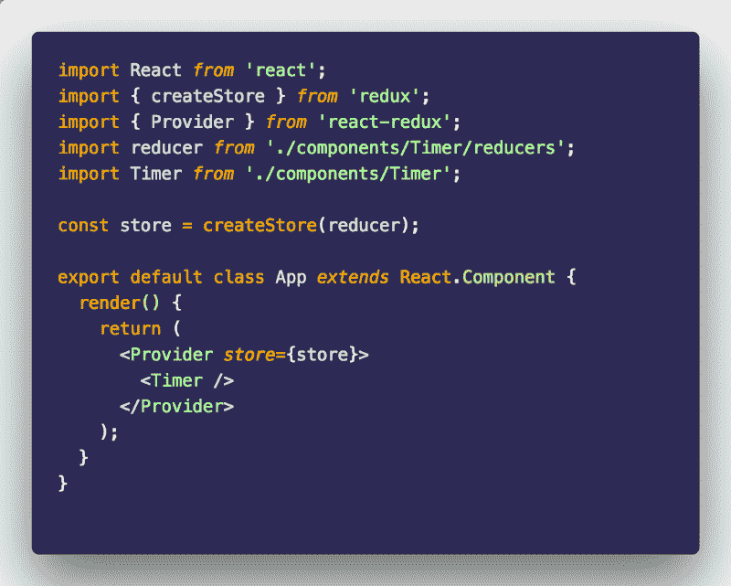

存储是一个将动作和减少器集合在一起的对象。它在应用程序级别提供和保存状态，而不是单个组件。就哪个框架或库应该使用它或不使用它而言，Redux 不是一个固执己见的库。

要用 Redux 绑定 React 或 React 本机应用程序，可以使用`react-redux`模块。这是通过使用高阶组件`Provider`来完成的。它基本上将存储传递给应用程序的其余部分。

我们需要将 action creators 与我们的计时器函数绑定在一起，以使它完全发挥作用(以便它响应可触摸的事件或计时器的启动或重启)。我们将在`Timer/index.js`函数中这样做。

首先，我们导入所需的依赖项来绑定动作创建者。

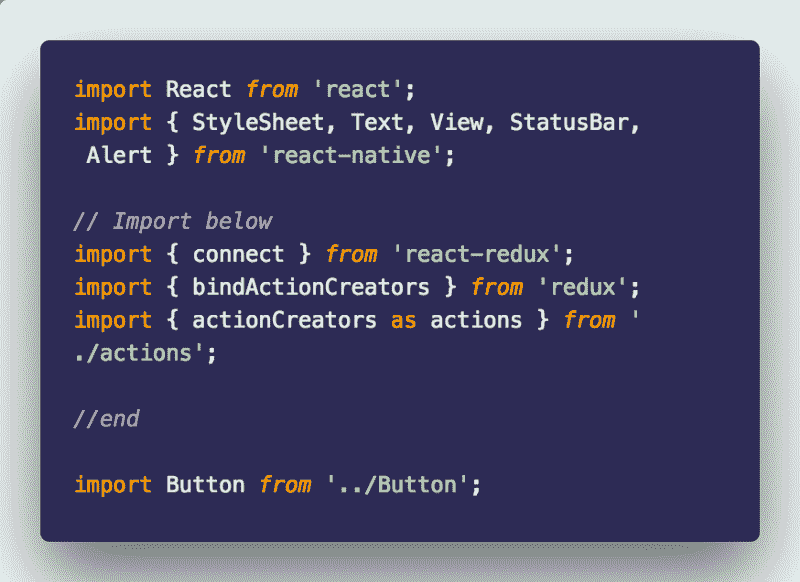

`bindActionCreators`使用动作功能的名称将动作功能映射到一个对象。当函数被调用时，这些函数自动将动作分派给存储。要更改数据，我们需要分派一个操作。为了实现这一点，我们需要两个东西:`mapStateToProps`和`mapDispatchToProps`，我们需要用我们的组件连接它们。这是您将要重写的样板代码。

我们定义了这两个函数，并在定义了 React 本地视图的样式后修改了我们的`export default`语句。

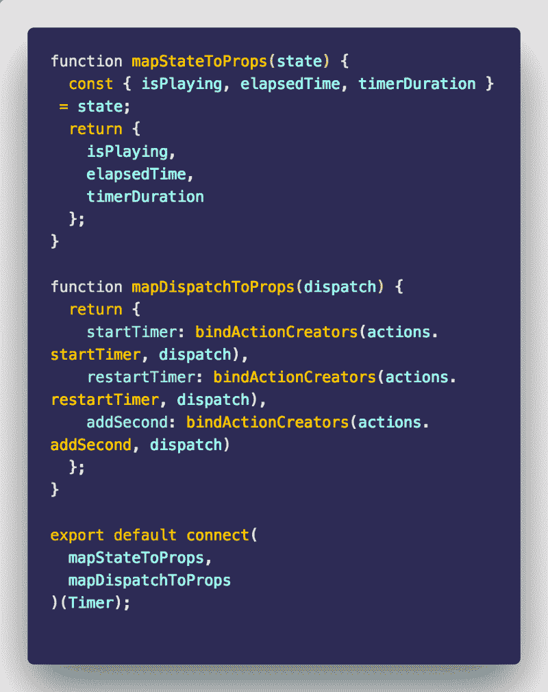

`mapStateToProps`是一个存在于商店中的对象，它的键作为道具传递给组件。下面是计时器组件的完整代码。

### 完成应用程序⚛️ +？

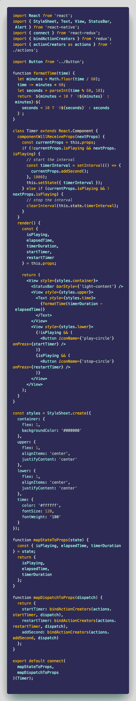

我创建了一个名为`formatTime`的自定义函数来以正确的格式显示时间，但是您可以使用任何计时器库。接下来，为了增加时间的价值，我使用 React 生命周期方法`componentWillReceiveProps`。我知道它很快会被弃用，但现在它还能用。查看我们的迷你应用程序:

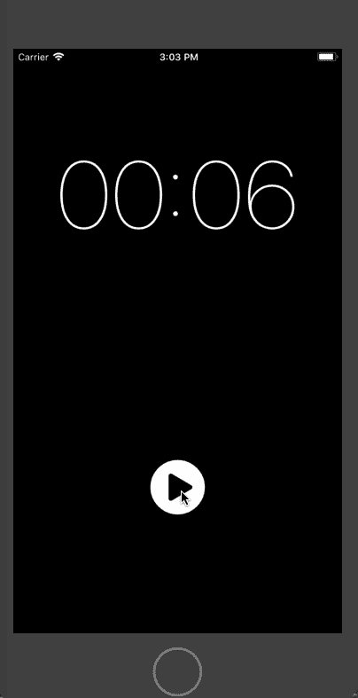

为了简洁起见，在这个演示中，我只用秒来显示计时器。您可以通过编辑`reducers.js`中常量`TIMER_DURATION`的值来增加计时器的值。

我们已经到了文章的结尾。希望你读它的时候和我写它的时候一样开心。您可以在 Github repo 中找到本文的完整代码:

[**amandeepmittal/rn-pomodoro-example**](https://github.com/amandeepmittal/rn-pomodoro-example)
[*rn-pomodoro-example-React Native+Redux integration*github.com](https://github.com/amandeepmittal/rn-pomodoro-example)

你还记得我告诉过你我在实现 Redux 架构时遵循的一个特定的文件结构吗？这就是所谓的**再鸭**模式，你可以在这篇由[亚历克斯·摩尔多瓦](https://www.freecodecamp.org/news/how-to-integrate-redux-into-your-application-with-react-native-and-expo-ec37c9ca6033/undefined) : 撰写的内容丰富的文章中找到更多细节

[**用鸭子缩放你的 Redux 应用**](https://medium.freecodecamp.org/scaling-your-redux-app-with-ducks-6115955638be)
[*你的前端应用如何缩放？你如何确保你写的代码在 6 个月内是可维护的…*medium.freecodecamp.org](https://medium.freecodecamp.org/scaling-your-redux-app-with-ducks-6115955638be)

**？更多问题，请在[推特](https://twitter.com/amanhimself)上联系我，或者在我的[网站](https://amanhimself.dev)上阅读更多关于我的信息。**

如果你想收到我关于 React Native 的下一篇文章的更新，请考虑订阅我的时事通讯。