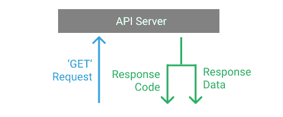

# Python 请求——如何使用 Python 与 Web 服务交互

> 原文：<https://www.freecodecamp.org/news/how-to-interact-with-web-services-using-python/>

API 或**应用编程接口**促进了两个软件之间的通信。它允许您使用代码检索和发送数据。我们通常使用 API 来检索数据，这将是本初学者友好教程的重点。

当我们想从一个 API 接收数据时，我们需要发出一个**请求**。请求在网络上随处可见。例如，当您访问这篇博文时，您的 web 浏览器向 freeCodeCamp web 服务器发出了一个请求，该服务器以这个网页的内容作为响应。



API 请求的工作方式完全相同——您向 API 服务器发出数据请求，它会响应您的请求。

## 不同的 HTTP 方法和状态代码

对于[REST API](https://www.ibm.com/cloud/learn/rest-apis)有各种 HTTP 方法。这些方法告诉 API 需要对数据执行什么操作。虽然有许多 HTTP 方法，但下面列出的五种方法是 REST APIs 中最常用的:

| HTTP 方法 | 描述 |
| --- | --- |
| `GET` | 检索现有数据 |
| `POST` | 添加新数据 |
| `PUT` | 更新现有数据 |
| `PATCH` | 部分更新现有数据 |
| `DELETE` | 删除数据 |

一旦 REST API 接收并处理了一个 HTTP 请求，它就会返回一个带有 HTTP 状态代码的响应。此状态代码提供了有关响应的信息，并帮助客户端应用程序了解它是哪种类型的响应。

状态代码根据结果的类别进行编号:

| 代码范围 | 种类 |
| --- | --- |
| `1xx` | 信息反应 |
| `2xx` | 成功的手术 |
| `3xx` | 重寄 |
| `4xx` | 客户端错误 |
| `5xx` | 服务器错误 |

您可以从 [MDN Web 文档](https://developer.mozilla.org/en-US/docs/Web/HTTP/Status)中了解更多关于 HTTP 状态代码的信息。

## API 端点

API 端点是由服务器公开的公共 URL，客户端应用程序使用它们来访问资源和数据。

出于本教程的考虑，我们将使用[假的 Store REST API](https://fakestoreapi.com/) 。更具体地说，我们将使用以下端点:

| HTTP 方法 | API 端点 | 描述 |
| --- | --- | --- |
| `GET` | `/products` | 获取产品列表。 |
| `GET` | `/products?limit=x` | 仅获得 5 个产品。 |
| `GET` | `/products/<product_id>` | 获得单品。 |
| `POST` | `/products` | 创造新产品。 |
| `PUT` | `/products/<product_id>` | 更新产品。 |
| `PATCH` | `/products/<product_id>` | 部分更新产品。 |
| `DELETE` | `/products/<product_id>` | 删除产品。 |

上面的每个端点基于 HTTP 方法执行不同的操作。对于每个 API URL，基本 URL 是:`https://fakestoreapi.com`。我们将一个接一个地探索它们。

但是首先我们需要安装一个外部库来使用这些 API。大多数 Python 开发人员使用`requests`库与 web 服务进行交互。您可以像这样使用`pip`命令安装这个库:

```
$ pip install requests
```

一旦库安装完毕，我们就可以开始了！

## 如何发出 GET 请求

这是您将遇到的最常见的 HTTP 请求方法之一。这是一个**只读**操作，允许您从 API 中检索数据。

让我们在上面提到的第一个端点上尝试 GET 请求，这个端点响应一个产品列表。

```
import requests

BASE_URL = 'https://fakestoreapi.com'

response = requests.get(f"{BASE_URL}/products")
print(response.json()) 
```

上面的脚本使用`requests.get()`方法在 API 端点`/products`上发送 GET 请求。它以所有产品的列表作为响应。然后，我们调用`.json()`来查看 JSON 响应，如下所示:

```
[
    {
        "id": 1,
        "title": "Fjallraven - Foldsack No. 1 Backpack, Fits 15 Laptops",
        "price": 109.95,
        "description": "Your perfect pack for everyday use and walks in the forest. Stash your laptop (up to 15 inches) in the padded sleeve, your everyday",
        "category": "men's clothing",
        "image": "https://fakestoreapi.com/img/81fPKd-2AYL._AC_SL1500_.jpg",
        "rating": {
            "rate": 3.9,
            "count": 120
        }
    },
    {
        "id": 2,
        "title": "Mens Casual Premium Slim Fit T-Shirts ",
        "price": 22.3,
        "description": "Slim-fitting style, contrast raglan long sleeve, three-button henley placket, light weight & soft fabric for breathable and comfortable wearing. And Solid stitched shirts with round neck made for durability and a great fit for casual fashion wear and diehard baseball fans. The Henley style round neckline includes a three-button placket.",
        "category": "men's clothing",
        "image": "https://fakestoreapi.com/img/71-3HjGNDUL._AC_SY879._SX._UX._SY._UY_.jpg",
        "rating": {
            "rate": 4.1,
            "count": 259
        }
    },
    {
        "id": 3,
        "title": "Mens Cotton Jacket",
        "price": 55.99,
        "description": "great outerwear jackets for Spring/Autumn/Winter, suitable for many occasions, such as working, hiking, camping, mountain/rock climbing, cycling, traveling or other outdoors. Good gift choice for you or your family member. A warm hearted love to Father, husband or son in this thanksgiving or Christmas Day.",
        "category": "men's clothing",
        "image": "https://fakestoreapi.com/img/71li-ujtlUL._AC_UX679_.jpg",
        "rating": {
            "rate": 4.7,
            "count": 500
        }
    },
    {
        "id": 4,
        "title": "Mens Casual Slim Fit",
        "price": 15.99,
        "description": "The color could be slightly different between on the screen and in practice. / Please note that body builds vary by person, therefore, detailed size information should be reviewed below on the product description.",
        "category": "men's clothing",
        "image": "https://fakestoreapi.com/img/71YXzeOuslL._AC_UY879_.jpg",
        "rating": {
            "rate": 2.1,
            "count": 430
        }
    },
    {
        "id": 5,
        "title": "John Hardy Women's Legends Naga Gold & Silver Dragon Station Chain Bracelet",
        "price": 695,
        "description": "From our Legends Collection, the Naga was inspired by the mythical water dragon that protects the ocean's pearl. Wear facing inward to be bestowed with love and abundance, or outward for protection.",
        "category": "jewelery",
        "image": "https://fakestoreapi.com/img/71pWzhdJNwL._AC_UL640_QL65_ML3_.jpg",
        "rating": {
            "rate": 4.6,
            "count": 400
        }
    },
    {
        "id": 6,
        "title": "Solid Gold Petite Micropave ",
        "price": 168,
        "description": "Satisfaction Guaranteed. Return or exchange any order within 30 days.Designed and sold by Hafeez Center in the United States. Satisfaction Guaranteed. Return or exchange any order within 30 days.",
        "category": "jewelery",
        "image": "https://fakestoreapi.com/img/61sbMiUnoGL._AC_UL640_QL65_ML3_.jpg",
        "rating": {
            "rate": 3.9,
            "count": 70
        }
    },
    {
        "id": 7,
        "title": "White Gold Plated Princess",
        "price": 9.99,
        "description": "Classic Created Wedding Engagement Solitaire Diamond Promise Ring for Her. Gifts to spoil your love more for Engagement, Wedding, Anniversary, Valentine's Day...",
        "category": "jewelery",
        "image": "https://fakestoreapi.com/img/71YAIFU48IL._AC_UL640_QL65_ML3_.jpg",
        "rating": {
            "rate": 3,
            "count": 400
        }
    },
    {
        "id": 8,
        "title": "Pierced Owl Rose Gold Plated Stainless Steel Double",
        "price": 10.99,
        "description": "Rose Gold Plated Double Flared Tunnel Plug Earrings. Made of 316L Stainless Steel",
        "category": "jewelery",
        "image": "https://fakestoreapi.com/img/51UDEzMJVpL._AC_UL640_QL65_ML3_.jpg",
        "rating": {
            "rate": 1.9,
            "count": 100
        }
    },
    {
        "id": 9,
        "title": "WD 2TB Elements Portable External Hard Drive - USB 3.0 ",
        "price": 64,
        "description": "USB 3.0 and USB 2.0 Compatibility Fast data transfers Improve PC Performance High Capacity; Compatibility Formatted NTFS for Windows 10, Windows 8.1, Windows 7; Reformatting may be required for other operating systems; Compatibility may vary depending on user’s hardware configuration and operating system",
        "category": "electronics",
        "image": "https://fakestoreapi.com/img/61IBBVJvSDL._AC_SY879_.jpg",
        "rating": {
            "rate": 3.3,
            "count": 203
        }
    },
    {
        "id": 10,
        "title": "SanDisk SSD PLUS 1TB Internal SSD - SATA III 6 Gb/s",
        "price": 109,
        "description": "Easy upgrade for faster boot up, shutdown, application load and response (As compared to 5400 RPM SATA 2.5” hard drive; Based on published specifications and internal benchmarking tests using PCMark vantage scores) Boosts burst write performance, making it ideal for typical PC workloads The perfect balance of performance and reliability Read/write speeds of up to 535MB/s/450MB/s (Based on internal testing; Performance may vary depending upon drive capacity, host device, OS and application.)",
        "category": "electronics",
        "image": "https://fakestoreapi.com/img/61U7T1koQqL._AC_SX679_.jpg",
        "rating": {
            "rate": 2.9,
            "count": 470
        }
    },
    {
        "id": 11,
        "title": "Silicon Power 256GB SSD 3D NAND A55 SLC Cache Performance Boost SATA III 2.5",
        "price": 109,
        "description": "3D NAND flash are applied to deliver high transfer speeds Remarkable transfer speeds that enable faster bootup and improved overall system performance. The advanced SLC Cache Technology allows performance boost and longer lifespan 7mm slim design suitable for Ultrabooks and Ultra-slim notebooks. Supports TRIM command, Garbage Collection technology, RAID, and ECC (Error Checking & Correction) to provide the optimized performance and enhanced reliability.",
        "category": "electronics",
        "image": "https://fakestoreapi.com/img/71kWymZ+c+L._AC_SX679_.jpg",
        "rating": {
            "rate": 4.8,
            "count": 319
        }
    },
    {
        "id": 12,
        "title": "WD 4TB Gaming Drive Works with Playstation 4 Portable External Hard Drive",
        "price": 114,
        "description": "Expand your PS4 gaming experience, Play anywhere Fast and easy, setup Sleek design with high capacity, 3-year manufacturer's limited warranty",
        "category": "electronics",
        "image": "https://fakestoreapi.com/img/61mtL65D4cL._AC_SX679_.jpg",
        "rating": {
            "rate": 4.8,
            "count": 400
        }
    },
    {
        "id": 13,
        "title": "Acer SB220Q bi 21.5 inches Full HD (1920 x 1080) IPS Ultra-Thin",
        "price": 599,
        "description": "21\. 5 inches Full HD (1920 x 1080) widescreen IPS display And Radeon free Sync technology. No compatibility for VESA Mount Refresh Rate: 75Hz - Using HDMI port Zero-frame design | ultra-thin | 4ms response time | IPS panel Aspect ratio - 16: 9\. Color Supported - 16\. 7 million colors. Brightness - 250 nit Tilt angle -5 degree to 15 degree. Horizontal viewing angle-178 degree. Vertical viewing angle-178 degree 75 hertz",
        "category": "electronics",
        "image": "https://fakestoreapi.com/img/81QpkIctqPL._AC_SX679_.jpg",
        "rating": {
            "rate": 2.9,
            "count": 250
        }
    },
    {
        "id": 14,
        "title": "Samsung 49-Inch CHG90 144Hz Curved Gaming Monitor (LC49HG90DMNXZA) – Super Ultrawide Screen QLED ",
        "price": 999.99,
        "description": "49 INCH SUPER ULTRAWIDE 32:9 CURVED GAMING MONITOR with dual 27 inch screen side by side QUANTUM DOT (QLED) TECHNOLOGY, HDR support and factory calibration provides stunningly realistic and accurate color and contrast 144HZ HIGH REFRESH RATE and 1ms ultra fast response time work to eliminate motion blur, ghosting, and reduce input lag",
        "category": "electronics",
        "image": "https://fakestoreapi.com/img/81Zt42ioCgL._AC_SX679_.jpg",
        "rating": {
            "rate": 2.2,
            "count": 140
        }
    },
    {
        "id": 15,
        "title": "BIYLACLESEN Women's 3-in-1 Snowboard Jacket Winter Coats",
        "price": 56.99,
        "description": "Note:The Jackets is US standard size, Please choose size as your usual wear Material: 100% Polyester; Detachable Liner Fabric: Warm Fleece. Detachable Functional Liner: Skin Friendly, Lightweigt and Warm.Stand Collar Liner jacket, keep you warm in cold weather. Zippered Pockets: 2 Zippered Hand Pockets, 2 Zippered Pockets on Chest (enough to keep cards or keys)and 1 Hidden Pocket Inside.Zippered Hand Pockets and Hidden Pocket keep your things secure. Humanized Design: Adjustable and Detachable Hood and Adjustable cuff to prevent the wind and water,for a comfortable fit. 3 in 1 Detachable Design provide more convenience, you can separate the coat and inner as needed, or wear it together. It is suitable for different season and help you adapt to different climates",
        "category": "women's clothing",
        "image": "https://fakestoreapi.com/img/51Y5NI-I5jL._AC_UX679_.jpg",
        "rating": {
            "rate": 2.6,
            "count": 235
        }
    },
    {
        "id": 16,
        "title": "Lock and Love Women's Removable Hooded Faux Leather Moto Biker Jacket",
        "price": 29.95,
        "description": "100% POLYURETHANE(shell) 100% POLYESTER(lining) 75% POLYESTER 25% COTTON (SWEATER), Faux leather material for style and comfort / 2 pockets of front, 2-For-One Hooded denim style faux leather jacket, Button detail on waist / Detail stitching at sides, HAND WASH ONLY / DO NOT BLEACH / LINE DRY / DO NOT IRON",
        "category": "women's clothing",
        "image": "https://fakestoreapi.com/img/81XH0e8fefL._AC_UY879_.jpg",
        "rating": {
            "rate": 2.9,
            "count": 340
        }
    },
    {
        "id": 17,
        "title": "Rain Jacket Women Windbreaker Striped Climbing Raincoats",
        "price": 39.99,
        "description": "Lightweight perfet for trip or casual wear---Long sleeve with hooded, adjustable drawstring waist design. Button and zipper front closure raincoat, fully stripes Lined and The Raincoat has 2 side pockets are a good size to hold all kinds of things, it covers the hips, and the hood is generous but doesn't overdo it.Attached Cotton Lined Hood with Adjustable Drawstrings give it a real styled look.",
        "category": "women's clothing",
        "image": "https://fakestoreapi.com/img/71HblAHs5xL._AC_UY879_-2.jpg",
        "rating": {
            "rate": 3.8,
            "count": 679
        }
    },
    {
        "id": 18,
        "title": "MBJ Women's Solid Short Sleeve Boat Neck V ",
        "price": 9.85,
        "description": "95% RAYON 5% SPANDEX, Made in USA or Imported, Do Not Bleach, Lightweight fabric with great stretch for comfort, Ribbed on sleeves and neckline / Double stitching on bottom hem",
        "category": "women's clothing",
        "image": "https://fakestoreapi.com/img/71z3kpMAYsL._AC_UY879_.jpg",
        "rating": {
            "rate": 4.7,
            "count": 130
        }
    },
    {
        "id": 19,
        "title": "Opna Women's Short Sleeve Moisture",
        "price": 7.95,
        "description": "100% Polyester, Machine wash, 100% cationic polyester interlock, Machine Wash & Pre Shrunk for a Great Fit, Lightweight, roomy and highly breathable with moisture wicking fabric which helps to keep moisture away, Soft Lightweight Fabric with comfortable V-neck collar and a slimmer fit, delivers a sleek, more feminine silhouette and Added Comfort",
        "category": "women's clothing",
        "image": "https://fakestoreapi.com/img/51eg55uWmdL._AC_UX679_.jpg",
        "rating": {
            "rate": 4.5,
            "count": 146
        }
    },
    {
        "id": 20,
        "title": "DANVOUY Womens T Shirt Casual Cotton Short",
        "price": 12.99,
        "description": "95%Cotton,5%Spandex, Features: Casual, Short Sleeve, Letter Print,V-Neck,Fashion Tees, The fabric is soft and has some stretch., Occasion: Casual/Office/Beach/School/Home/Street. Season: Spring,Summer,Autumn,Winter.",
        "category": "women's clothing",
        "image": "https://fakestoreapi.com/img/61pHAEJ4NML._AC_UX679_.jpg",
        "rating": {
            "rate": 3.6,
            "count": 145
        }
    }
]
```

如果仔细观察，JSON 响应看起来像 Python 字典列表。JSON 是一种非常流行的 REST APIs 数据交换格式。

您还可以打印与响应相关的其他属性，如状态代码。

```
print(response.status_code)

# OUTPUT
>>> 200
```

众所周知，状态代码 200 表示响应成功。

由于`/products`端点返回大量数据，让我们将这些数据限制在 3 个产品上。

为此，我们有一个端点`/products?limit=x`，其中 x 是一个正整数。`limit`称为查询参数。让我们看看如何在请求中添加这个查询参数。

```
import requests

BASE_URL = 'https://fakestoreapi.com'

query_params = {
    "limit": 3
}

response = requests.get(f"{BASE_URL}/products", params=query_params)
print(response.json()) 
```

`requests.get()`方法接受一个名为`params`的参数，我们可以用 Python 字典的形式指定查询参数。因此，我们创建了一个名为`query_params`的字典，并将`limit`作为键，将`3`作为值。然后我们在`requests.get()`中通过了这个`query_params`。输出现在看起来像这样:

```
[
  {
    "id": 1,
    "title": "Fjallraven - Foldsack No. 1 Backpack, Fits 15 Laptops",
    "price": 109.95,
    "description": "Your perfect pack for everyday use and walks in the forest. Stash your laptop (up to 15 inches) in the padded sleeve, your everyday",
    "category": "men's clothing",
    "image": "https://fakestoreapi.com/img/81fPKd-2AYL._AC_SL1500_.jpg",
    "rating": { "rate": 3.9, "count": 120 }
  },
  {
    "id": 2,
    "title": "Mens Casual Premium Slim Fit T-Shirts ",
    "price": 22.3,
    "description": "Slim-fitting style, contrast raglan long sleeve, three-button henley placket, light weight & soft fabric for breathable and comfortable wearing. And Solid stitched shirts with round neck made for durability and a great fit for casual fashion wear and diehard baseball fans. The Henley style round neckline includes a three-button placket.",
    "category": "men's clothing",
    "image": "https://fakestoreapi.com/img/71-3HjGNDUL._AC_SY879._SX._UX._SY._UY_.jpg",
    "rating": { "rate": 4.1, "count": 259 }
  },
  {
    "id": 3,
    "title": "Mens Cotton Jacket",
    "price": 55.99,
    "description": "great outerwear jackets for Spring/Autumn/Winter, suitable for many occasions, such as working, hiking, camping, mountain/rock climbing, cycling, traveling or other outdoors. Good gift choice for you or your family member. A warm hearted love to Father, husband or son in this thanksgiving or Christmas Day.",
    "category": "men's clothing",
    "image": "https://fakestoreapi.com/img/71li-ujtlUL._AC_UX679_.jpg",
    "rating": { "rate": 4.7, "count": 500 }
  }
] 
```

现在，我们的响应数据仅限于 3 种产品。让我们试着只买一件带`id` 18 的产品。

```
import requests

BASE_URL = 'https://fakestoreapi.com'

response = requests.get(f"{BASE_URL}/products/18")
print(response)
```

因为我们有一个端点`/products/<product_id>`，所以我们可以在 API URL 中传递`id` 18 并对其发出 GET 请求。响应如下所示:

```
{
    "id": 18,
    "title": "MBJ Women's Solid Short Sleeve Boat Neck V ",
    "price": 9.85,
    "description": "95% RAYON 5% SPANDEX, Made in USA or Imported, Do Not Bleach, Lightweight fabric with great stretch for comfort, Ribbed on sleeves and neckline / Double stitching on bottom hem",
    "category": "women's clothing",
    "image": "https://fakestoreapi.com/img/71z3kpMAYsL._AC_UY879_.jpg",
    "rating": {
        "rate": 4.7,
        "count": 130
    }
}
```

## 如何提出发布请求

我们使用 POST 请求向 REST API 添加新数据。数据以 JSON 格式发送到服务器，这看起来像一个 Python 字典。根据山寨商店 API 文档，一个产品有以下属性:`title`、`price`、`description`、`image`、`category`。一个新产品看起来像这样:

```
new_product = {
    "title": 'test product',
    "price": 13.5,
    "description": 'lorem ipsum set',
    "image": 'https://i.pravatar.cc',
    "category": 'electronic'
}
```

我们可以像这样使用`requests.post()`方法发送 POST 请求:

```
import requests

BASE_URL = 'https://fakestoreapi.com'

new_product = {
    "title": 'test product',
    "price": 13.5,
    "description": 'lorem ipsum set',
    "image": 'https://i.pravatar.cc',
    "category": 'electronic'
}

response = requests.post(f"{BASE_URL}/products", json=new_product)
print(response.json())
```

在`requests.post()`方法中，我们可以使用`json`参数传递 JSON 数据。使用`json`参数自动将请求头中的`Content-Type`设置为`Application/JSON`。

一旦我们在`/products`端点上发出 POST 请求，我们就会在响应中获得一个带有`id`的产品对象。响应如下所示:

```
{
  "_id": "61b45067e087f30012c45a45",
  "id": 21,
  "title": "test product",
  "price": 13.5,
  "description": "lorem ipsum set",
  "image": "https://i.pravatar.cc",
  "category": "electronic"
} 
```

如果我们不使用`json`参数，我们必须发出这样的 POST 请求:

```
import requests
import json

BASE_URL = 'https://fakestoreapi.com'

new_product = {
    "title": 'test product',
    "price": 13.5,
    "description": 'lorem ipsum set',
    "image": 'https://i.pravatar.cc',
    "category": 'electronic'
}

headers = {
    "Content-Type": "application/json"
}

response = requests.post(f"{BASE_URL}/products", data=json.dumps(new_product), headers=headers)
print(response.json()) 
```

在这种情况下，我们使用`data`参数而不是`json`，我们需要在头中显式地将`Content-Type`设置为`application/json`。而在使用`json`参数的情况下，我们不需要序列化数据——但是在这种情况下，我们需要使用`json.dumps()`来序列化数据。

## 如何提出卖出请求

我们经常需要更新 API 中的现有数据。使用 PUT 请求，我们可以更新完整的数据。这意味着当我们发出 PUT 请求时，它会用新数据替换旧数据。

在 POST 请求中，我们创建了一个新产品，它的`id`是 21。让我们通过在`products/<product_id>`端点上发出 PUT 请求，用新产品更新旧产品。

```
import requests

BASE_URL = 'https://fakestoreapi.com'

updated_product = {
    "title": 'updated_product',
    "category": 'clothing'
}

response = requests.put(f"{BASE_URL}/products/21", json=updated_product)
print(response.json()) 
```

当我们使用`requests.put()`方法用`updated_product`发出 PUT 请求时，它用以下 JSON 数据响应:

```
{
  "id": "21",
  "title": "updated_product",
  "category": "clothing"
}
```

请注意，旧产品已被更新的产品完全取代。

## 如何提出补丁请求

有时，我们不需要完全替换旧数据。相反，我们希望只修改某些字段。在这种情况下，我们使用补丁请求。

让我们通过在`products/<product_id>`端点上发出补丁请求，将产品类别从**服装**更新回**电子**。

```
import requests

BASE_URL = 'https://fakestoreapi.com'

updated_product = {
    "category": 'electronic'
}

response = requests.patch(f"{BASE_URL}/products/21", json=updated_product)
print(response.json())
```

在这种情况下，我们使用`requests.patch()`方法，该方法返回如下响应:

```
{
  "id": "21",
  "title": "updated_product",
  "category": "electronic"
}
```

请注意，这一次整个数据都没有改变，只有 category 字段进行了更新。

## 如何提出删除请求

顾名思义，如果希望从 API 中删除资源，可以使用删除请求。让我们删除这个带有`id` 21 的产品。

```
import requests

BASE_URL = 'https://fakestoreapi.com'

response = requests.delete(f"{BASE_URL}/products/21")
print(response.json())
```

`requests.delete()`方法帮助我们在`/products/<product_id>`端点上发出删除请求。

## 包扎

在本教程中，我们学习了如何使用 Python 中一个名为 **requests** 的强大工具与 web 服务进行交互。

我希望你喜欢它——感谢你的阅读！