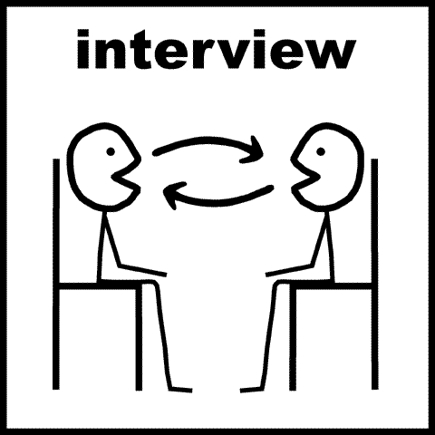

# 开发人员面试指南

> 原文：<https://www.freecodecamp.org/news/how-to-interview-as-a-developer-candidate-b666734f12dd/>

作者:戴夫·史密斯

# 开发人员面试指南

#### 备用标题:如何面试一家公司

你有没有过这样的经历:在一次求职面试中，面试官看着桌子对面说:“你有什么问题吗？”，而你只是回瞪着说，“嗯，我不这么认为”。如果这种情况发生在你身上，很有可能你对面试经历的看法非常片面。

作为一名候选人，可以理解的是，你只关注一个结果:获得工作机会。但是别忘了，工作面试不是单向的。你应该像他们专注于面试你一样专注于面试这家公司。

但是你应该问他们什么呢？

很多求职的开发者都问过我这个问题。在过去的 15 年里，我已经为 7 家公司工作过(包括 2 次实习和 6 个月的初创公司工作)，也面试过十几家公司。我最终决定写下我在这些面试中问的所有问题，希望对其他人有所帮助。

> 旁注:在我们每周的开发者建议播客[软技能工程](https://softskills.audio/)中，我们涵盖了这个主题和许多其他主题。订阅！

我的目标是让这成为一份活的文件。如果你有建议，请[通过 Twitter](https://twitter.com/djsmith42) 让我知道，我会将它们纳入，让每个人受益。

### 你会和谁谈？

面试时，你通常会遇到三个角色。根据公司的规模，这些人可能是一个人，也可能是多个:

*   软件工程师
*   工程经理(技术主管、中层经理、总监)
*   公司领导层(副总裁、首席技术官、首席执行官、部门经理)

我对每个角色都有不同的问题，我将在下面列出。请注意，我有时会向多个角色重复同一个问题，看看他们的回答如何比较。

这是一篇相当长的文章，与其说是通读，不如说是参考。如果我今天去面试，我会带着它，在面试时(谨慎地)参考它。

这些问题大多没有“正确”或“错误”的答案。它们旨在帮助你了解公司、公司文化、流程和组织。它们也可以作为谈话的开始，当你的大脑停止工作时，这在面试中会很有帮助。

出于礼貌，我通常会在面试开始时告诉面试官，我想有一些时间问问题。这将有助于他们做出相应的计划。通常，他们会让我在面试结束时问问题，所以对面试的时间表要敏感，让他们在面试的早期就知道你的意图。在每个问题之后，停下来问问你是否可以继续提问，以及面试官有多少时间。

### 软件工程师的问题

#### 1.你怎么知道每天要做什么？

这个问题的目的是识别功能障碍。我想从 2 到 3 个工程师那里得到答案。如果公司领导说他们遵循某个过程，但是工程师们不谈论这个过程，那就是功能障碍的迹象。如果你从不同的工程师那里得到不同的答案，那是功能障碍的另一个迹象。

在一个高质量的团队中，我会得到一致的答案。每个开发人员都知道这个过程，而且这个过程是轻量级的，足以支持工程师而不是压迫他们。

一个好答案的例子(还有很多其他的):“我们没有 N 周的冲刺，每个工程师承诺交付一组特性和错误修复。每一天，我们都向对方汇报我们承诺的进展。我们有一个了不起的产品经理，他与客户互动，帮助我们优先考虑功能和漏洞修复。”

一个错误答案的例子(还有很多其他的):“我走进办公室，看看有什么火在燃烧。大多数时候，我会被紧急情况打断。”

请注意，我没有提到“Scrum”或任何其他特定的方法。我对公司用于工程过程的标签不感兴趣，更感兴趣的是实际的日常“事情是如何完成的”。

#### 2.你用什么来控制版本？

好的工具是一个好团队的有力标志。如果一个团队正在使用一个古老的修订控制系统，他们可能正在使用一堆其他过时的工具。此外，他们可能不重视通过投资好的工具所能获得的效率收益。

一个好的后续问题是询问工作流。你用树枝吗？你更喜欢重组还是合并(git 术语)？这些问题将告诉你他们对所选工具的熟练程度，这将告诉你他们的熟练程度，进而告诉你如果你接受这份工作会有什么样的结果。例如，您将成为“本地 git 专家”还是向真正的 Linus Torvalds 学习？

这个问题可以引发一场关于工具的讨论，通常会给你一些好的见解。

#### 3.你喜欢在这里工作的什么？

强有力的回答:我从我所做的工作中获得了很多满足感。强有力的回答:我们在工作中有很多乐趣。
有力的回答:我喜欢和非常聪明、友好的同事一起工作。
强有力的回答:管理尊重工程。

好答案越多越好。我不一定要得到以上所有答案才能给公司打高分。请记住，有些人天生不是“多愁善感”的，所以你在这里可能得不到积极的回应，这可能是好的。

但如果我听到以下几种答案，而且很少来自强有力的答案列表，我就会紧张起来:

无力的回答:它支付账单。
弱弱的回答:我不用很努力。
弱答:没有太大的交付压力。
软弱的回答:我犯大错误也没关系。
弱弱的回答:(沉默)

不要认为我在编造那些答案。我确实在真实的采访中听到过。

如果我听到那些无力的回答，我不会自动认为它是一家糟糕的公司，但如果那些是唯一的答案，我通常会去别处看看。

#### 4.你写单元测试吗？

当根据他们的单元测试实践对一个工程团队下结论时，要小心。如果当我问及单元测试时，一个团队变得兴奋起来，这通常是一个好的迹象。尽管另一方面，如果他们不能解释**为什么**他们进行单元测试，或者单元测试的缺点，这可能是盲从教条的表现。如果他们为为什么不写测试提供不好的借口，特别是像“我们没有时间”这样的借口，对我来说是一个不好的信号。

如果工程师告诉我他们编写单元测试，并且他们能够告诉我关于他们测试的度量标准，比如他们运行多长时间，他们有多少测试，以及他们的代码覆盖率，这对于我来说非常有吸引力。这告诉我，他们有好的工具，他们知道如何使用它们。另一方面，如果他们认为 100%的代码覆盖率可以确保一个没有 bug 的代码库，我会持怀疑态度。

我想事先知道我是否会在这家公司从事一个大型的、旧的、未经测试的代码库。这将帮助我管理自己的期望，并决定这是否是我想做的事情。

后续问题:

*   你喜欢单元测试还是集成测试？
*   你有验收测试吗？
*   你使用什么样的测试框架？你喜欢吗？
*   你的单元测试运行需要多长时间？

#### 5.你有持续集成吗？

我所知道的最好的软件开发团队使用像 Jenkins、Travis 和 Buildbot 这样的工具。如果团队没有持续集成，我会尝试判断他们是否熟悉这个概念。如果不是，以我的经验来看，这是一个不好的迹象。拥有持续集成系统意味着团队可能相信自动化，以我的经验来看，这通常是一个非常好的迹象。

对于一些团队来说，这自然会导致关于[持续交付](http://www.amazon.com/Continuous-Delivery-Deployment-Automation-Signature/dp/0321601912)的讨论，这是一个与持续集成相关但不同的概念。如果是一个 web 开发人员的职位，我希望团队至少让**听说过**关于 CD 的事情，而强大的团队倾向于把它放在适当的位置，至少是部分地。

后续问题:

*   当 CI 报告故障时，您的团队需要多长时间来修复故障？
*   对于您的 CI 系统，您喜欢/不喜欢什么？
*   你的 CI 运行需要多长时间？你让他们更快了吗？

#### 6.你衡量什么？

这是一个开放式的问题，意在发现团队是否已经努力去度量他们的软件。对于 web 开发团队来说，答案往往集中在性能指标上，如服务器响应时间、请求吞吐量、用户数量、客户端响应能力等。但是，讨论可以涉及到说不同语言的用户数量、浏览器故障、缓存命中率和未命中率以及无数其他话题。如果团队没有花时间来衡量，这可能是他们没有使用真实数据来通知他们的决策的一个指标。他们可能是不成熟的优化者。我重视使用真实的、测量的数据来做决策的团队，尤其是在绩效方面，但这也适用于许多其他事情。

如果面试官知道这些问题的答案，这是一个好的迹象，表明这个团队是高质量的。如果他们不知道为什么他们会关心这些测量，这可能是一个消极的迹象。

同样，关于教条的规则也适用于此。如果团队似乎抓住了一个不一定能产生有价值的、可操作的信息的指标，并且他们不能让你满意地解释这一点，这可能是一个警告信号。

后续问题:

*   你最重要的产品指标是什么？
*   你使用什么测量系统？(例如， [MixPanel](https://mixpanel.com/) ， [statsd](https://github.com/etsy/statsd) 等。)

#### 7.你是如何发现并修复 bug 的？

一个强大的团队通常有专门的测试人员，团队的开发人员关注质量。一个真正强大的团队拥有令人印象深刻的测试自动化。一些团队对于专门的测试人员或者测试自动化来说太小了，但是这并不一定意味着他们是一个糟糕的团队。当我问这个问题的时候，我在试着感受他们的过程。他们的头发总是着火吗？他们是否有一个合理的流程来查找 bug 并对其进行优先级排序？他们依赖用户发现 bug 吗？

后续问题:

*   你如何区分 bug 的优先级？
*   你用什么 bug 追踪器？(你讨厌它的什么地方)
*   你用 Excel 追踪 bug 吗？( [nooo！)](http://www.nooooooooooooooo.com/)
*   你的 bug 追踪器里有多少 bug？
*   修复您的错误需要多长时间(最短/最长/最长)？

#### 8.你使用什么协作工具？

根据我的经验，高功能团队使用大量的协作工具。他们经常使用聊天服务(Slack，IRC，HipChat，Jabber)，代码审查服务(Gerrit，GitHub，GitLab，Review Board)，当然，还有古老但显老的电子邮件。我在寻找每个开发人员都知道其他开发人员在做什么的指标。我不是在寻找疯狂的细节层次，而是更多的是一种普遍的意识。此外，我喜欢看到与协作工具的集成。最简单的例子是每当自动构建失败时自动发送的电子邮件。web 开发团队的另一个例子是自动错误记录服务，当出现严重错误时，或者当关键指标超过某个阈值时，它会通知团队的聊天室。

#### 9.你用什么框架？

我个人对框架的偏好有两个方面:

1.  我喜欢现代的东西。
2.  我喜欢新鲜的东西。

因此，如果一个团队正在用[主题](https://en.wikipedia.org/wiki/Widget_toolkit)构建一个 [AIX](https://en.wikipedia.org/wiki/IBM_AIX) 桌面应用程序，我可能不感兴趣。但也许你是。这是一个非常个人化的话题，你应该带着对自己偏好的深刻理解来对待它。

不管你的框架偏好如何，理解**为什么**团队选择了他们的框架是很重要的。它们是炒作驱动的吗？他们会像换内裤一样换框架吗？他们的代码库是否散落着每月框架变动的碎片？他们还停留在古老的版本上吗？

关于 **why** 这个话题，我喜欢了解 latitude 开发者在选择技术上有多大的自由度。管理层授权技术选择吗？管理层听从开发人员吗？为了弄清这些问题，我通常会问:“你是如何在你的项目中使用 framework X 的？”。如果开发人员不知道答案，这可能是一个不好的迹象，或者这可能意味着他们对公司来说还不够新，他们没有做出决定。

我喜欢看到团队为他们使用的开源项目做出贡献。这告诉我，他们不仅能够**使用**开源代码，而且他们也足够精通为之做出贡献。这些是我喜欢与之共事的开发人员。如果公司愿意付钱让他们这么做，那就更好了。这告诉我，这家公司明白成为一名开源公民意味着什么。

如果团队在重新发明轮子，而不是使用现成的工具来帮助他们构建产品，我会很紧张。这条规则也有例外。例如，当脸书[正在开发他们自己的框架](https://facebook.github.io/react/blog/2013/06/05/why-react.html)时，我不会因此而反对他们(或者我会这样做)。

#### 10.什么时候可以结对？

如果你想真正清楚地了解和这个团队一起工作是什么感觉，那就试着和他们一起工作。我个人从来没有这样做过，但是我有一个朋友做过(一个可能的故事，对吧)。我认为这是个绝妙的主意。如果你想了解这个团队的任何事情，去和他们一起工作半天。可能需要你签一份 NDA。如果团队愿意考虑这个想法，我认为这是一个非常好的迹象。

你可能需要和管理层的人一起安排，所以这个问题更多的是为了得到开发人员的反应。他们可能会对这种想法感到震惊，认为这不值得向管理层提出。

#### 11.你的下一个截止日期是什么时候？

(供稿:[埃文·法勒](https://twitter.com/evanfarrer)

这个问题旨在告诉你更多关于公司实际遵循的发展过程。这个问题本身并不能提供很多信息，但是当你加上这些问题时，事情就变得有趣多了:

*   谁定的这个期限？
*   你在最后期限前完成了吗？如果没有，为什么没有？

高质量的团队同意并共同致力于最后期限。任意下达的截止日期可能是功能障碍的标志，或者至少是工程师在决定进度时没有发言权。

#### 12.建立一个新的开发环境需要多长时间？

(供稿人:[埃文·法勒](https://twitter.com/evanfarrer))

这个问题有助于衡量公司在开发者体验上投入了多少努力。新开发人员是否需要几小时、几天或几周时间来安装计算机并准备开始编码？是自动的还是手动的？这将告诉你团队在“支持活动”方面的熟练程度，这些活动与编写软件没有直接关系，但有助于支持它。团队认真对待这件事了吗？

一些公司以拥有快速的开发设置过程而自豪，新开发人员可以在第一天就将代码投入生产。这表明该公司非常重视为开发者提供无摩擦的体验。

### 给工程经理的问题

#### 1.你最后一次写代码是什么时候？

我喜欢有很强技术背景的经理。无意冒犯我的 MBA 朋友，但我发现我真正喜欢的经理是那些做过我所做的事情的人。

#### 2.你是如何成为经理的？

我喜欢那些选择成为经理的经理，因为他们真正享受这份工作，并掌握这份工作的诀窍，而不是被迫去做。我也喜欢经理们专注于服务他们的团队。我最喜欢的经理是那些专注于让团队生活得更好，而不是“向上管理”的人。他们视自己为团队的帮助者和保护者。他们有服务的态度，他们认为最重要的工作是让团队成员的工作生活更好。

#### 3.你的工程师如何知道每天要做什么？

因为我问工程师同样的问题，所以我喜欢比较经理的回答，看他们是否匹配。如果不匹配，可能意味着有功能障碍。最糟糕的功能障碍是未被识别的功能障碍。我认为经理的工作就是识别这样的差异并解决它。

#### 4.你的团队目前面临的最大挑战是什么？

他们通常回答说是人手不够。因为这是一个常见且显而易见的答案(他们毕竟在招人)，所以我喜欢问他们的第二大挑战。我在寻找危险信号，比如进度延误、产品质量问题和人际关系紧张。当你看到危险信号时，你会知道的。每个团队都有问题，所以你得到的答案取决于几个因素:

*   经理对问题的意识
*   经理愿意对你坦诚相待
*   团队中问题的严重性

#### 5.你如何衡量个人表现？

一个有经验的经理会有很好的技巧来做这件事。当评估一个团队成员的表现时，最好的经理会仔细收集整个团队的反馈。糟糕的经理会根据自己的观察做出决定，而不会咨询团队。

#### 6.你做正式的绩效评估吗？

我喜欢为重视提供反馈和帮助团队成员提高的经理工作。绩效评估可能是痛苦的，也可能是积极的经历。根据我自己的观察，我认为大多数人认为它们是痛苦的。一个真正伟大的经理会知道这一点，并会采取措施，以某种方式使绩效评估变得伟大，让你印象深刻，并愿意为他们工作。

后续问题:

*   你能告诉我一次你帮助别人提高表现的经历吗？
*   在这些评估过程中，你如何指导员工？

#### 7.你每年都加薪吗？

我想知道我的薪酬将会根据我对公司的贡献进行调整，而且我们至少每年会正式审核一次。对于适用的公司，我喜欢问股权。你会给我股票期权吗？你会每年给我更多的股票期权吗？

一些工程师不喜欢问这样的财务问题。不要这样。工程师通常只花很少一部分时间来思考这些话题，但是经理们一直在进行这些对话。这些问题应该不会让经理感到不舒服:

*   你如何为加薪做预算？
*   你的团队去年加薪的中位数是多少(百分比)？
*   从现在开始一年后，我的薪水会增加多少？最好的情况，最坏的情况？

我问这些问题并不是作为一份签了字的合同或未来加薪的保证。而是想了解公司是怎么运作的。我需要特意去要求加薪吗，还是已经有了标准流程？

#### 8.我能得到一些描述公司福利的带回家的材料吗？

(供稿:[埃文·法勒](https://twitter.com/evanfarrer)

我想大多数人已经知道要问这个问题，但为了完整起见，还是值得一提。大多数公司都准备给你一堆描述公司利益的文件或网站。了解这一点很重要，因为这通常是你薪酬的很大一部分。这可能只适用于美国。我不确定公司提供的医疗保险激励措施在其他国家是如何运作的。

#### 9.你会给员工排名吗？

(供稿:[马特·莱恩](https://twitter.com/mattvryan)

一些公司决定加薪和奖金(这不是我瞎编的)的方式是在一个大的排序列表中排列每个员工，从最好到最差，然后强迫一定比例的员工进入“好”、“一般”和“坏”子列表。

我从没见过喜欢这个的工程师。这在大公司中尤为普遍。它可以影响你如何与你的同龄人交往，因为你知道有一天你将不得不和他们争夺金钱。

当我遇到这种情况时，它可能不会立即意味着这家公司是一个糟糕的工作场所。在这样的公司里，经常会有一些令人敬畏的小东西“在雷达下飞行”。询问面试官对这个系统的看法。有些经理会很坦率地说出他们不喜欢这个系统，有些人甚至会告诉你他们为了团队的利益而“玩弄”这个系统的策略。如果你找到这种类型的经理，你可能会忽略排名系统。

记住，也不是每个人都讨厌这个系统。没遇到喜欢的人，不代表不存在。

跟进问题:

*   你真的认为你的员工中有 X %是“坏”的吗？这说明了你的招聘流程是怎样的？(这是一个大胆的问题——小心行事)
*   你会运用某种曲线来决定最佳表现者吗？
*   你用什么标准给员工排名？
*   您如何知道这些指标是准确收集的？
*   你如何知道这些指标实际上确定了最佳表现者？

要了解更多信息，这里有来自马特·莱恩的一个很好的分析。

#### 10.你定期做团队回顾吗？

(供稿:[王高·帕金森](https://medium.com/@aric.parkinson))

如果有，他们是什么样的？你多久收到一次团队成员的反馈？你上一次根据收到的反馈改变管理团队的方式是什么时候？

这些问题会让你感觉到你期望管理层的反应有多快，以及团队是否向管理层提供了很多反馈。

如果没有进行回顾，团队就很难发现问题，更不用说改变方式来纠正它们了。如果经理觉得他们没有收到关于团队如何变得更好的反馈，那么他们可能对团队的问题充耳不闻，或者营造了一种人们不放心说出问题的氛围。

### 向领导提问

我并不总是有机会与公司的高层领导交谈，尤其是对于较大的公司，但当我这样做时，我会把它作为评估公司财务可行性的机会。我真的没有资格做这个，但是有些明显的问题，我有时候在面试中也能发现。此外，我喜欢知道自上而下的文化是什么样的，因为这些信息可以告诉我公司如何评价其工程师，包括积极和消极的方面。

#### 1.你是如何得到资助的？

我在努力洞察公司背后的金钱。如果它们是由风险资本、私募股权、公共股票或通过税收自筹资金资助的，我想知道。通常我可以很容易地在面试前发现这一点，但公司领导经常会增加一些我无法通过谷歌或 [CrunchBase](http://crunchbase.com/) 找到的见解。

#### 2.你盈利了吗？

如果有利可图，太好了！如果不盈利，你的盈利计划是什么？一些创业公司对此有计划，而另一些则通过收购或 IPO 寻找出路。

后续主题:

*   过去几个季度/几年的历史收入。它呈上升趋势吗？
*   竞争、意外支出和意外收入不足等盈利风险。
*   Runway:在筹集更多资金之前，公司还能运营多久？

#### 3.你对外包有什么看法？

我想知道我申请的工作是否有可能在未来被外包，或者这份工作是否会变成管理外包工程师的职位。

我这里说的不仅仅是离岸外包。这也包括承包商。

#### 4.说说公司文化吧。

这是我用来调和工程师观点和领导观点的另一个问题。我在寻找差异作为功能障碍的标志。如果领导和工程在同一页上，这表明良好的自上而下的沟通。我想知道高层领导是否脱离了基层员工。我还想看看领导层是否有经过良好沟通的坚实愿景。我最喜欢为之工作的公司拥有强大的、共同的愿景。

一些公司非常重视文化，这可能是一件好事。至少你会清楚公司看重什么。对于其他公司，你必须通过隐含的，有时是不言而喻的细微差别来发现它。文化可能非常重要。有没有政治内斗？职业素养受重视吗？诚信受重视吗？加班有价值吗？

#### 5.你有什么把握这家公司会成功？

带着这个问题，我在寻找真实的证据，而不仅仅是营销炒作。如果高层领导给我实际的数字，比如收入、市场规模和资本总额，这是一个好迹象。此外，如果我能从其他来源核实这一信息，这是一个更好的迹象。另一方面，这些数字可能表明一些非常糟糕的事情，比如一个月的跑道没有资金。

#### 6.告诉我你的报告结构。

对我来说，这个问题的最佳答案很简单。如果这个人能画出一个简单的组织图来解释报告结构，我就满意了。我个人倾向于为小而灵活的公司工作，组织和沟通开销最小。你的偏好可能不同，这没关系。无论您的偏好如何，这个问题旨在为您提供所需的信息，以便您对公司做出明智的决策。

### 结论

面试是双向的。如果你有幸得到一份工作，确保你从经验中获得做出明智决定所需的一切。祝你好运！