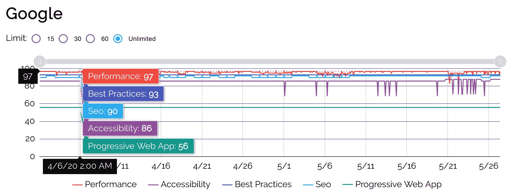
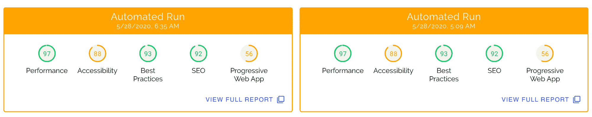
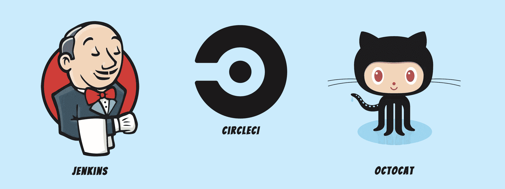

# 如何保存灯塔报告的历史记录

> 原文：<https://www.freecodecamp.org/news/how-to-keep-a-historical-record-of-lighthouse-reports/>

Lighthouse 是谷歌 Chrome 团队的一个开源项目。它用于根据一套现代的“以用户为中心”的指标来分析网页质量。

当支持依靠有机搜索结果获取收入的网站时，质量至关重要。性能、可访问性和一般 SEO 最佳实践是搜索引擎排名的主要因素。

Lighthouse 提供了一组粒度指标，代表这些因素和报告中的改进建议。

运行 Lighthouse 的方式有很多种，但在现实世界中，您可能希望定期比较报告，尤其是在持续变化的工作流中。也就是说，你可能想知道- **我如何跟踪 SEO、性能和可访问性随时间的变化**？

这篇文章讲述了如何使用[自动化灯塔检查](https://www.foo.software/lighthouse)来分析网站质量。但是请记住，还有许多其他的[灯塔集成](https://github.com/GoogleChrome/lighthouse#lighthouse-integrations)可供选择。

## 在时间线中保存报告和查看结果

[Lighthouse scoring](https://developers.google.com/web/tools/lighthouse/v3/scoring) 是该工具的一个有趣的方面，一开始可能会觉得有点脏。不过，在查看历史数据时，这仍然是一个非常有用的比较点。

特别是性能类别，它的分数计算非常复杂，你可以在 web.dev 上找到很多关于这个主题的优秀读物。

自动化灯塔检查提供了一种手动触发审核或建立一个全天自动运行的计划的方法。这些审计保存在数据库中，因此您可以在历史水平上可视化和分析结果。实际上，您可以及时深入任何报告，查看全部细节([参见此处的示例](https://www.foo.software/dashboard/page/5d1d459641e33a002f256efc))。

关于自动灯塔检查的入门指南，[参见文档](https://www.foo.software/automated-lighthouse-check-getting-started/)。

Timeline view of Lighthouse scores

A historical list of Lighthouse audits

## DevOps 的灯塔自动化

不仅有许多有用的基于云的 Lighthouse 工具，还有许多可以在各种 DevOps 工作流中实现的开源项目。其中一些解决方案支持某种形式的数据持久性，以便进行历史跟踪。

下面是我参与的几个例子。

*   这篇文章讲述了如何在 CircleCI 使用 Lighthouse。您可以将报告保存为 CircleCI 中的“工件”,或者自动上传到 AWS S3。
*   这篇文章讲述了如何在 GitHub 操作中使用 Lighthouse。该解决方案还提供了一种将报告保存为“工件”(在 GitHub 中)或自动上传到 AWS S3 的方法。
*   [Lighthouse Persist 是一个 NPM 包](https://www.npmjs.com/package/@foo-software/lighthouse-persist)，它公开了原生的 Lighthouse API，并提供了额外的选项来设置 AWS S3 凭证，因此它可以用于自动上传报告。

A few friends - Octocat, Jenkins, CircleCI

## 结论

我希望这篇文章有助于提供分析网站历史质量的解决方案。通过购买当地开发者的软件来帮助支持他们？

但是严肃地说，我喜欢任何关于自动灯塔检查的反馈...评论、建议、功能请求等。在撰写本文时，它已经有大约一年的历史了，最近已经迁移到 Kubernetes 以实现高可用性。

自动灯塔检查提供[免费和额外收费计划](https://www.foo.software/pricing)。