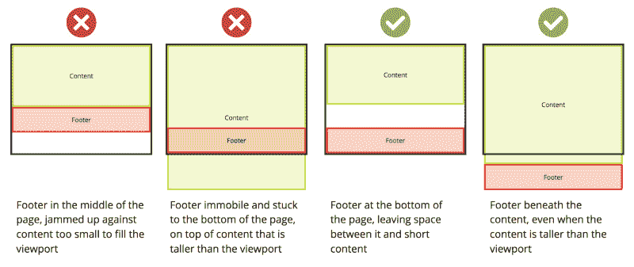

# 如何让你的页脚留在它该在的地方？

> 原文：<https://www.freecodecamp.org/news/how-to-keep-your-footer-where-it-belongs-59c6aa05c59c/>

页脚是页面上的最后一个元素。至少它在视窗的底部，或者如果页面内容比视窗高，它会更低。简单吧？？

当处理包含页脚的动态内容时，有时会出现页面内容不足以填充页面的问题。页脚，而不是停留在页面底部我们希望它停留的地方，上升并在其下方留下一个空白。

作为一个快速解决方案，您可以将页脚绝对定位在页面的底部。但这也有其不利的一面。如果内容变得比视窗更大，那么无论我们是否希望，页脚都会“粘”在视窗的底部。

这显示了我们不想要和想要的行为:



让我们来看看实现这一点的方法。

#### 控制你的页脚

`index.html`:

```
<!DOCTYPE html>

<html>
 <head>
   <link rel="stylesheet" type="text/css" href="main.css" />
 </head>

<body>
 <div id="page-container">
   <div id="content-wrap">
     <!-- all other page content -->
   </div>
   <footer id="footer"></footer>
 </div>
</body>

</html>
```

`main.css`:

```
#page-container {
  position: relative;
  min-height: 100vh;
}

#content-wrap {
  padding-bottom: 2.5rem;    /* Footer height */
}

#footer {
  position: absolute;
  bottom: 0;
  width: 100%;
  height: 2.5rem;            /* Footer height */
}
```

那么这是在做什么？

*   `page-container`环绕页面上的所有内容，并将其最小高度设置为视窗高度的 100%(`vh`)。由于它是`relative`，它的子元素稍后可以基于它设置`absolute`位置。
*   `content-wrap`有一个底部填充，是页脚的高度，确保在容器中为页脚留出足够的空间。这里使用的包装`div`将包含所有其他页面内容。
*   将`footer`设置为`absolute`，贴在它所在的`page-container`的`bottom: 0`上。这很重要，因为它不是视窗的`absolute`，但是如果`page-container`比视窗高，它会向下移动。如上所述，它的高度，这里任意设置为`2.5rem`，用于它上面的`content-wrap`。

现在你知道了。你的页脚现在停留在你期望的地方！

#### 最后润色

当然，这是 CSS，所以如果没有一些[移动特定的 UX 考虑](https://nicolas-hoizey.com/2015/02/viewport-height-is-taller-than-the-visible-part-of-the-document-in-some-mobile-browsers.html)，以及[使用`min-height: 100%`而不是`100vh`的替代方法](https://matthewjamestaylor.com/blog/keeping-footers-at-the-bottom-of-the-page)，它就不完整。但是这也有它自己的缺点。

Flexbox(带 flex-grow)或者 Grid 也可以，都很强大。

选择哪种方法完全取决于您和您的设计细节。希望上面的例子和链接能帮助你在做决定和实施时节省一些时间。

感谢阅读。以下是我最近写的一些其他东西:

*   [亚马逊弹性容器服务入门指南](https://medium.freecodecamp.org/amazon-ecs-terms-and-architecture-807d8c4960fd)
*   [测试与 Jest 和酶的反应](https://medium.com/@dfrase/testing-react-with-jest-and-enzyme-20505fec4675)