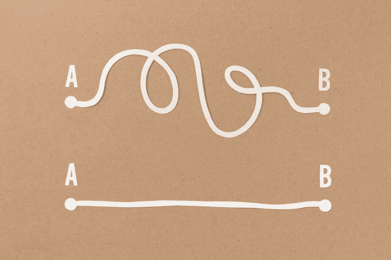

# 如何让你的 JavaScript 代码简单易读

> 原文：<https://www.freecodecamp.org/news/how-to-keep-your-javascript-code-simple-and-easy-to-read-bff702523e7c/>

阿瑟·阿拉基良

# 如何让你的 JavaScript 代码简单易读



解决同一个问题的方法有很多，但有些解决方法很复杂，有些甚至很可笑。在这篇文章中，我想谈谈同样问题的坏的和好的解决方案。

让我们从需要从数组中删除重复值的问题开始。

#### **复杂-使用 forEach 删除重复项**

首先，我们创建一个新的空数组，然后我们使用 [**forEach()**](https://developer.mozilla.org/en-US/docs/Web/JavaScript/Reference/Global_Objects/Array/forEach) 方法为每个数组元素执行一次提供的函数。最后，我们检查新数组中是否不存在该值，如果不存在，我们就添加它。

```
function removeDuplicates(arr) {     const uniqueVals = [];      arr.forEach((value,index) => {            if(uniqueVals.indexOf(value) === -1) {           uniqueVals.push(value);       }     });  return uniqueVals;}
```

#### **简单——使用过滤器删除重复项**

[**filter**](https://developer.mozilla.org/en-US/docs/Web/JavaScript/Reference/Global_Objects/Array/filter) 方法创建一个新数组，其中所有元素都通过了由所提供的函数实现的测试。基本上，我们迭代数组，对于每个元素，检查该元素在数组中的第一个位置是否等于当前位置。当然，对于重复元素，这两个位置是不同的。

```
function removeDuplicates(arr) {  return arr.filter((item, pos) => arr.indexOf(item) === pos)}
```

#### **简单-使用集合**删除重复项

ES6 提供了 [**Set**](https://developer.mozilla.org/en-US/docs/Web/JavaScript/Reference/Global_Objects/Set) 对象，这让事情变得简单多了。 **Set** 只允许唯一的值，所以当你传入一个数组时，它会删除任何重复的值。

但是，如果您需要一个具有唯一元素的数组，为什么不从一开始就使用 **Set** ？

```
function removeDuplicates(arr) {   return [...new Set(arr)];}
```

让我们继续解决第二个问题，它要求我们编写一个函数，该函数接受一个不同的非负整数数组，使它们连续，并返回缺失数的计数。

对于`const arr = [4, 2, 6, 8]`，输出应为
`countMissingNumbers(arr) = 3`

如你所见，`3`、`5`和`7`都不见了

#### **使用排序和 for 循环求解复杂问题**

为了获得最小和最大的数字，我们需要对 [**和**](https://developer.mozilla.org/en-US/docs/Web/JavaScript/Reference/Global_Objects/Array/sort) 进行升序排序，为此，我们使用了`sort`方法。然后我们从最小的数字到最大的数字循环。每次，我们检查一个序列号是否存在于数组中，如果不存在，我们增加计数器。

```
function countMissingNumbers(arr) {    arr.sort((a,b) => a-b);        let count = 0;        const min = arr[0];        const max = arr[arr.length-1];    for (i = min; i<max; i++) {      if (arr.indexOf(i) === -1) {          count++;               }          }            return count;}
```

#### **简单-使用 Math.max 和 Math.min 求解**

这个解决方案有一个简单的解释:函数`[**Math.max()**](https://developer.mozilla.org/en-US/docs/Web/JavaScript/Reference/Global_Objects/Math/max)`返回数组中最大的数字，函数`[**Math.min()**](https://developer.mozilla.org/en-US/docs/Web/JavaScript/Reference/Global_Objects/Math/min)`返回数组中最小的数字。

首先，我们发现如果没有丢失的数字，数组中会有多少个数字。为此，我们使用下面的公式`maxNumber - minNuber + 1`，这个结果和数组长度之间的差将给出缺失数的计数。

```
function countMissingNumbers(arr) {      return Math.max(...arr) - Math.min(...arr) + 1 - arr.length;}
```

最后一个我想拿来作为例子的问题是检查字符串是否是**回文**。

**A **回文**是一个从左到右和从右到左读起来都一样的字符串。*

#### **使用 for 循环进行复杂检查**

在这个选项中，我们从第一个字符开始遍历字符串，直到字符串长度的一半。字符串中最后一个字符的索引是 string.length-1，倒数第二个字符是 string.length-2，依此类推。所以这里我们检查从开始的指定索引处的字符是否等于结尾的指定索引处的字符。如果它们不相等，我们返回 false。

```
function checkPalindrome(inputString) {    let length = inputString.length   for (let i =0; i<length / 2; i++) {        if (inputString[i] !== inputString[length - 1 -i]) {             return false                }   }  return true}
```

#### **使用反向和连接进行简单检查**

我认为这个简单的解决方案不需要解释，因为它不言自明。我们简单地使用 [**扩展操作符**](https://developer.mozilla.org/en-US/docs/Web/JavaScript/Reference/Operators/Spread_syntax) 从字符串创建一个数组，然后 [**反转**](https://developer.mozilla.org/en-US/docs/Web/JavaScript/Reference/Global_Objects/Array/reverse) 该数组，然后使用 [**join**](https://developer.mozilla.org/en-US/docs/Web/JavaScript/Reference/Global_Objects/Array/join) 方法再次将它转换成一个字符串，并将其与原始字符串进行比较。

```
function checkPalindrome(string) {   return string === [...string].reverse().join('');}
```

#### 保持简单！

有更简单的方法为什么要复杂化？我希望你觉得这篇文章很有趣。祝你有美好的一天，尽量不要把生活中简单的事情复杂化:)

谢谢你的掌声？