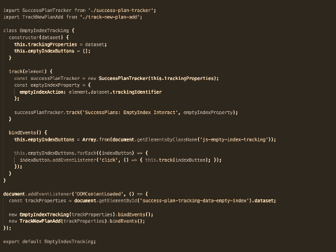

# 如何保持 JavaScript 代码简单并增加其可读性

> 原文：<https://www.freecodecamp.org/news/how-to-keep-your-javascript-code-simple-and-increase-its-readability-94d6a949afc4/>

作者莱昂纳多·利马

# 如何保持 JavaScript 代码简单并增加其可读性

在几年几乎只使用 Ruby on Rails 和一些 jQuery 的工作之后，我将注意力转向了前端开发。我发现了 JavaScript ES6 语法的美妙之处，以及 React 和 Vue 等令人兴奋的现代库。我开始只使用 ES6 普通 JavaScript 实现新特性，并立即爱上了所有这些新的类抽象和箭头函数。

如今，我正在生成大量的 JavaScript 代码。但是，因为我认为自己是一个 JavaScript 学徒，所以还有很大的改进空间。通过我的研究和观察，我了解到即使使用了 ES6 中的语法糖，如果你不遵循主要的 [SOLID](https://hackernoon.com/solid-principles-made-easy-67b1246bcdf) 原则，你的代码很有可能变得难以阅读和维护。

为了演示我所说的，我将带你经历一次精彩的代码审查会议，这是我上周和我的一个朋友一起进行的。我们将从一个 35 行的 JavaScript 类开始，并以一个漂亮的 11 行代码片段结束，该代码片段仅使用了巧妙的函数。有了耐心和韧性，你将能够观察并应用这个模式到你自己的代码库中。

Refactoring process featured in this arcticle

### 该功能

我需要做的事情非常简单:从页面中获取一些信息，并向第三方跟踪服务发送请求。我们在客户端构建了一个事件跟踪器，并跟踪一些页面动作。

下面的代码示例使用不同的代码设计策略实现了相同的任务。

#### 第一天——使用 ES6 类语法(也称为对象原型模式包装器)

您可以注意到上面我启动了 smart:隔离通用跟踪器`SuccessPlanTracker`以便在空索引之外的另一个页面中重用。

但是，等一下。如果这是一个空的指数追踪器，那这个外国人`TrackNewPlanAdd`到底在那里做什么？

#### 第二天——去除类样板代码

好了，现在文件名清楚地反映了特性责任，看，没有更多的`EmptyIndexTracker`类给我们更少的样板代码。这里了解更多[，这里](https://gist.github.com/indiesquidge/f8c486795d7dd455c0327ce7e0aa8c16)了解更多[。我们使用简单的函数变量，伙计，使用那些闪亮的](https://www.accelebrate.com/blog/javascript-es6-classes-and-prototype-inheritance-part-1-of-2/) [ES6 对象散布](https://developer.mozilla.org/en-US/docs/Web/JavaScript/Reference/Operators/Spread_operator)点是多么好的捕捉。

我发现 [querySelectorAll](https://developer.mozilla.org/en-US/docs/Web/API/Element/querySelectorAll) 方法已经返回了一个列表，所以我们能够从`Array.from(document.getElementsByClassName('js-empty-index-tracking')) `.`中移除`Array.from()`函数。记住 [getElementsByClassName](https://developer.mozilla.org/en-US/docs/Web/API/Element/getElementsByClassName) 方法返回一个对象。

此外，由于核心职责是绑定 HTML 元素，`document.addEventListener('DOMContentLoaded')`函数调用不再属于文件。

干得好！

#### 第三天——去除 ES5 旧的实践，进一步分离责任。

如果你仔细观察，上面的代码中没有`SuccessPlanTracker`类——它遭受了与旧的`EmptyIndexTracker`相同的命运。阶级杀戮的心态一旦形成，就会自我扩散和繁殖。但是不要害怕，我的好孩子。

记住，总是尽量保持 JavaScript 文件简单。不需要知道类实例的状态，而且这些类实际上只公开了一个方法。

你不认为使用 ES6 类抽象有点过头了吗？

你还注意到我从文件顶部移除了变量实例吗？这个实践重新挂载到了 ES5，现在我们已经有了 ES6+语法，所以不需要太担心它了。

最后，第三个版本的最后一个主要变化。我们的空索引跟踪器绑定器现在只做一件事:元素绑定。

遵循这些步骤使代码非常接近单一责任原则——最重要的坚实原则之一。

#### 第 4 天——避免 DOM 草率操作

嘿，现在有更多的线了，你这个骗子！

问题是我们的第三个版本有点破损。我们在第`properties.emptyIndexAction = button.dataset.trackingIdentifier;`行不恰当地改变了 DOM 元素数据集。

一个按钮的属性被传递给另一个按钮，生成混乱的跟踪事件。为了解决这种情况，我们通过创建自己的作用域方法`trackAction()`，将绑定循环中的`emptyIndexAction`属性分配给适当的函数。

通过添加这些额外的行，我们改进了代码，更好地封装了每个动作。

#### 最后，总结并写下

*   如果你想设计和编写精彩的代码，你需要愿意进一步探索，超越适当的现代语法的限制。
*   即使你的代码的第一个版本简单易读，也不一定意味着这个系统有一个好的设计，或者它遵循了至少一条[坚实的](https://hackernoon.com/solid-principles-made-easy-67b1246bcdf)原则。
*   接受建设性的代码评审并让其他开发人员指出你可以做得更好是很重要的。
*   为了让你的代码简单，你需要想得更大。

非常感谢您阅读这篇文章。有没有另一个重构的例子或者代码评审的经验可以分享？请在下面留言评论！还有，你可以通过鼓掌和分享来帮助我和其他人分享这个信息。

**ProTip to-go** :这里有一个非常有用的 ES6 (ES2015+) [备忘单](https://devhints.io/es6)

**为 [@anderson06](https://github.com/anderson06) 干杯，因为他是这么好的代码伙伴，给了我很棒的反馈。*