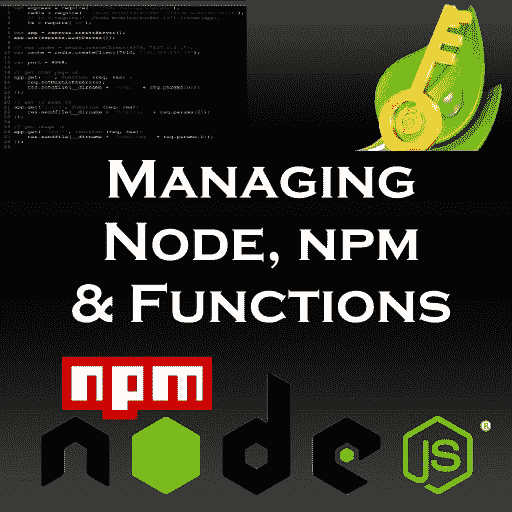

# 如何在管理节点中的 NPM 和函数时保持理智

> 原文：<https://www.freecodecamp.org/news/how-to-keep-your-sanity-while-managing-npm-functions-in-node-9a5889cce80d/>

作者泰德·格罗斯

# 如何在管理节点中的 NPM 和函数时保持理智



### 介绍

在我的职业生涯中，我浏览了数百篇关于 NodeJS 的文章和许多完整的 NodeJS 示例，或者是典型的 MEAN 堆栈，或者是使用各种 NPM 模块的特定示例。用 NodeJS 编写的一个不可或缺的部分是使用 NPM 或 Yarn 来安装完成某些事情的库。举一个所有节点程序员都知道的例子，有 Express-Passport-JWT-Mongo NPM 库。

我们都知道堆栈不会就此停止。Express 可能还需要安装“body-parser”和“cors”，可能还需要安装 sub Express NPM 模块。不要忘记 Lodash，下划线，Moment…这个列表还在继续，因为有成千上万的 NPM 模块可以使用。

### 以合理的方式维护 NPM 模块结构

通常，当您在搜索中检查代码片段或系统，或者编写自己的代码时，每个文件都将包含该特定文件所需的模块。以下代码片段摘自网上的真实代码片段:

*   *请注意，对于这些示例,“var”应根据正在执行的操作替换为“let”或“const”。*

```
var express = require('express');var path = require('path');var favicon = require('serve-favicon');var logger = require('morgan');var bodyParser = require('body-parser');
```

那么另一个文件可能会以:

```
var morgan = require('morgan');var mongoose = require('mongoose');var passport = require('passport');
```

第三个文件将以如下开头:

```
var mongoose = require('mongoose');var Schema = mongoose.Schema;var bcrypt = require('bcrypt-nodejs');
```

你可以想象其余的文件，通常有很多，甚至在微服务中，它们看起来是怎样的。

更糟糕的是，您还可以在文件中间找到*‘require’*。换句话说，代码可以有很多行，突然编码者会引入另一个 NPM 模块。这通常发生在没有经验或缺乏组织的编码人员身上，但这是一种非常普遍的做法，会严重影响对代码的理解和调试。

正如你所看到的，问题在于过多的 NPM 模块迟早会给维护系统带来巨大的麻烦，特别是在一个程序员团队中，他们需要知道哪些已经安装，哪些可用，哪些没有。

节点程序员因安装、测试和丢弃 NPM 模块而臭名昭著，(我承认是其中之一)。问题当然是，如何保持理智，秩序，最重要的是控制已安装的 NPM 模块和调用它们的通用方法。

幸运的是，Node 提供了一种相当简单的方法来处理这些问题。下面是我为后端团队处理堆栈使用的一种方法。它使事情井然有序，易于查找，并且每个人都知道系统中安装了什么和没有安装什么。它还允许在不再需要 NPM 模块时进行干净卸载。

如果你是一个“函数式”程序员，换句话说，并不是所有的东西都必须是面向对象的，比如类和“this->”，下面的内容实际上可以让你重新考虑使用函数和存储过程的全新方法。

我的建议是在您的根项目目录下创建一个目录。我通常把这个目录叫做*“env”*，但是你可以随便叫它。*“env”*是我保存所有函数库和存储过程的地方，包括(如果使用的话)*“dotenv”*NPM 库所需的环境文件。(环境变量可以保存在任何地方，它们不需要保存在根项目目录中。然而，关于环境变量和“dotenv”的讨论将在另一篇文章中讨论。)换句话说，您的 *"env"* 目录应该只包含部分系统需要或访问的文件。

在根目录下的 *"env"* 目录下，创建一个名为 *"helperMods.js"* 的文件。(同样，您可以随意命名该文件。)此外，如果您的系统将使用许多 NPM 模块，或者那些仅用于开发目的的模块(如“chalk”)，您可能希望将它分成两个或三个文件。然而，对于我们的简单例子，我们将使用一个文件。

```
module.exports = {    request: require("request"), //used for request http    fs: require('fs'),    path: require('path'),    chalk: require('chalk'),    moment: require('moment'),    express: require('express'),    session: require('express-session'),    eJWT: require('express-jwt'),    bodyParser: require('body-parser'),    cors: require('cors'),    passport: require('passport'),    passportLocal: require('passport-local'),    crypto: require('crypto'),    dotenv: require('dotenv'),    jwt: require('jsonwebtoken'),    jwtclaims: require('jwt-claims'),    redis: require('redis'),    mongodb: require('mongodb'),    mongoose: require('mongoose'),    assert: require('assert'),    shortid: require('shortid'),    badWords: require('bad-words'),    enum: require('enum'),    errorHandler: require('errorhandler'),    morgan: require('morgan')};
```

首先，安装您想要使用的 NPM 模块，例如:

```
npm i jsonwebtoken --s
```

现在决定该模块的调用者。例如，在上面的文件中，jsonwebtoken 首先被定义为“jwt”。然后需要您安装的实际模块。因此，该行将读作:

```
jwt: require('jsonwebtoken'),
```

(末尾的逗号是由于文件的 JSON 格式。)

该文件中需要注意的事项如下:

1.保持你的称呼清晰。

2.不管你在上面看到了什么，我会按照名字或者 NPM 模块的字母顺序来排列。

3.同样要记住，即使它是一个内置的 NodeJS 模块，比如“crypto”(是的，“crypto”现在终于是内部 NodeJS 的一部分)或者“request”，你也需要它。

4.事实上，如果您确实需要许多“本机”模块，您可以将它们分成文件，这些文件都可以从您运行的每个文件的前几行中调用。

5.记住，“命名空间”可以防止你将一个模块加载到内存中两次。一旦你在你需求中调用了这个模块，即使你从另一个文件中再次调用它，它也不会占用更多或者“复制”内存。

一旦有了文件设置，从任何文件调用的方法都相当容易。

您设置或使用的每个文件都应该以两行(或更多行)开始，这取决于您需要的模块。例如:

```
"use strict";const helpMods = require("./env/helperMods");
```

上面的这些行将需要你的文件中的所有模块。然后，使用点符号调用它们就成了一种简单的方法。

例如，如果您需要调用 badWords 模块，您的点符号将如下所示:

```
helpMods.badWords.(do whatever needs to be done normally here)
```

如果您忘记了 helpMods，像 WebStorm 这样的 IDE 会向您抛出一个错误警告，指出不需要该模块，它会立即告诉您忘记了正确的点符号，或者忘记了将该模块包含在主导出文件中。

### 以合理的方式维护用户功能

同样，在查看许多示例时，您会在文件中找到函数。很多时候，这些功能是“一次性”的，换句话说，专门用于不会重复的非常具体的情况。还是会？

多年的经验告诉我，一旦你有一个函数正确运行，你很有可能会在另一个文件中再次使用它。也许参数可能不同，或者您可能需要添加它接收到的参数(使用好的 IDE 很容易做到)，*但是您很可能会再次使用它*。

为此，我在*“env”*目录中维护了一组函数库。我通常会尝试将这些功能划分成逻辑结构。例如，所有 CRUD 和其他 DB 活动都将放入一个函数库文件中。所有的安全功能将进入另一个。这只是一个建议。

这种类型的程序做什么:

*   让您和您的团队控制环境。
*   在每个文件中反复减少特定模块的需求。
*   授予对 NPM 模块的即时访问权限，您可能认为在文件中不需要这些模块。
*   使用标准点符号，没有任何变通办法。
*   允许你以任何你认为合适的方式划分你的结构，包括在函数文件中调用函数等等。以这种方式。然而，函数文件并不是以相同类型的结构编写的。您将需要:

```
"use strict";const helpMods = require("./env/helperMods");
```

**以及您决定的任何其他模块文件。**

对于这个例子，我们将使用几个函数，按照系统的顺序进行分类，然后编写并定义所有函数，包括回调、承诺或异步/等待。让我们把这个文件叫做 *"generalFuncs.js"* 虽然每个函数都有一个名字。

```
Function(getExactTime(passed params go in here){/do stuff in here}
```

```
Function(logFile(passed params go in here){//do stuff in here}
```

根据需要向该文件中添加任意数量的函数。**所以，在函数文件的末尾你应该写:**

```
module.exports = {getExactTime, logfile, HTMLResponse, getRemoteConnect, doesKeyExist, generateUniqueKey, restartAll, createDateFromString};
```

上述内容将允许这些函数以点符号的形式存在于任何文件中，您可以添加以下内容:

```
"use strict";const helpMods = require("./env/helperMods");const generalFuncs = require (../env/generalFuncs");
```

现在，当您使用函数“getExactTime”时，您可以按如下方式访问它:

```
generalFuncs.getExactTime(whatever is needed goes here);
```

作为一个好的 IDE 的附加功能，你可以看到哪些函数没有被导出，因为它们在任何系统中都是不需要的。

### 结论

上述方法将允许您保持对系统中正在使用的东西的控制和理解。函数文件将允许在任何需要的时候重构函数。点符号将允许你以简单有序的方式调用模块或函数。

它确实在您的目录结构中增加了一个层次，这可能会使您疯狂地从其他子目录中访问它们，除非您确切地知道 Node 如何处理目录结构(无论如何您应该知道)。如果你不想这样做，你可以把它们放在你的应用程序根目录下。

顺便说一下，这些都不会干扰 GitHub 版本或版本控制。事实上，检查、重构和测试将变得更加容易。单行只能标记给开发系统，其他只能标记给生产系统。

如果你能围绕这种编码风格，至少在模块和可能的功能方面，你会发现你的代码更干净，更容易阅读，对整个团队可用&更容易重构。

________________________________________________________

关于作者:Ted Gross 担任 CTO 多年，擅长数据库技术、NodeJS、MongoDB、加密、PHP 和 OOP。他擅长虚拟世界技术和增强现实。他还发表了许多关于技术主题的文章，特别是关于大数据和混沌理论的文章(在专业期刊和在线@ Medium & LinkedIn 上)。他也是文学小说、儿童书籍和各种非小说文章的作者 。他的短篇小说集 [*【古代故事、现代传说】*](http://www.amazon.com/Ancient-Tales-Modern-Legends-Collection/dp/1469901714) 获得了极好的评价。

可以通过电子邮件联系到泰德:tedwgross@gmail.com；[推特](https://twitter.com/tedwgross)(@ tedw gross)；[LinkedIn](http://il.linkedin.com/in/tedwgross)；[中等](https://medium.com/@tedwgross)