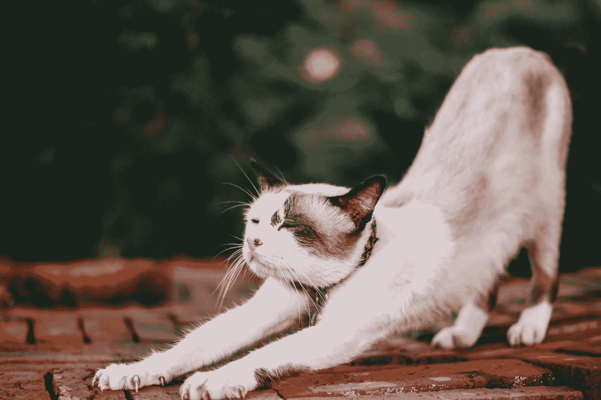
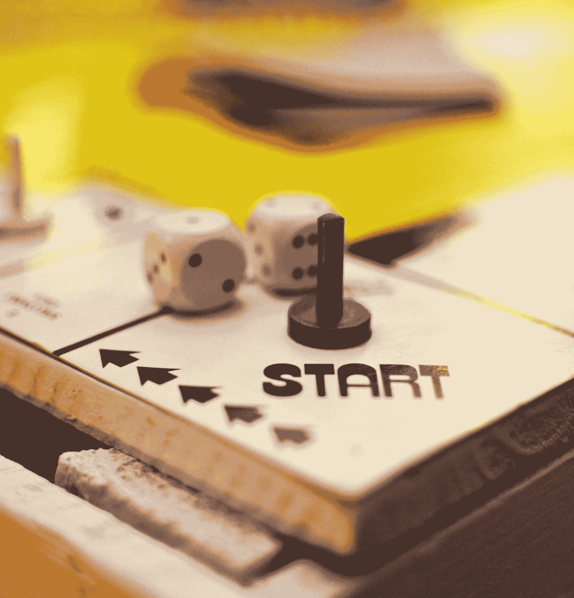
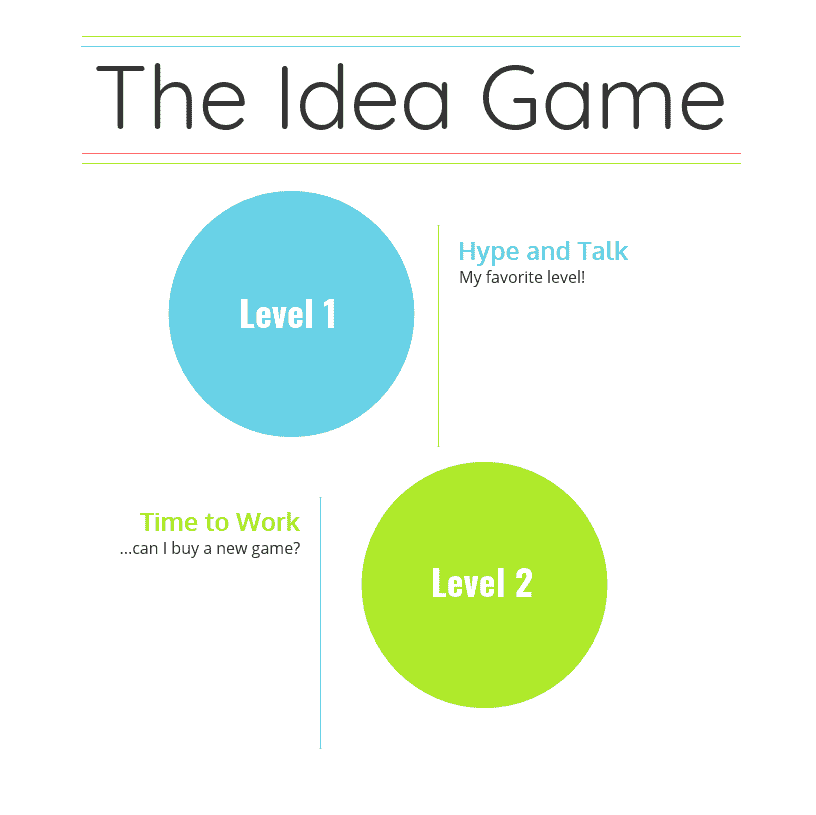
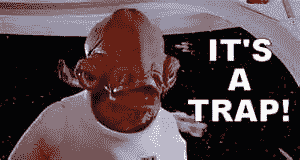
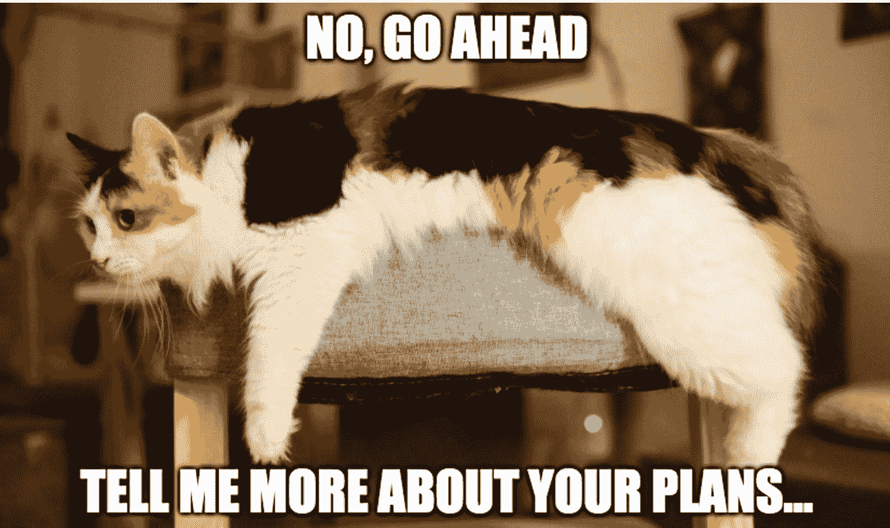
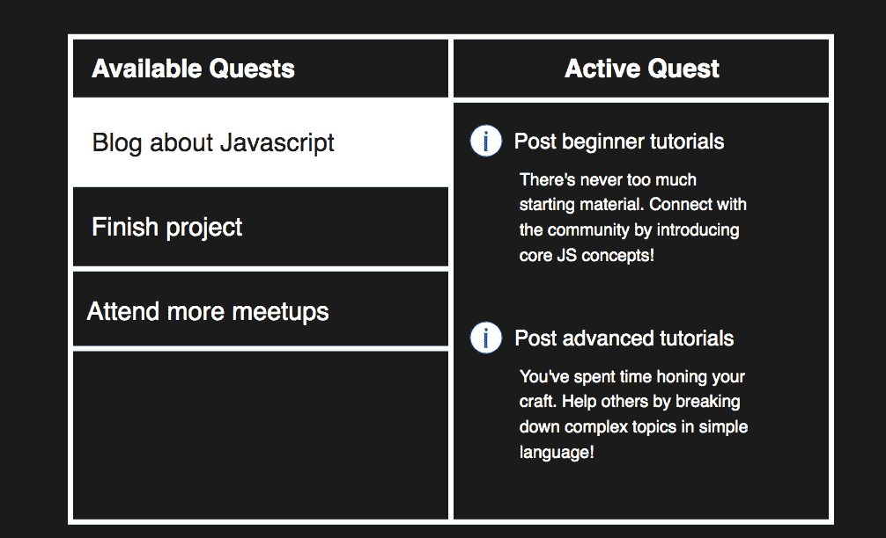
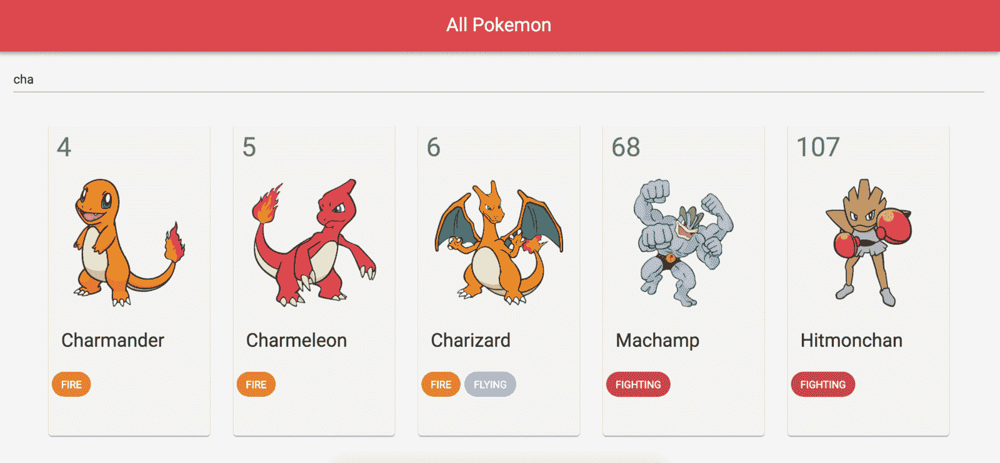
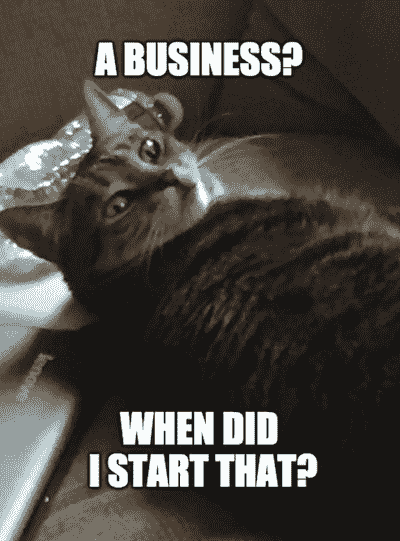
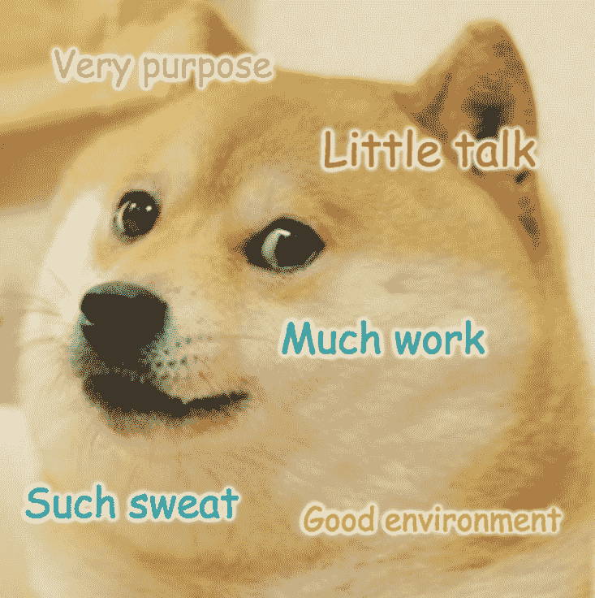

# 如何杀死你的拖延症，用你的想法彻底粉碎它

> 原文：<https://www.freecodecamp.org/news/how-to-kill-procrastination-and-crush-your-ideas/>

我甚至不知道有多少人(包括我自己)一直在说:

> “是啊，我要开始这个 JavaScript 课程了！”

> “我在买，在看这本书！”

> “我已经开始构建这个应用程序来学习 React 和 GraphQL 了！”

## 几个月后...

How's that app coming along?

> “我没有完成那门课程，这本新书才是我需要的！”

> "这本书太长了，但这门课对我来说再合适不过了！"

> "这个应用程序的想法并不实际，但是看看这个新的吧！"

## 不，别说了。

课程、书籍和应用程序的想法可能都很好。你真正的问题是承诺。跟我重复:

> 我喜欢开始做事，但讨厌完成它们。

现在来说说为什么。

## 痴迷于第一关

Why do we keep coming back here?

我的游戏伙伴们，什么能给你们带来更多的快乐？

1.  玩十个不同游戏的第一关...
2.  还是一直玩一个优秀的游戏到最后？

我会在任何一天选择 **#2** ，尤其是在 RPG 游戏中。

开始许多游戏对于浏览来说是很棒的，但是你不会有时间和他们中的任何一个进行情感上的交流。没有人重视他们只演示过的十个游戏。

## 这是关于优质时间

Your emotional connection needs time to develop.

让自己沉浸在故事中，理解角色，学习游戏玩法，这就是如何打造令人难忘的游戏体验。这是激发你最珍贵的童年游戏记忆的秘方。那是每个人都记得的经历。

> 开启这种体验需要你超越第一层。

## 生活中也一样

这是另一项民意调查，什么让你更快乐？

1.  开始一个想法，放弃，然后开始另一个想法...
2.  还是开始一个想法，无论如何都要完成？

这次我觉得选择 **#1** 赢了。

为什么我们致力于游戏，却放弃创意？

电子游戏通过进程提供快乐。开始一个游戏的全部要点是通过探索和完成它来提交。超越一级是显而易见的。

另一方面，想法通过激情提供快乐。所有的乐趣都在第一层。一旦到了工作的时间，我们大多数人都会放弃并选择另一个想法。

我们倾向于在第一级之后退出:**炒作和谈论。**

How many Level 2s have you reached?

## 不仅仅是你

我要第一个承认——当我开始做一些新的事情时，我的大脑会有一种奖励的感觉。这种感觉随着我告诉的每个人而加剧。宣布我的新计划感觉像是一个胜利！

但那是个陷阱。

Admiral already knows

你仅仅通过传播你的计划而“赢得”的空洞的胜利会让你达到自满的程度。尽管很容易，但谈话会让你感觉很好，以至于你最终会认为你已经做了足够多的工作！

Toast has heard more than enough.

即使在社会层面，我们也沉迷于生活的层次。无论是一个想法，产品，娱乐，甚至是其他人，如果你不喜欢就点新的！

## 制定流程

> 一个好的电子游戏是基于一个想法，但通过一个过程来实现。

如果你的想法要实现，那就创造一个过程！定义你需要什么来获得成功，制定计划，然后开始工作。

尝试创建自己的任务，由几个任务组成，这些任务只是许多*动作项目*。

无论是纸质清单、待办事项还是日历，写下你的行动项目，然后开始划掉它们。

However you want to gamify things.

如果没有持续不断的事情去关注，你会旋转你的轮子，变得无聊，并且完全放弃这个想法。

## 学会延迟满足

我最近在业余时间编写了一个小程序。你知道吗，我谈了两年，在这个过程中开始/停止了几次。

交谈简单、便宜、快捷——这就是我坚持这么做的原因。当我终于闭嘴，坐下，开始工作...感觉真的很有收获。

后来我呼吸的新鲜空气差点把我的房子吹倒了！那个 Pokedex 应用程序现在是我个人帝国的坚实基石。

## 不断提醒自己

有时候我们根本不记得我们为什么要开始一件事！

在激情阶段，你可能会致力于一个常规，直到取得成功。

但是一路上奇怪的事情发生了...你开始忘记当初为什么要设定这个目标。有一天你醒来，问是谁把你嫁给了这个时间表，你怎么才能走出来。

That feeling when you wake up...

为什么和什么一样重要。提醒自己这两点。这是让别人关心你的关键。

> 没有人会记得你的十个想法，但他们会记得你出色地执行了其中一个。

## 这是一份清单

如果我真的完成了某件事，它通常具有以下品质:

1.  明确的目的。
2.  聊聊天。
3.  很多工作。
4.  无数个小时的沮丧和想要放弃。
5.  一个提醒你第 1-4 点有多重要的环境。

这是总督表格。

Doge's work checklist

最终结果往往是没有人知道你的努力，直到他们已经为你鼓掌。所以，与其膨胀你的计划去寻求廉价的快感，不如脚踏实地，朝着你的目的地前进。

把它玩到底，一路上提醒自己为什么，创造一个我们都会记住的经历。

感谢阅读。直到下一次❤️

更多类似的内容，请查看[https://yazeedb.com！](https://www.yazeedb.com/)