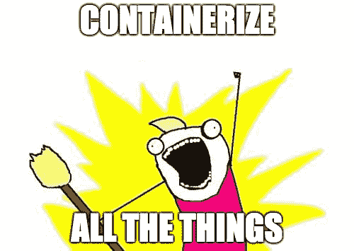

# 如何知道 Kubernetes 是否适合你的 SaaS

> 原文：<https://www.freecodecamp.org/news/how-to-know-if-kubernetes-is-right-for-your-saas-315dfffe0a25/>

Kubernetes 是一项令人敬畏的技术，我个人已经看到，由于它，我在扩展、部署和管理我自己的 SaaS 的能力方面取得了巨大的进步。但是，并不是每个人都能立即从采用它中受益，原因如下:

*   不熟悉容器技术
*   应用程序架构不利于利用 Kubernetes 的优势
*   增加的工作量与花费的时间

如果你对 Kubernetes 感兴趣，但不确定是否需要投入时间/资源，那么这篇文章就是为你准备的。

### 你对集装箱有什么体验？？

为了理解 Kubernetes 能为您做什么，您首先需要知道容器提供了什么好处。在 Kubernetes 上花费时间之前，您应该首先:

#### 容器化您的应用程序



首先，您的应用程序必须是容器化的。这意味着定义获取基本操作系统映像并在该映像上的文件(通常是 docker 文件)中安装应用程序所需的步骤。

经历这个过程以及定义配置应用程序所需的环境变量(比如应用程序使用的数据库的 URL、用户名和密码)对于使 Kubernetes 能够使用您的容器映像至关重要。

还要记下应用程序运行所需的任何依赖项，并学习如何使用这些依赖项的容器化版本。

#### [了解存储的工作原理](https://docs.docker.com/engine/admin/volumes/)

容器被设计成只保存运行应用程序所需的代码。任何持久数据都需要存储在其他地方，因为拆卸和旋转容器的过程(在处理容器时非常常见)也会破坏存储在该容器的文件系统中的任何数据。

在考虑 Kubernetes 时，了解容器存储应该如何工作，以及如何处理诸如备份数据、在容器之间移动数据以及从容器外部访问数据之类的事情是非常有价值的。

Kubernetes 通过自动配置等功能简化了存储管理。这能够让您的存储提供商(如 AWS EBS)在创建新容器时动态创建新卷，并自动装载它们。

#### [了解网络如何工作](https://docs.docker.com/engine/userguide/networking/)

你如何实现网络对你如何使用 Kubernetes 有很大的影响。对于初学者来说，了解如何向公共互联网开放特定系统并隐藏其他系统(如数据库),同时保持服务之间的通信非常重要。我需要学习的一些更复杂的操作是如何集成负载平衡，以及给每个客户的实例一个定制的主机名(Kubernetes 使这些事情变得容易得多)。

### Kubernetes 解决了你目前面临的问题吗？？


如果您没有使用容器来部署您的应用程序，您可能还不应该使用 Kubernetes。Kubernetes 旨在解决的问题是在尝试和扩展基于容器的基础设施时出现的问题。

以下是我认为 Kubernetes 在处理大规模容器时擅长解决的几个问题。

#### 扩大资源规模

Kubernetes 基本上是一个节点集群，它提供可由容器工作负载使用的计算资源。这种集群架构允许非常容易地扩大或缩小资源。您只需在集群中添加或删除节点，Kubernetes 就会自动利用这些资源或在您现有的资源上重新分配工作负载。

这解决了我面临的一个主要问题，因为我从拥有一台必须不断扩展的服务器(一个烦人的手动过程)转变为能够使用 CLI 通过一个命令来扩展或缩减我的基础架构。

#### 执行批量更新

Kubernetes 解决的另一个问题是更新所有容器的能力。以前，我编写 shell 脚本来挑选每个相关的容器，并使用新的图像标签重新创建它。这个过程需要一个多小时，我无法确认更新是否成功。使用 Kubernetes，我能够用一个命令执行更新，如下例所示:

```
// Update all the pods of frontend to a new image tag
$ kubectl rolling-update frontend --image=image:v2
```

Kubernetes 还允许您更新 Kubernetes 的任何部分(网络、存储等。)使用基于任何标准的命令。与编写自己的脚本来对基础设施进行修改相比，这是一个巨大的进步。

#### 自愈

我想说的 Kubernetes 的最后也是最重要的一点是自我修复的能力。如果 Kubernetes 检测到其部分基础设施出现问题，例如节点没有响应或容器没有通过健康检查，它将执行步骤来重新创建自己的这些部分，直到事情重新开始工作。

这是非常有用的，因为如果集群的某个部分由于某种原因出现故障，工作负载将被重新分配，您甚至可以让 Kubernetes 重新创建整个服务器来解决问题。

### 您的应用程序架构需要改变吗？？


Sometimes adapting your app to Kubernetes is like fitting a square peg in a round hole

当我迁移到 Kubernetes 时，我没有做太多的修改，因为它最初被设计为通过容器部署的多实例平台。

以下是我在将自己的工作量转移到 Kubernetes 时学到的一些东西。

#### 应用程序的启动时间很重要

当您创建一个新的部署时，您必须等待您的应用程序启动，最终用户才能使用它。如果您的部署过程涉及到在最终用户按下按钮时创建新实例，或者如果您在所有客户实例上执行更新，这就会成为一个问题，因为这需要重新构建 pod。

当迁移到 Kubernetes 时，你可能需要对你的代码库进行一些修改，以使启动过程更加有效，这样最终用户在使用你的产品时就不会有降级的体验。

#### 适应多租户架构非常困难

多租户架构意味着您有一个应用程序实例，它管理分区租户中的所有最终用户，通常每个人共享一个数据库。

如果您的应用程序不是为利用集群(多个服务器作为一个实例)而构建的，那么您还不应该使用 Kubernetes。

在使用 Kubernetes 时，我通常会看到两种类型的架构:

*   多实例，每个客户一个应用程序实例
*   具有集群功能的多租户体系结构，因为它们可以利用纵向扩展和横向扩展资源

我个人更喜欢多实例，因为与集群多租户架构相比，它们更容易实现。此外，与向多实例架构添加集群功能相比，从多租户迁移到多实例所涉及的工作并不太糟糕。

#### 迁移到无状态应用程序是一项巨大的工作

Kubernetes 的一个重要特性是能够在部署中增加或减少单元的数量。但是，如果您的应用程序不是集群化的或无状态的，那么这个功能就被浪费了，因为部署中的额外 pods 不会被正确配置，也不能被利用。

在 Kubernetes 中利用无状态性的过程通常比它的价值更麻烦，因为大多数时候你需要完全重做你在应用程序中处理配置的方式。

如果您不想花时间使您的应用程序无状态或集群化，请不要气馁，因为有许多方法可以使有状态部署适应 Kubernetes。但是它们有自己的问题，我不会在这篇文章中讨论。

### 你应该采用 Kubernetes 吗？？

在问自己这些问题之后，你应该有一个很好的想法，如果 Kubernetes 在这个时候适合你。大多数早期创业公司可能不需要它，而更成熟的公司可能在其他技术上有大量投资，因此转换是不可行的。

我认为迁移到 Kubernetes 的最佳案例是一家初创公司，该公司希望从使用容器驱动生产工作负载的最低可行云基础设施迁移到更稳定的基础设施。这就是我的情况，我可以说，由于 Kubernetes 的强大功能，我从因资源管理不善和服务器超负荷工作而导致的周期性停机转变为完全不用担心我的基础架构。

想把 Kubernetes 和你的 SaaS 联系起来吗？让我们谈谈- [ben@servicebot.io](mailto:ben@servicebot.io)

