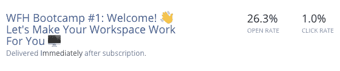
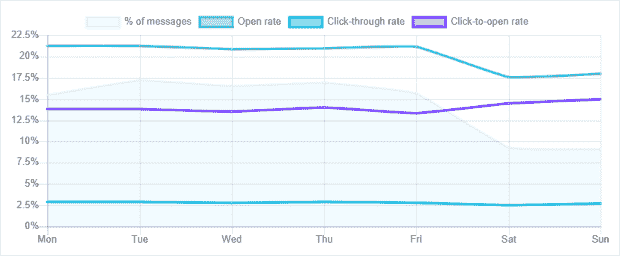
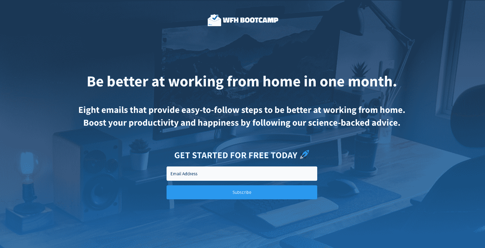

# 我从发布电子邮件简讯中学到了什么

> 原文：<https://www.freecodecamp.org/news/how-to-launch-an-email-newsletter/>

我喜欢学习，也喜欢建设。我是 SaaS 软件公司的产品经理，已经建立了几十个网站，从当地面包店的电子商务到蜜月网站。

在上周之前，我从未创建和发布过电子邮件简讯。下面是我发起电子邮件时事通讯的经历和我发现的主要经验。

我希望你能利用我的经验来启动你自己的项目，并尽可能避免一些陷阱。

## 如何发现问题和机会

由于当地新冠肺炎的封锁，我无法离开我的家，我有更多的时间从事副业，学习新技能，并研究发展趋势。对我来说，一个不可避免的趋势是远程工作的增加。

像我们中的许多人一样，我在 2020 年的大部分时间和 2021 年未知的一段时间里，一直是在家工作的被迫实验的一部分。

虽然 WFH 有不可否认的好处，但 WFH 也带来了许多挑战。这些挑战包括:

*   拥有合适的工作环境。
*   管理工作生活平衡。
*   维护职业关系。
*   解决倦怠问题。
*   导航我的职业生涯。

我意识到，数以百万计的其他人在家里工作也面临着类似的挑战，可能需要指导如何在 WFH 脱颖而出。

指南就在出版物和专业书籍中，但是大多数人没有时间或动力去找到所有的指南。

我看到了一个机会，可以提供一些简单的提示和技巧，帮助人们在家工作。

现在的问题是如何传递这些信息？

## 我是如何决定使用电子邮件作为媒介的

我的背景是在[建网站](https://www.freecodecamp.org/news/how-to-start-a-blog-with-wordpress/)。一个有教育内容的在家工作的网站是一个简单的选择，但对这个想法来说不够有粘性。我的网站主要通过搜索引擎优化来吸引访问者，我想在人们可能不知道的话题上帮助他们。

此外，我想探索另一种媒介作为教育的努力。是时候潜入抖音了？调查音频媒体？电子邮件简讯？

一封电子邮件简讯检查了我想要的所有箱子。电子邮件简讯具有以下优势:

*   着迷的观众。
*   能够按计划交付内容。
*   易于跟踪指标。

我一直是时事通讯的粉丝，比如[早茶](https://www.morningbrew.com/)、[吊牌](https://tagtheflag.co/)和 [theSkimm](https://www.theskimm.com/) 。我发现这些时事通讯鼓舞人心，既是成功的创业追求，也是与忠实受众交流的绝佳媒体。

电子邮件简讯是一个很好的学习媒介。超过 83%的企业已经在使用电子邮件简讯，平均投资回报率为 4400%(每花费 1 美元，投资回报率为 44 美元)。

有了电子邮件，我可以建立一个自动化的系列，人们只需采取行动(注册)一次，我就可以在一个月内向他们提供信息。我可以在人们阅读内容并收到在家工作的有益建议的时候“设置好然后忘记”。

是电子邮件简讯！

这个想法形成了一个 8 封电子邮件的系列，将在 1 个月内自动发送。我决定把它叫做“在家工作(WFH)训练营”。

## 早期电子邮件营销课程

在进入细节之前，我必须了解我的新媒体的局限性。

我知道如何加快网页速度，优化搜索引擎优化，跟踪网站访问者，监控跳出率，等等——但我对电子邮件的最佳实践、电子邮件的固有限制以及应该注意什么一无所知。

以下是我学到的一些东西。

### 电子邮件打开率

*   平均邮件打开率应该在 15-25%之间。
*   平均点击率应该在 2.5%左右。

这意味着，在八封电子邮件系列中，人们只会阅读其中的几封。不理想。我的希望是，基于这个系列的性质，人们会期待这些邮件，从而导致更高的打开率。但是低打开率是电子邮件通讯的一个固有因素。

训练营的想法是在电子邮件中包含信息丰富的参考资料，以及一些产品试用建议。如果只有 2.5%的人点击进入这些有深度的文章和产品，那么这封电子邮件在其他网站上推动行动的影响将低于我的预期。

以下是我的初步结果:

Open rate and click rate for the first 1,000 subscribers to WFHBootcamp.com

WFH 训练营的第一封邮件已经发送给了 1000 多名订户。只有 26.3%的用户打开了第一封邮件。这比我预期的要低很多，随着训练营的成长，我将不得不对此进行监控。

### 电子邮件内容优化

我熟悉写网站文案和优化搜索引擎优化。但是怎样才能制作出好的电子邮件简讯？

以下是我在准备撰写电子邮件系列时学到的东西:

*   邮件的长度取决于邮件的类型，为了便于销售，请尽量简短。
*   简讯内容应 90%教育和 10%推广(HubSpot)。
*   主题(很多)- 47%的邮件收件人只根据主题打开邮件(OptInMonster)。
*   在主题行中使用表情符号可以将打开率提高 4.2% (Moosend)。
*   图像很难- 43%的人禁用图像，一些电子邮件客户端不显示背景图像(OptInMonster)。

我试图将在家工作的最佳实践提炼成 8 封简明的电子邮件。我决定我的长度需要在 900 字以下。这大约是 3 分钟的阅读时间(注意力经济中的永恒)。

阅读一封电子邮件的平均时间是 11 秒，所以写更长的内容是一场赌博。短暂的注意力持续时间是电子邮件通讯媒介的极限。

### 电子邮件发送时间

自从我开始创建一个关于在家工作的自动化时事通讯，弄清楚内容什么时候到达我的订户的收件箱是很重要的。

GetResponse 分析了客户发送的约 40 亿封电子邮件，以收集发送到个人电子邮件地址的最佳时间信息。以下是他们在一周中的每一天的发现:

Get Response data for email opens and clicks by day of the week.

我认为在周末接收 WFH 的内容没有多大意义。此外，GetResponse 数据证实，周末电子邮件的打开率和点击率更低。幸运的是，我的电子邮件提供商有这样一个功能，只在工作日发送电子邮件。

还有很多关于发送电子邮件最佳时间的研究(周二上午 10 点？)但基于这项研究，我认为在工作日发送邮件的最佳时间是有人注册的时候。

## 我如何写内容和产生用户反馈

写作可能很难，尤其是作为一名营销人员。

为了我自己的利益，在过去的一年里，我已经记录了大量的 WFH 最佳实践。这些笔记让我创建了一个大纲，这使得开始进行用户研究并最终用有用的内容填充大纲变得非常容易。

我是这样开始的。

### 客户研究

像所有好的产品开发一样，我从把我的初步发现带给潜在客户开始。我问人家:“订阅我的简讯，想学什么？你希望从中得到什么？”

当我第一次问人们这些问题时，我得到了三种类型的回答:

1.  帮助我提高办公空间的物理舒适度。
2.  在不与他人频繁接触的情况下工作时，帮助我改善心理健康。
3.  帮助我成为一名出色的远程工作者，并提升我的职业前景。

幸运的是，这些类别与我希望写的内容一致。然后，通过练习设计思维(这是一种运用批判性思维来解决与人们相关的设计问题的整体方法)，我能够剥离层次，更好地理解用户想要学习什么，最重要的是，**为什么**。

现在是写作的时候了。

### 写作冲刺

我在一个(漫长的)周末写完了所有八封电子邮件。这个写作冲刺是通过在写作之前进行广泛的行业和用户研究实现的。

以下是每封邮件的主题和长度:

*   WFH 训练营#1:欢迎！👋让你的工作空间为你服务🖥 *(806 字)*
*   WFH 训练营#2:为什么你的家庭办公室很重要🖥 *(862 字)*
*   WFH 训练营#3:赢得 WFH 的智力游戏🧘‍♀️ *(586 字)*
*   WFH 训练营#4:让我们来谈谈你的身体健康🏃‍♀️ *(765 字)*
*   WFH 训练营 5 号:📊提升您的 WFH 性能📈 *(545 字)*
*   WFH 训练营 6 号:👩‍💻管理你的职业生涯👨🏽‍💻 *(508 字)*
*   WFH 训练营#7:公司如何看待远程工作🏬🏢 *(350 字)*
*   WFH 训练营 8 号:WFH 和你的未来🚀🚀🚀 *(425 字)*

总共不到 5000 字。双倍行距，即大约 20 页的内容。

所以基本上，WFH 训练营是我为 WFH 101 的研究论文。

## 我是如何构建登录页面的

幸运的是，创建一个简单的博客相当容易。

我用 Wordpress 建立了一个简单的登陆页面，托管在 Kinsta 上，使用 ConvertKit 作为我的电子邮件提供商，并使用来自 UnDraw.co 的图片。

建立网站只花了几个小时。

WFHBootcamp.com

对于 MVP，内容只能通过电子邮件获得。在网站上提供门控内容(使用像 Wordable 这样的工具将内容从 Google Docs 快速添加到 Wordpress)是合乎逻辑的下一步，但不是电子邮件系列 MVP 的要求。

对于那些希望轻松创建门控内容的人来说，SubStack 等服务提供了一种现成的解决方案，可以推出带有门控内容和付费订阅的时事通讯。

## 我如何推出简讯，以及后续步骤

### 早期反馈至关重要

我已经尽可能多地融入了现实世界的反馈。内容一写完，我就和大约 100 名用户(朋友、家人、关系)组成了一个测试组，并加快了启动训练营的时间。

这些用户通过我通过 [TypeForm](https://www.typeform.com/) 创建的定制调查提供了宝贵的早期反馈。

我有时会尴尬吗？你打赌。那种感觉让我慢下来了吗？一点也不。正如雷德·霍夫曼所说“如果没有任何打字错误，我们推出得太晚了！”。

与构建和发布任何其他类型的软件产品一样，上市速度非常重要。

不是因为我害怕竞争对手或模仿，而是因为我喜欢我的产品，相信它能为那些从事真实工作、努力在家工作的人增加价值。我越早发布电子邮件系列，就能越早帮助那些人。

构建者从客户开始，逆向工作。他们努力赢得并保持客户的信任。获得反馈是建立信任的关键。

这些早期用户也扩大了训练营的发展。自从推出这 100 名测试用户以来，已经有 1000 多人注册了 WFH 训练营。

### 电子邮件简讯要监控什么

随着这些数字继续增长，我在监控:

*   开放率。
*   点击率。
*   转发率/邮件分享。
*   列表增长率。
*   取消订阅的数量。
*   垃圾邮件投诉。

此外，我将继续通过调查获得客户反馈。

## 结论

我希望我如何发起 WFH 训练营的故事对你有所帮助。

我们讨论了为什么电子邮件是一个很好的媒介，电子邮件的局限性，写内容时的重要考虑，与用户的早期测试，以及在你的电子邮件时事通讯中监控什么。

我将继续监控、重复和改进电子邮件——就像我对待任何软件产品一样。

事实证明，电子邮件是一种有趣且简单的学习和发布新产品的媒介。它让我能够快速推出一款产品，希望能帮助人们在家工作时更有效率、更快乐，到目前为止，这是一次美妙的学习经历。