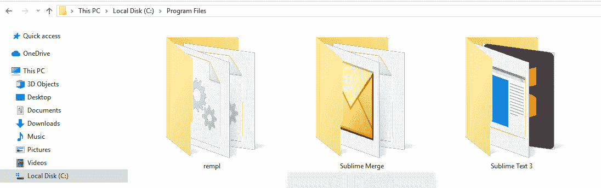
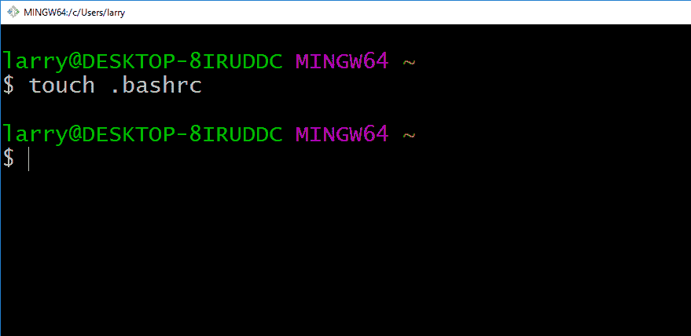
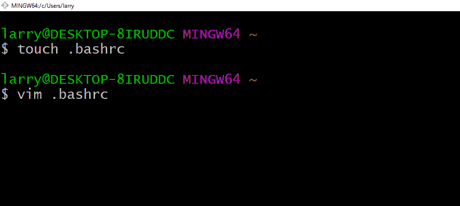
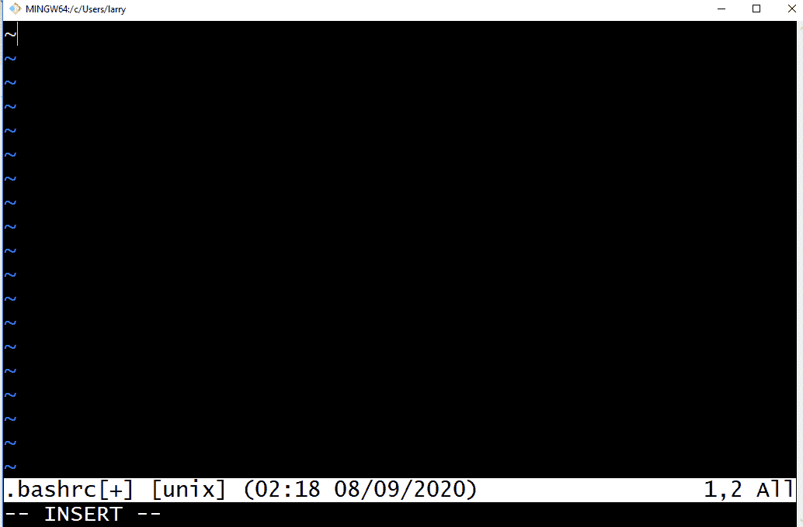
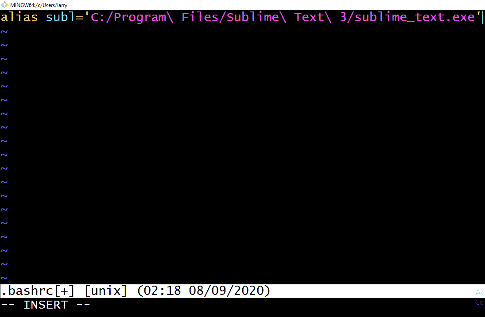
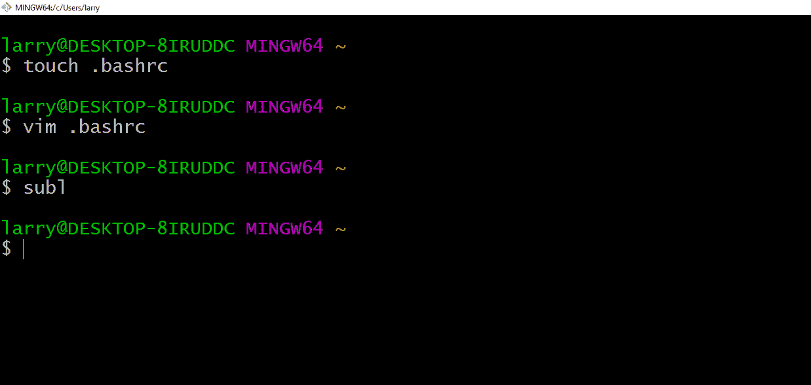
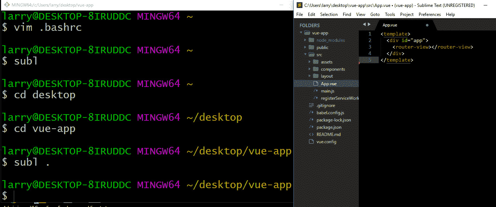

# 如何在 Windows 上从 Git Bash 启动 Sublime Text

> 原文：<https://www.freecodecamp.org/news/how-to-launch-sublime-text-from-your-terminal/>

如果您一直试图找出如何从 Git bash 打开 Sublime 文本编辑器，那么您很幸运。这篇文章将引导你轻松完成这个过程。

我花了一段时间才明白这是怎么做到的，但现在我可以在这篇文章中与大家分享这些知识。最后，您将能够从 bash 启动 Sublime Text。

### 先决条件:

*   确保您已经设置了 [Sublime 文本编辑器](https://www.sublimetext.com/3)
*   确保你已经安装了 [Git](https://git-scm.com/downloads)

## 入门指南

[Sublime text](https://en.wikipedia.org/wiki/Sublime_Text#:~:text=Sublime%20Text%20is%20a%20shareware,maintained%20under%20free%2Dsoftware%20licenses.) 是一个源代码编辑器，帮助软件开发人员编码和编辑文本或标记。

它有惊人的功能，如语法突出，缩进，插件和包。所有这些特性都有助于使工作变得更加容易和舒适，并有助于各种各样的编程语言代码库。

下载并安装 Sublime 后，它将位于程序文件中，如下所示:



我们要做的是为 Sublime Text 3 文件夹中的 sublime_text.exe 创建一个别名。然后，当我们在 Git bash 中键入别名时，它会自动启动文本编辑器。

## 如何用 Sublime 别名配置 Git Bash

要开始配置 Git bash，我们首先需要打开 bash 终端。然后，我们可以继续研究各种 Linux 命令，以完成配置过程。

首先，我们需要使用 **[触摸命令](https://www.geeksforgeeks.org/touch-command-in-linux-with-examples/)** 创建一个. bashrc 文件。重要的是，该文件必须创建在 **C:\Users\username\** 目录下——否则，您将得到一个权限被拒绝的错误。

我已经在指定的目录中创建了 bash 文件，所以我的文件看起来像是 **C:\Users\larry\bashrc** 。



接下来我们需要编辑**。bashrc 文件**包含启动 Sublime text 所需的别名:



当我们点击输入时，我们会看到一个界面，看起来有点像我们下面的。然后需要按`i` 进入插入模式。



现在，您可以访问并输入提示了。所以我们现在可以在那里添加我们的别名，就像这样:

```
alias subl='C:/Program\ Files/Sublime\ Text\ 3/sublime_text.exe'
```



一旦我们包含了这些，我们可以按`esc` 退出插入模式，然后按`:wq`保存并退出。

一旦我们完成了这些，我们就可以回到 bash，通过如下所示的`subl`来检查我们的配置是否有效:



是的，有效！你可以看到崇高的文本本身。

我还发现，如果你有一个工作目录，你可以强制 Sublime 打开这个目录。我现在将导航到一个代码库，并在下一个屏幕截图中展示不同之处:



从上面的截图来看，Sublime 不只是启动一个空白的工作空间，它会启动与该项目相关的所有项目文件夹。这是因为我们在命令中添加了一个通配符。

我希望有了这个黑客，你将能够为崇高的文本设置一个别名。真的很感谢这个栈溢出 **[线程](https://stackoverflow.com/a/43431197/9352741)** 上的答案。它帮助我形成了我能够在这篇文章中分享的知识。