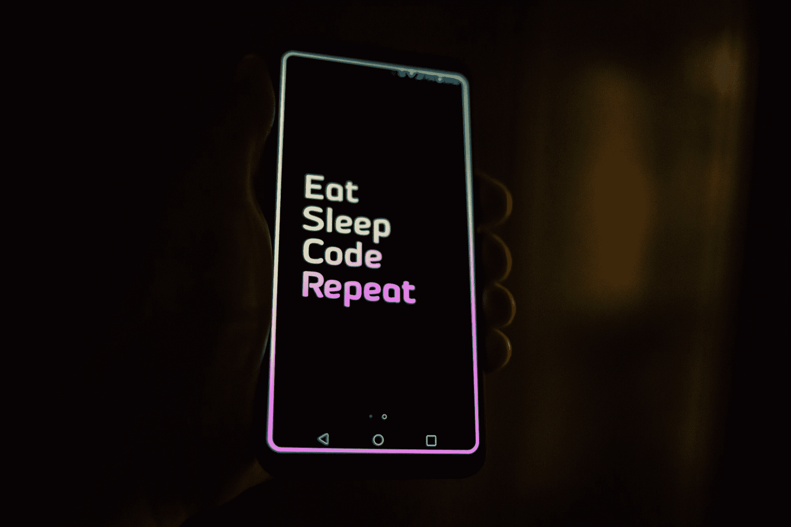
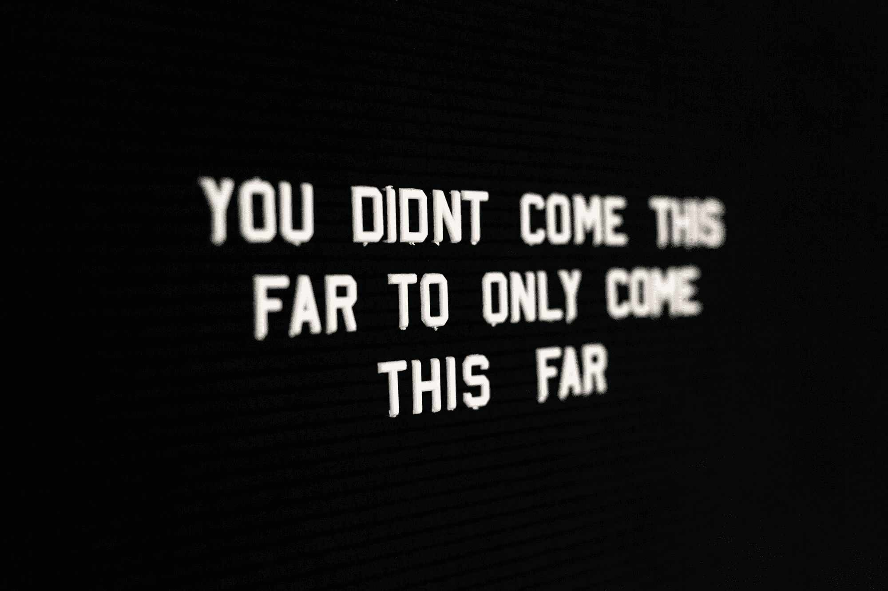

# 如何学习编码:方法决定一切

> 原文：<https://www.freecodecamp.org/news/how-to-learn-coding-approach-is-everything/>

以下是以更有效的方式学习编码的技巧。它们得到了神经科学、行为心理学和十多年经验的支持。

你可以花几个月的时间去健身房，但由于你的锻炼方式，你仍然看不到任何效果。

我们大多数人都知道这一点。

同样的事情也适用于编码。

你可以花几个月的时间学习，尝试不同的东西，在教程中跳来跳去，但仍然觉得自己是个初学者——充其量是个高级初学者。

很疼。

这让你想知道是否有更快、更好、更有效的学习方法。

有。

但首先要做的是。

> "当运动的机制更加可靠时，速度就会随之而来."拉斐尔·萨巴蒂尼

如果你不了解学习的基本原理，无论你走得多快，你仍然建立在不稳定的基础上。你不想那样。

就这样，让我们开始吧。

## 两分钟教程

如果我告诉你有一个 2 分钟的教程可以帮助你马上掌握 JavaScript，你会去看看吗？

无论你是回答了*【是】*还是*【否】*，都无关紧要。

也就是说，如果你内心深处明白仅仅一个简短的教程是违背精通任何领域的原则的。

简单来说，精通是如何工作的:

1.  从一个巨大的信息转储开始。
2.  将新学到的东西与你以前已经知道的东西进行比较。
3.  列出新旧信息的不同之处。
4.  通过从头开始学习来测试自己。
5.  最后，教别人。

这个。需要。几年。

这就是为什么仅仅靠捷径是不够的。

所以，下次你看到一个千载难逢的教程，许诺你一下子就能掌握，记住它充其量只是给你一个信息转储。

内化这一点，你的基础就牢固了。

那么速度也会随之而来。

## 你是如何应对挣扎的？


[Image credits](https://unsplash.com/@henrikkedue?utm_source=ghost&utm_medium=referral&utm_campaign=api-credit)

我见过有人退出编程，因为他们不想与 bug 作斗争。

这就像你讨厌健身房，因为你不想让你的锻炼受伤。

但事实是:你不会逃避错误——你会训练自己更快地找到它们。

因为一个熟练的程序员就是一个高效的 bug 侦探。

每当你因为错误而感到沮丧时，记住这是一个学习的机会。不要跳过。

> “宽容是心灵最伟大的礼物；这需要大脑付出与在自行车上保持平衡同样的努力。”― **海伦·凯勒**

神经科学研究证实，练习不只是让你变得完美，而是有意识地在特定任务中提高，让你变得更好。

刻意的练习包括挣扎。有虫子。

所以你的期望不应该是完美的编码。

相反，你的口头禅应该是:

*   你编码。
*   你调试。
*   你挣扎。
*   你克服了。
*   你重复。

你越早接受这一点，你的学习就变得越有效率。

因此，如果在这一点上你没有挣扎，你只是在玩。浪费时间。

但是另一方面，如果你觉得每次都在挣扎，那么下一部分就是为你准备的。

## 你不笨，你学的水平不对

先打个小比方。

想象一下学习英语(例外的语言)。

你从一个激励你学习拼写像*大象*这样的大单词的教程开始。

但是没用。

打败自己这么长时间后，你决定去一个较低的教程，学习拼写更小的单词，如 *ANT* 。

但之后你还是会纠结。

所以你得出结论说你很笨，因为你降低了你的辅导水平，仍然没有掌握任何东西。你有证据——反面证据。

但是当一个新老师调查你为什么在挣扎时，他们发现你一直在挣扎是因为...

你实际上不知道英语字母表。


[Image credits](https://unsplash.com/@krakenimages?utm_source=ghost&utm_medium=referral&utm_campaign=api-credit)

让我们回到编码上来。

有些人跳进初学者教程，立即开始学习*反应或角度(大象)*。

然后意识到这毫无意义，所以他们继续学习 *JavaScript (ANT)* 作为编程世界的入门

但这对他们来说仍然没有意义，所以他们退出了。

> “我对学习编码已经厌倦了。这显然不适合我。”


[Image credits](https://unsplash.com/@simmerdownjpg?utm_source=ghost&utm_medium=referral&utm_campaign=api-credit)

但他们只是在研究一些过于先进的东西。

即使是入门课程也可以升级，因为你的思维还没有连接到一般的编程上。

我认为这还不够好，但是如果你正在努力学习入门课程，你应该考虑儿童编程入门。

找到比入门课程更低级的课程，并从那里开始积累，这并不可耻。

使用以下工具学习:

*   [爱丽丝](https://www.alice.org/resources/exercise-and-project/tutorial-building-a-program/)。
*   [划痕](https://scratch.mit.edu/)。
*   代码大战。

因为你年纪大了，你可能会过得更快。

但他们会给你非常需要的软介绍，有意义，并建立你对编程的胃口。

同样，这与自我无关。

这是你的学习之旅。

如果你先学习字母表:

*   你会获得开始拼写 ANT 所需的信心。
*   然后*大象，*作为你的下一大步。
*   还有一些像[肺部显微镜检查](https://en.wikipedia.org/wiki/Pneumonoultramicroscopicsilicovolcanoconiosis) **这样的长词。**

无论你跳向哪个学科或编码领域，这对 Python 的*介绍*和机器学习的*介绍*同样适用。

如果你在正确的水平学习**，你会学得更有效率。**

## 用间隔重复提升你的学习方式

这项技术来自神经科学的研究。我来快速描述一下。



[Image credits](https://unsplash.com/@synkevych?utm_source=ghost&utm_medium=referral&utm_campaign=api-credit)

### 工作原理:

*   你学会了。
*   48 小时后召回。
*   然后 72 小时复习。

### 这样做:

*   你会忘记得更少。
*   将新思想与旧思想联系起来；
*   在长期记忆中保留更多。

我以 48 小时和 72 小时为例，但是您可以将时间线扩展到几天或几周。最重要的外卖不是简单的学一次。

而是有意留出时间让你回来复习。

复习之间的时间间隔越长，它就越容易被长期记忆所遗忘。

*   [Duolingo](https://www.duolingo.com/) 用的。
*   [Quizlet](https://quizlet.com/) 采用了。
*   也可以应用。

## 1 个项目> 10 个 hello worlds

不要永远陷入`hello worlds`中。

我理解完成简单练习的兴奋感:

```
print “I am awesome”
print “You’re cool”
print “Wait, are we cool?” 
print “OMG! Guys! Like I can so print all day” 
```

但我必须对你说实话，这不会解决问题的。

回到我们的蚂蚁类比，无论你用多少种方法重新排列蚂蚁这个词，你永远也到不了大象这个词。

不管你学了多少入门教程，你永远也不会真正掌握基础知识，除非你能超越它。

> "*但是作为初学者不知道从什么项目开始。*

别担心。

这里有 3 个例子:

*   **货币转换器:**创建一个将货币从一种单位转换成另一种单位的程序，例如，将印度卢比转换成美元，将英镑转换成欧元，等等。
*   随机密码生成器:创建一个程序，从用户那里获取一些单词，并使用这些单词生成一个随机密码。
*   ****猜数字** :** 让用户猜一个 1 到 50 之间的数字。如果他们的猜测超出了这个范围，显示一条错误消息，要求他们再次猜测。每当他们猜错号码时，问他们是想继续玩还是想退出。最后，当用户最终猜出正确的数字时，祝贺他们并显示他们尝试的次数。

如果你觉得这些很无聊，这里有[其他初学编程的项目思路可供选择。](https://www.lifetechpsych.com/beginner-programming-projects)

如果所有这些看起来都太难或太无聊，在 Twitter 上给我发消息，我会根据你的水平量身打造一些东西。

记住，这与自我无关。

关乎你的学习水平和成长。

## 动力就像洗热水澡

洗个热水澡感觉很好，你应该去洗。


[Image credits](https://unsplash.com/@chanphoto?utm_source=ghost&utm_medium=referral&utm_campaign=api-credit)

但是如果你的热水停了两个星期，你会不洗澡吗？

这个问题听起来很可笑。

但是同样的，你不应该把你的学习仅仅建立在你有动力的日子里。

在编码领域有很多令人兴奋的日子，但也会有黑暗的、令人沮丧的日子。

老实说，这不仅仅是编码的问题。它伴随着生活，伴随着任何新的冒险。

但是你必须训练自己，不仅在你感到极度兴奋的时候出现，而且在情绪低落、无聊的时候也要出现。

这并不意味着完全忘记动机。

远非如此。你应该这样做:

> 在你感觉超级有动力的日子里，利用你的动力迅速让自己投入到一些大的事情中，当动力枯竭的时候，这些事情会让你保持责任感。

怎么会？

加入问责运动，如:

*   [30daysofcode](https://twitter.com/hashtag/30Daysofcode?src=hashtag_click)
*   [100DaysOfCode](https://twitter.com/hashtag/100DaysOfCode?src=hashtag_click)

一些事情。

任何事。

让你在不景气的日子里保持责任感。

在行为心理学中，这被称为预先承诺。

当你没有动力的时候，你用乐观的时刻来承诺自己的未来。使用这个技巧，你会让自己坚持更长的时间。

## 学习的旅程永无止境

没有人真正教你如何学习。

重点大多是学什么。但是，如果你想走得更远，学会如何学习是至关重要的。

如果你想深入学习艺术，我强烈推荐这门课程。

你可能从简单地学习编码或者有一天成为一名开发人员的想法开始。

但是还有更多。



[Image credits](https://unsplash.com/@drewbeamer)

当你从另一边出来时，你不仅仅是一个开发者。

而是作为一个焕然一新的人，因为你学会了一种新的学习和处理事情的方式。

不要误解我。

这可不容易，你会拼命工作的。

但最终，这是值得的，不仅因为编码，还因为改变自己的快乐。

## **感谢阅读！**

就这样结束了。不打算说谎，这花了很多时间和思考来拼凑。

1.  ****在推特上关注我:**** 我在推特上最活跃。如果你喜欢这个，[喜欢并转发这个帖子](https://twitter.com/LifeTechPsych/status/1311338563884257280)来帮助传播这个消息。有问题吗？我的 DM 一直开着。
2.  ****加入**我的**电子邮件社区:**** 我正在整合资源，帮助新程序员和初级开发人员减轻压力，管理冒名顶替综合症，更聪明地学习。如果有兴趣，[加入这个邮件列表](https://lifetechpsych.ck.page/)。
3.  **想阅读更多？**查看[我为初学者和初级开发人员写的更多文章](https://www.lifetechpsych.com/)。

*——我热爱研究，所以我倾向于用行为心理学和神经科学的概念来支持我的建议和方法。*