# 如何更快地学习 JavaScript 开始编写 JS 的技巧和资源

> 原文：<https://www.freecodecamp.org/news/how-to-learn-javascript-faster/>

JavaScript 是一种编程语言，通常用于 web 开发和许多其他事情。它与 HTML 和 CSS 一起为网站添加动态功能。

世界上大约 97%的网站使用 JavaScript——所以你可以看到它是一种流行和广泛使用的语言。

JavaScript 是网络的调味品。它让事物舞动。JavaScript 使网页能够做一些事情，比如显示更新的内容，显示可以与之交互的地图，以及许多其他事情。

今天我们将学习如何更快地学习 JavaScript，这样你就可以随心所欲地掌握 JavaScript，并在你的项目中有效地使用它。

## 我们将在本文中讨论的内容

*   如何更快地学习 JavaScript 概述
*   如何用 JavaScript 练习编码
*   为什么您应该阅读文档
*   您可以从阅读文档中采纳一些最佳实践
*   如何为开源项目做贡献
*   如何找到可以参与的项目
*   为什么你应该建立许多项目
*   可能会启发您构建项目的资源

## 如何用 JavaScript 练习编码

练习能让你进步。无论是音乐、舞蹈、唱歌、打篮球，还是编码。

练习确实是重复的，可能会很累，但从长远来看，这有助于我们，让我们与众不同。正是通过练习和重复的行动，我们才能够擅长所有这些活动。编码没有不同。

#### 完成课程和教程

课程和教程是学习的好方法。你可以在网上很多地方找到各种学习资料。如果你想学习一门特定编程语言的课程，你可以在 LinkedIn、Codecademy 和 Udemy 等网站上找到。

如果你喜欢视频，YouTube 上有很多很棒的频道免费发布编码教程。我最喜欢的一站式商店是 freeCodeCamp 的频道。

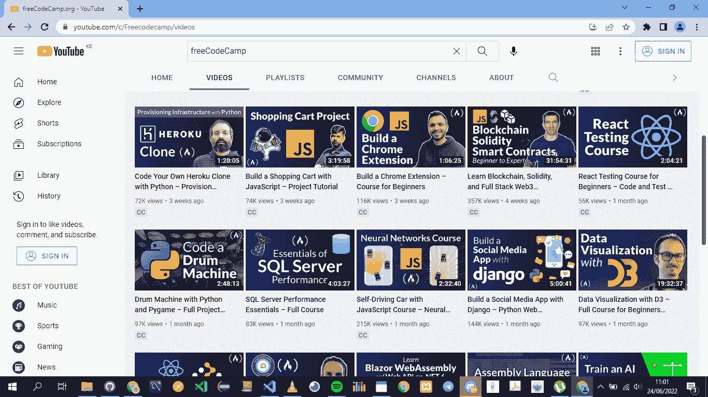

freeCodeCamp's channel on YouTube

这些频道可能专注于 JavaScript，也可能包括其他编程语言的视频。

我在 YouTube 上使用的一个好规则是检查一个教程的浏览量。这将有助于你知道这是否是一个好的跟随。

教程的长度也很重要。如果您刚刚开始用 JavaScript 编程，较长的教程很好地涵盖了基础知识。

#### 试试 freeCodeCamp 上的免费 JavaScript 课程

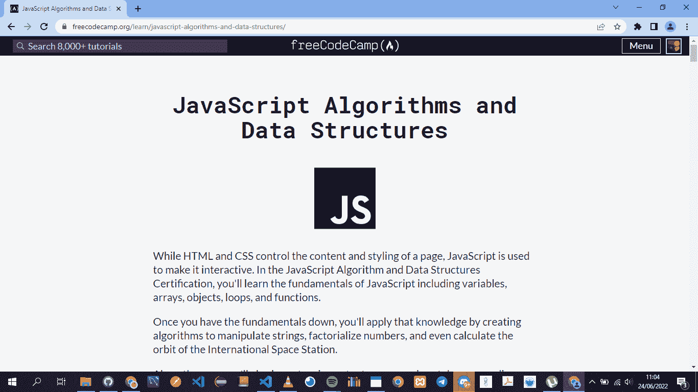

freeCodeCamp's curriculum

FreeCodeCamp 的课程是练习编码的绝佳方式。它提供了一些你可以练习的小挑战，一旦你的测试通过，就进入下一步。它几乎像一个没有游戏部分的游戏。

你可以通过完成课程提供的挑战来理解这门语言是如何工作的。这对于喜欢玩游戏的人来说真的是太好了。

#### 下面是一个预期结果的示例:

首先，您需要在访问 freeCodeCamp 时登录。这允许你保存你的分数。

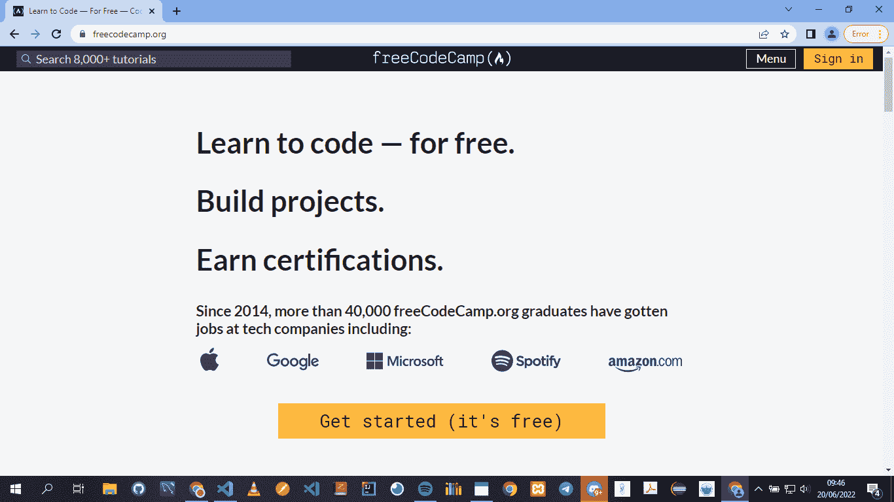

sign in to freeCodeCamp

在这里你可以选择各种免费课程。在我们的例子中，我们只需要 JavaScript 课程，所以我们选择了它:

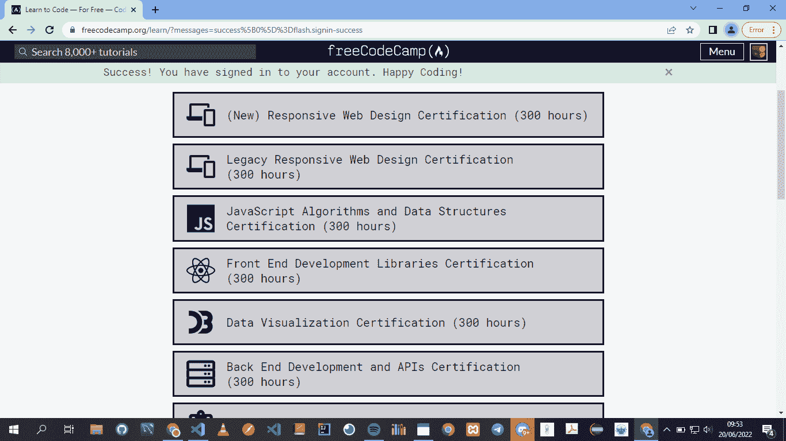

freeCodeCamp courses

我已经完成了本课程中的所有挑战，但如果你要开始，你需要从第一个挑战开始。

Comment Your JavaScript Code challenge

现在，您将能够边编码边学习。您还可以运行位于屏幕左下方的测试。

右边可以看到我已经完成挑战。

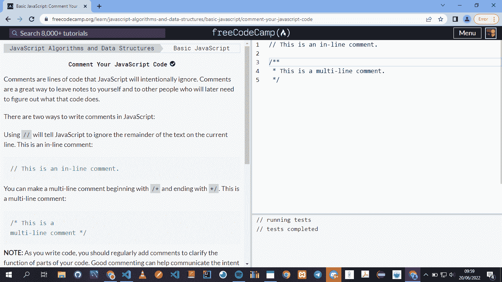

Attempt of the challenge

当你点击`Run the Tests(Ctrl + Enter)`时，如果你答对了，你就会得到你的分数。由于我已经做了这些挑战，所以我的分数仍然会保持在 100%。

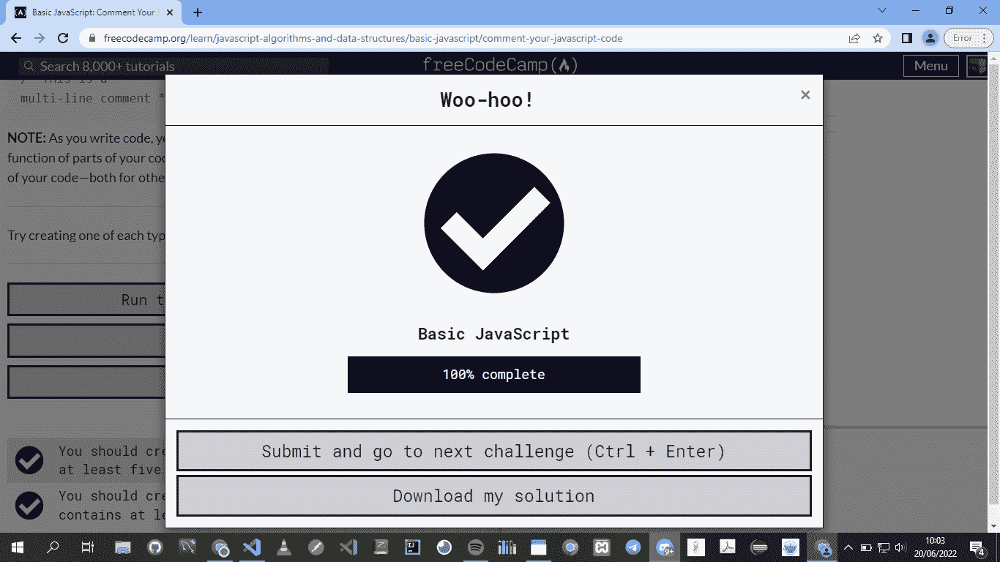

Completed the challenge

坚持挑战，直到你感觉舒服为止。

#### 如何接近课程/教程以避免教程地狱

人们很容易陷入一个接一个地看教程的陷阱——并且没有真正记住任何信息。有时这些教程就像网飞系列的剧集一样一个接一个地出现。

我去过那里。这发生在我第一次学习 React 的时候。我参加了一个在线课程。有一个黑客马拉松即将到来，我需要知道反应，我深入到课程中。

我多么喜欢它。教练太棒了！“有多容易做出反应？，”我说。我去了黑客马拉松，加入了一个团队。凭借我对 React 的新知识，我告诉他们把需要 React 的前端留给我。正是在实施的过程中，现实击中了我。我不能在反应中写任何东西。

#### 我是如何逃离教程地狱的

所以我发现自己看了很多教程。对我来说，决定性的时刻是当我开始通过边看教程边编码来实现我所学到的东西。看完教程后，我能够创建一个项目。然后我创造了一个又一个，一个又一个。

我现在已经准备好自己尝试这些项目了。使用我创建的项目，我会借用它们的概念，如导航栏或页脚，并在我的新项目中实现它。最后，我能够在没有教程帮助的情况下自己创建一个新项目。

### 阅读文档

阅读文档的能力被低估了，但却是一项重要的技能。阅读文档可以让你更好地理解这门语言。

大多数教程只会教你基本的东西，这样你就可以开始用 JavaScript 编程了。但是如果你完全理解这种语言以及它是如何工作的，这可以让你的技能提高十倍。

这让我想起了我学习火车如何工作的时候。好吧，改天再说。:)

此外，阅读文档有助于理解 JavaScript 的最佳实践。很多时候，在不了解最佳实践的情况下，您可能会陷入编写效率低下的糟糕代码的陷阱。这会让你陷入永无止境的低效代码的陷阱。

有很多工具可以用来浏览文档。其中包括 Zeal、DevDocs 和 Devbook，它们都是免费的。如果你觉得你想更好地理解你的功能，你可以在应用程序中使用他们的搜索功能，不必谷歌就可以了解更多信息。(图片来源:布鲁诺·埃多)

#### 您将从阅读文档中学到什么

有时通过教程学习会给你留下比你已经回答的更多的问题。这就是文档的用武之地。

课程讲师可能会介绍一个让你无所适从的概念。幸运的是，您通常可以通过查阅文档来了解更多关于这个概念的信息。

例如，在 Beau Carnes 关于学习 JavaScript 的初学者课程中:

[https://www.youtube.com/embed/PkZNo7MFNFg?feature=oembed](https://www.youtube.com/embed/PkZNo7MFNFg?feature=oembed)

Beginners course to learn JavaScript by Beau Carnes

博真的很好地诠释了这些概念！但是如果你觉得你想探索更多，例如，你可以去谷歌“JavaScript 中的变量”。

或者，你可以使用这种特殊的方法谷歌:搜索关键字将在你想要的网站内搜索查询。让我们以 MDN Web 文档为例:“developer.mozilla.org 变量”:

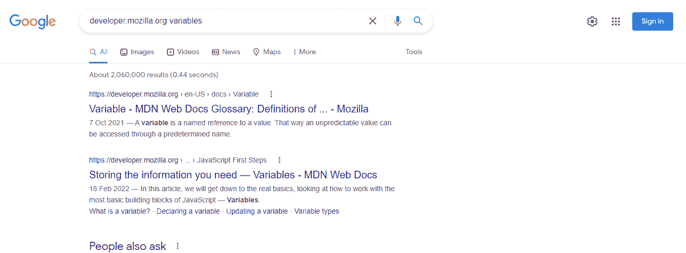

Google search of variables on Mozilla website.

当我点击这个链接时，它把我带到了关于变量的文档。在文档中，你可以了解什么是变量。当我点击“在 JavaScript 中声明变量”链接时:

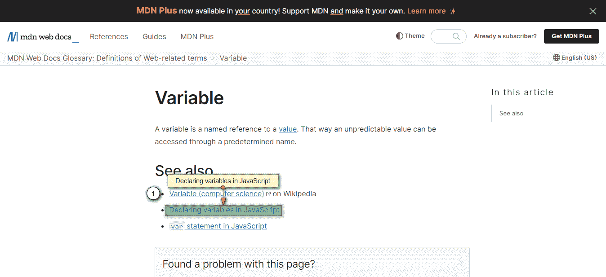

在那里我可以学到更多关于 JavaScript 变量的知识。

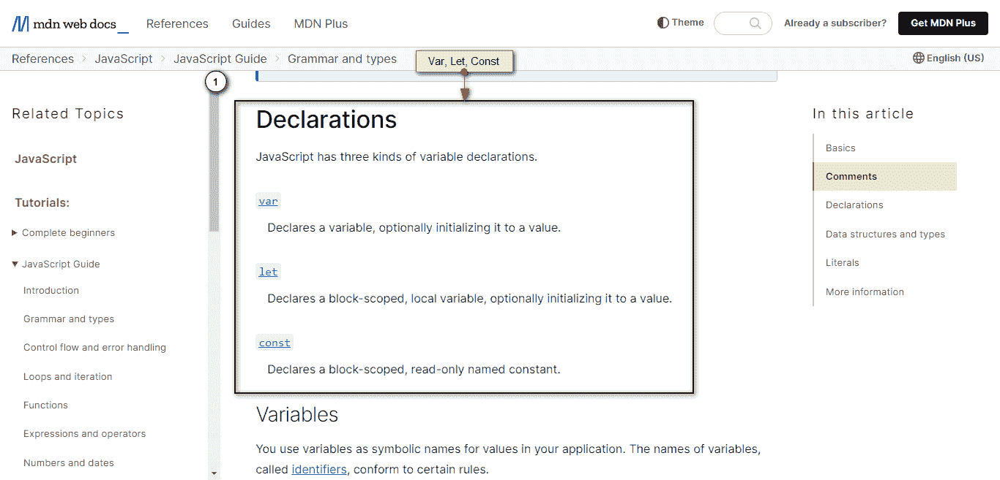

Var, Let, Const on the MDN web docs.

当我向下滚动一点时，我能够了解更多关于数据类型的信息。在这里，您可以通过关注他们各自的链接了解更多信息。

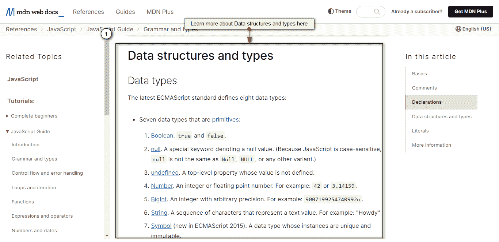

Data types in JavaScript

### 从阅读文档中你可以采纳一些最佳实践

关于文档的最好的事情是你得到了你还没有问的问题的答案。

你可以在文档中找到你要用到的所有函数。如果你浏览一下，你可能会得到一两个对你未来项目很有帮助的想法。

另一个好处是，它将帮助您编写高效的代码。阅读文档可以向您介绍编写代码的更好方法。这有助于你避免在栈溢出和谷歌上搜索你的代码为什么不能工作的时间。

### 为开源项目做贡献

另一个学习的好方法是为开源项目做贡献。

在 GitHub 上有很多你可以学习和贡献的开源项目。其中一些项目包括:

#### 你不知道。

这个资源库将帮助您在更深的层次上了解更多关于 JS 的知识。

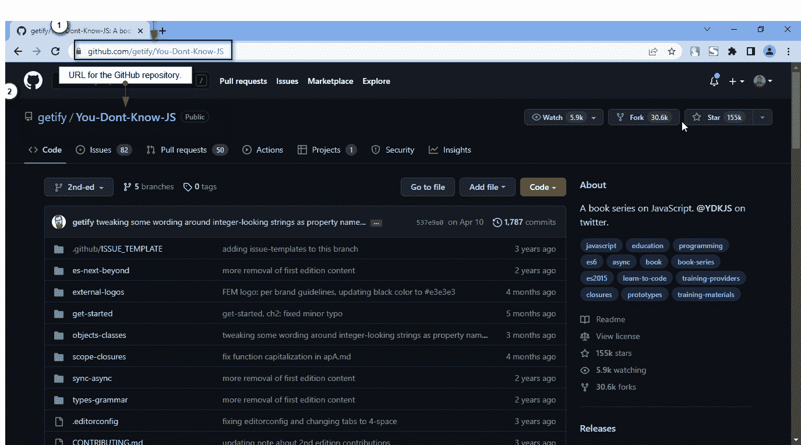

You Don't Know JS repository.

你将能够在贡献中学习。对开源的贡献可以小到一个打字错误的修复。您可以通过阅读自述文件(可以在存储库主页的底部找到)来更好地理解这个项目。

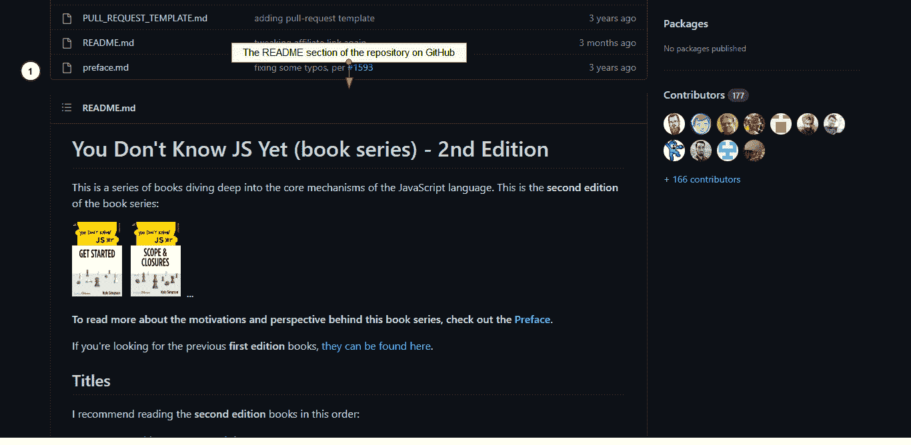

你可以做的其他贡献包括在问题中分享建议，帮助写博客，以及编码。

如果您不熟悉存储库，或者是第一次使用，您可以从“问题”选项卡上标记为`good-first-issues`的问题开始。

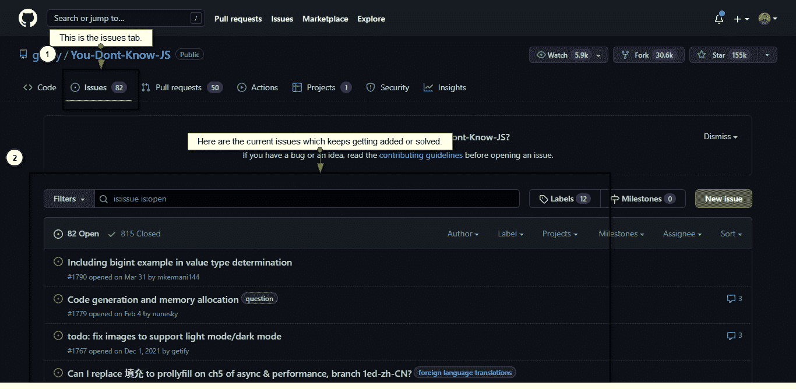

Issues tab on GitHub for a repository.

这是资源库的链接:www.github.com/getify/You-Dont-Know-JS

如果您想要克隆存储库，或者您已经进行了更改，并且想要向存储库发出一个 Pull 请求，请确保您拥有一个 GitHub 帐户。

您可以为包容性社区做出贡献的其他项目包括:

1.  干净的代码 JavaScript。(github . com/ryanmcdermott/clean-code-JavaScript)。
2.  wtfjs。(github.com/denysdovhan/wtfjs)。
3.  ES6-人类。(github . com/meta Grover/ES6-for-humans)。

通读这些项目的代码，了解他们是如何构建代码的。您还可以学习他们使用的语言和框架，这将有助于您练习和巩固您的 JavaScript 学习。

开源社区通常也非常受欢迎。如果你发现了一个你喜欢的项目，那就试试吧！

#### 如何为开源做贡献

为了能够对开源做出贡献，你只需要三样东西:

*   一台电脑
*   GitHub 账户
*   贡献的愿望

要创建 GitHub 帐户，请访问 [GitHub 的网站](https://github.com/)。

GitHub's sign up page.

在这里，你可以注册一个 GitHub 账户。注册后，您可以使用新凭据登录。

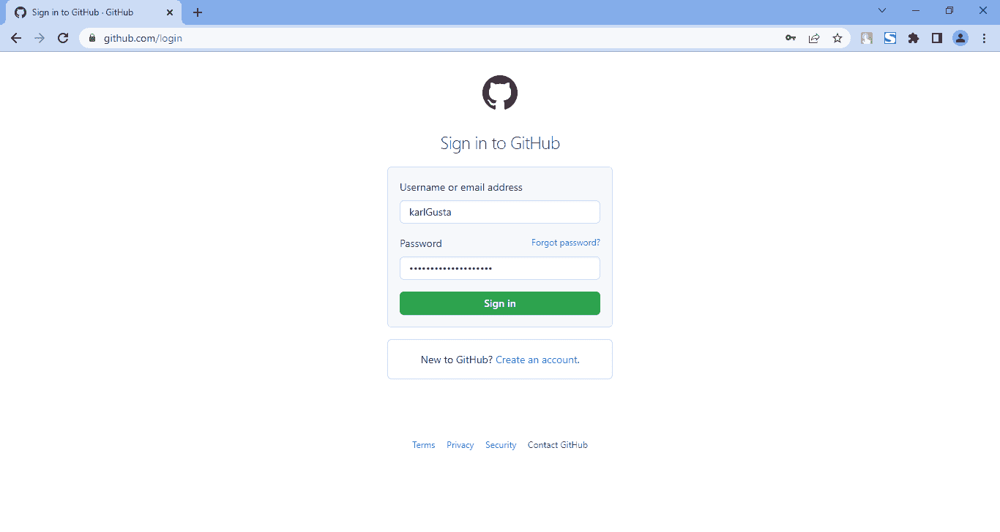

Sign in page of GitHub.

登录后，您现在可以开始您的开源开发之旅了！

一个好的开始是寻找任何你想参与的项目。我们将使用一个托管在 GitHub 上的 JavaScript 项目的例子。

### 如何找到可以参与的项目

在搜索栏中，我输入“JavaScript”。

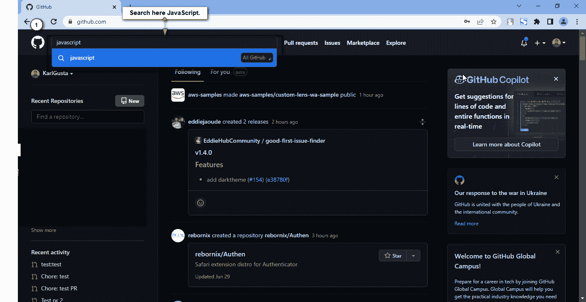

然后，我将在搜索中选择“All GitHub”来搜索整个 GitHub。这是目前用蓝色突出显示的。

当我搜索的时候，会把我带到这个页面。

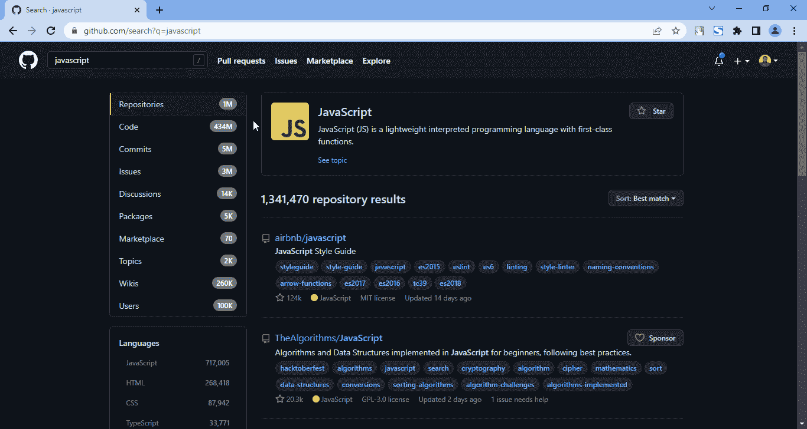

它返回许多我可以贡献的库，或者我可以查看他们的代码库。

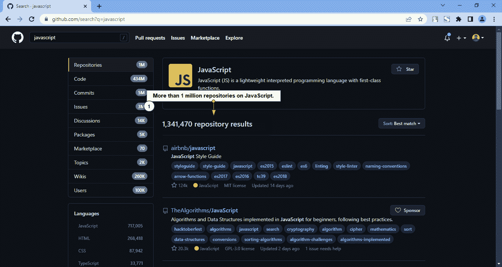

JavaScript 上有超过一百万个资源库。在我的例子中，我将选择“Airbnb 的 JavaScript 风格指南”。

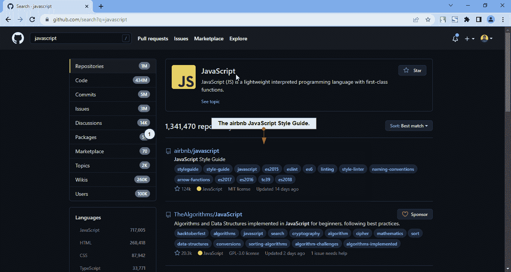

airbnb's style guide.

通过选择这个风格指南，它把我带到他们的仓库。

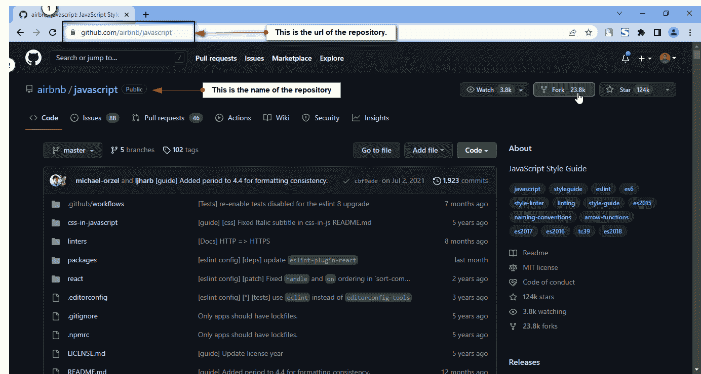

AirBnB's JavaScript style guide.

值得注意的一点是，这个库是学习 JavaScript 的好地方。它会教你写 JavaScript 的正确方法，也会告诉你不好的方法。

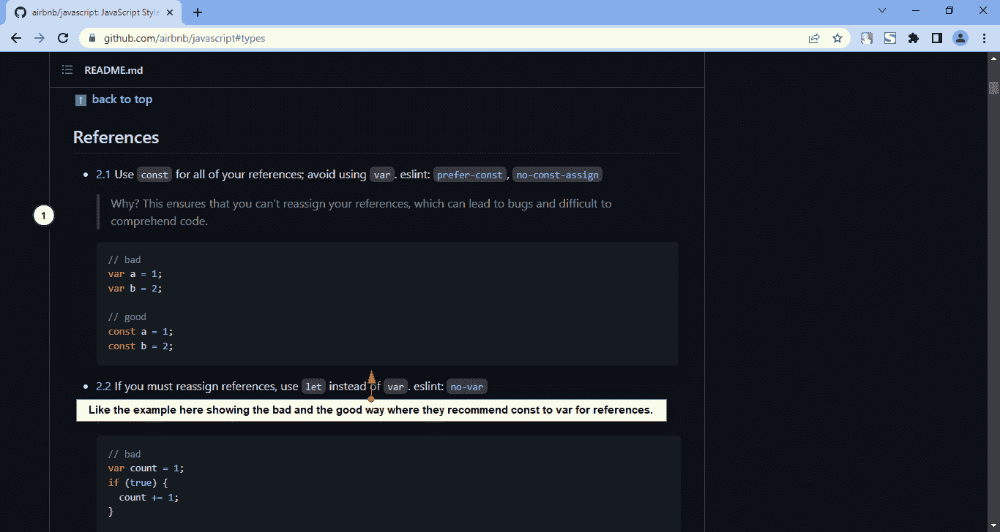

Airbnb's README example code on GitHub.

您还可以选择“问题”选项卡，在这里您可以找到您认为可以解决的问题。

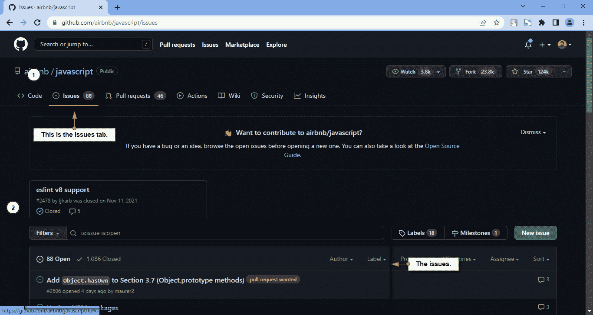

The issues tab on GitHub's AirBnB's repository.

当你点击它时，它会把你带到当前这个库的开发者正在试图解决的问题，并感谢你的帮助。

如果你不喜欢这个库，或者它对初学者不友好，你可以看看其他初学者友好的库，比如`Web development resources`或`EddieHub community`，在那里你可以共享资源、学习并成为社区的一员。

成为社区的一部分是很棒的！

#### Web 开发资源库

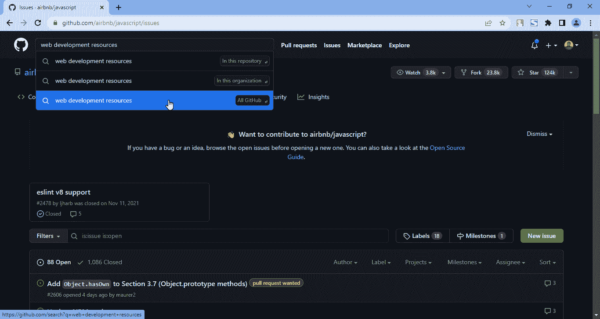

Searching on GitHub.

记住在搜索中选择`All GitHub`，因为我们要搜索整个 GitHub。其他选项有`in this repository`在这个存储库中搜索，以及`in this organization`在组织内搜索。

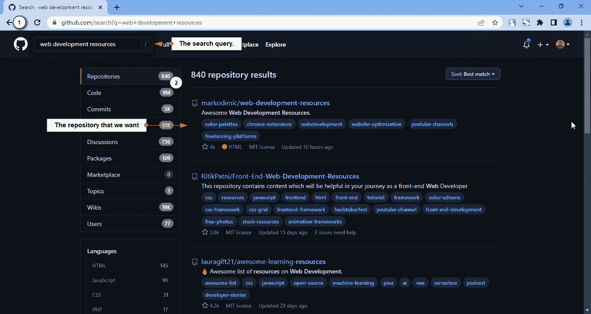

Web Development Resources repository search.

##### EddieHub 社区

仍然在 GitHub 中，你可以搜索`EddieHub`,在那里你可以找到一个欢迎开发者的社区，准备帮助新的开发者免费为开源库做贡献。它有很棒的知识库，你可以在那里学习和贡献。

### 建设许多项目

构建项目确实有助于你理解软件是如何工作的。

想知道当你点击鼠标或键盘时，事情是如何发生的吗——你总是想知道是如何发生的？制作项目有助于你理解所有这些。

你做的项目越多，你对一个话题的理解就越好。你就越能满足你毕生的愿望去发现它是如何工作的。

做项目也会让你变得坚强。你变成了一个无论问题大小都喜欢解决的人。面对编程挑战和解决出现的问题的能力让你成为一个问题解决者。这种能力在生活中随处适用。

> "学习骑自行车的最好方法是买一辆自行车，然后开始骑自行车."卡尔古塔。

要开始骑自行车，你并不真正了解自行车。有时候你不知道自行车的零件，但你仍然会一路骑行并学习，如果你足够好奇的话。

也是在建设项目中，创造力遇到了技术技能。大多数行业都没有一种方法可以让你同时运用你的技能和创造力。但是软件行业有。

你不会每次构建时都面临相同的问题，所以你需要创造性地找到解决方案。挑战和你想出的解决方案是乐趣和满足所在。

它是文档、教程、编码(大部分)和阅读他人代码之间的一个微妙平衡。在这个过程中相信你的直觉。

如果你需要指导来增强自信，这里有一些资源可能会有所帮助。

### 可以启发您构建项目的资源

以下是一些可能有助于构建您的第一个 JavaScript 项目的资源:

1.  **JavaScript 编程-全程(免费)。**

[https://www.youtube.com/embed/jS4aFq5-91M?feature=oembed](https://www.youtube.com/embed/jS4aFq5-91M?feature=oembed)

JavaScript Programming - Full Course.

在 Per Harald Borgen 的视频教程中，您将了解如何使用 JavaScript 创建乘客计数器应用程序。您将学习如何创建变量、添加按钮、添加事件侦听器、函数、字符串、if else 语句、数组等等。所有这些都在 JavaScript 中，而且是免费的。

在同一视频中，还有一个更好的秘密礼物！构建 chrome 扩展。哎呀！我说了。

2.**如何创建一个计数器时钟(免费)。**

[https://www.youtube.com/embed/3PHXvlpOkf4?start=17933&feature=oembed](https://www.youtube.com/embed/3PHXvlpOkf4?start=17933&feature=oembed)

在这个视频教程中，你将学习如何创建一个类似亚马逊这样的电子商务网站上的计数器时钟。

**3。40 个面向初学者的免费 JavaScript 项目**

[在这篇文章](https://www.freecodecamp.org/news/javascript-projects-for-beginners/)中，Jessica 分享了 40 个 JavaScript 项目，你可以构建这些项目来实践你的技能。

你将构建一个反应灵敏的导航条，一个倒计时钟，一个平台游戏，等等。

## 结论

JavaScript 是一种强大的编程语言，如果你想开始编码，这是一种很好的学习语言。

阅读文档的能力会让你更好地理解这门语言。它还将帮助您理解 JavaScript 的最佳实践。

通过课程练习编码，在编写项目代码时通过教程学习，以及为开源做贡献，这些都会让你与众不同。也会让你成为更好的程序员。

通过制作项目，你可以了解 JavaScript 是如何工作的，以及软件是如何工作的。这也有助于你释放你的创造力。

我希望你喜欢阅读这篇文章。如果你有任何问题或建议，请随时在 Twitter 上给我打电话。

回头见！