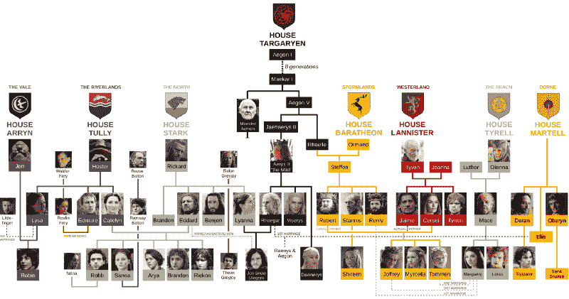
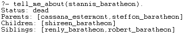
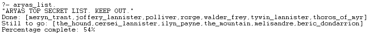

# 如何通过看《权力的游戏》学习 Prolog

> 原文：<https://www.freecodecamp.org/news/how-to-learn-prolog-by-watching-game-of-thrones-4852ea960017/>

瑞秋·怀尔斯

# 如何通过看《权力的游戏》学习 Prolog

#### 他们死了吗？他们还活着吗？她是他的阿姨吗？不要把你的思想抛回到 2011 年，省省力气，用 Prolog 构建你自己的专家。


Image via HBO

#### 必读的《权力的游戏》**剧透警告！包括的事件一直到第七季，不考虑书中发生的任何事情。如果你跟不上速度，小心前进。但是，序言自 1972 年以来保持不变，没有情节曲折，结构简单，本教程将帮助你掌握。**

### 确立事实

Prolog 是一种逻辑程序设计语言，它从事实中形成规则和关系。为了使用 Prolog，查询通过事实的结构化数据库传递。《权力的游戏》因其复杂(通常是乱伦)的家谱而闻名，因此将事物分解成简单的事实为 Prolog 数据库奠定了良好的基础。



Ain’t nobody got time for that. Image via usefulcharts

通过用一组事实开始数据库来简化事情，这些事实可以应用于所有角色。对于家谱来说，一个很好的起点是通过父母来联系角色。以艾莉亚·史塔克为例:

```
parent(eddard_stark, arya_stark).parent(catelyn_stark, arya_stark).
```

这里已经定义了两个独立的事实，说艾德和凯特琳是艾莉亚的父母。然后，您可以在整个《权力的游戏》宇宙中为所有的房子推断这些查询，以创建一个完整的数据库(或者，从我的 [GitHub](https://github.com/rachelwiles/GoT-Check) 中窃取整个数据集)。仅凭这些事实就足以开始提出质疑。最基本的查询是检查数据库中是否存在某个事实。

```
?-parent(eddard_stark, arya_stark).true
```

如果您输入不在数据库中的关系，它将返回 **false** 。您还可以通过使用大写字母在 Prolog 中查询变量。要知道艾莉亚的父母是谁，可以问:

```
?-parent(Parent, arya_stark).Parent = eddard_stark ;Parent = catelyn_stark.
```

在本例中，Eddard 首先返回，因为这是数据库中列出的第一个 **true** 事实。点击分号搜索进一步的正确答案(凯特琳 _ 史塔克)，直到没有剩余。句点将终止搜索。使用下划线作为匿名变量来过滤掉无关紧要的信息。例如，如果您希望看到 Arya 有父母，但不关心他们是谁，请查询以下内容:

```
?-parent(_, arya_stark).true
```


Season 1 Episode 1: The last time anyone smiled in GoT. Image via Fanpop

### 创建规则

现在数据库中已经有了事实，开始创建规则。规则取决于事实。将事实联系在一起创造规则。根据我们上一个例子，从父事实制定一个简单的规则，以确定子关系；如果(Prolog 中写成**:-**)Y 是 x 的父，那么 x 就是 Y **的子**

```
child(X, Y) :-    parent(Y, X).
```

这实质上颠倒了父规则，并允许在家族树中上下搜索。在另一个例子中，假设您想要制定一个由某个事实的*缺席*决定的规则…

```
status(X, dead) :-    not(status(X, alive)).
```

在这里，我扩展了数据库，为每个仍然活着的角色添加了一组规则。该查询在数据库中搜索人 X 还活着的所有实例。**而非**表示，如果没有发现 X 活着，那么 X 就死了。这一规则对于《权力的游戏》来说是有效的，因为它只需要少量的事实，对于少数仍然活着的人来说。


dies(X) :- played_by(X, sean_bean). Image via [nova969](http://www.nova969.com.au)

结合事实创造出更有趣、更具体的规则。例如，为了创造一个母亲/父亲的关系，需要更多关于《权力的游戏》中每个角色性别的事实。完成后，通过以下方式创建一个标识母亲的规则:

```
mother(X, Y) :-    parent(X, Y),    female(X).
```

在上面，我们已经说明了母亲(X)是某人**的父母，而**(在 Prolog 中写为逗号)是女性。

到目前为止，我们已经介绍了在家谱上上下移动，但是还没有涉及到从左到右。通过创建兄弟规则，可以在《权力的游戏》系谱树上进行各种方式的查询:

```
sibling(X, Y) :-    parent(Z, X),    parent(Z, Y),    dif(X, Y).
```

通俗地说，这表示如果两个人(X 和 Y)共享同一个父代(Z ),则他们是兄弟姐妹。这里的 **dif** 函数对于阻止程序将*本身*作为自己的兄弟返回是很重要的。然而，这种方法有其局限性。查询这个将评估 X 的两个父母*和 Y 的两个父母*(经常，但不总是，相同的人)，因此全搜索将返回重复。这可以通过引入列表来解决。


A whole different breed of sibling problems. Image via wordpress

### 列清单

重温兄弟问题，添加列表将实现更好的实现，并在 Prolog 中有许多应用。以前使用的代码仍然可以使用，但是需要使用以下代码将结果收集到一个列表中:

```
list_siblings(X, Siblings) :-    setof(Y, sibling(X, Y), Siblings);    Siblings = none. 
```

**setof** 集合了`sibling(X, Y)`查询的所有可能结果，并将它们存储在一个名为 Siblings 的列表中。在没有兄弟的情况下，**或**组件(在 Prolog 中用分号表示)返回 none。setof 还删除任何重复项，只保留唯一值，从而改进了先前的查询。既然可以为任何字符生成兄弟列表，那么单独的查询可以确定两个字符是否是兄弟:

```
siblings(X, Y) :-    list_siblings(X, Siblings),    member(Y, Siblings).
```

当被查询时，它为 X 构建列表兄弟，并使用**成员**来确定 Y 是否在列表兄弟中。

既然数据库中有了兄弟姐妹关系、父母关系和性别，你就不需要去城堡里的大图书馆去找出谁是琼恩·雪诺的姑姑了。


Should’ve just used Prolog. Image via usatoday

### 递归

《权力的游戏》中的家谱跨度远不止直系亲属。这是有可能的冒险更远，并产生更遥远的关系之间的联系。使用父谓词，Prolog 可以递归地评估数据库以查找祖先。通过在数据库中包含以下 3 个部分来设置递归:

1.  终止段-该段必须出现在循环段之前，以阻止程序无限循环:

```
ancestor(X, Y) :-    parent(X, Y).
```

2.循环部分—该部分反复调用自身，直到满足上述终止条件:

```
ancestor(X, Y) :-    parent(X, Z),    ancestor(Z, Y).
```

3.呼叫部分—查询？-ancestors(X，Ancestor_of)通过上面定义的每次递归开始存储祖先列表:

```
ancestors(X, Ancestor_of) :-    findall(A, ancestor(X, A), Ancestors_of).
```

这里的 **findall** 函数的工作方式类似于的**set，但是不排除重复项，并返回 X 是谁的祖先的列表。**

### 打印和格式化

如果你正在寻找一个一站式商店，在那里你可以得到一个角色的所有信息，你将需要格式化来组织它。要一次性返回一组信息，请在规则中调用先前定义的规则:

```
tell_me_about(X) :-    alive_or_dead(X),    parents(X, Parents),    format("Parents: ~w", [Parents]), nl,     children(X, Children),    format("Children: ~w", [Children]), nl,    list_siblings(X, Siblings),    format("Siblings: ~w", [Siblings]), nl,    !.
```

**format** 返回方括号中代替~w 的任何输出，并打印用引号括起来的所有内容。 **nl** 代表新的线路。切功能(**！Prolog 中的**)防止回溯，所以在找到第一个解后，强制程序停止寻找其他解。在上面的例子中，这确保了所有东西都打印一次。使用史坦尼斯·拜拉席恩对此进行查询会得到以下结果:



当没有变量要输出时，函数 **print** 也可以用来代替 format。


The code is long and full of errors. Image via HBO

### 使用算术

在 Prolog 中可以使用算术运算来解释和分析数据。假设艾莉亚现在想变得超级有条理，用 Prolog 代替记忆列表。她可以使用以下内容进行跟踪:

```
aryas_list :-    print("ARYAS TOP SECRET LIST. KEEP OUT."), nl,    findall(X, on_list(X), MainList),    ticked_off(List),    format("Done: ~w", [List]), nl,    not_dead_yet(AnotherList),    format("Still to go: ~w", [AnotherList]), nl,    length(AnotherList, LCompletedList),         length(MainList, LMainList),    Percent is ((LMainList - LCompletedList) / LMainList) * 100,    Percentage is round(Percent),             format("Percentage complete: ~w%", [Percentage]), nl.
```

在 aryas_list 中，我使用了以下运算符:

*   *相乘
*   减去
*   /划分
*   长度()。生成列表长度
*   圆形()。四舍五入到最接近的整数

结果如下所示:



is_arya :- girl(X), no_name(X). Image via inverse

在介绍了所有工具之后，Prolog 中还有很多更有趣的方式来探索《权力的游戏》的世界。或者，在通过不可争辩的逻辑编程确定了谁应该坐上铁王座之后，彻底放弃看这部剧。

```
rightful_heir(X) :-    parent(robert_baratheon, X),    status(X, alive).
```

结果不言自明…


My inbox is open for debate.

如果您想扩展现有的数据库，或者尝试创建自己的关系，代码在我的 [GitHub](https://github.com/rachelwiles/GoT-Check) 上。

关注我的 [LinkedIn](https://www.linkedin.com/in/rachelwiles/) 未来项目。