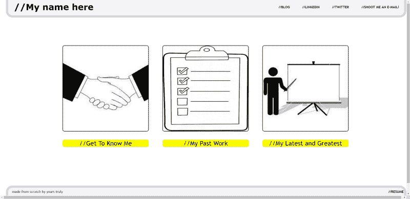
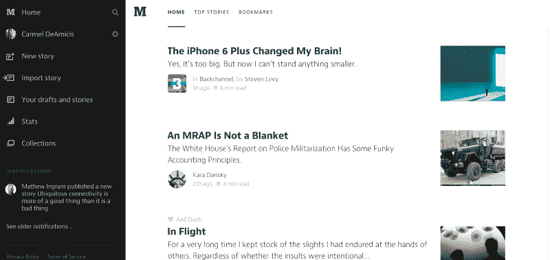
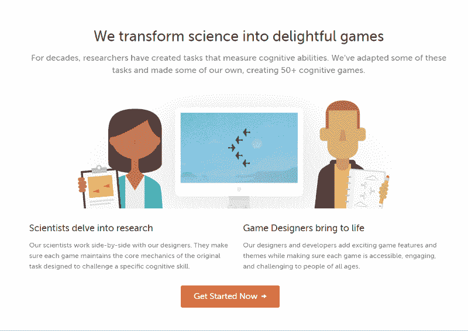
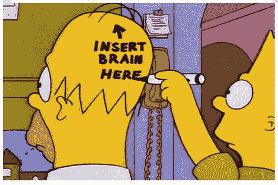

# 当你拥有荷马·辛普森的创造力时，如何学习网页设计

> 原文：<https://www.freecodecamp.org/news/how-to-learn-web-design-when-you-have-the-creativity-of-homer-simpson-a22c0452c99e/>

凯文·科诺年科

# 当你拥有荷马·辛普森的创造力时，如何学习网页设计

#### 对于少数幸运的人来说，设计是自然而然的。这本指南是给其他所有人的。

当你刚开始做网页设计时，你最初的一些创作可能会让人觉得是可耻的失败。

一方面，专业人士设计了你日常使用的所有产品，所以你觉得你必须达到他们的崇高标准。另一方面，你的设计让你想大喊“移开你的眼睛！”给你的用户。

为了搞笑，下面是我个人网站的原网站设计:

为了保持乐观，我们只能说还有很多事情要做。当我开始的时候，我会盯着我的设计，然后修改它们。然后当我不知道到底出了什么问题时，我会用头撞墙。

This is what it feels like to create crappy designs

与编码不同，当你通常可以参考某处的参考资料来解决你的问题时，你可能很难找到如何解决最初设计的方向。感觉就像一系列未知的挑战相互叠加。

因此，这里有 5 种不同的方法来牢牢掌握设计基础，快速分析你自己的设计，这样你可以更快地改进。

请注意，您可以随时停止构建过程或学习过程来学习所有的设计基础知识。那可能要花好几个小时。这些策略将教你如何在构建产品或学习代码的过程中学习设计。

#### 找到你喜欢的设计。复制它们。

这就是有经验的设计师有时所说的“从别人的设计中获取灵感”。换句话说，看看你所在行业的网站，用相似的方式设计你的网站，或者通过颜色，或者更可能是结构。

当你只是一个初学者时，当你尝试一种新的和创造性的方法时，很难说出你做错了什么。你可能会陷入几个小时的思考，为什么你的设计就是不正确。解决办法是看看有经验的设计师在做什么，然后去做。

你可以前往 [Behance](https://www.behance.net/) 或 [Dribbble](https://dribbble.com/) ，查看你所在行业的设计。假设你正在设计一个博客网站。你可以查看一个像 Medium 这样的网站，将你的设计与他们现有的设计紧密结合。以后，或者当你的团队中增加了一个更有经验的设计师时，你可以随时改变它。

An early version of Medium

这实际上让你的用户的生活更轻松。当用户第一次尝试你的网站时，已经有足够的压力去弄清楚这个网站到底是做什么的。添加未知的设计模式可能只会让你的用户感到困惑——尤其是如果你是一个初级设计师。

#### **2。在设计中挑出你喜欢的具体东西，并做笔记。**

比方说，你试图让某种配色方案或信息层次看起来很棒，但你想不出为什么经过多次调整后，它看起来仍然很丑。想一个你已经使用过的例子，它在这个小的、特定的设计上做得很好。去那个网站，记下 3-5 个你喜欢它的地方。

例如:假设我正在设计一个登录页面，我不知道如何快速解释我的网站的几个关键优势。我最喜欢的网站之一是 [Lumosity](http://www.lumosity.com/) ，所以让我们看看他们是怎么做的。

*   每个段落都有 5 个字的精彩解释
*   字体粗细和字体颜色都可以平衡标题和段落
*   段落上良好的行距使其易于阅读
*   页眉和段落靠左对齐，便于阅读
*   如果你再看看这张图片，你会发现它讲述了文字的故事。即使你没有，它也提供了平衡。

一旦你创建了你的正面属性列表，你可以回头看看你的站点中的一个特定的相似部分，并根据你列出的正面属性进行修正。您可以右键单击您喜欢的特定元素，并使用“检查元素”来查看设计使用的确切 CSS。

#### **3。找设计师。成为他们的朋友。尽可能寻求批评。**

如果你一直怀疑自己，学习设计会变得更加困难。如果你不知道哪里出了问题，你不能只考虑几分钟或几个小时，然后期望把它做好。

所以，如果你能和稍微有点设计专业知识的人讨论你的问题，你会学得更快。大多数设计师应该能够立即指出缺陷，你将能够从他们的分析中学习。

以下是如何找到这些慷慨的设计师之一:

如果你在一家老牌公司工作:想办法结识设计团队的成员，可以通过你公司的一个共同朋友，也可以直接接近他们中的一个。告诉他们你想学什么，问他们是否愿意每周给你 1-2 次 15 分钟的时间来谈论设计。如果他们是一个好老师，他们会发现这是值得的！

*如果你在一个共同工作的空间/孵化器/加速器工作:*如果你的团队还没有一个设计师，那就去找你所在空间的另一家公司的设计师吧！他们会很乐意帮忙，因为他们只是想让自己的公司像你一样起步。明确学习设计对你来说很重要，这对你的团队成功至关重要。这不仅仅是一种模糊的好奇。还是那句话，15 分钟，一周一到两次对你们俩来说都应该是合适的。

*如果你在家工作或者没有一个明确的方法去见设计师:*使用 [Meetup](http://www.meetup.com) 去查看网页设计师可能会参加的当地活动。这可能是一个专注于网页设计的聚会，甚至是一个前端开发者聚会。你也可以查看[免费代码营地列表](https://github.com/FreeCodeCamp/freecodecamp/wiki/List-of-Free-Code-Camp-city-based-Campsites)，看看你所在的地区是否有一群初学 web 开发的人。在网上向大家宣布你自己，当你参加一个活动时，开始告诉人们你正在努力完成什么。如果他们感兴趣，问问他们是否愿意抽出时间来帮忙！

当然，以上三种方法都假设你没有自己的设计师朋友。如果你这样做了，这些将是最好的交谈对象。

What it feels like to struggle with design

#### **4。用你已经使用的程序制作模型，比如 PowerPoint 或者 Keynote**

你可能会想学一个像 Adobe Illustrator 这样的真正的网页设计程序。虽然从长远来看这是有帮助的，但是当你花时间学习如何使用一个新工具时，它会创造一个 20 多个小时的学习曲线。

或者，如果你在没有创建模型或设计的情况下构建你的产品，你可能会花几个小时调整 CSS 而没有一个清晰的网站愿景。

我强烈建议你创建模型。它可以让你练习创建一个完整的页面，而不用花时间编写代码。Powerpoint 和 Keynote 是两个很好的选择。

您可以通过向按钮添加触发器来构建交互式模型。最重要的是，你可以使用熟悉的系统来学习设计。你甚至可以像在 Illustrator 中一样[设置网格线](https://www.youtube.com/watch?v=JSlUkkRoObI)。

然后，在编写代码之前，**调整这个设计，直到你满意为止。是的，它看起来会和在浏览器中有一点不同。但是你可以快速尝试不同的选项，并根据设计师的反馈进行调整。**

这也将促使你完全理解进入特定视图的所有不同的设计决策。不要在颜色或字体上吝啬，或者其他任何东西。使其尽可能接近像素完美。需要灵感来做好每一件事？看看[的土坯颜色](https://color.adobe.com/)或者[的谷歌字体](https://www.google.com/fonts)。

#### 5.读一本关于设计原则的书

这是最后一个选择，因为它会让你完全脱离产品构建过程。但是，你可以选择一本更实用的书，而不是更理论化的书。

对于一个创造能力有限的人来说，理论书上的建议尝试起来可能有点挑战性。当你阅读它们的时候，它们可能是有意义的，但是试图实现它们可能会让你回到你开始时的困惑中。

我推荐一本围绕现实世界中成功的网页设计进行教学的书。这里有一本很棒的、[关于设计基础的免费电子书，并附有网站示例](https://studio.uxpin.com/ebooks/visual-web-ui-design-colors-space-contrast/)。

#### 释放你内心的设计师

与编码不同，你不能通过查阅设计参考来学习进行功能设计的确切方法。

当你把你的设计展示给用户看的时候，你可能会发现你的设计有多糟糕，而他们会说“这看起来不太对”，或者“这不太好看。”

不要期待他们的具体反馈！

此外，不要犹豫让自己被优秀包围，并从中“获取灵感”。模仿伟大设计师的设计——或者下班后和设计师一起闲逛——将会帮助你比一个初学者试图发明自己的解决方案学得更快。

请记住，每个伟大的设计师都必须经历那个讨厌的初级阶段。

这本指南对你有帮助吗？请在评论中告诉我！