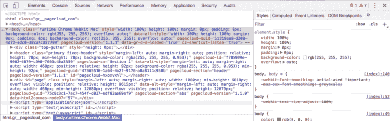
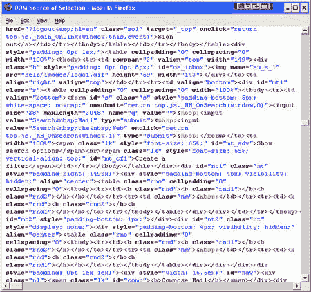
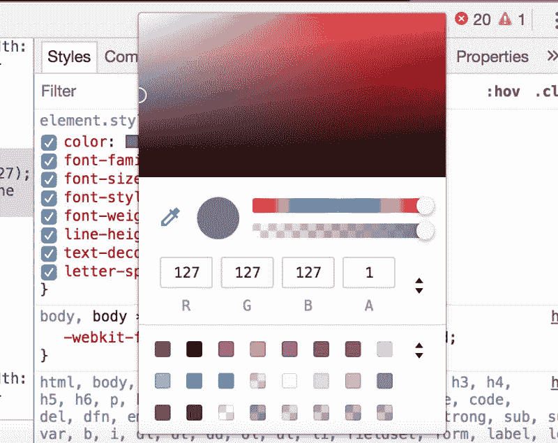
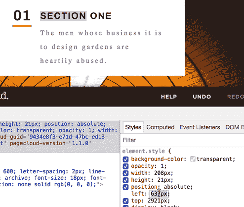
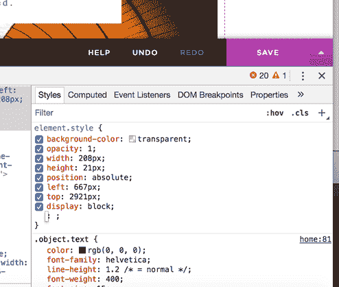
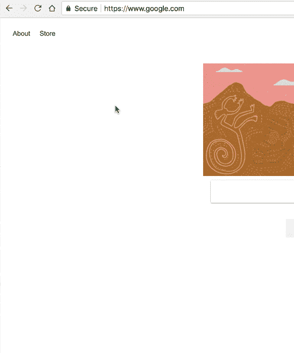
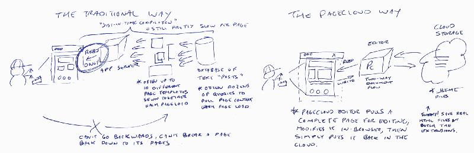
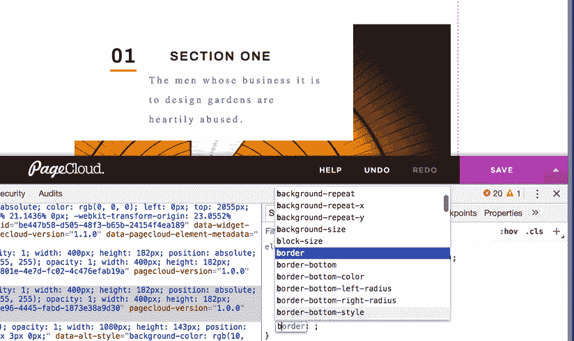

# 如何利用现代网络检查员的力量

> 原文：<https://www.freecodecamp.org/news/how-to-leverage-the-power-of-the-modern-web-inspector-b94dd85e1917/>

克雷格·菲茨帕特里克

# 如何利用现代网络检查员的力量

自“查看源代码”时代以来，这个小巧、方便的工具(也就是 Web Inspector)已经取得了长足的进步！

对于那些太年轻不记得的人来说，回到网站开发的史前时代,“查看源代码”命令只是在 Windows 记事本中打开一个页面的 HTML。不太好。

快进到今天，我们已经…

…内置颜色选择器的可修改 CSS 规则…

…使用键盘微调像素值的能力，使您的内容实时移动…

…其中最伟大的发明是“look-ahead”，它可以在您键入时自动完成 CSS 名称和值。这为您节省了因糟糕的拼写而导致的调试时间:

许多开发人员甚至还没有发现大多数 Web 检查器中内置的所有小惊喜。

例如，**您知道**您可以在检查器中构建一个完整的 HTML 页面吗？

只需打开一个新的标签和检查器(你可能会看到一个谷歌搜索页面或其他默认页面),并开始从 DOM 检查器中删除节点。一旦你只剩下 HTML 节点，右击并选择编辑为 HTML。

在上面的浏览器框架中自动实时预览您的作品，从头开始构建您的页面！您甚至可以在检查器中拖放 HTML 节点来移动内容。

甚至不要让我开始谈论 JavaScript 控制台在检查内存、在堆栈中上下移动等方面有多棒。

这是一个网页开发员的好日子！

### 但是

但是有一个小问题。保存您的工作最近才可用[，有点笨拙](https://youtu.be/wz1Sy5C039M?t=6m17s) …您必须:

*   打开导航器并选择覆盖
*   启用本地覆盖
*   右键单击 CSS 文件并保存覆盖

当然……这里有一些非常强大的技术，但是您如何快速将您的更改返回到您的生产站点呢？呃。如此接近完美！

### 页面云

当我在写第一个版本的 PageCloud 时，这是我想的事情之一。

尽管 PageCloud 是一个帮助非技术人员构建网页的可视化网站构建器，但我想:DOM inspector 是一个如此强大的工具，如果您可以简单地进行一些更改并立即将它们发送到云中，岂不是很棒？

因此，我开始了一项任务，让开发人员能够使用 Web Inspector 来编辑生产网站。

然而，实现这一点的唯一方法是后退一步，重新思考网页是如何构建、管理和服务的。

路上有一大堆技术挑战，比如应用服务器、模板、嵌套、数据库、缓存…

所以我决定从桌面出版剧本中吸取一页。想法很简单:你启动一个能够阅读、编辑和创建文档的应用程序。一旦你点击保存，你所有的改变都将生效。

所以我问自己:

> 如果我们简单地把网页看作文档会怎么样？

我不会让你厌烦让它真正工作的努力(以及帮助减轻痛苦的几瓶酒)，但这个最初的想法是 PageCloud 今天一切的基础。而且，到目前为止，我们是唯一这样做的人。

基于这个概念，我们能够让用户以与桌面应用相同的方式与网络交互:例如从剪贴板复制/粘贴，分层，调整大小，以及在页面上自由移动对象。

同样的想法允许我们与 Web Inspector 集成，使用户能够调整任何东西，点击保存，然后就完成了。

这里有一个简单的例子:

利用现代 Web Inspector 的所有优点，您可以:编辑 HTML、CSS，并创建指向外部 CSS 和 JS 的链接。您甚至可以在 JavaScript 控制台中运行命令来修改 DOM！

任何修改 DOM 的方法都是公平的。当您“保存”时，您的所有更改都会被保存下来并发送回云端——因为您的页面毕竟是一个文档！

由于 web inspector 的魔力，您甚至可以从一个浏览器窗口复制节点，并将其粘贴到另一个页面的 DOM 中。

是的，我们雄心勃勃。但我们相信，这种新的思维方式将使 PageCloud 成为有史以来第一个满足视觉设计师需求的工具，同时保持开发人员不受限制的访问。

也许在不远的将来的某一天，“Inspect”会被一个人性化的界面所取代，加入“view source”这个过时的行列。也就是如果 PageCloud 有关系的话！