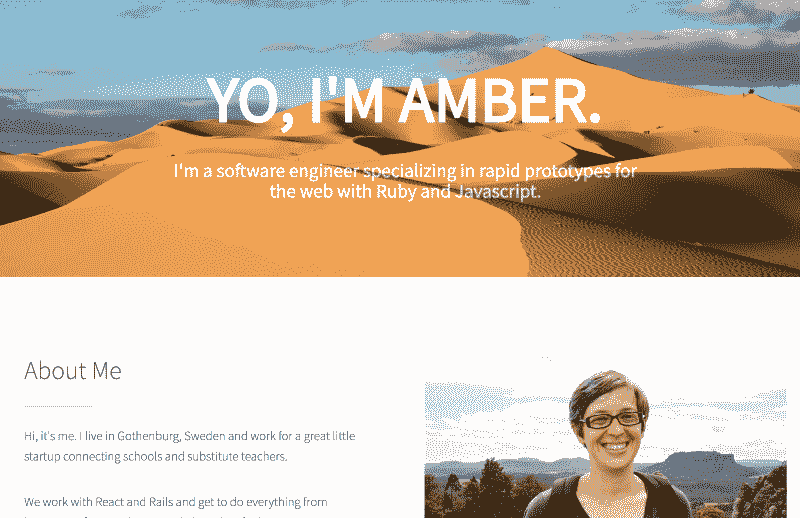
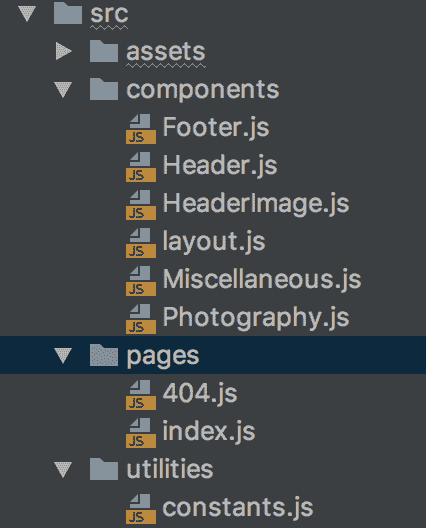

# 如何利用静态站点生成器 Gatsby.js 的 React 技能

> 原文：<https://www.freecodecamp.org/news/how-to-leverage-your-react-skills-with-static-site-generator-gatsby-js-81843e928606/>

有时候一个动态的单页应用程序是多余的。你只需要在网上获取一些有吸引力的信息。欢迎回到静态网站。有了 [Gatsby.js](https://www.gatsbyjs.org) 框架，你不必为了追求更快、更好、更弱而放弃你的 React 技能。


Hiking above the treeline in Bucegi, Romania — totally unrelated to web development, but pretty

### 什么是静态站点，你为什么想要一个静态站点？

与动态网站相反，静态网站 a)不与数据库交互，b)对每个人来说看起来都一样。静态站点的每个页面都是一个独立的文件。

如果你使用过 React 或大多数其他前端框架，你会发现这不同于我们目前最喜欢的“单页面网站”模式——你可以点击链接，但你总是停留在“同一页面”。互联网上的每个 React 站点几乎都完全呈现在一个非常基本的 HTML 页面的`app` div 中。div 内部的所有内容都是动态生成的。通常是专门为电脑前的用户设计的。

理解静态站点不能做的一些事情可能会更有帮助:

*   基于数据库信息动态呈现页面(例如，在 id 为>的`/user/<user-`显示用户信息)
*   生成和使用登录/用户验证
*   确保数据的持久性(当然，您可以使用 cookies，但是您的用户总是可以随意丢弃它们)

#### 优势

静态网站速度很快，因为它们不需要通过任何数据库来获取信息。当用户从浏览器中请求页面时，它们也已经被渲染和构建，所以它是即时可用的(当然，尽管有图像加载)。运行网站所需的所有代码都提供给浏览器，并且在本地运行。

静态站点可以简单地用托管**。没有 Heroku 睡着，没有服务器运转。不言而喻，这是让你的内容走向世界的最便宜的方式。大多数人会对简单网站的免费选项感到满意。**

静态站点**稳定**。越来越多的用户加载你的网站的唯一障碍是你存放文件的主机服务器。不用担心数据库负载或处理。它只是发送 HTML、CSS 和 Javascript 文件，只要你的主机允许，它就能尽快完成。

#### 不足之处

所有主要的缺点都包含在静态网站的概念中:难以更新内容，缺乏对用户的响应。如果你的项目需要登录，静态网站并不适合你。如果你有大量的内容，或者你想以相似的方式显示相似的内容，这可能也是一个错误的工具。

我个人并不认为博客是这样一个工具的好候选，因为从创建到发布需要太多的步骤。如果你使用过 Wordpress 之类的东西，那将会感觉很难让事情变得真实。话说回来，你可以从头到尾控制你的内容，这对很多人来说非常有吸引力。

本文的其余部分将讨论如何创建一个静态站点。就在几年前，如果你想要一个，你必须从头开始写所有的东西。然后可能通过 FTP 等进行部署。但是我在这里要说的是:你可以用你的 React 技能建立静态网站。让我们跳进来。

### ms 项目



My portfolio site, built in Gatsby.js

我最初进入 [Gatsby.js](https://www.gatsbyjs.org) 的原因是，我想重做我的作品集网站。我一直在使用一个修改过的模板，通过 FTP 上传到我的托管网站。更新是一件痛苦的事情，我已经好几年没碰它了。我不想在 React 中构建它，因为那样我就得在 Heroku 上托管它。如果没有人使用 Heroku 的免费应用程序，它会让它们休眠——我觉得这种延迟是不可接受的。我知道一个静态站点会快得多，而且永远不会休眠。

我很高兴发现 React 内置了静态站点生成器！我可以将我的 React 技能用于构建可以部署在 Github 页面上的东西。得分！

如果你是那种想直接进入代码的人，欢迎你参加我的[投资组合](http://www.amberwilkie.com)的 [github 回购](https://github.com/AmberWilkie/portfolio)。

### Gatsby.js vs. Next.js

在研究这篇文章的过程中，我发现很多人指向 [Next.js](http://www.nextjs.org) 。它确实有一个选项[导出静态内容](https://nextjs.org/docs/#static-html-export)，但是它通常运行在服务器上(进入 Heroku sleeping ),通常用于那些想要使用服务器端渲染的人。我不能把它作为这样的工具，但它看起来很整洁，如果你需要做一些 SSR，你应该看看它。

对我来说，各种网络推荐 [Gatsby.js.](https://www.gatsbyjs.org/) 当我开始制作自己的作品集时，我立刻就爱上了它。

### 为什么是盖茨比？

一句话:**反应**。我已经知道如何在 React 中构建东西，Gatsby 为我利用了这些技能。但是还有更多。更多。

#### 社区

Gatsby 有一批忠实的追随者，并且有许多人在开发与框架一起使用的库。截至本文写作时，盖茨比有 [545 个插件。此外，您可以使用大量的标准 React 库来构建您的站点。](https://www.gatsbyjs.org/plugins/)

#### GraphQL，API，以及互联网拥有的所有数据

在构建时(当您，即开发人员，构建网站时，而不是当用户访问它时)，Gatsby 可以接触到互联网，从任何您想获得的地方获取您想要的所有信息。在这里，您可以访问任何 API，包括您自己构建的 API。然后 Gatsby 将这些数据合并到它生成的 HTML 中，并基于这些数据创建页面。

GraphQL 内置在构建包中，因此您可以使用您可能已经熟悉的工具。如果你更喜欢使用类似于`fetch`(或者更广泛支持的`axios`)的东西，那也没问题。因为您或多或少在编写 React，所以您可以使用任何 React 包来让您的船漂浮起来。

当然，由于站点运行时没有服务器交互，Gatsby 将数据转储到 JSON 文件中。盖茨比从那里拉渲染。

#### 内置图像延迟加载

如果你曾经调整过网页图片的大小，你就会知道以合理的速度显示图片是多么的烦人。输入`gatsby-image`。这个插件允许你预先加载你的图片，并在那个时候以适合浏览器的尺寸交付它们。

#### 速度极快

Gatsby 包括开箱即用的代码和数据分割，因此您的站点将会爆炸式增长。它还为你没有看到的网站部分预取数据。当时机成熟时，它会向你的用户提供新的信息。

### 现成的好东西

《盖茨比》让入门变得很容易。除了建立在 React 之上，我最喜欢的盖茨比部分是自动路由。

#### 按指定路线发送

有一个`pages`文件夹，你可以把你网站的所有链接放在里面。因此，您可能有一个索引页面，按照惯例您将把它命名为`index.js`。你可能也有一个`about`页面和一个`contact`页面。Gatsby 希望你将你的`pages`文件夹中的文件命名为与你的网站链接相同的名称。



Folder structure in a Gatsby.js project

因此，当您创建一个`About.js`和`Contact.js`时，您将自动生成到`/about`和`/contact`的路由。在这些父组件中，你可以放置任何你想要的代码，包括额外的组件，它们将会存在于你的`pages`文件夹之外的某个地方。

如果你曾经设置过 React 路由器，这感觉就像一个该死的启示。实际上根本没有工作要做。您将正确命名的父组件(您可能在 React 项目中将其命名为`containers`)放入`pages`文件夹中。盖茨比替你做所有的工作。

要链接页面，使用简单的`<Link to='/contact'>Contact&`lt；/Link >。

#### 工具作业

盖茨比的另一个伟大之处是，它是多么令人难以置信地容易启动和运行。当然，有一个 CLI 工具，所以事情很简单:

```
npm install --global gatsby-cli
gatsby new site-name
gatsby develop
```

盖茨比照顾一切，就像`create-react-app`一样。你有现成的热重装。当你完成并准备将坏男孩发送给你的主机提供商时，只需`gatsby build`将静态内容发送到你想要的任何地方。

#### 初学者库

这个社区的另一个优点是有大量可用的[初学者库](https://www.gatsbyjs.org/starters/?v=2),这样你就不必从头开始每个项目。如果你知道你想要一个博客，或者一个类似 powerpoint 的演示网站，甚至是一些带有设计的东西，Gatsby 可以让你快速有效地走上这条路。

(确保你选择了一个基于《盖茨比》第二版的入门游戏！我经历了惨痛的教训:升级并不愉快。)

### 代码

所以我们来看看盖茨比项目代码是什么样子的。

#### 布局/index.js

我们从应用程序开始的地方开始:我们的`components/layout.js`。在删除了一些我不太需要或不想要的启动加载代码后，我的代码看起来是这样的:

```
import React from 'react'
import '../assets/scss/main.scss'

import Header from '../components/Header'
import Footer from '../components/Footer'

class Template extends React.Component {
  render() {
    return (
      <div className='body'>
        <Header/>
        {this.props.children}
        <Footer/>
      </div>
    )
  }
}

export default Template;
```

按照惯例，我们将在这个`Template`组件中包装任何页面。如果我们需要不同的模板，当然我们可以在任何我们喜欢的地方使用它们。

(注:盖茨比 v1 自动从你的`layouts/index.js`抓取代码，应用到所有页面。Gatsby v2 希望您手动管理您的布局。)

我们需要导入样式表。看，我们可以用 Sass！你需要添加`node-sass`和`gatsby-plugin-sass`，否则就写你的 sass，把它导入到你的站点顶部，然后很开心。

#### page/index . js

`pages/index.js`是我们的应用真正“开始”的地方。

这是我的网站的全部组件。我…编辑了文本以缩短内容，但除此之外，我把所有内容都留在这里，这样你就可以看到 Gatsby 代码看起来*完全*像 React 代码，因为它就是。

```
import React from 'react'
import me from '../assets/images/main/me.png'
import Helmet from 'react-helmet'
import Template from '../components/layout'
import Photography from '../components/Photography'
import Miscellaneous from '../components/Miscellaneous'

class IndexPage extends React.Component {
  state = {}

  ChevronLink = () => [...]

  render() {
    const { showMiscellaneous, showPhotography } = this.state

    return (
      <Template>
        <div>
          <Helmet>
            <meta charSet="utf-8"/>
            <title>Amber Wilkie, Software Engineer</title>
          </Helmet>

          <section id="aboutMe" className="main style1">
            <div className="grid-wrapper">
              <div className="col-6">
                <header className="major">
                  <h2>About Me</h2>
                </header>
                <p>Hi, it's me...</p>
                <div className='about-me-links' >
                  <a href='http://www.medium.com/@heyamberwilkie'>Tech Blog</a>
                  {this.ChevronLink('showPhotography', 'Photography')}
                  {this.ChevronLink('showMiscellaneous', 'Etc')}
                </div>
              </div>
              <div className="col-6">
                <span className="image fit">
                    
                </span>
              </div>
            </div>
          </section>
          {showPhotography && <Photography />}
          {showMiscellaneous && <Miscellaneous/>}
        </div>
      </Template>
    )
  }
}

export default IndexPage;
```

这里的一切都是非常基本的 React 东西:一些跨度切换网站的部分，导入/导出，你知道这些东西。您可能需要注意的唯一一点是，我们必须导入并引用导入的元素。我不能“链接”本地映像:在构建时，那些引用是动态生成的。如果您想要引用您的任何资产，您将需要导入它们。

### 数据提取

我的站点中最有趣的组件是`Photography`。同样，我删除了一些代码，并…删除了其他代码，为重要的部分腾出了空间。

```
import React, { Component } from 'react'
import { StaticQuery, graphql } from 'gatsby'
import Img from 'gatsby-image'
import { CSSTransition } from 'react-transition-group'
import { travelDescriptions } from '../utilities/constants'

class Photography extends Component {
  state = {
    currentImage: this.props.data.Images.edges[0].node,
    imageIndex: 0,
  }

  changeImage = () => [...]

  render() {
    const { currentImage } = this.state
    const imageSizes = currentImage.childImageSharp.sizes
    const imageName = currentImage.name

    return (
      <section id="photography" className="main style2">
       <div className="grid-wrapper">
         <div className='col-3'>
           <header className="major">
             <h2>Photography</h2>
           </header>
           <CSSTransition>
             [... photo descriptions ...]
           </CSSTransition>
         </div>
         <div className="col-9 image-holder">
           <div key={imageName}>
             <div className='left' onClick={() => this.changeImage(-1)}/>
           
          <div className='right' onClick={() => this.changeImage(1)}/>
        </div>
      </div>
    </div>
  </section>
)
  }
}

const query = graphql`
    query imagesQuery {
        Images: allFile(
            sort: {order: ASC, fields: [absolutePath]}
            filter: {relativePath: {regex: "/travel/"}}
        ) {
            edges {
                node {
                    relativePath
                    name
                    childImageSharp {
                        sizes(maxWidth: 1500) {
                            ...GatsbyImageSharpSizes
                        }
                    }
                }
            }
        }
    }
`
export default () => <StaticQuery
  query={query}
  render={data => <Photography data={data}/>}
/>
```

```
export default () => <StaticQuery  query={query}  render={data => <Photography data={data}/>}/>
```

#### GraphQL 数据提取

让我们看看该组件的最后一部分。尽管你的站点在运行时是静态的，但它可以在构建时提取各种数据。这就是我们的 GraphQL 获取的用武之地，它是 Gatsby 核心库的一部分。因为我在一个组件中工作，所以我需要使用 Gatsby 的`StaticQuery`，它将把我的查询结果传递给`this.props.data`。

如果我在一个*页面*上做这个查询，我可以简单地将我的查询转储到代码中。它会自动将结果传递给`this.props.data`。注意`StaticQuery`不能接收 props，但是页面上的匿名查询可以。

它在这里做同样的事情。如果你有一个更复杂的数据结构，你可能更喜欢创建一个可以传递`data`道具的数据层。这里我们需要页面上的 GraphQL 查询来获取 props 中的`data`。

这只是 Gatsby 如何从本地文件夹中获取数据的一个例子。要了解更多信息，请查看来自 [Gatsby 文档](https://www.gatsbyjs.org/docs/graphql-reference/)的 GraphQL 参考。框架中还内置了许多图像采集工具。更多的例子[在文档](https://www.gatsbyjs.org/docs/working-with-images/)中也有。


gatsby-image progressive loading

但是这里我们就只说说我在做什么。我正在寻找我的`travel`文件夹中的任何文件。然后`childImageSharp`将创建一个大小数组，我们将它传递给`Img`组件(来自非常流行的`gatsby-image`插件)。`Img`将为我们创建一个模糊的占位符，并根据我们的浏览器大小提供有效的图像大小。很漂亮，对吧？

最后，别忘了那张图片`key`。您没有映射任何东西，但是`gatsby-image`希望您告诉它图像加载的位置，这样它就可以创建一个非常模糊的占位符。

### 额外好处:部署在网络上

用 [Netlify](https://www.netlify.com) 在互联网上获取你的代码甚至更容易。这些人让你跳过构建步骤，直接把你的内容上传到 Github。Netlify 将把你的代码从回购到在线可用，基本层是免费的，包括 SSL。甚至还有一个(简单得可笑的)[一步一步的指南，让盖茨比页面启动并运行](https://www.netlify.com/blog/2016/02/24/a-step-by-step-guide-gatsby-on-netlify/)。每次你在 Github 上提交 master，都会触发一个 Netlify 构建。因为 Gatsby 在构建时从内部和外部来源获取数据，所以每次构建运行时您都会获得新的数据。

### 好处:通过 IFTTT 自动部署

作为一个额外的步骤，您可以考虑为您的站点创建一个自动部署，这样您就可以从外部资源获取新内容。例如，可以通过`gatsby-source-medium`插件添加中型文章摘要(我可以证明这很容易设置)。

Netlify 将为您提供一个用于发布请求的 URL。当您这样做时，将触发站点的重新构建和部署。你可以根据自己的意愿，使用自己喜欢的工具来设定条件。

我可以支持 if TTT T1，这是一项服务，如果你以前从未听说过，它会让你开心一天。如果这为你创造了网络钩子。所以你可以以发布一篇新的媒体文章为条件。IFTTT 将处理监听器和动作。如果您发布到 Medium，它将发送发布请求。您的 Gatsby 站点将通过对 Medium 的 GraphQL 查询获取新内容。您的站点将使用您的新文章摘要进行重新部署。

去拿吧，朋友们。

### 参考

*   [静态网站定义](https://techterms.com/definition/staticwebsite)
*   [什么是静态站点生成器？](https://wsvincent.com/what-is-a-static-site-generator/)
*   [盖茨比 vs Next](http://blog.jakoblind.no/gatsby-vs-next/)
*   [盖茨比文件](https://www.gatsbyjs.org/docs)
*   非常感谢[玛丽贝尔·杜兰](https://www.freecodecamp.org/news/how-to-leverage-your-react-skills-with-static-site-generator-gatsby-js-81843e928606/undefined)为[创作了这么棒的教程](https://medium.freecodecamp.org/how-i-made-my-portfolio-website-blazing-fast-with-gatsby-82ccddc2f671)。不过要小心:她提到了《盖茨比》第一版的开头。如果你使用它，你会讨厌它，因为从盖茨比 v1 升级到 v2 是一笔巨大的开支。我强烈建议您从 v2 中的构建开始。