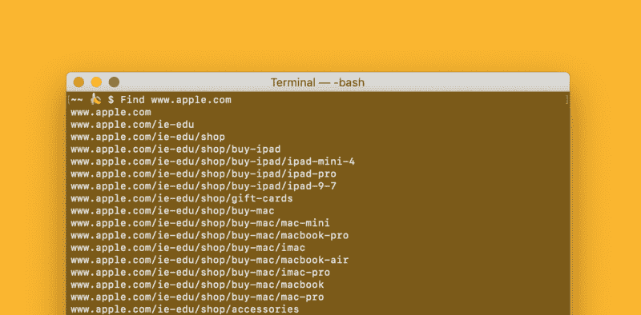
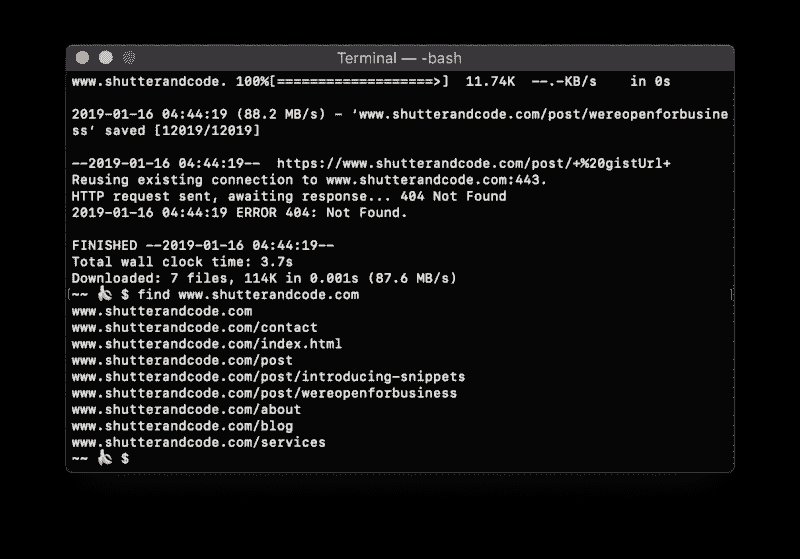

# 如何快速列出所有与网站相关的 URL

> 原文：<https://www.freecodecamp.org/news/how-to-list-out-all-urls-associated-with-awebsite-fast-ish-d6056401ad85/>

泰·欧文

# 如何快速列出所有与网站相关的 URL



所以你需要一个包含所有网址的列表？你可能在做一些重定向吗？达到了 XML 站点地图的极限？酷，我也是。我为你准备了一个工具，它能以和 XML 站点地图一样的速度完成这项工作，但是你看起来会更酷。

### 教程实际开始的地方

为了获得您的 URL 列表，我们将使用 Wget！

### 弗丽嘉是什么？

> Wget 是一个使用 HTTP、HTTPS 和 FTP(最广泛使用的互联网协议)来检索文件的免费软件包——[酿‍Formulas](https://brewformulas.org/wget‍)

您还可以使用它来请求与某个域相关联的 URL 的大列表。‍

### ‍1.安装 Wget

如果你还没有安装 Wget，你需要先安装[home brew](https://brew.sh/)；又名酿造。？Brew 是一个软件包管理器，这意味着它会为您安装软件并进行管理。你可以查看他们网站上的说明，或者按照下面的说明去做。

#### 安装 Brew

将此粘贴到终端提示符下，并按两次⮐回车键(它可能会要求您输入密码)。)

```
/usr/bin/ruby -e "$(curl -fsSL https://raw.githubusercontent.com/Homebrew/install/master/install)"‍
```

#### 安装 Wget

现在你已经安装了 Brew，是时候安装 Wget 了。将此粘贴到终端提示符下，然后点击输入⮐

```
brew install wget
```

### 2.是时候去找 URLs‍了

现在安装了 Wget，我们只需下载网站，然后显示它的所有 URL。从下载你喜欢的网站开始

```
Wget -r www.shutterandcode.com
```

下载完成后，我们将列出网址

```
Find www.shutterandcode.com
```

(确保使用与下载内容相同的网站域)。



3.7s download time

#### 结论

在使用较小的网站对 Wget 和 XML 站点地图进行了一系列随意的测试之后，我发现两者几乎不相上下。偶尔一个会比另一个快，但总的来说，他们都有相似的速度。‍

如果您想了解更多关于 Wget 命令的信息，只需在提示符下键入以下内容

```
wget --help
```

我希望你喜欢读这篇文章！别忘了点赞、评论、订阅！？

另外，不要觉得自己有义务去喜欢、评论或订阅，因为这只是 YouTubers 上的一个笑话:)

> ***更新:如果你不想让网站实际下载到你的电脑上，就像*** 一样在“wget”后面加上“— spider”

```
wget -r --spider www.example.com
```

查看原始帖子和其余片段！在的系列

[*快门&代号—乐博客*](https://www.shutterandcode.com/post/snippets-list-out-all-urls-associated-with-a-website-fast)