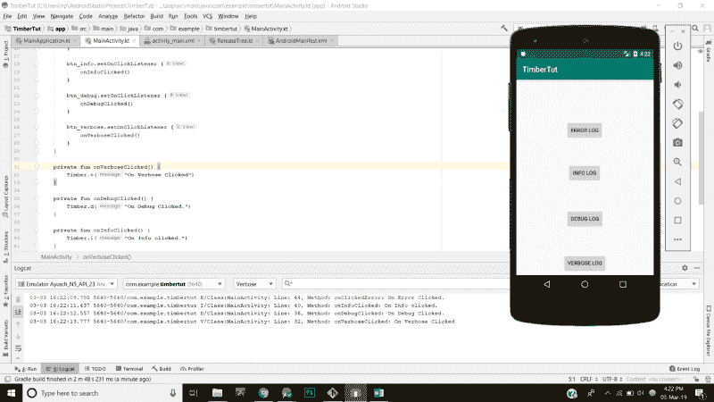

# 如何更有效地使用木材

> 原文：<https://www.freecodecamp.org/news/how-to-log-more-efficiently-with-timber-a3f41b193940/>

作者:阿尤施·贾恩

# 如何更有效地使用木材


日志是 Android 框架中最常用的工具之一。当通过断点调试不起作用时，它确实有助于调试您的代码。

将日志语句放在代码中通常是一种好的做法。这些语句帮助您跟踪应用程序中的流控制。同样，不建议在发布就绪代码中包含日志语句，因为那些日志语句可以被任何将其手机连接到 PC 的人读取。因此，在将应用程序发布到 play store 时，建议从代码中删除所有日志语句。

但是这真的很痛苦。你的代码中有如此多的日志语句。现在您必须找到每一个，并将其从发布版本的代码中删除。

默认日志机制的另一个问题是，每次编写日志语句时都需要传递标记。

如果日志语句在生产中会自动禁用自己，那不是很好吗？如果日志语句在记录时自动选择了**标签** /classname，而您可以专注于编写更好的代码，这不是很好吗？

嗯，诸如此类的问题以及更多的问题都可以通过 android 中一个更好的日志库来解决，这个库叫做 **Timber** (由杰克·沃顿开发)。

这是一个轻量级的，易于使用的库。它会处理您在登录时需要做的大部分维护工作，这样您就可以将更多的精力放在编写优秀的代码上，而不是维护工作上。

让我们继续创建一个示例应用程序，看看如何将 **Timber** 包含在您的 **android 应用程序**中，让您的伐木生活更加轻松。

### 入门指南

我们将创建一个简单的有 4 个按钮的 Android 应用程序。每个按钮都会在控制台上打印出不同的优先级日志语句。

在 Android 中创建一个新项目，并在应用程序级别的 build.gradle 文件中添加 Timber 的依赖项。在撰写本文时，这是 timber 的最新依赖版本:

```
implementation 'com.jakewharton.timber:timber:4.7.1'
```

### 初始化木材

下载完依赖项后，现在是初始化 timber 库的时候了。初始化 timber 的最佳位置是在应用程序类中，该类在应用程序的整个生命周期中都是活动的。因此，让我们创建一个定制的应用程序类，并在其中初始化我们的**木材库**:

```
class MainApplication : Application() {    override fun onCreate() {        super.onCreate()        if(BuildConfig.DEBUG){            Timber.plant(Timber.DebugTree())        }    }}
```

### 创建主活动

现在让我们通过添加 4 个按钮并为每个按钮设置点击监听器来创建我们的 MainActivity。这是我的 activity_main.xml 文件。我使用 ConstraintLayout 作为我的根布局，包括 4 个按钮，每个按钮对应不同的日志级别。

```
<?xml version="1.0" encoding="utf-8"?><android.support.constraint.ConstraintLayout        xmlns:android="http://schemas.android.com/apk/res/android"        xmlns:tools="http://schemas.android.com/tools"        xmlns:app="http://schemas.android.com/apk/res-auto"        android:layout_width="match_parent"        android:layout_height="match_parent"        tools:context=".MainActivity">
```

```
 <Button            android:text="Error Log"            android:layout_width="wrap_content"            android:layout_height="wrap_content"            android:id="@+id/btn_error" app:layout_constraintStart_toStartOf="parent" android:layout_marginStart="8dp"            app:layout_constraintEnd_toEndOf="parent" android:layout_marginEnd="8dp" android:layout_marginTop="108dp"            app:layout_constraintTop_toTopOf="parent" app:layout_constraintHorizontal_bias="0.498"/>    <Button            android:text="Info Log"            android:layout_width="wrap_content"            android:layout_height="wrap_content"            android:id="@+id/btn_info" android:layout_marginTop="64dp"            app:layout_constraintTop_toBottomOf="@+id/btn_error" app:layout_constraintStart_toStartOf="parent"            android:layout_marginStart="8dp" app:layout_constraintEnd_toEndOf="parent" android:layout_marginEnd="8dp"            app:layout_constraintHorizontal_bias="0.498"/>    <Button            android:text="Debug Log"            android:layout_width="wrap_content"            android:layout_height="wrap_content"            android:id="@+id/btn_debug" android:layout_marginTop="72dp"            app:layout_constraintTop_toBottomOf="@+id/btn_info" app:layout_constraintStart_toStartOf="parent"            android:layout_marginStart="8dp" app:layout_constraintEnd_toEndOf="parent" android:layout_marginEnd="8dp"    />    <Button            android:text="Verbose Log"            android:layout_width="wrap_content"            android:layout_height="wrap_content"            android:id="@+id/btn_verbose" android:layout_marginTop="68dp"            app:layout_constraintTop_toBottomOf="@+id/btn_debug" app:layout_constraintStart_toStartOf="parent"            android:layout_marginStart="8dp" app:layout_constraintEnd_toEndOf="parent" android:layout_marginEnd="8dp"            android:layout_marginBottom="8dp"            app:layout_constraintBottom_toBottomOf="parent" app:layout_constraintVertical_bias="0.061"/></android.support.constraint.ConstraintLayout>
```

现在是时候为这些按钮设置点击监听器，并在每次点击按钮时打印日志语句了。我使用的是 kotlin 的合成绑定，而不是常规的 findViewById 调用或 Butterknife。下面是我的 **MainActivity.kt** 文件:

```
class MainActivity : AppCompatActivity() {
```

```
 override fun onCreate(savedInstanceState: Bundle?) {        super.onCreate(savedInstanceState)        setContentView(R.layout.activity_main)
```

```
 btn_error.setOnClickListener {            onClickedError()        }
```

```
 btn_info.setOnClickListener {            onInfoClicked()        }
```

```
 btn_debug.setOnClickListener {            onDebugClicked()        }
```

```
 btn_verbose.setOnClickListener {            onVerboseClicked()        }    }
```

```
 private fun onVerboseClicked() {        Timber.v("On Verbose Clicked")    }
```

```
 private fun onDebugClicked() {        Timber.d("On Debug Clicked.")    }
```

```
 private fun onInfoClicked() {        Timber.i("On Info clicked.")    }
```

```
 private fun onClickedError() {        Timber.e("On Error Clicked.")    }
```

```
}
```

请注意，我们不需要在类中初始化任何标签变量，Timber 会自动为您完成。

### 为调试和发布定制木材

现在，**这是木材真正发光的地方** s。到目前为止，我们所做的并没有什么了不起的，只是在点击按钮时打印日志报表。但是如您所知，在生产中登录并不是一个好主意。我们将编写代码来禁用生产日志，同时在调试模式下保持启用。

我们将编写一个 if 块来检查我们的应用程序是否处于调试模式，并为此启用日志记录。如果没有，那么我们希望使用一个**定制树来初始化 Timber。**

下面是修改后的 **MainApplication.kt** 类:

```
class MainApplication : Application() {    override fun onCreate() {        super.onCreate()        if (BuildConfig.DEBUG) {            Timber.plant(object : Timber.DebugTree() {                override fun createStackElementTag(element: StackTraceElement): String? {                    return String.format(                        "Class:%s: Line: %s, Method: %s",                        super.createStackElementTag(element),                        element.lineNumber,                        element.methodName                    )                }            })        } else {            Timber.plant(ReleaseTree())        }    }}
```

如你所见，我们已经在释放模式下使用定制的 **ReleaseTree** 初始化了 timber。现在让我们继续创建我们自己的发布树。

### 创建自定义树

创建一个发布树相当简单。创建一个新的 Kotlin 类，并从 Timber.Tree 扩展它。实现所有的抽象函数，你就可以开始了。

这是我的 **ReleaseTree.kt** :

```
class ReleaseTree : @NotNull Timber.Tree() {    override fun log(priority: Int, tag: String?, message: String, t: Throwable?) {        if (priority == Log.ERROR || priority == Log.WARN){            //SEND ERROR REPORTS TO YOUR Crashlytics.        }    }
```

```
}
```

如你所见，无论何时出现错误，我们都可以将**日志**发送到在线服务，如 **Firebase CrashAnalytics 或 Crashlytics** ，而不是退出生产。

### 结果



source: https://ayusch.com

### 使用 Timber 与 Android 日志记录的优势

让我们看看使用 Timber 库而不是 android sdk 的默认日志实用程序的一些好处。

*   **无需担心标签** : Timber 会自动为您生成标签，因此您不必担心在每个类中包含一个全局标签。
*   **无需手动删除日志语句**:如前所述，禁用发布应用的日志记录非常简单。因此，您不再需要检查整个代码并手动删除所有日志。
*   **生产中的定制行为**:在生产版本中，您不希望记录日志，尽管您肯定希望记录任何可能发生的崩溃。您可以通过使用定制的调试树(如上所示)来实现这一点，该调试树不是将日志记录到 logcat，而是将日志发送到您的 crashlytics 服务。
*   **定制元数据**:您可以在日志语句中包含定制元数据。例如，我在上面的实现中添加了类名、行号和方法名，从中可以打印日志语句。拥有这些数据可以让调试变得更容易。
*   轻量级:不会增加你的应用程序大小/方法数量太多。真正轻量级的库，因为它只是一个已经存在的日志实用程序的包装。

### 结论

很长一段时间，我忽略了日志语句的使用和打印出更好的日志。随着我的代码变得越来越大，问题变得越来越复杂，我意识到我需要采用更好、更有效的调试例程。因此，使用木材是朝着正确方向迈出的一步。

> ****Important**** *:我为移动开发人员创建了一个 [**SLACK**](https://join.slack.com/t/androidvillespace/shared_invite/enQtNTQxOTY4NjI4NjE0LTA3ZGFiZjViNGRjZDdjNThhZjRlNjM0MTZlYzRlZWM0YTYxY2EwMzU0ZDdhNmRkMjJhYzBiZTA3Y2NjZTc4ZmU) 工作区，我们可以在这里分享我们对所有最新技术的学习，尤其是在 **Android 开发、RxJava、Kotlin、Flutter 以及总体移动开发方面**。*

> [**点击此链接加入时差工作区。绝对免费！**](https://join.slack.com/t/androidvillespace/shared_invite/enQtNTk4NzUzMDk3Nzk2LTUwNWU2OTNiYWU3YjBiOWQ0NzY3Y2I5ZjVlOTFkOWFjN2FmOGRhM2JmZDhjY2Q0YmI1YjFkODMwMjViMDg4MGU)

> *本文最初发布于[https://ayusch.com/timber-for-android](https://ayusch.com/timber-for-android)*

喜欢你读的书吗？别忘了在[](https://www.facebook.com/AndroidVille)****Whatsapp****LinkedIn**上分享这个帖子。**

***你可以在 [LinkedIn](https://www.linkedin.com/in/ayuschjain) 、 [Quora](https://www.quora.com/profile/Ayusch-Jain) 、 [Twitter](https://twitter.com/ayuschjain) 和 [Instagram](https://www.instagram.com/androidville/) 上关注我，在那里我**回答与**移动开发相关的**问题，尤其是 Android 和 Flutter** 。***