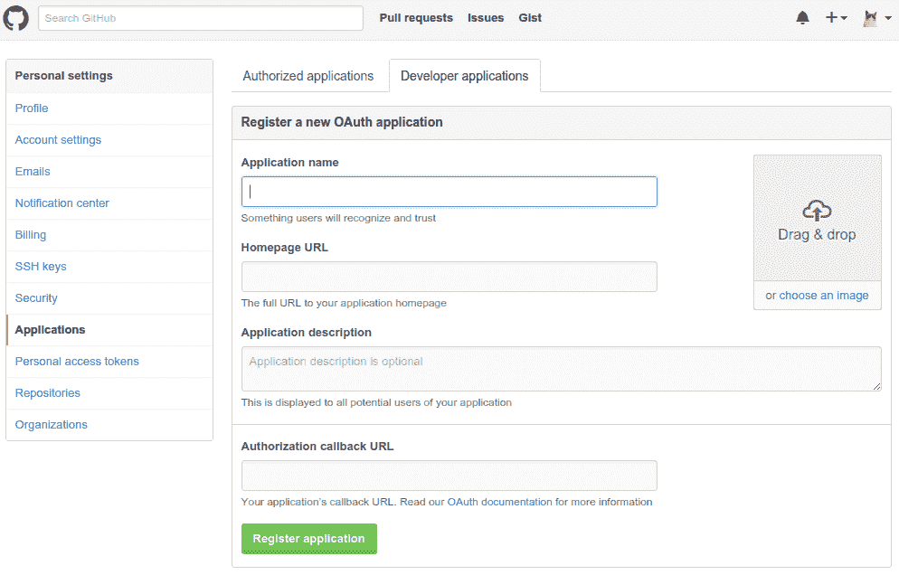
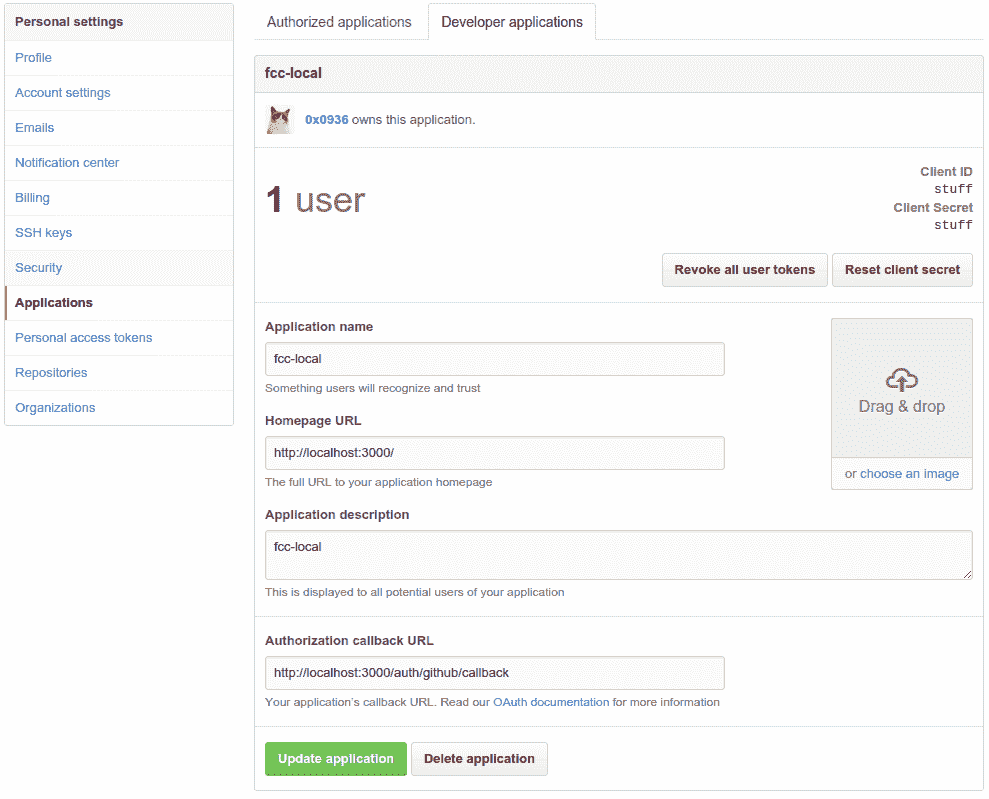
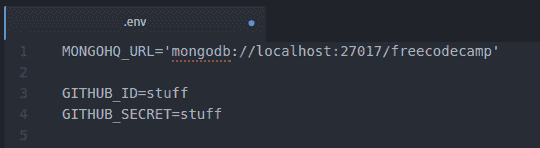

# 如何登录到 freeCodeCamp 的本地实例

> 原文：<https://www.freecodecamp.org/news/how-to-login-to-your-local-instance-of-freecodecamp/>

本指南将帮助您使用 GitHub 帐户登录当地的 FCC 网站。使用其他社交媒体帐户登录的过程应该类似。本指南假设您已经安装并运行了 FCC 的本地副本。

## **TL；博士**

1.  [注册一个新的 OAuth 应用程序](https://github.com/settings/developers)
2.  主页字段:`http://localhost:3000/`
3.  回调字段:`http://localhost:3000/auth/github/callback`
4.  将客户端 ID 和客户端密码复制/粘贴到您的`.env`文件中
5.  查看本地 FCC 网站时使用端口 3000

我们的[帮助贡献者聊天室](https://gitter.im/FreeCodeCamp/HelpContributors)有免费的代码营地问题模块和工作人员来帮助解决与拉请求相关的问题

## **免责声明**

运行`$ gulp`提到 ****访问端口**** 的输出是 3001。我只在端口 3000 成功登录过 GitHub——****代理端口**** 。如果您了解如何使用其他端口登录，请考虑在这个 wiki 上提交一个 pull 请求。

## **使用您的 GitHub 帐户登录**

1.  [注册一个新的 OAuth 应用](https://github.com/settings/developers)，点击 ****注册新的应用****

*或者*，点击你的 ****个人资料图片**** = > ****设置**=>****应用**** = > ****开发者应用**** = > ****注册新应用******

填写 OAuth 应用程序字段

*   ****应用名称****——选择任意名称，如`fcc-local`
*   ****首页网址****——设置为`http://localhost:3000/`
*   ****应用描述**** -可选
*   ****授权回调网址**** -设置为`http://localhost:3000/auth/github/callback`

1.  点击 ****注册应用**** 可以看到新注册的应用页面，显示您的客户端 ID 和客户端密码。

1.  将您的客户 ID 和客户密码复制并粘贴到您的`.env`文件中。

*注意:您的客户 ID 和客户密码将是长字母数字值。*

## **提示**

1.  用注释移除/取消设置阻止 [passport-provider](https://github.com/FreeCodeCamp/FreeCodeCamp/blob/staging/server/passport-providers.js) 中不需要的提供者。
2.  如果在 express-session 和 cookieParser 上出现错误，请在`.env`中添加会话*机密和 COOKIE* 机密。

`COOKIE_SECRET='secret' SESSION_SECRET='secret'`

1.  如果你没有得到挑战，在运行`gulp`之前运行命令`node seed`。

## **完成了**

恭喜你！您现在可以使用您的 GitHub 帐户成功登录到您当地的 FCC 网站。