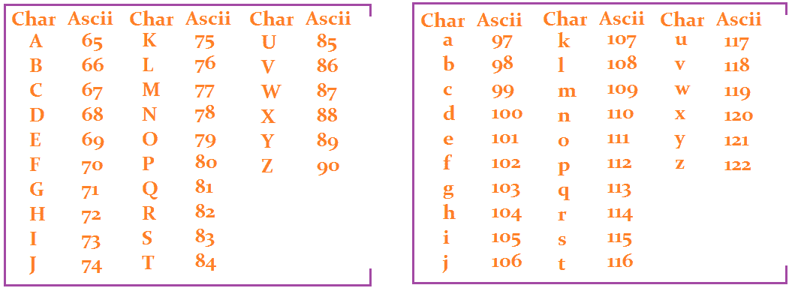

# Python lower()——如何用 tolower 函数的等价物来小写 Python 字符串

> 原文：<https://www.freecodecamp.org/news/how-to-lowercase-python-string/>

字符串是由用引号括起来的字符组成的数据类型。这些字符可以是字母、符号或数字。

在 Python 中，有不同的处理字符串的方式。这些方法是改变字符串结果的内置函数。

例如，如果我想将我的名字的第一个字母大写，我使用`.title()`方法将第一个字母大写。

在本文中，我们将学习如何在不使用内置方法的情况下将大写字母转换为小写字母。

## 如何使用`.lower()`将字符串转换成小写

字符串可以由不同的字符组成，其中一个字符是字母表中的字母。你可以把英文字母写成大写或小写。当将字符串更改为小写时，它仅适用于字母。

在 Python 中，有一个内置的方法可以将大写的字符串改为小写。它也适用于包含大写和小写字母的字符串。的”。lower()"方法将字符串更改为小写。

```
name = "BOB STONE"
print(name.lower()) # >> bob stone
name1 = "Ruby Roundhouse"
print(name1.lower()) # >> ruby roundhouse
name2 = "joHN Wick"
print(name2.lower()) # >> john wick
name3 = "charlieNew"
print(name3.lower()) # >> charlienew 
```

我们可以在上面的代码块中看到，存储每个字符串的变量都有大写字母。然后用`.lower()`方法，它将这些字母转换成小写。

## 将 Python 字符串转换成小写的其他方法

除了内置方法”。lower()”，Python 中有不同的大写字母转换成小写字母的方法。在这篇文章中，我们将看看两种不同的方式。

访问信件有两种方式:

*   将它们手动复制到列表中，或者
*   利用 Unicode 标准

### 如何从列表中访问字母

其思想是遍历一个字母列表，用小写字母替换字符串中的大写字母。

首先，创建一个变量来存储接受大写字母字符串的输入。

然后，创建另一个存储大写字母和小写字母列表的变量。

最后，创建最后一个存储空字符串的变量，这是小写字母的存储位置。

```
word = str(input("Enter a word: ” ))

alphabet = ['a', 'b', 'c', 'd', 'e', 'f', 'g', 'h', 'i', 'j', 'k', 'l', 'm', 'n', 'o', 'p', 'q', 'r', 's', 't', 'u', 'v', 'w', 'x', 'y', 'z','A','B','C','D','E','F','G','H','I','J','K','L','M','N','O','P','Q','R','S','T','U','V','W','X','Y','Z']

lowercase_letters = '' 
```

在上面的列表中，我们看到它有小写字母和大写字母。英语字母表中有 26 个字母，但列表中的索引从 0 开始，所以字母表的计数是 51(大写和小写字母都是)。

我们还可以看到，小写字母先写(左侧)，大写字母后写(右侧)。小写字母的索引范围为 0 - 25，而大写字母的索引范围为 26 - 51。

接下来，我们遍历字符串中的每个字符。

```
for char in word: 
```

`<char>`是存储来自`<word>`变量的所有字符的新变量名。

我们要转换的字符串有两种情况。第一种情况是只有大写字母的字符串，第二种情况是有特殊符号、数字、一些小写字母和一些大写字母的字符串。

**第一种情况**:只有大写字母的字符串

要将大写字母转换成小写字母，我们必须从列表中找到由变量`<char>`存储的每个字母的索引。要查找索引，我们使用“.index()"方法:

```
alphabet = ['a', 'b', 'c', 'd', 'e', 'f', 'g', 'h', 'i', 'j', 'k', 'l', 'm', 'n', 'o', 'p', 'q', 'r', 's', 't', 'u', 'v', 'w', 'x', 'y', 'z','A','B','C','D','E','F','G','H','I','J','K','L','M','N','O','P','Q','R','S','T','U','V','W','X','Y','Z']
word = str(input("Enter a word: " ))
for char in word:
    print(alphabet.index(char))

# Results
# Enter a word: GIRL
# 32
# 34
# 43
# 37 
```

在上面的代码中，打印了<word>“GIRL”中字母的索引。</word>

在列表中，小写字母的索引从 0-25，大写字母的索引从 26 - 51。当设置条件(“if”语句)时，我们开始检查字母的索引是否大于“25”，因为第一个大写索引从“26”开始。

为了得到相应的小写字母，我们从每个大写索引中减去 26。当我们得到小写数字的索引时，我们使用 indexing(variable _ name[index _ number])来查找相应的字母。小写字母现在被添加到存储空字符串的变量名<lower_case_letters>中。</lower_case_letters>

我们通过在循环外打印变量<lowercase_letters>来返回它。</lowercase_letters>

```
for char in word:
      if alphabet.index(char) > 25:
          lowercase_letters += alphabet[alphabet.index(char)-26]
  print(lowercase_letters) 
```

这是我们将所有代码放在一起时的样子:

```
def change_to_lowercase(word):

  alphabet = ['a', 'b', 'c', 'd', 'e', 'f', 'g', 'h', 'i', 'j', 'k', 'l', 'm', 'n', 'o', 'p', 'q', 'r', 's', 't', 'u', 'v', 'w', 'x', 'y', 'z','A','B','C','D','E','F','G','H','I','J','K','L','M','N','O','P','Q','R','S','T','U','V','W','X','Y','Z']
  lowercase_letters = ''

  for char in word:
      if alphabet.index(char) > 25:
          lowercase_letters += alphabet[alphabet.index(char)-26]

  return lowercase_letters

word = str(input("Enter a word: " ))
print(change_to_lowercase(word=word))

# Results
# Enter a word: FERE
# fere
# Enter a word: PYTHONISFUN
# pythonisfun 
```

**第二种情况**:大写字母旁边有特殊符号、数字、小写字母的字符串。

在将大写字母转换成小写字母之前，我们需要检查一些条件。该条件将检查每个字符`<char>`是否来自单词:

*   不是一封信
*   单词中既有大写字母也有小写字母。如果单词中的一些字母是小写的，它们将保持不变。

在这些检查之后，它假定剩余的字符是大写字母。

为了检查一个字符是否不是字母，我们使用“not in”关键字。为了检查一个字符是否是小写的，我们找到索引，并将其与列表中小写字母的最后计数进行比较。

同样，小写字母的索引从 0-25，最后一个小写字母<z>的索引是 25。这些字符被添加到存储空字符串的变量名<lower_case_letters>中。</lower_case_letters></z>

```
for char in word:
    if char not in alphabet or alphabet.index(char)<=25:
        lowercase_letters += char 
```

在上面的代码块中，我们使用了`.index()`方法来查找字母在字母表中的位置。

对于我们假设为大写字母的其余字符，在字母列表中，这些字母的索引是从 26 到 51。为了找到它们对应的小写字母索引，我们减去 26，并使用`.index()`方法找到字母。

Indexing =变量名称[索引编号]。我们将最终结果添加到存储空字符串的变量中。

```
for char in word:
    if char not in alphabet or alphabet.index(char)<=25:
        lowercase_letters += char
    else:
        lowercase_letters += alphabet[alphabet.index(char)-26] 
```

然后我们在循环外打印小写字母:

```
for char in word:
    if char not in alphabet or alphabet.index(char)<=25:
        lowercase_letters += char
    else:
        lowercase_letters += alphabet[alphabet.index(char)-26]
print(lowercase_letters) 
```

这是我们将所有代码放在一起时的样子:

```
def change_to_lowercase(word):

  alphabet = ['a', 'b', 'c', 'd', 'e', 'f', 'g', 'h', 'i', 'j', 'k', 'l', 'm', 'n', 'o', 'p', 'q', 'r', 's', 't', 'u', 'v', 'w', 'x', 'y', 'z','A','B','C','D','E','F','G','H','I','J','K','L','M','N','O','P','Q','R','S','T','U','V','W','X','Y','Z']
  lowercase_letters = ''

  for char in word:
      if char not in alphabet or alphabet.index(char)<=25:
          lowercase_letters += char
      else:
          lowercase_letters += alphabet[alphabet.index(char)-26]
  return lowercase_letters

word = str(input("Enter a word: " ))
print(change_to_lowercase(word=word))

# Results
# Enter a word: 2022BlackADAM&&
# 2022blackadam&&
# Enter a word: Weasle2@3568QQQAJHGB
# weasle2@3568qqqajhgb 
```

## 如何使用 Unicode 标准访问字母

Unicode 表示通用字符编码标准。根据 unicode.org 的说法，

> Unicode 标准为每个字符提供了一个唯一的编号，无论是什么平台、设备、应用程序或语言

简单地说，不同语言的所有字母都有一个唯一的数字，代表 Unicode 中的每个字符。

在 Python 中使用 Unicode 时，我们使用两种方法:`ord()`和`chr()`。

*   ord():该函数接受字符(任何语言的字母)并返回 Unicode 标准下的唯一数字。
*   chr():该函数接受整数，并返回 Unicode 标准下的等效字符。

在深入解释代码之前，这里有一个图表，包含了所有英文字母的唯一数字，包括小写字母和大写字母。



[ASCII Chart representing the unique numbers of english alphabets](https://linuxhint.com/understanding-ascii-table/)

现在我们已经熟悉了什么是 Unicode 以及如何在 Python 中访问值，让我们开始吧。

首先，创建一个变量来存储接受大写字母字符串的输入。

然后，创建存储空字符串的最后一个变量，这是小写字母的存储位置。

```
word = str(input("Enter a word: ” ))
lowercase_letters = '' 
```

然后我们遍历字符串中的每个字符。

```
for char in word: 
```

`<char>`是存储来自`<word>`变量的所有字符的新变量名。

**第一种情况**:只包含大写字母的字符串。

在将大写字母转换成小写字母之前，我们需要检查单词中的每个字符<char>是否都是大写的。</char>

根据 Unicode 表，大写字母 A 的数字是“65”，大写字母 Z 的数字是“90”。我们检查`<word>`中的每个字符`<char>`是否有 65 到 90 之间的数字。如果有，就是大写字母。

```
print((ord('A')))
# RESULT
# 65
print((ord('Z')))
# RESULT
# 90
print((ord('F')))
# RESULT
# 70 
```

`ord()`函数以大写形式返回每个字母的唯一数字。

为了将大写字母转换成小写字母，我们将两种情况的差异“32”加到大写字母的每个数字上，得到小写字母。

例如:

```
number_for_A = ord('A')
number_for_a = ord('a')
difference_a = number_for_a - number_for_A
print("Differences in letters" , difference_a)
print("The unique number for A", number_for_A)
print("The unique number for a", number_for_a)

 # Results
# The unique number for A 65
# The unique number for a 97
# Differences in letters 32

number_for_F = ord('F')
number_for_f = ord('f')
difference_f = number_for_f - number_for_F
print("The unique number for F", number_for_F)
print("The unique number for f", number_for_f)
print("Differences in letters" , difference_f)
# Results
# The unique number for F 70
# The unique number for f 102
# Differences in letters 32 
```

在上面的代码中，unicode 图表上的“A”是 97，“A”是 65。两者相差 32。如果我们想得到图表上“A”的值，我们将“65”的值加上 32，得到“97”。

因此，要转换成小写，我们必须将 32 加到大写字母的每个数字上，以获得它们对应的小写字母。

```
word = str(input("Enter a word: " ))
lowercase_letters = ''
for char in word:
    if ord(char) >= 65 and ord(char) <= 90:
        char = ord(char) + 32
    print(char)
# Results
# Enter a word: REAL
# 114
# 101
# 97
# 108 
```

在上面的代码中，我们通过变量`<word>`循环访问每个字符。

然后我们检查变量`<word>`中的每个字符是否有一个介于 65 和 90 之间的唯一数字。如果有，则由大写字母组成。

为了得到相应的小写字母，我们加上 32。上面的结果打印了小写字母的唯一数字。

我们可以通过使用`chr()`函数将数字和它们的字母匹配起来。

```
word = str(input("Enter a word: " ))
lowercase_letters = ''
for char in word:
    if ord(char) >= 65 and ord(char) <= 90:
        char = ord(char) + 32
        to_letters = chr(char)
    print(to_letters) 

# Result
# Enter a word: REAL
# r
# e
# a
# l 
```

现在我们看到返回的字母是小写的。为了获得一行中的字母，我们将它添加到存储空字符串的变量中，并返回该变量。

```
word = str(input("Enter a word: " ))
lowercase_letters = ''
for char in word:
    if ord(char) >= 65 and ord(char) <= 90:
        char = ord(char) + 32
        to_letters = chr(char)
        lowercase_letters += to_letters
print(lowercase_letters)
# Result
# Enter a word: FERE
# fere 
```

以下是我们将所有这些整合在一起后的效果:

```
def change_to_lowercase(word):
    lowercase_letters = ''
    for char in word:
        if ord(char) >= 65 and ord(char) <= 90:
            char = ord(char)+32
            to_letters = chr(char)
            lowercase_letters += to_letters
    return lowercase_letters
word = str(input("Enter a word: " ))
print(change_to_lowercase(word=word))

# Results
# Enter a word: HARDWORKPAYS
# hardworkpays
# Enter a word: PYTHONISFUN
# pythonisfun 
```

**第二种情况:**带有特殊符号、数字、小写字母和大写字母的字符串。

对于包含非字母和一些小写字母的字符串，我们添加一个“else”语句来返回字符串中出现的值。大写字母随后被转换成小写字母:

```
word = str(input("Enter a word: " ))
lowercase_letters = ''
for char in word:
    if ord(char) >= 65 and ord(char) <= 90:
        char = ord(char)+32
        to_letters = chr(char)
        lowercase_letters += to_letters
    else:
        lowercase_letters += char
print(lowercase_letters)

# Result
# Enter a word: @#&YEAERS09=
# @#&yeaers09= 
```

以下是我们将所有这些整合在一起后的效果:

```
def change_to_lowercase(word):
    lowercase_letters = ''
    for char in word:
        if ord(char) >= 65 and ord(char) <= 90:
            char = ord(char)+32
            to_letters = chr(char)
            lowercase_letters += to_letters
        else:
            lowercase_letters += char
    return lowercase_letters
word = str(input("Enter a word: " ))
print(change_to_lowercase(word=word))

# Enter a word: YOUGOT#$^
# yougot#$
# Enter a word: BuLLettrAIn@2022
# bullettrain@2022 
```

我知道第二种方法很难理解，但它也能让你得到结果，就像第一种方法一样。

## 摘要

在本文中，您已经学习了如何将字符和字符串从一种格式转换为另一种格式。我们还看了一下 ASCII 表。

一旦您知道如何使用这两个重要的函数，第二种方法将更加有效和简单。字母的索引是 Python 内置的，所以没有必要去记忆它们。

感谢您的阅读！