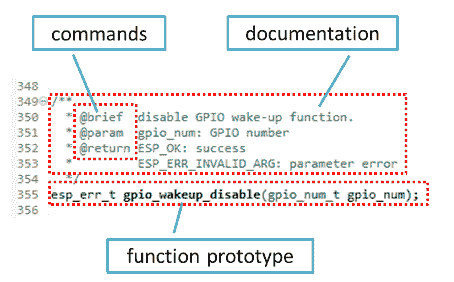
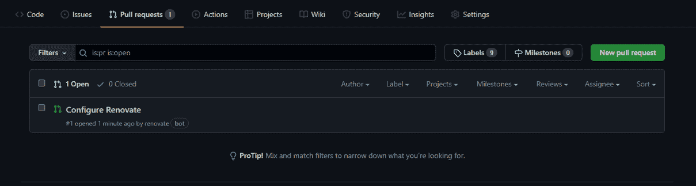
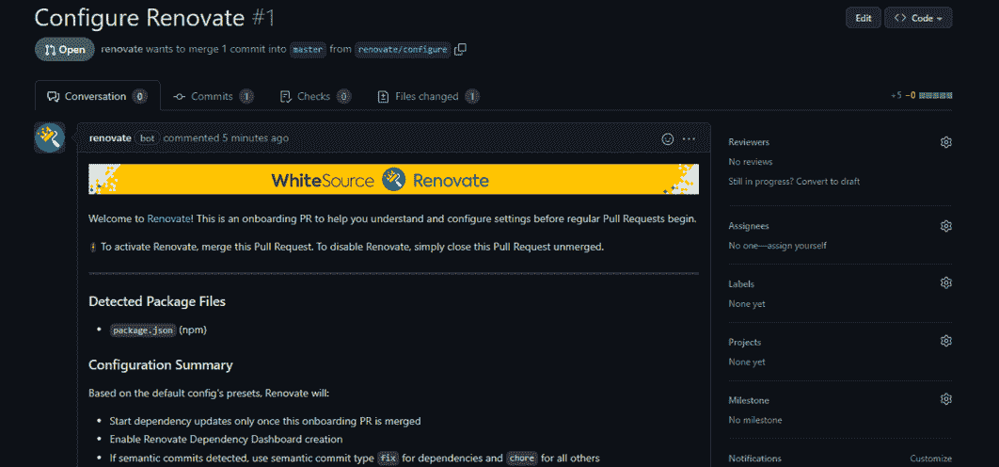
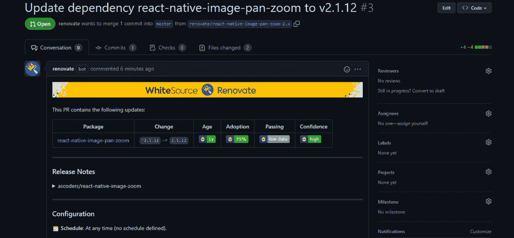
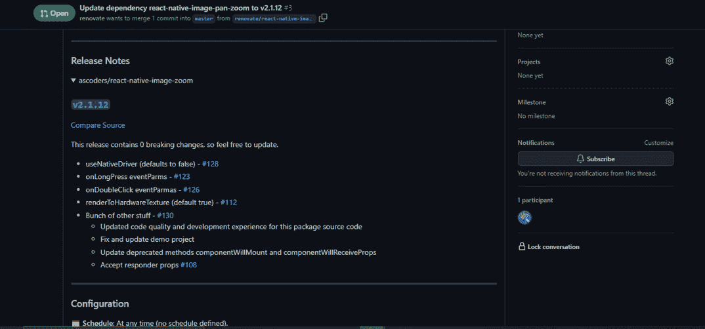

# 如何维护开源项目——最佳实践和技巧

> 原文：<https://www.freecodecamp.org/news/how-to-maintain-an-open-source-project/>

那么，现在你已经发布了你的第一个开源项目，接下来呢？如果您是开源的新手，您可能会认为这就是了。但好戏才刚刚开始。

事实上，大部分的工作在于维护你的项目，让更多的用户可以访问它。这是这个过程中最重要的步骤之一，也是开源项目成功运行的原因。

维护 [OSS](https://en.wikipedia.org/wiki/Open-source_software) 本质上意味着保持项目最新，以便它与它使用的各种第三方库、框架和软件的最新版本兼容。

建立良好的安全措施也很重要。bug 是任何软件开发生命周期中不可避免的一部分，因此修复对安全性构成威胁的 bug 同样重要。

几天前，我发表了我的第一个开源[项目](https://www.npmjs.com/package/nextportal)，一个 npm 包。所以，现在，重要的是，我遵循一些最佳实践，使其有利可图。

在这里，我将向您介绍一些步骤，帮助您在学习过程中维护一个开源项目。

在整篇文章中，我将使用 GitHub(假设大多数项目都在那里托管和维护)。

但是，如果你碰巧使用任何其他 VCS 托管网站，你仍然可以遵循这些步骤，以确保您的项目的成功。

## 编写好的文档

文档告诉人们软件或代码做什么，如何安装，如何使用，它提供了一个工作示例和贡献指南。

请注意，即使代码是一个开源项目，它仍然需要有一个许可证，允许其他人在定义的范围内使用、修改或添加内容。因此，文档基本上是帮助人们使用你的软件的规则手册或指南。

[来源](https://docs.espressif.com/projects/esp-idf/en/latest/esp32/contribute/documenting-code.html)

不完整的文档会让人们很难理解你的代码的主旨和目的，无论你的项目有多好，他们都不愿意尝试。

所以只要确保你有写得很好的文档，以及你对项目所做的所有最新变更的任何细节。

## 自动化重复性任务

维护一个开源项目通常会涉及许多重复性的任务，比如定期维护、定期更新依赖项、持续集成等等。

因为这些任务是耗时的、重复的，并且不需要创新，所以您可以自动化其中的许多任务。

以更新依赖关系为例。在您的项目中使用其他包和依赖项是很常见的。但是，与此同时，您不能因为使用过时的依赖项而损害项目的安全性/性能。

我发现一个有用的工具是免费的[white source renewal](https://www.whitesourcesoftware.com/free-developer-tools/renovate/)。它自动更新依赖关系。所以使用像 keep 这样的工具来保持依赖关系的更新是一项你不应该忽视的重要任务。如果你想了解如何将 white source renewal 整合到你的项目中，请继续阅读下面的部分。

### 更新自动依赖关系

首先，你需要[将 revenue](https://github.com/apps/renovate)与你的 GitHub 账户整合。然后单击安装，并按照指示的步骤进行操作。

在配置时，renewal 让您决定是在默认情况下在所有存储库上运行，还是只在特定的存储库上运行。根据您的意愿选择选项。(注意:如果您想更新为在分叉的存储库上运行，单击“选择所有存储库”将默认跳过分叉的存储库。在这种情况下，您必须手动添加分叉回购协议。

在用所需的存储库设置了 renew 之后不久，renew bot 将提交一个 onboarding PR，其中包含诸如配置摘要和应该升级哪些包/依赖项之类的信息。

出于演示的目的，我从我的 GitHub 帐户中提取了一个回购，这应该是一个基于 [React Native](https://reactnative.dev/) 的移动应用程序。它不再被维护，所以它将作为一个很好的测试例子。

如果您正确遵循了上述步骤，您应该会看到类似于以下内容的入职简历:

Initial PR

Merge PR

一旦您合并了上面的 pull 请求，renew bot 将开始寻找需要更新的过时或陈旧的依赖项，并为每个需要更新的依赖项提交 PR。

请记住，该工具不跟踪漏洞或问题，只跟踪可用的更新。但是新的依赖关系通常伴随着错误修复、安全改进和新添加的特性。

尽管如此，仅仅因为有一个可用的更新并不意味着你必须更新它，因为它可能会由于兼容性不匹配或类似的原因而破坏你现有的系统。因此，在合并 PR 之前检查更新是很重要的。

为了帮助您做出关于是否要升级软件包的正确决定，PR 包括关于采用率和测试通过率的详细信息，这有效地确定了总体信心水平。

它还从依赖关系存储库中提取最新的发行说明，否则需要您手动导航到 repo 来查找新内容。

## 总是解决问题

确保您的项目持续改进的一个好方法是解决您的同事提出的问题。

如果开源项目不能解决潜在的 bug、安全问题或特性增加，没有人会对它感兴趣。

您可以设置一个 CI 脚本，在问题打开时分配一个标签，然后将其分配给维护项目的参与者。这将导致问题被快速审查，也将帮助贡献者找到新的修复和/或特性添加。

## 传播你的项目

你已经发布了一个优秀的开源项目，但是你看不到任何人使用或参与这个项目。出现这种情况的主要原因可能是人们还没有发现你的项目。

为了启动这个项目，你应该确保你的项目得到尽可能多的曝光。一个有效的方法是在社交媒体上分享你的作品，只要人们对它感兴趣。

你也可以在问答平台上参与和你的项目相关的话题讨论，比如 Stack Overflow 和 Reddit。那么分享你的项目将是一件很自然的事情。

## 吸引有帮助的贡献者

遵循上面的步骤将帮助你开始。但是一旦你的项目开始增长，它将需要更多愿意维护项目的贡献者。

只有当你建立了一个强大的贡献者基础，这才有可能。为了增加帮助你维护项目的人，你可以设立贡献奖励，比如给满足某些要求的人发奖金。

如果人们对项目有自豪感和主人翁感，他们也会被鼓励做出贡献。因此，确保每个人都因自己的贡献得到应有的荣誉，无论贡献大小。

像这样的积极行动也可能使新的贡献者与他们的朋友/同事分享他们的工作，间接帮助你的项目获得更多的曝光率/用户/贡献者。

## 包扎

最终，你的项目提供的价值决定了有多少人贡献和使用它。因此，当你创建一个开源项目时，把可用性和影响力放在你的脑海中。你的项目将如何让其他人的生活更轻松？它解决了什么问题？

这些是成功维护一个开源项目应该采取的步骤。你推荐其他重要的实践来增加这个列表的价值吗？如果是的话，请与我分享，这样我们就可以更多地了解开源文化。

如果你觉得这篇文章很有帮助，请随意与你的朋友和同事分享，你可以在 [Twitter](https://twitter.com/mehulmpt) 上关注我以获取更多此类内容:)

干杯！