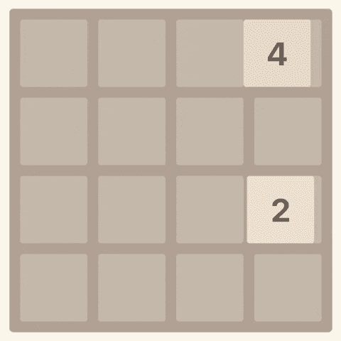
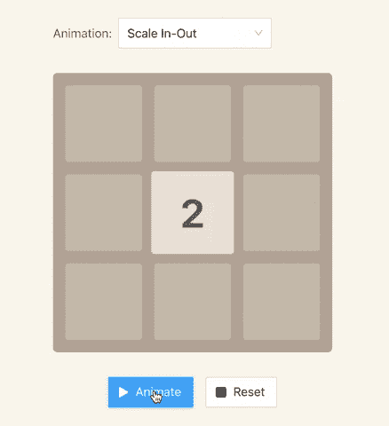
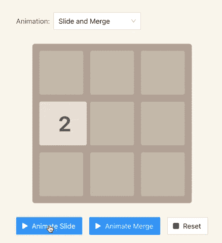

# React 教程——如何在 React 中构建 2048 游戏

> 原文：<https://www.freecodecamp.org/news/how-to-make-2048-game-in-react/>

今天你将学习如何在 React 中构建你自己的 2048 游戏克隆。

这篇文章的独特之处在于，我们将专注于创建令人愉快的动画。除了 React，我们将使用 TypeScript，我们将使用 LESS 进行一些 CSS 转换。

我们将只使用现代的 React 接口，比如钩子和上下文 API。

本文包含一些外部资源，例如:

*   [2048 游戏(GitHub 页面)](https://mateuszsokola.github.io/2048-in-react/)
*   【2048 年动画示例(GitHub 页面)
*   [源代码(GitHub)](https://github.com/mateuszsokola/2048-in-react)
*   ...还有一段 YouTube 视频。我花了一个多月的时间来准备这个教程，所以如果你看了它，点击“喜欢”按钮，订阅我的频道，它对我来说就意味着整个世界。

[https://www.youtube.com/embed/vI0QArPnkUc?feature=oembed](https://www.youtube.com/embed/vI0QArPnkUc?feature=oembed)

谢谢大家！

## 2048 游戏规则

在这个游戏中，玩家必须组合包含相同数字的牌，直到它们达到数字 2048。图块只能包含从 2 开始的整数值，并且是 2 的幂，如 2、4、8、16、32 等等。

理想情况下，玩家应该在最少的步数内到达 2048 块。该板的尺寸为 4 x 4 块瓷砖，因此它可以安装多达 16 块瓷砖。如果棋盘已满，并且没有可能将牌合并在一起，游戏就结束了。



在创建这个教程的时候，我走了捷径，专注于游戏机制和动画。我去掉了什么？

*   在我们的例子中，游戏总是创建一个数字为 2 的新牌。但是在正确的版本中，它应该生成一个随机数(2 或 4——使它更难玩)。
*   此外，我们不会处理输赢。你可以在完成数字 2048 后玩，当棋盘无法解决时什么也不会发生——你需要点击重置按钮。
*   我跳过了评分。

如果你愿意，你可以自己实现那些缺失的特性。只需派生我的存储库并在您自己的设置上实现它。

## 项目结构

该应用程序包含以下元素:

*   板(组件)-负责渲染瓷砖。它公开了一个名为`useBoard`的钩子。
*   网格(组件)-渲染 4x4 网格。
*   图块(组件)-负责与图块相关的所有动画，并渲染图块本身。
*   游戏(组件)–将上述所有元素结合在一起。它包括一个`useGame`钩子，负责执行游戏规则和约束。

## 如何构建瓷砖组件

我们想在动画上投入更多的时间，所以我将从瓷砖组件开始故事。最终，这个组件负责游戏中的所有动画。

2048 年只有两个相当简单的动画——磁贴高亮显示，和在棋盘上滑动。我们可以通过声明以下样式来处理带有 CSS 过渡的动画:

```
.tile {
  // ...
  transition-property: transform;
  transition-duration: 100ms;
  transform: scale(1);
}
```

目前，我只定义了一个过渡，当它被创建或合并时，这个过渡将突出显示图块。我们暂时就这样吧。

让我们考虑一下图块元数据应该是什么样子，这样我们就可以轻松地使用它。我决定将其命名为`TileMeta`,因为我们不想与其他实体(如图块组件)发生名称冲突:

```
type TileMeta = {
  id: number;
  position: [number, number];
  value: number;
  mergeWith?: number;
};
```

*   `id`–单幅图块的唯一标识符。这一点很重要，这样 React DOM 就不会在每次更改时从头开始重新渲染所有的图块。否则，我们会看到玩家的每个动作都高亮显示所有的牌。
*   `position`–牌在棋盘上的位置。这是一个包含两个元素的数组，即`x`和`y`坐标(两种情况下可能的值都是`0` - `3`)。
*   `value`–平铺值。只有二的幂，从`2`开始。
*   `mergeWith`–(可选)将要吸收当前图块的图块 id。如果它存在，该图块应该合并到另一个图块中，然后消失。

## 如何创建和合并单幅图块

我们想以某种方式突出显示玩家动作后磁贴发生了变化。我认为最好的方法是改变瓷砖的比例，以表明一个新的瓷砖已被创建或一个已被改变。

```
export const Tile = ({ value, position }: Props) => {
  const [scale, setScale] = useState(1);

  const prevValue = usePrevProps<number>(value);

  const isNew = prevCoords === undefined;
  const hasChanged = prevValue !== value;
  const shallAnimate = isNew || hasChanged;

  useEffect(() => {
    if (shallAnimate) {
      setScale(1.1);
      setTimeout(() => setScale(1), 100);
    }
  }, [shallAnimate, scale]);

  const style = {
    transform: `scale(${scale})`,
  };

  return (
    <div className={`tile tile-${value}`} style={style}>
      {value}
    </div>
  );
}; 
```

为了触发动画，我们需要考虑两种情况:

*   新的图块–先前的值将是`null`。
*   该单幅图块更改了值-以前的值将不同于当前值。

结果如下:



你可能已经注意到我正在使用一个名为`usePrevProps`的定制钩子。它有助于跟踪组件属性(属性)的先前值。

我可以使用引用来检索以前的值，但这会使我的组件变得混乱。我决定将它提取到一个独立的钩子中，这样代码是可读的，并且我可以在其他地方使用这个钩子。

如果您想在项目中使用它，只需复制以下代码片段:

```
import { useEffect, useRef } from "react";

/**
 * `usePrevProps` stores the previous value of the prop.
 *
 * @param {K} value
 * @returns {K | undefined}
 */
export const usePrevProps = <K = any>(value: K) => {
  const ref = useRef<K>();

  useEffect(() => {
    ref.current = value;
  });

  return ref.current;
}; 
```

## 如何在棋盘上滑动瓷砖

如果没有动画的方块滑动，游戏看起来会很滑稽。我们可以通过使用 CSS 转场轻松创建这个动画。

最方便的是使用负责定位的属性，比如`left`和`top`。所以我们需要修改我们的 CSS 样式，如下所示:

```
.tile {
  position: absolute;
  // ...
  transition-property: left, top, transform;
  transition-duration: 250ms, 250ms, 100ms;
  transform: scale(1);
}
```

一旦我们声明了样式，我们就可以实现负责改变块在棋盘上的位置的逻辑。

```
export const Tile = ({ value, position, zIndex }: Props) => {
  const [boardWidthInPixels, tileCount] = useBoard();
  // ...

  useEffect(() => {
    // ...
  }, [shallAnimate, scale]);

  const positionToPixels = (position: number) => {
    return (position / tileCount) * (boardWidthInPixels as number);
  };

  const style = {
    top: positionToPixels(position[1]),
    left: positionToPixels(position[0]),
    transform: `scale(${scale})`,
    zIndex,
  };

  // ...
}; 
```

如你所见，`positionToPixels`函数中的等式需要知道瓷砖的位置、每行和每列的瓷砖总量以及以像素为单位的总板长(宽度或高度–相同，都是正方形)。计算出的值作为内联样式传递给 HTML 元素。

等一下...但是`useBoard`钩子和`zIndex`属性呢？

*   `useBoard`允许我们在子组件中访问电路板的属性，而无需将它们传递下去。图块组件需要知道图块的宽度和总数，以便在棋盘上找到正确的位置。由于 React Context API，我们可以在多层组件之间共享属性，而不会污染它们的属性(props)。
*   `zIndex`是一个 CSS 属性，定义了平铺在堆栈上的顺序。在我们的例子中，它是瓦片的 id。正如你在下面的 gif 上看到的，瓷砖可以相互堆叠，所以`zIndex`使我们能够指定哪一个将在上面。



## 如何建立董事会

游戏的另一个重要部分是棋盘。Board 组件负责呈现网格和图块。

看起来这个板复制了 Tile 组件的业务逻辑，但是有一个小的区别。该板保存有关其大小(宽度和高度)以及列数和行数的信息。它与只知道自己位置的瓷砖相反。

```
type Props = {
  tiles: TileMeta[];
  tileCountPerRow: number;
};

const Board = ({ tiles, tileCountPerRow = 4 }: Props) => {
  const containerWidth = tileTotalWidth * tileCountPerRow;
  const boardWidth = containerWidth + boardMargin;

  const tileList = tiles.map(({ id, ...restProps }) => (
    <Tile key={`tile-${id}`} {...restProps} zIndex={id} />
  ));

  return (
    <div className="board" style={{ width: boardWidth }}>
      <BoardProvider containerWidth={containerWidth} tileCountPerRow={tileCountPerRow}>
        <div className="tile-container">{tileList}</div>
        <Grid />
      </BoardProvider>
    </div>
  );
}; 
```

Board 组件使用`BoardProvider`将图块容器的宽度以及每行和每列的图块数量分配给所有图块和网格组件。

```
const BoardContext = React.createContext({
  containerWidth: 0,
  tileCountPerRow: 4,
});

type Props = {
  containerWidth: number;
  tileCountPerRow: number;
  children: any;
};

const BoardProvider = ({
  children,
  containerWidth = 0,
  tileCountPerRow = 4,
}: Props) => {
  return (
    <BoardContext.Provider value={{ containerWidth, tileCountPerRow }}>
      {children}
    </BoardContext.Provider>
  );
}; 
```

`BoardProvider`使用 React 上下文 API 将属性向下传播到每个孩子。如果任何组件需要使用提供者上的任何可用值，它可以通过调用`useBoard`钩子来检索它。

我将跳过这个话题，因为我在我的关于 React 中特性切换的[视频中讲了更多。如果你想了解更多，你可以看看。](https://youtu.be/H9Tx5SqWX9o)

```
const useBoard = () => {
  const { containerWidth, tileCount } = useContext(BoardContext);

  return [containerWidth, tileCount] as [number, number];
}; 
```

## 如何构建游戏组件

现在我们可以指定游戏规则，并公开界面来玩游戏。我将从导航开始，因为它将帮助你理解为什么游戏逻辑是这样实现的。

```
import { useThrottledCallback } from "use-debounce";

const Game = () => {
  const [tiles, moveLeft, moveRight, moveUp, moveDown] = useGame();

  const handleKeyDown = (e: KeyboardEvent) => {
  	// disables page scrolling with keyboard arrows
    e.preventDefault();

    switch (e.code) {
      case "ArrowLeft":
        moveLeft();
        break;
      case "ArrowRight":
        moveRight();
        break;
      case "ArrowUp":
        moveUp();
        break;
      case "ArrowDown":
        moveDown();
        break;
    }
  };

  // protects the reducer from being flooded with events.
  const throttledHandleKeyDown = useThrottledCallback(
    handleKeyDown,
    animationDuration,
    { leading: true, trailing: false }
  );

  useEffect(() => {
    window.addEventListener("keydown", throttledHandleKeyDown);

    return () => {
      window.removeEventListener("keydown", throttledHandleKeyDown);
    };
  }, [throttledHandleKeyDown]);

  return <Board tiles={tiles} tileCountPerRow={4} />;
};
```

如您所见，游戏逻辑将由公开以下属性和方法的`useGame`钩子处理:

*   `tiles`–棋盘上可用的一排牌。它采用了上面介绍的`TileMeta`型。
*   `moveLeft`–将所有牌滑动到棋盘左侧的功能。
*   `moveRight`–将所有牌滑动到棋盘右侧的功能。
*   `moveUp`–将所有牌滑动到棋盘顶部的功能。
*   `moveDown`–将所有牌滑到棋盘底部的功能。

我们使用`throttledHandleKeyDown`回调来防止玩家在同一时间用大量的动作淹没游戏。基本上，玩家需要等到动画完成后才能触发另一个动作。

这种机制被称为节流。我决定使用`use-debounce`包装中的`useThrottledCallback`挂钩。

## 如何使用游戏钩子

我在上面提到过，游戏组件也将处理游戏规则。我们将把游戏逻辑提取到一个钩子中，而不是直接写在组件上(因为我们不想弄乱代码)。

useGame 挂钩基于 React 内置的`useReducer`挂钩。我将从定义减速器状态的形状开始。

```
type TileMap = { 
  [id: number]: TileMeta;
}

type State = {
  tiles: TileMap;
  inMotion: boolean;
  hasChanged: boolean;
  byIds: number[];
}; 
```

该状态包含以下字段:

*   `tiles`–负责存储图块的哈希表。哈希表使得通过关键字查找条目变得很容易，所以它对我们来说是一个完美的匹配，因为我们希望通过它们的 id 来查找切片。
*   `byIds`–按预期顺序(即升序)包含所有 id 的数组。我们必须保持瓷砖的正确顺序，因此 React 不会在每次改变状态时重新渲染整个棋盘。
*   `hasChange`–跟踪磁贴的变化。如果没有任何变化，将不会生成新的图块。
*   `inMotion`–确定图块是否仍在移动。如果是，则在运动完成之前，不会生成新的图块。

### 行动

`useReducer`要求指定该减速器支持的动作。

```
type Action =
  | { type: "CREATE_TILE"; tile: TileMeta }
  | { type: "UPDATE_TILE"; tile: TileMeta }
  | { type: "MERGE_TILE"; source: TileMeta; destination: TileMeta }
  | { type: "START_MOVE" }
  | { type: "END_MOVE" };
```

那些行为负责什么？

*   `CREATE_TILE`–创建新的图块，并将其添加到`tiles`哈希表中。它将`hasChange`标志更改为`false`，因为当一个新的牌被添加到板上时，该动作总是被触发。
*   `UPDATE_TILE`–更新现有的图块。它不会修改 id，而 id 对于保持动画正常工作是很重要的。我们将使用它来重新定位图块并更改其值(在合并期间)。此外，它将`hasChange`标志更改为`true`。
*   `MERGE_TILE`–将源图块合并到目标图块。此操作之后，目标单幅图块将更改其值(源单幅图块的值将被添加到其中)。它将从`tiles`表和`byIds`数组中移除源图块。
*   `START_MOVE`–告诉 reducer 它应该期待多个动作，所以它必须等到所有动画完成后才能生成新的图块。
*   `END_MOVE`–告诉 reducer 所有动作都已完成，它可以安全地创建新的图块。

如果您愿意，您可以自己编写这个减速器的逻辑，或者复制我的逻辑:

```
type TileMap = { 
  [id: number]: TileMeta;
}

type State = {
  tiles: TileMap;
  inMotion: boolean;
  hasChanged: boolean;
  byIds: number[];
};

type Action =
  | { type: "CREATE_TILE"; tile: TileMeta }
  | { type: "UPDATE_TILE"; tile: TileMeta }
  | { type: "MERGE_TILE"; source: TileMeta; destination: TileMeta }
  | { type: "START_MOVE" }
  | { type: "END_MOVE" };

const initialState: State = {
  tiles: {},
  byIds: [],
  hasChanged: false,
  inMotion: false,
};

const GameReducer = (state: State, action: Action) => {
  switch (action.type) {
    case "CREATE_TILE":
      return {
        ...state,
        tiles: {
          ...state.tiles,
          [action.tile.id]: action.tile,
        },
        byIds: [...state.byIds, action.tile.id],
        hasChanged: false,
      };
    case "UPDATE_TILE":
      return {
        ...state,
        tiles: {
          ...state.tiles,
          [action.tile.id]: action.tile,
        },
        hasChanged: true,
      };
    case "MERGE_TILE":
      const {
        [action.source.id]: source,
        [action.destination.id]: destination,
        ...restTiles
      } = state.tiles;
      return {
        ...state,
        tiles: {
          ...restTiles,
          [action.destination.id]: {
            id: action.destination.id,
            value: action.source.value + action.destination.value,
            position: action.destination.position,
          },
        },
        byIds: state.byIds.filter((id) => id !== action.source.id),
        hasChanged: true,
      };
    case "START_MOVE":
      return {
        ...state,
        inMotion: true,
      };
    case "END_MOVE":
      return {
        ...state,
        inMotion: false,
      };
    default:
      return state;
  }
}; 
```

如果你不明白我们为什么要定义这些动作，不要担心——现在我们要实现一个钩子，希望它能对此有所启发。

### 如何实现钩子

让我们来看看负责玩家移动的函数。我们将只关注向左移动，因为其他移动几乎相同。

```
 const moveLeftFactory = () => {
    const retrieveTileIdsByRow = (rowIndex: number) => {
      const tileMap = retrieveTileMap();

      const tileIdsInRow = [
        tileMap[tileIndex * tileCount + 0],
        tileMap[tileIndex * tileCount + 1],
        tileMap[tileIndex * tileCount + 2],
        tileMap[tileIndex * tileCount + 3],
      ];

      const nonEmptyTiles = tileIdsInRow.filter((id) => id !== 0);
      return nonEmptyTiles;
    };

    const calculateFirstFreeIndex = (
      tileIndex: number,
      tileInRowIndex: number,
      mergedCount: number,
      _: number
    ) => {
      return tileIndex * tileCount + tileInRowIndex - mergedCount;
    };

    return move.bind(this, retrieveTileIdsByRow, calculateFirstFreeIndex);
  };

  const moveLeft = moveLeftFactory();
```

如您所见，我决定将两个回调绑定到`move`函数。这种技术被称为控制反转——因此函数的消费者能够将他们自己的值注入到执行的函数中。

如果你不知道`bind`是如何工作的，你应该了解一下，因为这是求职面试中很常见的问题。

名为`retrieveTileIdsByRow`的第一个回调函数负责查找一行中所有可用的非空图块(用于水平移动——向左或向右)。如果玩家做垂直(向上或向下)移动，我们将寻找一列中的所有瓷砖。

名为`calculateFirstFreeIndex`的第二个回调函数根据给定的参数(如图块索引、行或列中图块的索引、合并图块的数量以及最大可能索引)找到离棋盘边界最近的位置。

现在我们将研究一下`move`函数的业务逻辑。我已经在评论中解释了这个函数的代码。该算法可能有点复杂，我相信如果我逐行记录代码，会更容易理解它:

```
 type RetrieveTileIdsByRowOrColumnCallback = (tileIndex: number) => number[];

  type CalculateTileIndex = (
    tileIndex: number,
    tileInRowIndex: number,
    mergedCount: number,
    maxIndexInRow: number
  ) => number;

  const move = (
    retrieveTileIdsByRowOrColumn: RetrieveTileIdsByRowOrColumnCallback,
    calculateFirstFreeIndex: CalculateTileIndex
  ) => {
    // new tiles cannot be created during motion.
    dispatch({ type: "START_MOVE" });

    const maxIndex = tileCount - 1;

    // iterates through every row or column (depends on move kind - vertical or horizontal).
    for (let tileIndex = 0; tileIndex < tileCount; tileIndex += 1) {
      // retrieves tiles in the row or column.
      const availableTileIds = retrieveTileIdsByRowOrColumn(tileIndex);

      // previousTile is used to determine if tile can be merged with the current tile.
      let previousTile: TileMeta | undefined;
      // mergeCount helps to fill gaps created by tile merges - two tiles become one.
      let mergedTilesCount = 0;

      // interate through available tiles.
      availableTileIds.forEach((tileId, nonEmptyTileIndex) => {
        const currentTile = tiles[tileId];

        // if previous tile has the same value as the current one they should be merged together.
        if (
          previousTile !== undefined &&
          previousTile.value === currentTile.value
        ) {
          const tile = {
            ...currentTile,
            position: previousTile.position,
            mergeWith: previousTile.id,
          } as TileMeta;

          // delays the merge by 250ms, so the sliding animation can be completed.
          throttledMergeTile(tile, previousTile);
          // previous tile must be cleared as a single tile can be merged only once per move.
          previousTile = undefined;
          // increment the merged counter to correct position for the consecutive tiles to get rid of gaps
          mergedTilesCount += 1;

          return updateTile(tile);
        }

        // else - previous and current tiles are different - move the tile to the first free space.
        const tile = {
          ...currentTile,
          position: indexToPosition(
            calculateFirstFreeIndex(
              tileIndex,
              nonEmptyTileIndex,
              mergedTilesCount,
              maxIndex
            )
          ),
        } as TileMeta;

        // previous tile becomes the current tile to check if the next tile can be merged with this one.
        previousTile = tile;

        // only if tile has changed its position will it be updated
        if (didTileMove(currentTile, tile)) {
          return updateTile(tile);
        }
      });
    }

    // wait until the end of all animations.
    setTimeout(() => dispatch({ type: "END_MOVE" }), animationDuration);
  };
```

这个钩子的完整代码有 400 多行代码，所以我决定把它放在 GitHub 上，而不是贴在这里——所以请[查看那里的完整代码](https://github.com/mateuszsokola/2048-in-react/blob/master/src/components/Game/hooks/useGame/useGame.ts)。

## 家庭作业

我在上面提到了一些功能缺失。如果您想深入理解代码，您可以派生我的存储库，并实现以下特性:

*   分数–你可以定义自己的算法。
*   支持有赢有输。
*   对于新的图块生成，选择一个随机的图块值-2 或 4。4 出现的次数不应该少于 5%。

如果你想让我检查你的代码，你可以邀请我加入你在 GitHub 上的请求——我的用户名是 mateuszsokola。也许我会录制一段视频，讲述我是如何审查您的代码的。

## 摘要

我希望你喜欢我的教程。这一次我决定专注于主题的本质，而不是构建基本的 React 和 CSS，所以我跳过了那些基本部分。我相信这样会让这篇文章更容易消化。

有任何反馈或问题吗？[在推特上冲我吼](https://twitter.com/msokola)！

如果你觉得这篇文章有帮助，请分享它，这样更多的开发者可以从中学习。我偶尔会在我的 YouTube 频道上发布视频，如果你订阅我的频道，点击喜欢按钮，并在你最喜欢的视频下留言，那就太好了。

敬请期待！