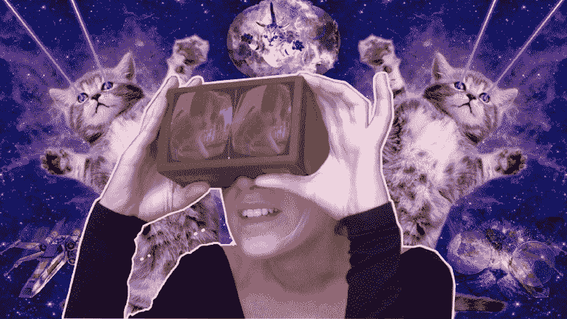
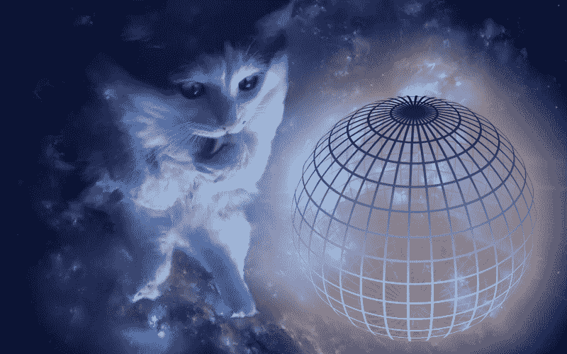
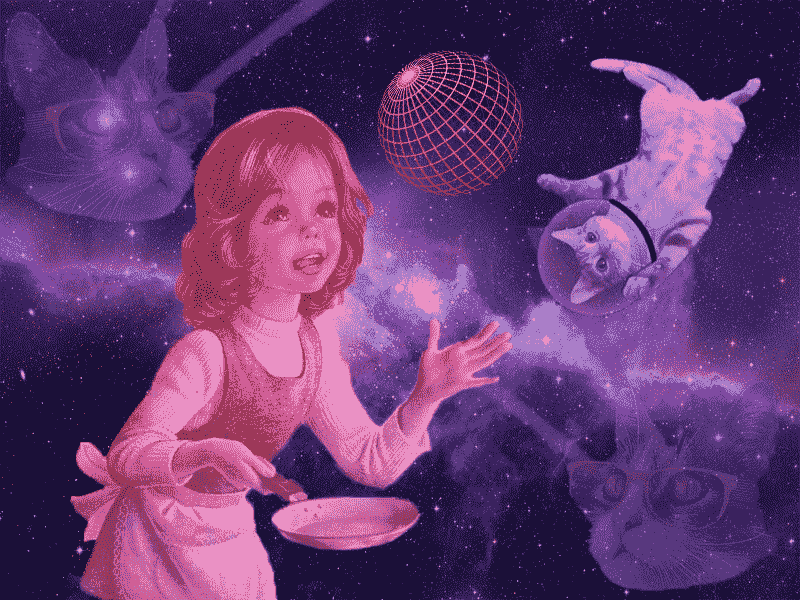
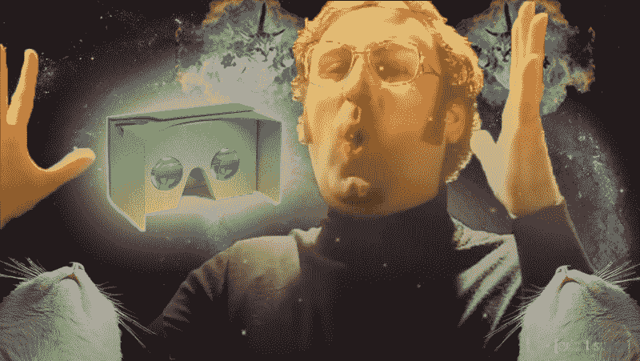
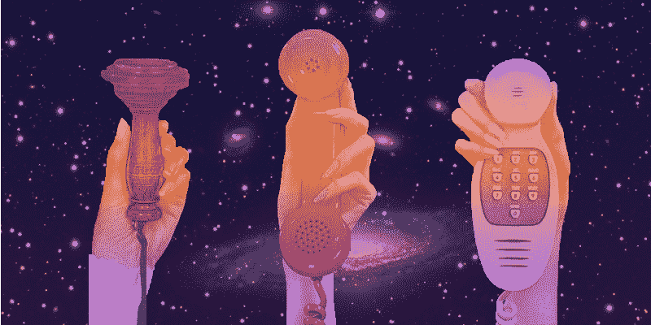
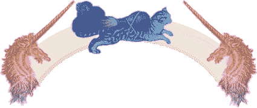

# 以下是如何使用 Unity 在 10 分钟内制作 360 VR 应用程序

> 原文：<https://www.freecodecamp.org/news/how-to-make-a-360-vr-app-with-unity-51cbe41ad8f1/>

阿德里亚娜·维奇奥利

# 以下是如何使用 Unity 在 10 分钟内制作 360 VR 应用程序

Image credits: yours truly

虚拟现实(VR)令人兴奋。这也是应用程序开发的新领域。

虚拟现实将催生新形式的讲故事和情感上强大的体验。然而，制作虚拟现实被认为是令人生畏的:它很昂贵，需要特殊的硬件和技能。

但这种情况正在改变，因为直观的工具和负担得起的硬件正在使 VR 开发变得容易。本教程将向您展示如何在短短几分钟内在 Android 和 Google Cardboard 上构建一个 360 视频应用程序。几乎不需要任何编码；)

VR 开发不应该成为让你的想法变成现实的障碍。让我们开始吧:

### **你需要什么**

这是我们的购物清单:

？一个带陀螺仪的机器人手机**可以感知头部运动，运行在 KitKat 或更新的操作系统上。**

**？A C **ardboard 耳机。如果你没有，你可以在亚马逊上找到很多不到 10 美元的。T [他的一个](https://www.amazon.com/gp/product/B06X6B9YVG/ref=as_li_tl?ie=UTF8&camp=1789&creative=9325&creativeASIN=B06X6B9YVG&linkCode=as2&tag=vrtiginous-20&linkId=86c04570070ba858568f715166805857)是我最喜欢的。****

**？U [**nity3D，**](https://unity3d.com/fr/get-unity/download) 一个跨平台的游戏引擎，需要安装在电脑上，版本 5.6 或更新。我们将使用这个软件来构建我们的整个项目。**

**？Unity 的 **G [oogleVR SDK，](https://developers.google.com/vr/unity/download)** 可以提前下载。**

**？一个 3 **60 的视频。**用 360°相机拍一个(h [这里有一个可以插在手机上的)](https://www.amazon.com/gp/product/B06Y5YTQGV/ref=as_li_tl?ie=UTF8&camp=1789&creative=9325&creativeASIN=B06Y5YTQGV&linkCode=as2&tag=vrtiginous-20&linkId=0660c5b49b36c9b42e46c759c7629008)或者在网上找一个。**

### **我们如何构建这个应用程序？**

**与具有矩形框架的常规视频不同，360°视频具有球体形状。因此，我们首先需要创建一个球形屏幕来投影我们的 360 视频。玩家(或观众)将位于这个球体内部，并将能够从任何方向观看视频。**

**下面的步骤解释了这一切是如何进行的，应该会让你觉得有能力做出自己的改变。有关分步说明，请参考视频**

### ****第一步:搭建球体？****

****

**首先，如果您是从零开始，让我们打开一个新的 Unity 项目(如果您想在现有项目中集成 360 视频播放器，请打开一个新的场景。)把一个场景想象成一个视频游戏的一个关卡，把一个项目想象成一个完整的游戏。**

**之后，在场景中添加一个球体对象，放置在其中心(*位置= 0，0，0* )，半径为 50 ( *比例= 50，50，50* )。相机的位置也应该设置为 0，0，0。相机是玩家/观众的眼睛，所以我们希望它在球体的中心。把它放在别处会使视频看起来失真。**

**一旦相机被放置在球体内部，后者在场景中就不再可见。别担心，这是有原因的！事实上，默认情况下，大多数游戏引擎不会渲染 3D 对象的内部。这是因为我们很少需要看到它们，渲染它们会浪费资源。我们接下来会解决这个问题。**

### **第二步:翻转球体的法线？**

****

**在我们的例子中，我们确实需要从内部观察我们的球体。这是应用程序的全部要点，所以我们要把它翻个底朝天。**

**在统一中，球体实际上不是球体(什么？我们一直都被骗了！)，它们是由成千上万个微小的面组成的多边形。小平面的外侧可见，但内侧不可见。出于这个原因，我们将制作一个程序来翻转这些小平面，就像煎饼一样。**

**在 3D 几何中，我们称这种转换为反转法线或翻转法线。**

**我们将使用一个叫做*着色器*的程序，我们将把它应用于球体的*材质*。材料统一控制物体的外观。着色器是一些小脚本，根据从材质中提取的照明和信息，计算渲染的每个像素的颜色。**

**因此，为球体创建一个新的材质，然后将一个新的着色器应用于该材质。我们需要为着色器编写自定义代码…但是不用担心，您可以复制粘贴以下代码:**

**这个小着色器将把球体的每个像素翻转过来。现在我们的球体看起来像一个白色的大球，从内部看，在我们的场景中。下一步是将这个白色球体变成视频播放器。**

### **第三步:将你的 360°视频投射到球体内部？**

**这里你需要手头有一个 360 mp4 的视频。将其导入到项目中，然后将其拖动到球体上。这时神奇的事情发生了:一个“视频播放器”组件出现了，然后砰的一声，视频就可以播放了。**

**您可以使用循环和音频等设置进行播放。还支持流媒体！**

### **第四步:设置 Google Cardboard？**

****

**在这一步，我们将使体验*真正*感觉身临其境。这就是为什么我们想在虚拟现实耳机中观看它，这里是谷歌 Cardboard。**

**我们将使用 GoogleVR SDK 创建一个“立体”视图(屏幕将被一分为二，两侧有一些鱼眼效果——每只眼睛一面)。每只眼睛上的鱼眼效果，加上纸板塑料镜片的变形，给你深度和沉浸感的错觉。**

**要将 [GoogleVR SDK](https://developers.google.com/vr/unity/download) 添加到我们的项目中，下载并导入插件，然后我们将调整一系列 Android 设置:**

*   **进入*顶栏菜单>文件>编译 Se* 设置。添加您的开放场景(如果尚未添加)，然后在支持的平台列表中选择 Android。**
*   **点击*开关平台*。第一次切换时，需要一段时间。**
*   **点击*玩家设置*。组件出现在教师面板中。**

**在“播放器设置”教师的“其他设置”部分中:**

*   **检查*支持的虚拟现实*。在*虚拟现实 SDKs* 下，选择+图标，然后选择 *Cardboard* 将其添加到列表中。**
*   **在*包标识符*字段中输入包名(例如， *com.yourdomain.demo360* )。它必须是独一无二的，是用来区分我们的应用程序从其他谷歌播放商店。**
*   **将*最低 API 等级*下拉菜单设置为“*安卓 4.4‘奇巧’(API 等级 19)* ”。**

**之后，从项目浏览器的 *GoogleVR\Prefabs* 文件夹中取出“ *GvrViewerMain* ”元素，并将其拖入场景中。在检查器中，给它与球体中心相同的*位置*——(*0，0，0* )。**

**GvrViewerMain 预设控制所有的虚拟现实模式设置，例如使屏幕适应纸板的镜头。它还可以与手机的陀螺仪通信，以跟踪你的头部运动。当你转头时，摄像头和你看到的东西也会在 360 视频播放器内转动。**

**现在，当视频打开时，你可以向各个方向看，屏幕被分成两半，以适应纸板的两个镜头。**

### ****第五步:在安卓上运行 app？****

****

**最后一步，我们将在 Android 手机上运行该应用程序，并与朋友分享！**

**有两种方法可以做到:**

*   **回到*文件>建立 Setti* ngs。你可以用 USB 线把安卓手机插到你的电脑上，点击*运行&* 。这会将应用程序直接安装到您的手机上。**
*   **另一个选项是点击*只构建*。这并不是将它安装在手机上，而是生成一个 APK 文件。你可以通过电子邮件与任何想尝试你刚刚制作的杰作的人分享 APK。他们必须双击 APK 附件才能将其安装到手机上。**

**在构建过程中，可能会要求您选择根 Android SDK 文件夹。如果是这样的话，下载 [Android SDK](https://developer.android.com/studio/index.html#downloads) 然后选择它的文件夹位置。**

**启动应用程序，将您的手机插入纸板耳机，您就可以开始了！你可以把视频替换成 360°格式的任何东西，在家体验 VR 360 沉浸感。**

### ****更进一步****

**恭喜你，你做出了一款 *360* 视频 app，距离打造一款 *VR* 视频 app 只有一步之遥！虽然这两个术语经常被类似地使用，但 360°和 VR 定义了两种不同的体验:**

*   **360°视频从各个角度录制，使用特殊的摄像机或多个摄像机的组合。用户可以从任何想要的方向观看，但是这种体验没有交互性。**
*   **VR 通常是指用户沉浸其中的计算机生成的环境。这是一个互动的体验:玩家可以四处移动和控制物体，除了向各个方向看。**

**您的新应用程序可以作为构建更丰富的虚拟现实体验的起点。Unity 有很多你可以利用的功能，比如添加 3D 元素或酷炫的粒子效果✨来覆盖和增强你的视频，或者加入一些互动元素。**

**您还可以在 360 视频播放器中放置一个完整的 3D 环境，并将后者用作天空盒。用户可以在风景中导航，使用这个漂亮的[行走脚本](https://github.com/JuppOtto/Google-Cardboard/blob/master/Autowalk.cs)。**

**尽情发挥你的想象力，向我展示你的作品:发微博给我或者留下评论。**

**创作美丽的虚拟现实故事很难。建造它们不应该。**

****

*****如果您喜欢这篇文章，请按下*？*在下面，这样其他人就能看到了。*****

**阿德里亚娜是一名艺术家&产品设计师，她创造虚拟现实体验，建立共鸣。如果你想把你的虚拟现实想法变成现实，给我们发邮件:hello@vrtiginous.com？**