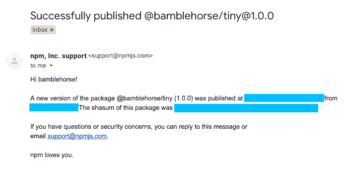
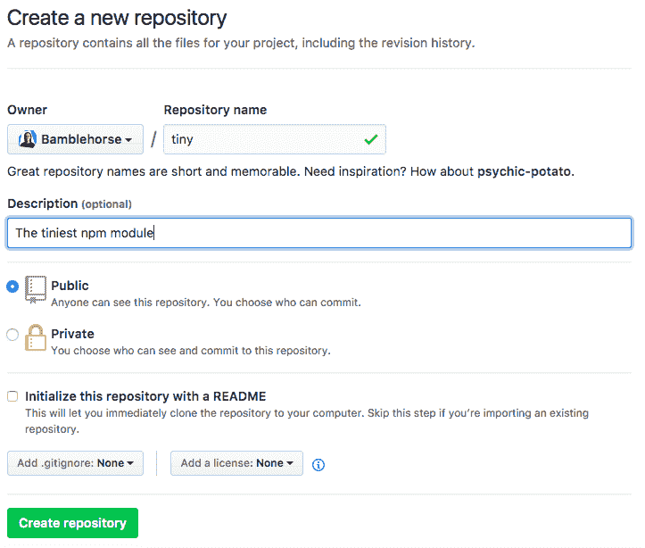
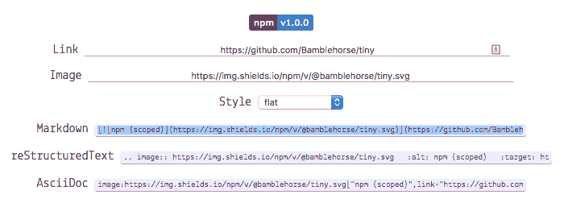
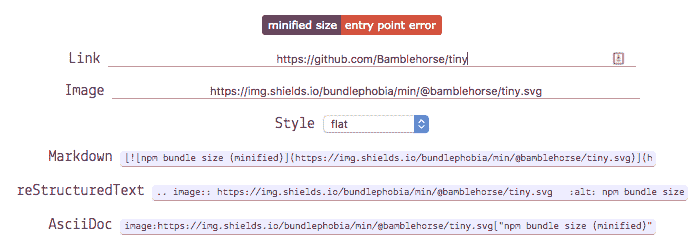
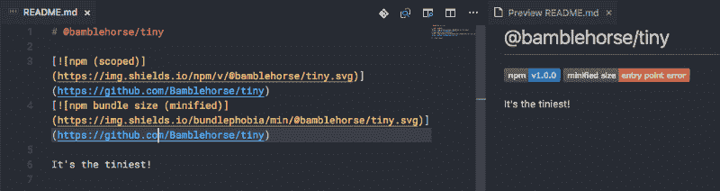
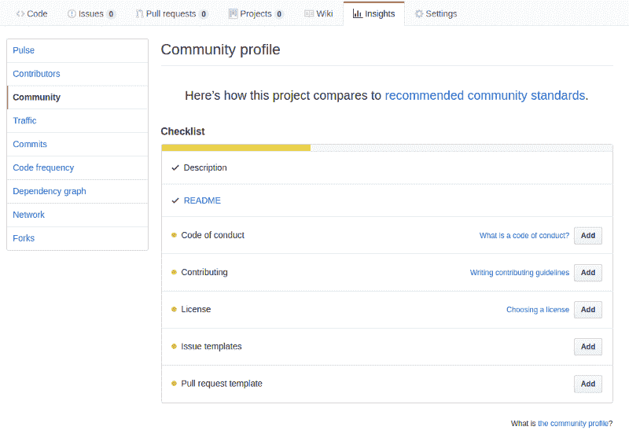
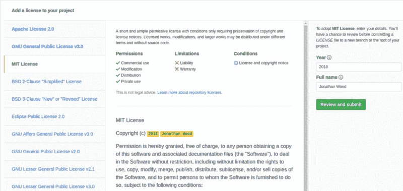

# 如何制作一个漂亮、小巧的 npm 包并发布它

> 原文：<https://www.freecodecamp.org/news/how-to-make-a-beautiful-tiny-npm-package-and-publish-it-2881d4307f78/>

你不会相信这有多容易！

如果你已经创建了很多 npm 模块，你可以直接跳过。否则，我们将快速介绍一下。

#### TL；速度三角形定位法(dead reckoning)

一个 npm 模块**仅**需要一个具有**名称**和**版本**属性的 package.json 文件。

### 嘿！

你在这里。

只是一只小象，你的人生还在前面。

您不是制作 npm 包的专家，但是您很想学习如何制作。

所有的大象都用它们的大脚跺着脚，制造一个又一个包裹，你就像:

> “我比不上那个。”

我在这里告诉你，你可以！

不再自我怀疑。

我们开始吧！

#### 你不是大象

我的意思是[比喻](https://www.merriam-webster.com/dictionary/metaphorical)。

想知道小象叫什么吗？

你当然有。小象被称为[小象](https://www.reference.com/pets-animals/baby-elephant-called-a3893188e0a63095)。

#### 我相信你

[自我怀疑](https://en.wikipedia.org/wiki/Impostor_syndrome)是真实的。

这就是为什么从来没有人做任何酷的事情。

你认为你不会成功，所以相反你什么也不做。但是你赞美了那些做了所有了不起的事情的人。

超级讽刺。

这就是为什么我要向你们展示尽可能小的 npm 模块。

很快你就会有大量的 npm 模块从你的指尖飞出。眼睛所能看到的可重用代码。没有技巧，没有复杂的指令。

### 复杂的指令

我保证过我不会…

…但我完全做到了。

他们没那么坏。总有一天你会原谅我的。

#### **第一步:npm 账户**

你需要一个。这只是交易的一部分。

[在此注册](https://www.npmjs.com/signup)。

#### 第二步:登录

你做了 npm 账户吗？

是的，你做到了。

酷毙了。

我还假设你可以使用[命令行/控制台](https://www.davidbaumgold.com/tutorials/command-line/)等。从现在开始我要称它为终端。显然[和](https://superuser.com/questions/144666/what-is-the-difference-between-shell-console-and-terminal)有区别。

转到您的终端并键入:

```
npm adduser
```

您也可以使用以下命令:

```
npm login
```

挑一个和你一致的命令。

你会得到提示，要求输入你的**用户名**、**密码**和**电子邮件**。把它们放在那里！

您应该会得到与下面类似的消息:

```
Logged in as bamblehorse to scope @username on https://registry.npmjs.org/.
```

不错！

### 让我们做一个包裹

首先，我们需要一个文件夹来存放我们的代码。用你觉得舒服的任何方式创造一个。我称我的包 **tiny** 是因为它真的很小。我为那些不熟悉的人添加了一些终端命令。

```
md tiny
```

在那个文件夹中我们需要一个 [**package.json**](https://docs.npmjs.com/files/package.json) 文件。如果你已经使用了[node . js](https://en.wikipedia.org/wiki/Node.js)——你以前应该见过这个文件。这是一个 [JSON](https://en.wikipedia.org/wiki/JSON) 文件，包含了关于你的项目的信息，并且有很多不同的选项。在本教程中，我们将只关注其中的两个。

```
cd tiny && touch package.json
```

#### 然而，它到底能有多小呢？

真的很小。

所有关于制作 npm 包的教程，包括官方文档，都告诉你在你的 package.json 中输入特定的字段。我们将继续尝试尽可能少地发布我们的包，直到它起作用。这是一种针对最小 npm 包的 TDD。

**请注意:**我向您展示这个是为了证明制作 npm 包并不复杂。为了对整个社区有用，一个包需要一些额外的东西，我们将在本文的后面讨论这些。

#### 发布:第一次尝试

要发布您的 npm 包，您可以运行名副其实的命令: **npm publish。**

因此，我们的文件夹中有一个空的 package.json，我们将尝试一下:

```
npm publish
```

哎呦！

我们遇到了一个错误:

```
npm ERR! file package.json
npm ERR! code EJSONPARSE
npm ERR! Failed to parse json
npm ERR! Unexpected end of JSON input while parsing near ''
npm ERR! File: package.json
npm ERR! Failed to parse package.json data.
npm ERR! package.json must be actual JSON, not just JavaScript.
npm ERR!
npm ERR! Tell the package author to fix their package.json file. JSON.parse
```

npm 没那么喜欢。

很公平。

#### 出版:第二击

让我们在 package.json 文件中为我们的包命名:

```
{
"name": "@bamlehorse/tiny"
}
```

你可能已经注意到我在开头添加了我的 npm 用户名。

这是怎么回事？

通过使用名字 **@bamblehorse/tiny** 而不仅仅是 **tiny** ，我们在用户名的**范围**下创建了一个包。它叫做 [**作用域包**](https://docs.npmjs.com/misc/scope) 。它允许我们使用可能已经被采用的短名称，例如 npm 中已经存在的 [**小**包](https://www.npmjs.com/package/tiny)。

你可能已经在流行的库中看到过这一点，比如来自 Google 的 [Angular framework](https://angular.io/) 。他们有几个作用域包比如 [@angular/core](https://www.npmjs.com/package/@angular/core) 和 [@angular/http](https://www.npmjs.com/package/@angular/http) 。

很酷吧。

我们将尝试第二次发布:

```
npm publish
```

这次误差更小——进步。

```
npm ERR! package.json requires a valid “version” field
```

每个 npm 包都需要一个版本，以便开发人员知道他们是否可以安全地更新到您的包的新版本，而不会破坏他们的其余代码。npm 使用的版本化系统叫做 [**SemVer**](https://semver.org/) ，代表**语义版本化**。

不要太担心理解更复杂的版本名称，但这里是他们对基本版本如何工作的总结:

> 给定主要版本号。小调。补丁，增加:

> 1.主要版本当您进行不兼容的 API 更改时，

> 2.当您以向后兼容的方式添加功能时，次要版本

> 3.补丁版本当你做向后兼容的 bug 修复。

> 预发布和构建元数据的附加标签可作为主标签的扩展。小调。补丁格式。

> https://semver . org

#### **出版:第三次尝试**

我们将给我们的 package.json 版本: **1.0.0** —第一个主要版本。

```
{
"name": "@bamblehorse/tiny",
"version": "1.0.0"
}
```

我们发表吧！

```
npm publish
```

哎呀。

```
npm ERR! publish Failed PUT 402npm ERR! code E402npm ERR! You must sign up for private packages : @bamblehorse/tiny
```

请允许我解释。

作用域包是自动私下发布的，因为除了对我们这样的单个用户有用之外，它们还被公司用来在项目间共享代码。如果我们发布了一个普通的包，那么我们的旅程将在这里结束。

我们需要改变的是告诉 npm，实际上我们希望每个人都使用这个模块——而不是把它锁在他们的金库里。所以我们改为运行:

```
npm publish --access=public
```

嘣！

```
+ @bamblehorse/tiny@1.0.0
```

我们会收到一个加号，即我们的软件包名称和版本。

我们做到了——我们加入了 npm 俱乐部。

我很兴奋。

你一定很兴奋。



redacted in a friendly blue

#### 你听到了吗？

> npm 爱你

可爱！

第一版已经发布了！

### 让我们重组

如果我们希望作为开发人员被认真对待，并且我们希望我们的包被使用，我们需要向人们展示代码并告诉他们如何使用它。一般来说，我们会将代码放在公共的地方，并添加一个自述文件。

我们还需要一些代码。

说真的。

我们还没有代码。

GitHub 是放置代码的好地方。让我们创建一个[新存储库](https://github.com/new)。



#### 自述！

我习惯了键入 **README** 而不是 **readme。**

你不必再那样做了。

这是一个有趣的习俗。

我们将添加一些来自 [shields.io](https://shields.io/) 的时髦徽章，让人们知道我们超级酷和专业。

这里有一个让人们知道我们的软件包的当前版本:



npm (scoped)

下一个徽章很有趣。它失败了，因为我们实际上没有任何代码。

我们真的应该写一些代码…



npm bundle size (minified)



Our tiny readme

#### 编码许可证

这个头衔绝对是詹姆斯·邦德的翻版。

实际上我忘记添加许可证了。

许可证只是让人们知道在什么情况下他们可以使用你的代码。有[很多不同的](https://choosealicense.com/)。

每个 GitHub 存储库中都有一个名为 insights 的很酷的页面，在这里你可以查看各种统计数据——包括项目的社区标准。我将从那里添加我的许可证。



Community recommendations

然后你点击这个页面:



Github gives you a helpful summary of each license

#### 代码

我们仍然没有任何代码。这有点尴尬。

在我们失去所有可信度之前，现在就补充一些吧。

```
module.exports = function tiny(string) {
  if (typeof string !== "string") throw new TypeError("Tiny wants a string!");
  return string.replace(/\s/g, "");
};
```

Useless — but beautiful

就在那里。

一个**小的**函数，从字符串中移除所有空格。

所以 npm 包需要的只是一个 **index.js** 文件。这是您的包的入口点。随着您的包变得越来越复杂，您可以用不同的方式来完成它。

但是现在这是我们所需要的。

### 我们到了吗？

我们如此接近。

我们可能应该更新我们的最小 **package.json** 并给我们的 **readme.md** 添加一些说明。

否则没有人会知道如何使用我们美丽的代码。

#### package.json

```
{
  "name": "@bamblehorse/tiny",
  "version": "1.0.0",
  "description": "Removes all spaces from a string",
  "license": "MIT",
  "repository": "bamblehorse/tiny",
  "main": "index.js",
  "keywords": [
    "tiny",
    "npm",
    "package",
    "bamblehorse"
  ]
}
```

Descriptive!

我们添加了:

*   [描述](https://docs.npmjs.com/files/package.json#description-1):包的简短描述
*   [资源库](https://docs.npmjs.com/files/package.json#repository) : GitHub 友好——所以你可以写**用户名/repo**
*   [许可证](https://docs.npmjs.com/files/package.json#license):在这种情况下是 MIT
*   [main](https://docs.npmjs.com/files/package.json#main) :包的入口点，相对于文件夹的根目录
*   [keywords](https://docs.npmjs.com/files/package.json#keywords) :用于在 npm 搜索中发现您的包的关键字列表

#### readme.md