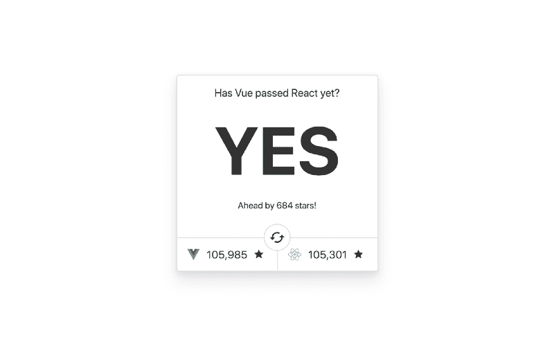
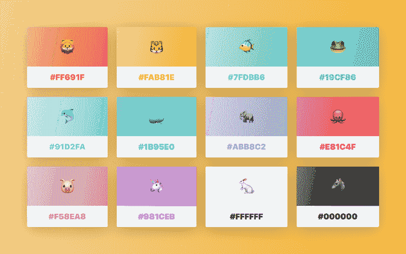
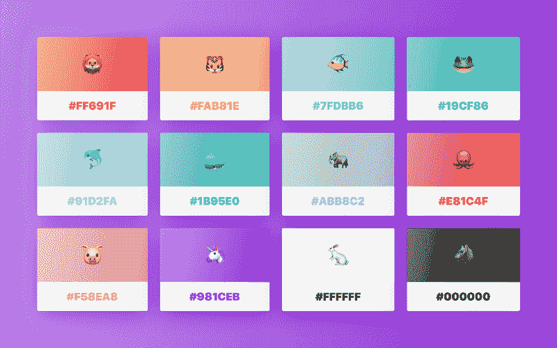
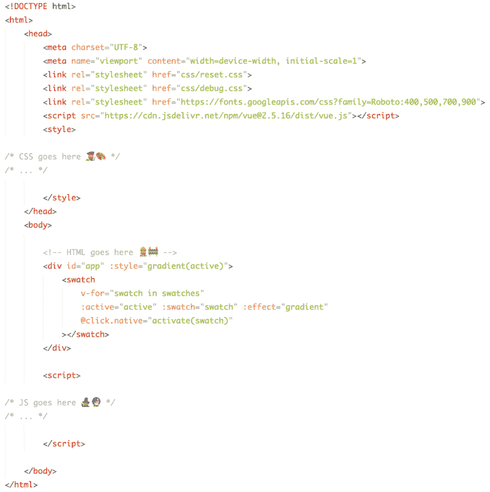
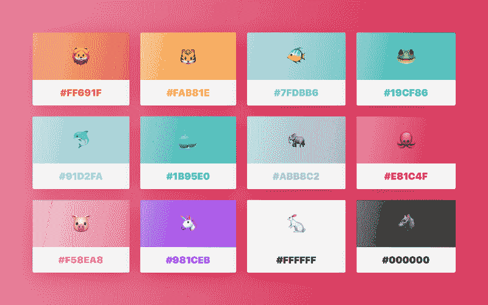
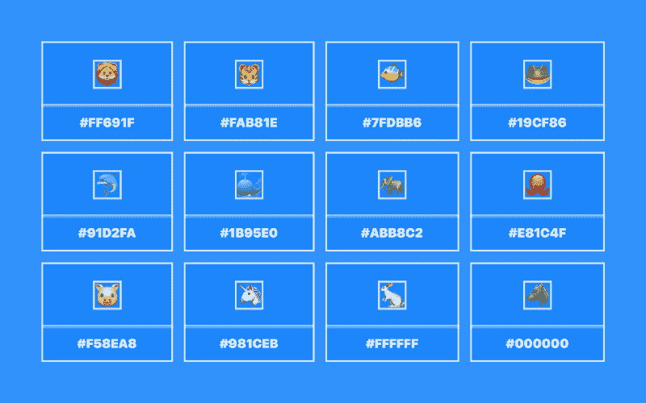
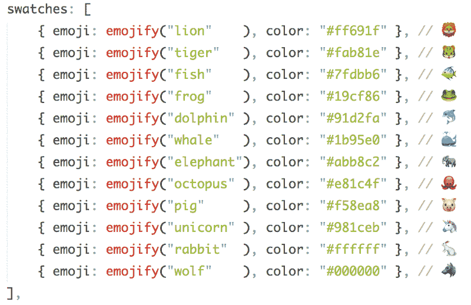
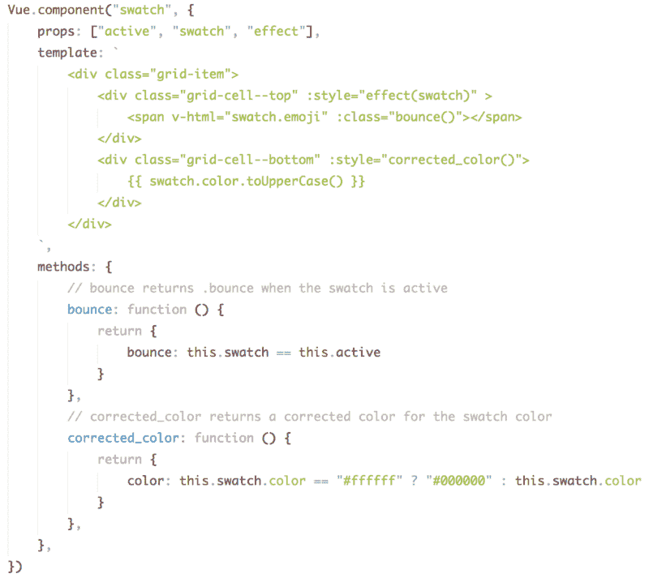
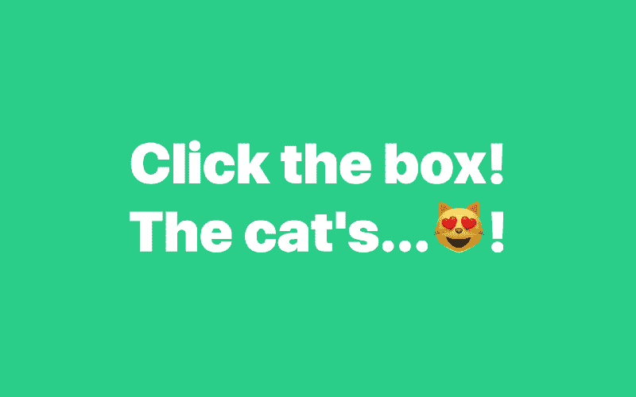

# 如何制作 a？带有 Vue 的颜色选择器！

> 原文：<https://www.freecodecamp.org/news/how-to-make-a-color-picker-with-vue-9640043b6c82/>

作者 ZAYDEK

# 如何制作 a？带有 Vue 的颜色选择器！

#### 注意:颜色可能看起来比实际更可爱！

在我开始写这篇文章之前，我只想分享我正在开发一个产品，我很乐意收集一些关于如何更好地为 web 开发人员服务的数据。我创建了一个[简短问卷](https://twitter.com/username_ZAYDEK/status/1103914471267790854)在阅读这篇文章之前或之后进行检查。请检查一下，谢谢！现在，回到我们的常规节目。

### 你好互联网！

我是 [Zaydek](https://twitter.com/username_ZAYDEK) ，我是网络开发新手。我有图形设计和编程的背景，所以做前端对我来说很有吸引力。

网络就像平面设计师和程序员的后代——它既是可视化的，也是程序化的。所以今天我要给大家介绍 [Vue.js](https://vuejs.org/) 和基于组件的网页设计——也就是现代网页开发。我将带你从一个网络开发新手成为一个无所不能、无所不知的网络开发先知！

> 你怎么能做出这样的断言，先生？

> 真想不到你

事实是，大多数人在我们(作为一个整体)了解如何上网之前就学会了如何上网！包括我！？老实说，这可能是我最长时间拒绝学习 web 开发的原因。感觉太破碎了！

但是时代在变，web 开发从来没有像现在这样简单和高效。因此，我非常荣幸地向大家介绍如何在 2018 年，甚至更远的地方上网！

#### 这怎么还教我？我刚刚发布的 Vue 课程中的作品和更多内容。从基础开始学习 Vue，并学习如何构建一些东西！点击这里免费注册！

[Click to enroll in my free Vue course!](https://scrimba.com/g/glearnvue)

#### Scrimba.com 是一个学习和分享如何编程的新的互动网站。截屏可以被打断和编辑，让学习变得活跃和有趣！

### 那么，Vue 是怎么回事？

那么，为什么是 [Vue](https://vuejs.org/) ？这是一个你应该问的伟大而公平的问题。有些人抗议和蔑视使用任何框架的想法，我认为这是一个危险的想法。然而，我建议无论你使用什么工具，都要深思熟虑，考虑清楚你为什么要使用它。

我选择 Vue 是因为我想使用不太主流的新工具。我希望他们从之前的工具中学习(或者换句话说，不要太超前)。他们应该有[最好的文档](https://vuejs.org/v2/guide/)，并且有足够数量的用户。

自从 Vue，在过去的几周里，[在 GitHub](https://hasvuepassedreactyet.surge.sh/) 中超过了 React is stars，这对我来说是 Vue 具有临界质量的证据。？

By the way, [this website](https://hasvuepassedreactyet.surge.sh) was made using Vue.js! ?

此外， [Vue 是一个非凡的开源项目](https://github.com/vuejs/vue) , [是公共资助的](https://www.patreon.com/evanyou)，并且有很好的开发者体验！喜欢用户体验，但对开发者来说。这带来了奇妙的结果，普通的开发者现在可以直观地创建交互式网站。Vue 建立在角度反应战争中最成功的想法之一上，即虚拟 DOM。所以我们现在就来谈谈这个。

> *虚拟 WUT？*

> —互联网的你

虚拟世界哟。LOL 抱歉。所以让我们倒退一下——DOM 是文档对象模型的缩写。我认为 DOM 是一个范例，说明了我们如何将文本视为数据结构来组成我们所谓的网页。虚拟 DOM 是处理元素间文本的巧妙抽象，比如`
hello, worl` d！< /p >。在一个基于 Vue 的惯用网站中，它是 som`ething like 
`；{{ message }} < /p >，数据存储在 JavaScript 内部！

> 一个简单的网站为什么要依赖 JavaScript？

> —无辜的你

这是一个伟大的(和公平的)观点。但是依靠一些 JavaScript 来构建网站有一个显著的好处，不管是静态的还是动态的。我们可以通过编程来编写和构建网站，而不是到处复制数据。一旦数据从 HTML 中分离出来，就像 CSS 从 HTML 中分离出来一样，神奇的事情就开始发生了。？

好消息是，因为我们对网站的期望如此之高，所以可以合理地假设大多数人都会默认启用 JavaScript。所以我们没有理由关闭它。几年前我可能不同意这一点，但我现在可以体会到使用 JavaScript 的好处远远超过可能出现的任何问题。

### 那么……那个颜色选择器怎么样，嗯？

Click to pick a color, any color!

抱歉多嘴了！我很难不详细谈论这个，部分原因是它太令人兴奋了。还有一部分原因是，当一个单独的开发者可以负责构建漂亮的交互式网络应用/业务时，会出现各种各样的可能性。你说生意？是的— [在 Twitter 上关注我](https://twitter.com/username_ZAYDEK)，我一定会跟进！？

事不宜迟，下面是该网站的 HTML:

Psst…完整代码可在第九期截屏中找到。

感到震惊？问题是，让我们想想我给你展示的这个网站的内在复杂性。它实际上只是一个有两个单元格的盒子，一个有表情符号，一个有文本，重复 12 次。是的，有一些填充，有一些渐变，但基本设计没有改变。那么，如果代码的复杂性与设计的复杂性成正比呢？

This is what I call a CSS debugger. You can learn more about it (and how to use it) by [clicking here](https://gist.github.com/zaydek/6b2e55258734deabbd2b4a284321d6f6).

在这里，我应用了一个 [CSS 调试器](https://gist.github.com/zaydek/6b2e55258734deabbd2b4a284321d6f6)来消除设计的歧义，但是这只涉及到 CSS。这里更重要的是，Vue 的真正意义在于，我们如何从数据而不是 HTML 元素的角度来看待我们的网站。

所以再看看这些图片。如果我们纯粹从数据的角度来考虑我们的网站，数据有多少？

现在，请允许我分享所使用的底层数据结构:

emojify() is a helper function

下面这句话可能是最重要的: **Vue 让我们从数据的角度考虑我们的网站，与 HTML 分开；这是一场关于我们如何构建网络的革命！**

明确地说，我向您展示的是一个匿名对象数组，每个对象都有两个键:`emoji`和`color`。既然我们可以用数据来表示网站，我们就用 Vue 的`v-for`和一个定制组件来迭代数据。

### 是啊，没错。那么组件呢？

组件—是的！除了从 HTML 中分离数据，Vue 提供的最酷的东西之一是基于组件的设计。组件可以帮助我们将 HTML/CSS/JS 的块抽象成一个可重用的单元:组件。

**快速提示**:我决定最好先学习如何在没有构建过程的情况下使用 Vue，这意味着我不会使用单文件组件。但是我正在通过`Vue.component()`使用组件。

还记得我之前在源代码中演示的`<swat` ch >元素吗？这是我使用 Vue 设计的自定义组件，用于从实现中抽象元素。这是一个重要的概念，因为这意味着我们可以开始更多地从功能性而不是强制性的角度来思考。

有什么区别？功能设计关心结果，而命令式设计关心结果**和**实现。设计组件是一个必不可少的过程，而使用组件是一个功能性的过程。？

这是前面显示的`swatch`元素的实现。它的工作原理是，Vue 扫描 DOM 寻找`swatch`的实例，并用组件的`template`值中的引号 HTML 替换它。这意味着我们可以进行重大的重构，从概念上更好地理解我们的网站，而不是一直担心某个东西应该如何被设计。

#### 学习 Vue 还有很多东西要学，所以我就这个主题又写了两篇文章。求求你，看完这篇文章，看看吧！

Left: “[Learn Vue.js in this free course! ?✨”](https://medium.freecodecamp.org/learn-vue-js-in-our-free-course-85d5df41e47f) Right: “B[uilding Schrödinger’s div ? with Vue!”](https://medium.freecodecamp.org/building-schr%C3%B6dingers-div-with-vue-4068f6423830)

### 你改变了我的想法..

我知道这可能很难接受，尤其是对于一件看起来无害的事情？颜色选择器。但是我给你展示的是(除了 CSS) 90%的代码库。至少有几个助手功能我省略了，但重点是，讨论的技术和意识形态加起来比一个可爱的 web 应用程序要多得多。这意味着一个人可以为他人创造美观实用的网络产品和服务。

我还认为 Vue 不仅仅是一个框架。如果搭配正确的后端语言(让我们为 [Go](https://golang.org/) 欢呼吧！)，学习和使用 Vue 加起来就多了很多。惯用的 Vue 还可以教授现代软件开发意味着什么，以及如何访问数十亿(！)的人，没有应用程序开发带来的技术障碍。

#### 所以，请到美丽的世界中去，学习一些 Vue 吧！可以(！)做出惊人的事情，甚至改变别人的生活，甚至是你自己的生活。如果有帮助的话，[试试免费课程](https://scrimba.com/g/glearnvue)！

