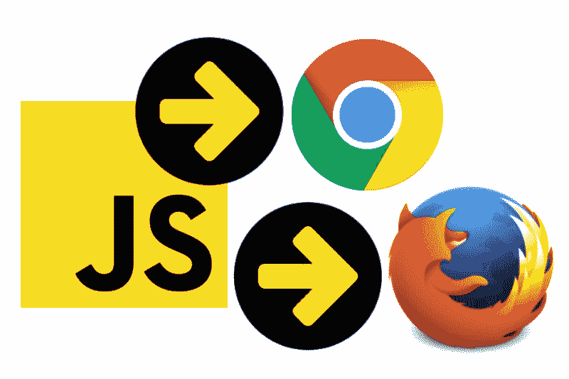
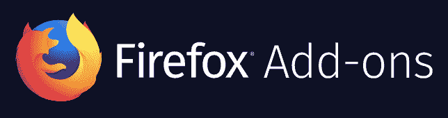

# 如何使用 JavaScript 和浏览器 API 进行跨浏览器扩展

> 原文：<https://www.freecodecamp.org/news/how-to-make-a-cross-browser-extension-using-javascript-and-browser-apis-355c001cebba/>

作者 ryanwhocodes

# 如何使用 JavaScript 和浏览器 API 进行跨浏览器扩展



本教程将介绍如何创建一个跨多个浏览器工作的 web 扩展。它将向您展示如何构建一个项目并编写 JavaScript 代码来与浏览器的选项卡进行交互，这取决于所使用的浏览器。这意味着您可以编写代码，然后将一个扩展包分发到多个浏览器的 web 商店。



Chrome Web Store and Firefox Add-ons are two places you can distribute your browser extension

> 这篇文章将关注 Chrome 和 Firefox 浏览器，以及通过 [Chrome 网络商店](https://chrome.google.com/webstore/category/extensions)和 [Firefox 插件](https://addons.mozilla.org/en-US/firefox/)网站分发扩展。其他浏览器和分发选项也可用于 web 扩展。

使用[模板](https://github.com/ryanwhocodes/template-browser-extension)开始—复制、编辑和发布！

要查看完整的示例，这里有一个链接，指向我制作的名为[链接格式化程序](https://github.com/ryanwhocodes/link-formatter)的扩展，在 [popup.js](https://github.com/ryandav/link-formatter/blob/master/extension/js/popup.js) 中有跨浏览器的 JavaScript。Chrome 和 Firefox 网络商店中都列出了相同的软件包。


### 浏览器扩展

扩展是扩展你的浏览器功能的一个很好的方式，它们允许你改善你的在线体验。如果您正在构建自己的第一个，或者想了解更多，我推荐以下教程:

*   [浏览器扩展— Mozilla | MDN](https://developer.mozilla.org/en-US/Add-ons/WebExtensions)
*   什么是扩展？—谷歌浏览器
*   [扩展剖析— Mozilla | MDN](https://developer.mozilla.org/en-US/Add-ons/WebExtensions/Anatomy_of_a_WebExtension)

#### 将扩展加载到本地计算机上

开发扩展时，您可以在本地加载它，而不必从外部网站发布和下载。具体方法取决于您使用的浏览器。

**铬合金**

*   在您的 Chrome 浏览器中访问`chrome://extensions/`
*   点击`Load Unpacked`
*   选择扩展的文件夹

**火狐**

*   访问`about:debugging`
*   点击`Load Temporary Add-on`
*   在扩展的文件夹中选择`manifest.json`

**调试提示**:查看控制台，(例如查看错误)，右键/控制键点击 web 扩展图标或弹出菜单，选择`inspect`


### 为您的浏览器扩展编写 JavaScript

有许多 JavaScript API 可以在您的浏览器扩展中使用。这篇文章将重点讨论标签 API。

**关于** **更多关于 web 扩展 API，**参见[JavaScript API—Mozilla | MDN](https://developer.mozilla.org/en-US/Add-ons/WebExtensions/API)。

当用户单击浏览器工具栏中的图标时，包含弹出 HTML 页面的浏览器扩展可能具有如下的项目结构:

```
extension├── css│   └── style.css├── js│   └── popup.js├── manifest.json└── popup.html
```

然后，`popup.html`页面将运行页面底部的`js/popup.js`脚本。你可以在这里添加你的 JavaScript。

**注意**:其他项目结构可能有一个用于库代码的文件夹，以及在扩展的其他区域运行的 JavaScript 文件。例如，在扩展的[后台脚本](https://developer.mozilla.org/en-US/Add-ons/WebExtensions/Anatomy_of_a_WebExtension#Background_scripts)中，以及扩展捆绑的任何其他文档中，包括[浏览器动作](https://developer.mozilla.org/en-US/docs/Mozilla/Add-ons/WebExtensions/Browser_action)或[页面动作](https://developer.mozilla.org/en-US/docs/Mozilla/Add-ons/WebExtensions/Page_actions)弹出、[侧边栏](https://developer.mozilla.org/en-US/docs/Mozilla/Add-ons/WebExtensions/Sidebars)、[选项页面](https://developer.mozilla.org/en-US/docs/Mozilla/Add-ons/WebExtensions/Options_pages)或[新标签页](https://developer.mozilla.org/en-US/Add-ons/WebExtensions/manifest.json/chrome_url_overrides)。

### 浏览器标签 API

编写 web 扩展时，需要使用 tabs API 与浏览器中的选项卡进行交互。为此，您还需要请求用户的许可。

#### 请求访问选项卡的权限

权限需要在`[manifest.json](https://developer.mozilla.org/en-US/Add-ons/WebExtensions/manifest.json)`中设置。当用户试图安装扩展时，它会提示用户确认是否允许此操作。

```
"permissions": [    "tabs"  ]
```


Firefox is one of the browsers that uses the browser.tabs API

#### 使用浏览器 API 查询标签

浏览器，比如 Firefox，使用`browser.tabs` API 与浏览器的标签交互。要请求关于窗口选项卡的信息，可以使用`query`方法，该方法返回一个带有选项卡数组的承诺。

```
browser.tabs.query(  queryInfo  // object)
```

在 [tabs.query() — Mozilla | MDN](https://developer.mozilla.org/en-US/Add-ons/WebExtensions/API/tabs/query) 阅读更多关于 browser.tabs.query 的信息

要请求浏览器窗口的活动选项卡，您需要编写以下 JavaScript:

```
browser.tabs.query({active: true, currentWindow: true}) .then(logCurrentTabData)
```

要获取当前选项卡，需要从返回的选项卡数组中检索第一个选项卡。按照这种结构，您可以从浏览器选项卡中获取数据。

```
const logCurrentTabData = (tabs) => {  currentTab = tabs[0]  console.log(currentTab.title);  console.log(currentTab.url);}
```

然而，当你试图在 Chrome 中打开扩展时…


Trying to use the browser API in Chrome throws an error


The Chrome browser uses the chrome.tabs API

#### 使用 chrome API 查询标签

Chrome 有自己的标签查询 API。这遵循语法`chrome.tabs` →您的查询

```
chrome.tabs.query(object queryInfo, function callback)
```

在这里阅读更多关于 Chrome 的 tabs API:[Chrome . tabs—谷歌 Chrome](https://developer.chrome.com/extensions/tabs) 。

因此，要使用这个方法调用，您应该在浏览器扩展中编写以下代码:

```
chrome.tabs.query(   {active: true, currentWindow: true},   (arrayOfTabs) => { logCurrentTabData(arrayOfTabs) });
```

### 组合选项卡查询

#### 检测要使用的 API

然后，通过使用条件语句来确定使用哪一种，可以在扩展中包含这两种类型的浏览器查询。

```
if(chrome) {  chrome.tabs.query(    {active: true, currentWindow: true},    (arrayOfTabs) => { logCurrentTabData(arrayOfTabs) }  );} else {  browser.tabs.query({active: true, currentWindow: true})    .then(logCurrentTabData)}
```

#### 为每种浏览器类型添加更多代码

在条件的每一侧，您可以添加依赖于不同 API 的其他代码，例如创建新的选项卡。

```
chrome.tabs.create()browser.tabs.create()
```

下面是添加了额外方法的代码，用于在新选项卡中打开链接。

```
if(chrome) {  chrome.tabs.query(    {active: true, currentWindow: true},    (arrayOfTabs) => { logCurrentTabData(arrayOfTabs) }    );  $('a').click( (event) => { chrome.tabs.create({url:event.target.href}) } )} else {  browser.tabs.query({active: true, currentWindow: true})    .then(logCurrentTabData)  $('a').click( (event) => { browser.tabs.create({url:event.target.href}) } )}
```

### 发布您的扩展

有了这些代码，您现在可以与当前的浏览器进行交互，而不必编写两个或更多不同的 web 扩展项目。现在，您可以打包您的扩展，并用同一个文件发布到多个 web 商店！

*   [在 Chrome 网络商店发布——谷歌 Chrome](https://developer.chrome.com/webstore/publish)
*   [开发者中心::火狐插件](https://addons.mozilla.org/en-US/developers/)

#### 从介质中读取更多内容

*   [如何链接到你的 Medium 文章中的特定段落(2018 目录方法)](https://medium.freecodecamp.org/how-to-link-to-a-specific-paragraph-in-your-medium-article-2018-table-of-contents-method-e66595fea549)作者[昆西·拉森](https://www.freecodecamp.org/news/how-to-make-a-cross-browser-extension-using-javascript-and-browser-apis-355c001cebba/undefined)在 [freeCodeCamp](https://medium.freecodecamp.org/)
*   [改善媒体体验:一次一个浏览器扩展](https://medium.freecodecamp.org/improving-the-medium-experience-one-browser-extension-at-a-time-7df7e233c984)来自[的塞德里克·阿玛雅](https://www.freecodecamp.org/news/how-to-make-a-cross-browser-extension-using-javascript-and-browser-apis-355c001cebba/undefined)来自[的自由代码营](https://medium.freecodecamp.org/)

#### 从 [ryanwhocodes](https://www.freecodecamp.org/news/how-to-make-a-cross-browser-extension-using-javascript-and-browser-apis-355c001cebba/undefined) 阅读更多内容

*   [如何在一小时内制作一个渐进式网络应用](https://medium.freecodecamp.org/how-you-can-make-a-progressive-web-app-in-an-hour-7e36d560610e)
*   [注意你的编程语言:如何使用 Github 语言学家和 gitattributes 准确检测你的应用程序的代码类型](https://medium.freecodecamp.org/mind-your-programming-language-38e340a430a1)
*   使用 iTerm2 和 Zsh，让您的终端更加丰富多彩，工作效率更高！