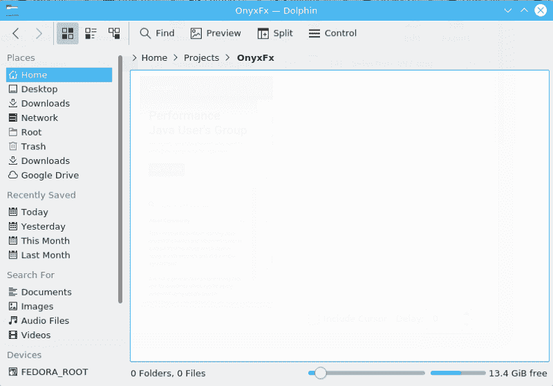
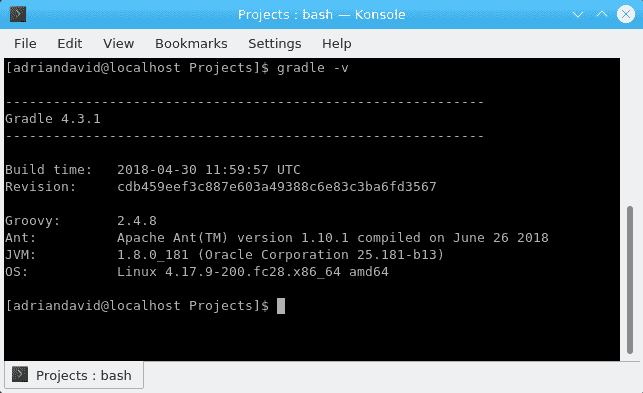
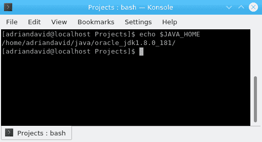
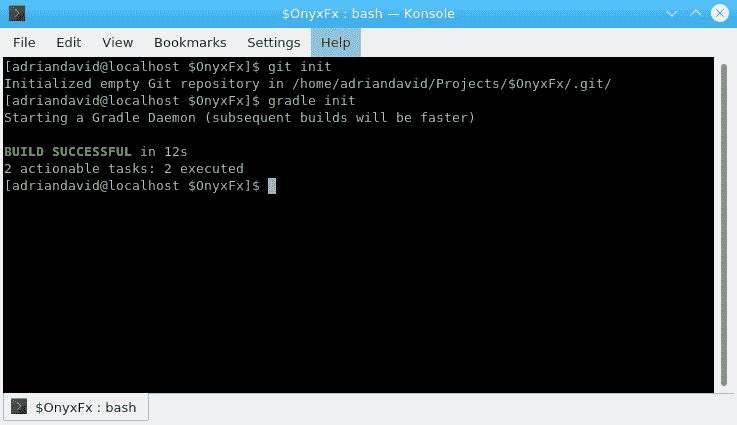
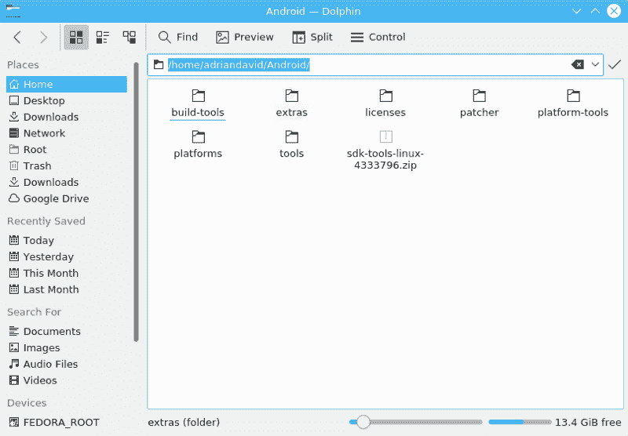
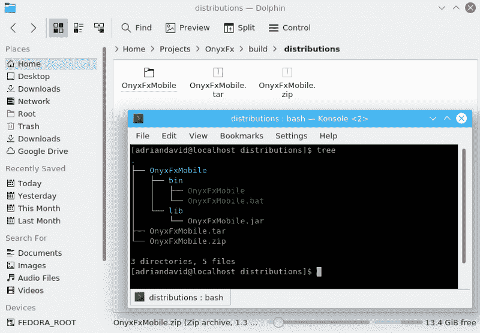
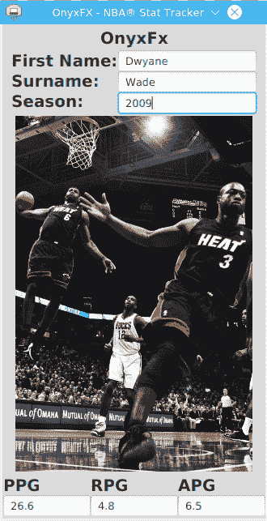
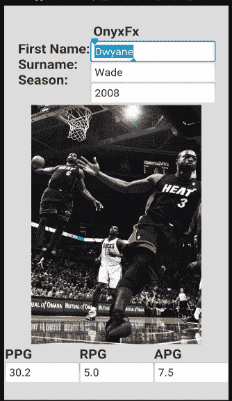
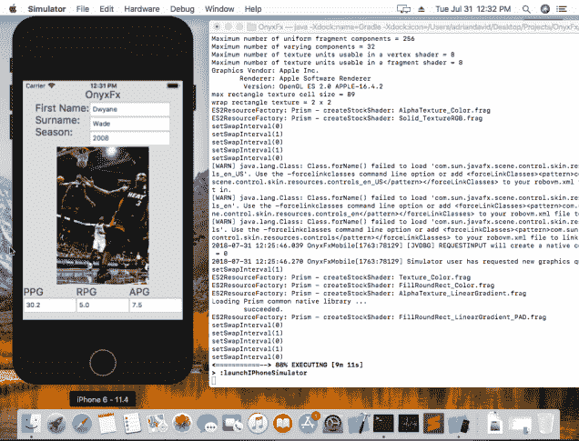
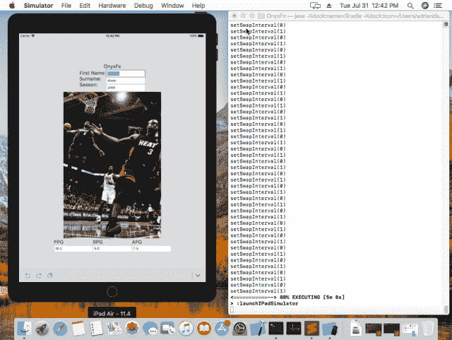

# 如何用 Java 制作跨平台的手机 App

> 原文：<https://www.freecodecamp.org/news/how-to-make-a-cross-platform-mobile-app-in-java-5f8eae071ff2/>

阿德里安·d·芬利

您知道可以使用 Java 制作跨平台的移动应用程序吗？是的，掐你自己，你第一次读对了！我将教你如何利用现有的 Java 知识，通过 12 个简单的步骤，在 Android 和 iOS 上创建高性能的应用程序。我们将使用 JavaFX 作为 GUI 工具包来完成这一切。

但首先，更多的前景。你将需要满足后续要求，以便能够为 Android 和 iOS 构建应用程序。但是，如果您不想构建 iOS 应用程序，可以在任何支持 Java SE 8 的 x64 位机器上自由开发。这个项目将是一个用 gradle 构建的 Git 库。但是您不需要创建 Git 存储库。

以下是**要求**:

*   符合 JDK 1.8 的 JVM
*   Android 命令行工具(SDK v.27 版)
*   XCode 9.2
*   Gradle 4.2
*   Git 大文件存储(v.2.5.0)(如果不想创建 git 存储库，则不需要)
*   优选至少 4G 内存

不耐烦？想看看最终结果吗？查看以下已完成的项目。

[**afin lay 5/OnyxFx**](https://github.com/afinlay5/OnyxFx)
[*grad le 源代码库用于 OnyxFx，一个跨平台(Android/iOS/Linux/MAC OS/Windows)的 JavaFX app 渲染…*github.com](https://github.com/afinlay5/OnyxFx)

我的开发环境将是 Fedora Linux 28 和 macOS High Sierra。既然我们已经解决了这个问题，让我们开始研究吧。

### 1)创建一个文件夹来存放项目

我托管了我的项目 OnyxFx，如下:“**/home/adriandavid/Projects/OnyxFx”。当然，你可以在任何你喜欢的地方主持这个项目。**



### 2)初始化 gradle，Git，设置 JAVA_HOME

在项目目录的根目录下打开一个终端。如果正确配置了 gradle，在执行以下命令后，您应该会看到类似这样的内容:

```
gradle -v
```



您需要确保 gradle 在标有“JVM”的部分旁边列出了您的 Java 开发工具包(JDK) 8 安装。

虽然有许多方法可以做到这一点，但最直接的方法是确保正确设置 JAVA_HOME 环境变量。

根据您的环境，有许多方法可以做到这一点。在大多数*nix 环境中这样做的一个方法是在 **/home/ < user > /中设置变量。b** ash **rc 或/etc/pro** 文件。请参阅操作系统的手册，确保 JAVA_HOME 环境变量设置正确。

您可以在任一行的末尾包含以下行。bashrc 或 profile，以确保 JAVA_HOME 设置正确。

```
JAVA_HOME=/home/adriandavid/java/oracle_jdk1.8.0_181/export JAVA_HOME
```

**注意:**您可以在这里安装甲骨文的 JDK 8 [。](http://www.oracle.com/technetwork/java/javase/downloads/jdk8-downloads-2133151.html)

然后，通过运行以下命令之一，确保 shell 反映了上述更改:

```
source ~/.bashrcsource /etc/profile
```

输入以下命令，验证变量设置是否正确:

```
echo $JAVA_HOME
```



如果您仍然遇到困难，或者您正在使用 Microsoft Windows，请参见此处的。

首先，在项目的根目录下运行`git init`来初始化 Git 存储库。**注意:如果您不想托管 git 存储库，可以跳过这一步。**

其次，在项目的根目录下运行`gradle init`来初始化 gradle 存储库。这一步是必需的。



**注意:**你会注意到我的例子略有不同。这是因为我已经在本地环境中初始化了 gradle 和 Git。

### 3)变得很棒！编辑 gradle.build 并

希望*大地、风、&火*能帮你变得很棒！打开您最喜欢的文本编辑器，编辑位于项目根目录下的 build.gradle，并用下面 GitHub gist 的内容替换它。

这些 build.gradle 设置将我们的 gradle 项目配置为使用 **javafxmobile** 插件，这是我们项目的工作马。你可以在这里和了解更多关于[和](https://github.com/javafxports/javafxmobile-plugin)[的插件。在许多事情中，javafxmobile 插件自动完成了下载(从 Maven Central 或 jcenter)以及将 iOS 和 Android SDKs 添加到应用程序的类路径中的过程。](https://bitbucket.org/javafxports/javafxmobile-plugin)

如果你熟悉 gradle、maven 或 ant，很好——你可能知道发生了什么。如果你不熟悉 gradle，**不用担心**。你需要了解的是，gradle 是一个构建工具，用于自动化构建应用程序中涉及的许多任务，如:获取依赖关系、项目组织等。

请注意，我们针对的是 Android 7.1 牛轧糖(API 版本 25)和 iOS 11(我们将很快看到这是在哪里完成的)。你可以根据需要调整这些值。但是，请注意，在 Android 的情况下，您必须确保 API 版本与您下载的 SDK 版本相匹配(稍后将详细介绍)。

最后，我不会在本教程中演示签名的可执行文件的生成。因此， *iOSSkipSigning* 被设置为 true，我们不使用 *releaseAndroid* gradle 任务。但是，您可以提供适当的设施来制作签名应用程序。

### 4)创建一个名为 gradle.properties 的新文件，并对其进行配置

在项目的根目录下创建一个名为`gradle.properties`的新文件，并将以下内容添加到该文件中。

```
robovm.device.name=iPhone-7robovm.sdk.version=11.0org.gradle.jvmargs=-Xms4g -Xmx8g
```

这些设置告诉 javafxports 插件使用 iPhone-7 作为板载仿真器，以 iOS 11 为目标，并将 Xms 和 Xmx 标志传递给 JVM，JVM 将初始内存池指定为 4GB，将最大堆内存池指定为 8GB。这对于 openJDK 的编译和 iOS 构建的开发是必要的。

### 5)安装自制软件(仅限 iOS)

如果您没有 Mac，也不打算开发 iOS 版本，可以跳过这一步。

在 macOS 中打开终端，粘贴以下命令。

```
/usr/bin/ruby -e "$(curl -fsSL https://raw.githubusercontent.com/Homebrew/install/master/install)"
```

### 6)安装 USB 多路复用插座(仅限 iOS)

只有在家酿已经成功安装的情况下，才可以进行到这一步。如果您没有 Mac，也不打算开发 iOS 版本，可以跳过这一步。

在 macOS 中打开终端，粘贴以下命令。

```
brew install usbmuxd
```

### 7)抓取 Android 命令行工具

点击获取适用于您平台的 Android 命令行工具[。下载完成后，解压文件夹并将内容粘贴到您选择的目录中。对我来说，这是件很奇怪的事。](https://developer.android.com/studio/#downloads)



### 8)设置 Android_HOME，抓取必要的 Android 包

和 Java 一样，gradle 需要知道在哪里可以找到 Android 命令行工具。有几种方法可以做到这一点。然而，本着简单和一致的精神，我们将在本教程中设置 ANDROID_HOME 环境变量。按照我们为 JAVA_HOME 添加变量的方式添加下面的变量。例如:

```
ANDROID_HOME=/home/adriandavid/Android/ export ANDROID_HOME
```

记得通过添加`source <fi` le >来重新加载 shell，就像我们对 JAVA_HOME 所做的那样。

现在，获取构建 Android 版本所需的工具。执行以下命令:

```
# *.nix./sdkmanager "platform-tools" "build-tools;25.0.3" "platforms;android-25" "extras;android;m2repository" "extras;google;m2repository"
```

```
or
```

```
#Windowssdkmanager "platform-tools" "build-tools;25.0.3" "platforms;android-25" "extras;android;m2repository" "extras;google;m2repository"
```

请注意，我们在 gradle.build 中指定的 SDK 和 API 版本对应于我们在该命令中指定的版本。即“25”。如果没有对齐，构建将不会成功。

### 9)创建应用程序的目录结构

要自动创建这些目录，请执行以下 shell 脚本。

Bourne-Again Shell /科恩 Shell:

Windows Shell (cmd):

将文件保存为 mkpdir.bat 或 mkpdir.sh，并以 **root** (或**管理员**)的身份从项目根目录执行该文件。

```
# *.nixchmod +x mkdir.sh-sh ./mkpdir.sh
```

```
# Windowsmkpdir
```

注意，我们为嵌入式和桌面创建了目录。我们将生成一个桌面构建，因为这样做不需要额外的工作。但是，我们不会为嵌入式设备制作任何版本。

### 10)创建您的 JavaFX 应用程序！

导航到/src/ <platform>/java 并开始开发您的 JavaFx 应用程序！应用程序资源存储在/src/ <platform>/resources 中。</platform></platform>

你可以从一个简单的 *Hello World* 应用程序开始，或者看看我在这里[整理的源代码](https://github.com/afinlay5/OnyxFx)。OnyxFx 是我按照这些说明制作的一个应用程序，它通过 HTTP 对 OnyxFxAPI 进行 REST 调用。反过来，API 是一个 web scraper，它将返回客户指定的 NBA 球员和赛季的统计数据(场均得分、场均篮板、场均助攻)。它将数据作为 JSON 返回，然后解析并显示到移动应用程序的屏幕上。随意编辑！

请记住，虽然您可以共享源代码，但是如果您想要进行特定于设备的更改，您应该在源代码的每个副本中包含自定义编辑。

还要注意，底层编译器(MobiDevelop 的 RoboVM 分支)并不完全支持所有的 Java 8 APIs。如果你非常仔细地看我的源代码，你会注意到在 iOS 版本的源代码中，我删除了不支持的 API，比如**Java . util . function . bi consumer**和 **java.util.Map.replace()** 。

### 11)为 iOS 版本创建一个 RAM 磁盘(仅限 iOS)

iOS 的编译过程非常耗费资源，因为该插件将编译整个 openJDK 和其他库两次，以创建一个用于构建应用程序的 fat JAR。因此，您应该抢先创建一个 RAM 磁盘来满足内存需求。

然而，这一步取决于您对机器性能的判断。举个例子，我用来编译我的 iOS 应用的 macOS 机器有 4GB 的 DDR2 内存。我决定做一个 8GB 的 RAM 磁盘。为此，在终端中执行以下命令。

```
SIZE=8192 ; diskutil erasevolume HFS+ ‘RoboVM RAM Disk’ `hdiutil attach -nomount ram://$((SIZE * 8192))`
```

### 12)构建并运行您的应用程序！

要构建您的应用程序，请从终端执行根目录中的 gradle wrapper，如下所示。

```
./gradlew clean build
```

这将生成一个打包成 JAR 的桌面应用程序，其中包含运行在`/build/distributions/<AppName.t`ar>name . zip>中提供的应用程序的脚本。如果您解压缩目录，您将会注意到以下结构:



请注意，在/bin 中有执行应用程序的脚本。这些脚本依赖于保留当前的文件夹结构。还要注意，你没有必要安装**树**。这里使用它只是为了说明的目的。

此外，还有一个独立的 JAR，您可以使用它在任何支持 JavaFX 8 的桌面环境中执行应用程序。要运行该应用程序，请执行以下操作之一:

```
# Navigate to /build/distributions/<ProjectName>/
```

```
#On *.nixcd bin./<ProjectName>
```

```
#On Windowscd bin<ProjectName>
```

```
#Platform agnosticjava -jar OnyxFxMobile.jar (or double click, if jvm is configured to run .jar files)
```

```
Note: If the executable providing "java" is not the same vendor and/or version of the Java 8 JDK with which you built this application, the jar may not run. JavaFX 8 builds between the openJDK & Oracle JDK are incompatible.
```

```
Otherwise: /location/to/java8/bin/java -jar <ProjectName>
```

#### 查看此项目的分级任务

您可以通过在项目的根目录下运行以下命令来查看该项目的 gradle 任务。

```
./gradlew tasks
```

#### 要编译，请在桌面上运行

以下命令将在宿主环境中运行您的项目。

```
./gradlew jar./gradlew run
```

您将在`build/libs/<AppName&g` t 中找到一个独立的 jar。罐子。

#### 要编译，在 Android 上运行

```
./android #Generates a debug Android apk containing the JavaFX application.
```

```
./androidInstall #Launch the application on a connected android device.
```

```
./androidRelease #Generates a release Android apk containing the JavaFX application.
```

```
Note: You will need to configure a valid signingConfig when releasing an APK (javafxports).
```

你会在`build/javafxports/android`中找到两个 apk。
第一个将被命名为`<AppName&g`t；第二个将会是 T2

#### 要编译，请在 iOS 上运行

```
./createIpa - Generates an iOS ipa containing the JavaFX app.
```

```
./launchIOSDevice - Launches app on a connected ios device.
```

```
./launchIPadSimulator - Launches app on an iPad simulator.
```

```
./launchIPhoneSimulator - Launches app on an iPhone simulator.
```

您将在`build/javafxports/ios`中找到三个可执行文件。
第一个将被命名为`<AppName&g`t；. ipa.
第二个会是`named <AppN` ame > .dSYM.
第三个 wi`ll be named &`lt；AppName>app。

### 我的示例应用程序的一些截图

#### 在桌面上



#### 在 Android 上



#### 在 iPhone 上



#### 在 iPad 上



#### 闪屏


### 我的结束语

javafxports 是一个很有前途的项目，旨在将 JavaFX 和 Java SE 平台引入移动设备和其他设备。在某种程度上，该工具的努力与 Xamarin 不相上下。然而，该项目还有许多工作要做。

首先，这个插件目前还不完全支持 Java 8。在 Android 上，它使用 retrolambda 来处理 Java 8 Lambda 表达式和方法引用。它在技术上取决于 Java 6。额外的依赖使得你可以使用 Java 8。然而，这个过程很简单，构建工作符合预期，编译时间也不会太长。

然而，在 iOS 上，编译是非常占用内存的，编译过程需要很长时间。以下是的日志片段。/gradlew createIpa 任务。

```
:createIpa (Thread[Task worker for ‘:’,5,main]) completed. Took 1 hrs 46 mins 40.198 secs.
```

总的来说，这个过程消耗了我机器上大约 6GB 的内存。这并不理想。然而，未来是有希望的。一家名为 Gluon 的公司开发了一款高性能、完全模块化的定制 JVM，完全支持 Java 9，你可以在这里阅读更多关于[的内容](https://gluonhq.com/products/mobile/vm/)。

*本文原载于我主页的博客版块，[此处](http://www.adriandavid.me/blog/24/how-to-make-a-cross-platform-mobile-app-with-java.xhtml)。*

### 要探索的资源:

*   JavaFxMobile 插件 Git Repo:[https://github.com/javafxports/javafxmobile-plugin](https://github.com/javafxports/javafxmobile-plugin)
*   JavaFxPorts 文档:[http://docs.gluonhq.com/javafxports/#_how_it_works](http://docs.gluonhq.com/javafxports/#_how_it_works)
*   JavaFxPorts 主页:[http://javafxports.org/](http://javafxports.org/)
*   胶子文献:[https://gluonhq.com/developers/documentation/](https://gluonhq.com/developers/documentation/)
*   JavaFxPorts 的 Google Groups 页面:[https://groups.google.com/forum/#!forum/javafxports](https://groups.google.com/forum/#!forum/javafxports)
*   JavaFxPorts 的堆栈溢出页面:[https://stackoverflow.com/questions/tagged/javafxports](https://stackoverflow.com/questions/tagged/javafxports)
*   胶子移动定价/许可选项:[https://gluonhq.com/products/mobile/buy/](https://gluonhq.com/products/mobile/buy/)


Source: [Looney Tunes Ending](https://www.youtube.com/watch?v=0FHEeG_uq5Y)