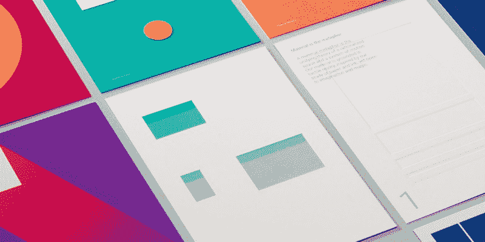
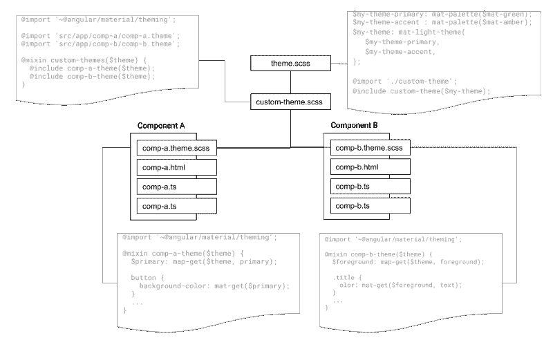

# 如何用棱角分明的材料制作定制主题

> 原文：<https://www.freecodecamp.org/news/how-to-make-a-custom-theme-in-angular-material-d47122a1e361/>

作者查尔斯·李

# 如何用棱角分明的材料制作定制主题



[Angular Material](https://material.angular.io/) 是一个伟大的库，为 Angular 2+实现了[材质设计](https://material.io/design/)。关于组件的用法，官方文档已经足够了，但是关于如何定制主题本身，特别是主题中使用的颜色的文章却很少。

在这篇文章中，我想总结一下这几个月来我从定制角度材质主题中学到的东西。

*注意本文不是关于 [AngularJS 材料](https://material.angularjs.org/latest/)，是用于 [AngularJS 1.x](https://angularjs.org/) 。*

### 相关职位

一些关于自定义主题的常见帖子有:

*   "[Theming your Angular Material app](https://material.angular.io/guide/theming)"定制主题官方指南，
*   由[托马斯·图拉真](https://medium.com/@tomastrajan?source=post_header_lockup)撰写的[棱角材料主题](https://medium.com/@tomastrajan/the-complete-guide-to-angular-material-themes-4d165a9d24d1)完全指南，其中提供了许多未记录的说明。**强烈推荐**。

我没有找到其他有用的帖子，如果有人能在评论中提供一些资源，我将不胜感激。

### 如何创建自定义主题

创建一个材质主题非常简单:你只需要选择三种颜色——原色**、**调**和**调**——棱角分明的材质会为你完成剩下的工作。[材质调色板页面](https://material.io/design/color/#tools-for-picking-colors)清楚地解释了它是如何工作的，你也可以用[颜色工具](https://material.io/tools/color/)直观地创建一个主题。**

关于代码，您需要做的就是创建以下主题文件:

```
// theme.scss@import '~@angular/material/theming';
```

```
$my-theme-primary: mat-palette($mat-green);$my-theme-accent : mat-palette($mat-amber);$my-theme-warn   : mat-palette($mat-red);
```

```
$my-theme: mat-light-theme(    $my-theme-primary,    $my-theme-accent,    $my-theme-warn);
```

然后你需要在你的主`style.scss`文件中应用这个主题:

```
@import "theme.scss";
```

```
@include mat-core();@include angular-material-theme($my-theme);
```

### 如何在组件中使用自定义主题

在创建了我们自己的主题之后，这样的需求将会增加:

> 我想创建一个文本框。文本颜色、背景颜色和边框颜色都应该来自我们自己的主题，而不是通过硬编码。

这个需求非常普遍——无论如何，能够在组件中使用正是我们想要创建自定义主题的原因。问题是怎么做。

#### 混合方法

我分享的第一份官方文件提出了一种使用 SCSS mixin 的方法。我称之为“自下而上”的方法，包括以下步骤:

1.  每个组件定义一个主题混合，并从`$theme`参数中检索颜色。
2.  一个全局`theme.scss`定义了定制主题，然后包含所有组件主题混合，并用定制主题调用它们。



除了上面提到的`theme.scss`定义，每个组件都需要创建一个主题文件，如下所示:

```
// src/app/comp-a/comp-a.theme.scss@import '~@angular/material/theming';
```

```
@mixin comp-a-theme($theme) {          // define mixin  $primary: map-get($theme, primary);  // retrieve color def  button {                             // apply theme to component    background-color: mat-color($primary);  }}
```

您可能想要一个`custom-theme.scss`来导入所有的组件级主题:

```
// src/app/custom-theme.scss@import '~@angular/material/theming';@import 'src/app/comp-a/comp-a.theme';@import 'src/app/comp-b/comp-b.theme';
```

```
@mixin custom-themes($theme) {  @include comp-a-theme($theme);  @include comp-b-theme($theme);}
```

然后将上面的`custom-theme.scss`导入到你的`theme.scss`中:

```
// theme.scss...@import './custom-theme';@include custom-themes($my-theme);
```

这种层次结构是可行的，并且可能是当你需要支持多个主题时的唯一方式。

然而，大多数时候我们只支持一个主题，使用 mixin 可能会很麻烦。这种方法主要有三个缺点:

1.  每个颜色参考都需要一个单独的`.theme.scss`文件。
2.  必须确切知道哪些组件提供自定义主题。这造成了不必要的依赖性。
3.  最重要的是，组件级主题文件没有被封装。

第一点和第二点是不言自明的。让我解释一下第三点。这就涉及到一些叫做“视图封装”的背景知识。

Angular 使用一种叫做“T0”视图封装“T1”的技术来“T2”保持组件 CSS 在本地“T3”。换句话说，为一个组件定义的规则将保留在该组件中，不会影响其他组件。

这样，您可以在组件中自由定义 CSS 类名，而不用担心命名冲突。但是，只有通过`@Component`，即`@Component({ styleUrls: ['./comp-a.scss'] })`定义 CSS，才会进行视图封装。

至于我们的自定义主题文件`comp-a.theme.scss`，由于它是由`custom-theme.scss`、*直接导入的，它的规则没有被封装*，所以它将适用于页面上的所有元素。在上面的例子中，我使用了下面的代码(这是错误的！):

```
@mixin comp-a-theme($theme) {  button { ... }    // This will apply to ALL buttons!}
```

但这会将样式应用于所有按钮，而不是只属于`comp-a`的按钮。你必须做一些类似于`comp-a button`的事情来使这个工作正常进行。

#### 直接的方法

因此，我提出一个更好的方法。我们让每个组件都包含主题文件并直接使用颜色定义，而不是使用 mixin。

在这种方法中，组件主题文件将如下所示:

```
// NOTE: just do this in your regular scss file.// No need to create separate theme file!// src/app/comp-a/comp-a.scss@import 'src/theme.scss';
```

```
$primary: map-get($my-theme, primary);button {  background-color: mat-color($primary);}
```

仅此而已。

让我们看看这是如何工作的。首先，主题相关的规则被放入组件 SCSS 文件中，因此不需要额外的组件级主题文件。其次，main `theme.scss`不需要知道组件级的主题(因为它不需要导入它们)，所以一个简单的主题定义就足够了。第三，组件 SCSS 文件与`@Component`一起使用，因此它被正确封装，这意味着我们可以简单地为`button`定义规则。

### 预定义的主题键

大概你已经注意到下一个问题了。以上主题文件(`map-get($my-theme, primary)`)中的`foreground`、`primary`是什么？有我能用的其他钥匙吗？

这些“钥匙”指的是主题中定义的不同颜色。然而我找不到任何解释这些“密钥”的文档，所以我能找到的唯一方法就是*阅读源代码*。(虽然都说好的程序员应该读代码，*让*读代码对一个库来说绝对不是一个好兆头。)

打开`node_modules/@angular/material/_theming.scss`，你会看到这些键的定义。为了以后参考，我在这里总结一下关键。

```
$theme  |- primary  |- accent  |- warn  |- foreground  |   |- base  |   |- divider  |   |- dividers  |   |- disabled  |   |- disabled-button  |   |- disabled-text  |   |- hint-text  |   |- secondary-text  |   |- icon  |   |- icons  |   |- text  |   |- slider-min  |   |- slider-off  |   `- slider-off-active  |- background  |   |- status-bar  |   |- app-bar  |   |- background  |   |- hover  |   |- card  |   |- dialog  |   |- disabled-button  |   |- raised-button  |   |- focused-button  |   |- selected-button  |   |- selected-disabled-button  |   |- disabled-button-toggle  |   |- unselected-chip  |   `- disabled-list-option  `- is-dark         // bool, whether dark theme or not
```

例如，如果要在组件中呈现禁用的文本，可能需要使用以下代码:

```
$foreground: map-get($my-theme, foreground);.disabled-text {  color: mat-color($foreground, disabled-text);}
```

好了，这些是我从与角状物质的斗争中学到的一些经验。如果你正面临类似的问题，希望这篇文章对你有所帮助。