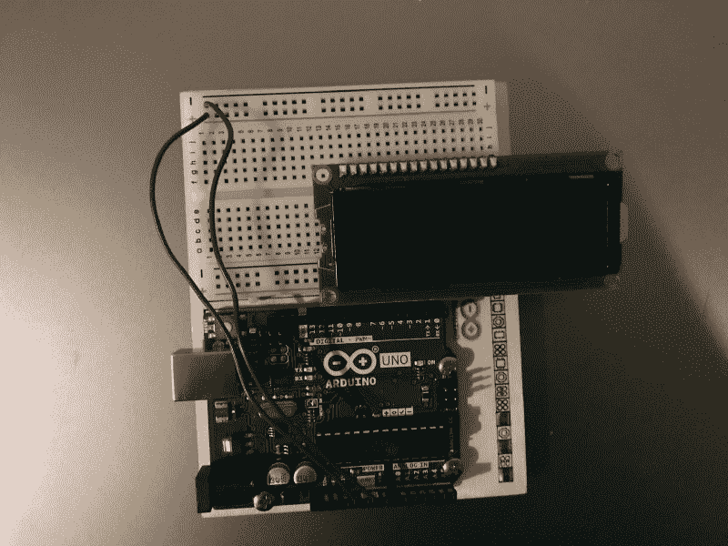
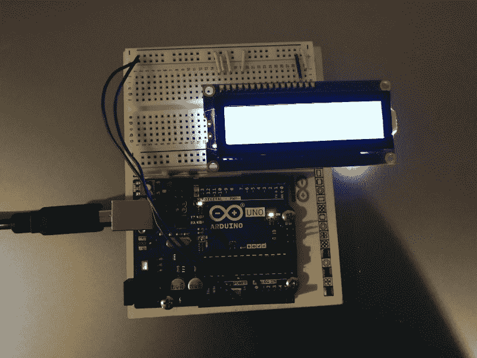
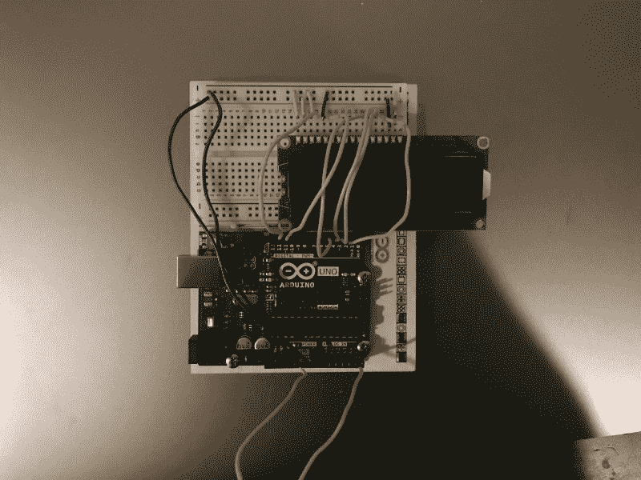
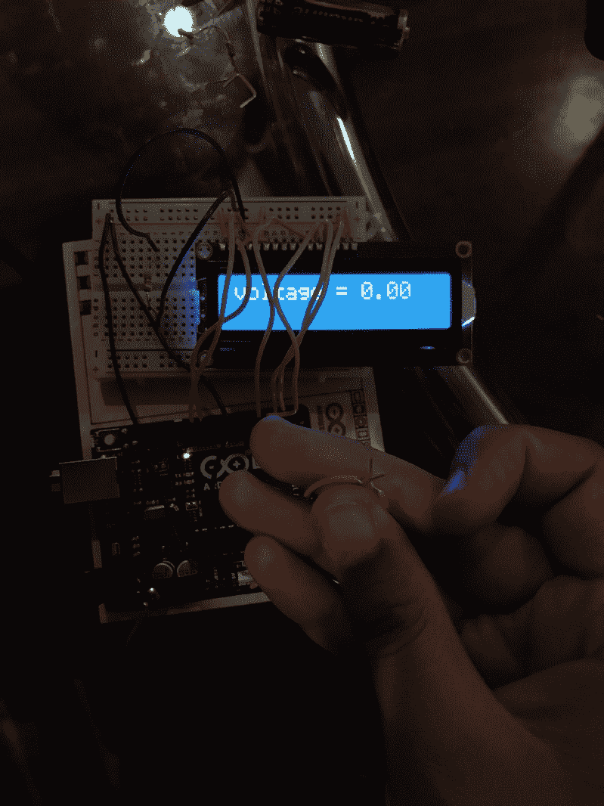
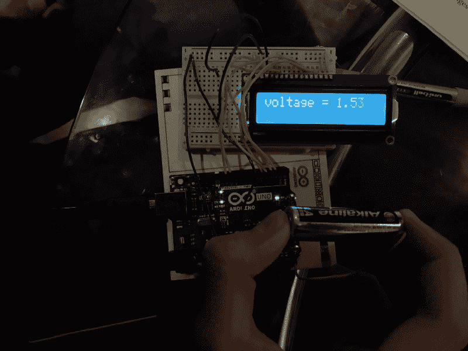

# 如何用 Arduino 制作数字电压表

> 原文：<https://www.freecodecamp.org/news/how-to-make-a-digital-voltmeter-using-arduino-b4dbf5b94d6f/>

作者 Harshita Arora

# 如何用 Arduino 制作数字电压表

上周日，当我向我的室友解释电子和 Arduino 的基础知识时，她挑战我理解电压表的工作原理，并使用我已经拥有的东西从头开始构建一个电压表。我接受了挑战，开始破解、编码、测试、再编码、再测试，最后我在晚餐时间准备好了我的电压表并开始工作！

我使用了 Arduino Uno(收集模拟电压并为 LCD 供电)，一个我在 Arduino 初学者工具包中获得的小 LCD 屏幕(显示电压)，一个试验板(连接一切)，以及跳线。

如果你正在寻找一个简单的项目来学习电子学，那么制作一个数字电压表会很有趣。我们开始吧！

### **电路**

#### 第一步

拿一个试验板(我用的是 30 排的小试验板)并连接一个 LCD 屏幕。然后用一根线，将一根线从 Arduino 上的 GND 引脚(接地状态)连接到试验板上的负电荷，另一根线从 5V 引脚连接到正电荷。这为试验板上的列提供了电流，我们现在可以将它连接到 LCD。



This is the basic setup after Step 1.

#### 第二步

现在，我们将 LCD 上的引脚连接到试验板，这样我们就可以给它通电。将 LCD 的引脚 1 连接到负电荷，引脚 2 连接到正电荷，引脚 3 连接到负电荷，引脚 5 连接到负电荷，引脚 15 连接到正电荷，引脚 16 连接到负电荷。插入 Arduino 进行测试，看看 LCD 是否打开！



The LCD lights up!

#### 第三步

让我们将 LCD 连接到 Arduino，这样我们就可以在 LCD 上显示电压(我们将从模拟引脚收集电压)。将 LCD 的引脚 4、6、11、12、13 和 14 连接到 Arduino 上的任何数字引脚(例如，引脚 2)。然后将一根导线放入 GND，另一根放入模拟引脚，如 A5。这两根电线现在是您的探针引线。



Finished electric circuit!

我们现在完成了电子/硬件。让我们继续看代码。

### **代码**

代码非常简单。我们只想收集 Arduino 在引脚 A5(或任何其他模拟引脚)接收的模拟信号，并将其转换为数字信号。然后我们想在 LCD 屏幕上显示结果。

这是您可以复制粘贴的代码。

```
#include <LiquidCrystal.h> int Vpin=A5;float voltage;float volts;LiquidCrystal lcd(12, 11, 5, 4, 3, 2);
```

```
void setup() {Serial.begin(9600);lcd.begin(16,2);}
```

```
void loop() {
```

```
voltage = analogRead(Vpin); volts = voltage/1023*5.0; Serial.println(volts);lcd.print(“voltage = “);lcd.print(volts);delay(200);lcd.clear();}
```

这是怎么回事？

所以我们首先导入 LCD 库，然后创建一个名为 Vpin 的变量(这将是从 A5 收集的电压)。接下来，我们为电压创建另外两个变量，然后创建一个 LiquidCrystal 类型的变量。最后，我们用串行监视器进行设置(这是 Arduino 中非常有用的工具！有点像调试控制台)，将模拟电压转换为数字电压，并将该值打印(显示)到 LCD 屏幕上。

就是这样！去测试各种电池和点！以下是我做的一些测试的照片:



Neutral wires.



Testing a 1.5V AA battery.

此外，如果您想使 LCD 上的读数更清晰，请在引脚 3 的路径上放置一个 1k 欧姆的电阻(用于对比度调整)。通过限制流向那个管脚的电流，你可以提高屏幕的对比度。

**同样重要的注意事项**:在这个电压表中，你测试的任何电压都将作为 Arduino 的直接输入，所以你应该只测试 Arduino 可以安全处理的电压范围内的东西(0-5V)。用 9V 电池测试会烧坏你的 Arduino。

感谢这个[视频教程](https://youtu.be/OZM6wm16uPU)帮我弄清楚了电路。特别感谢我的朋友[尼克·阿恩](https://twitter.com/nickarner)和[约翰尼·王](https://twitter.com/johnny___wang)帮我修理东西。感谢劳拉·戴明的挑战！:)

更多关于电子/硬件和脑机接口的文章和教程正在路上！:D

如果你有反馈要分享，请随时给我发电子邮件到 harshita@harshitaapps.com。我期待收到你的来信！