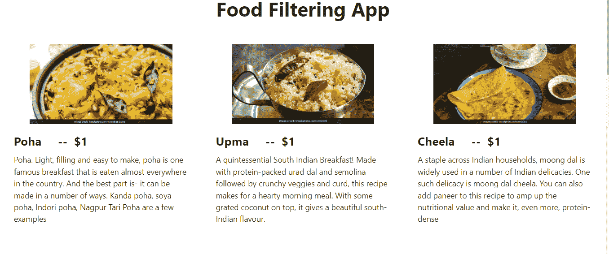
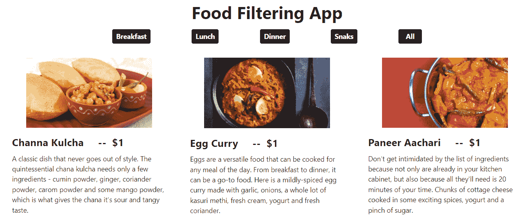

# 如何在 React 中制作过滤器组件

> 原文：<https://www.freecodecamp.org/news/how-to-make-a-filter-component-in-react/>

过滤器组件在网站上很有用，因为它们可以帮助用户快速方便地找到他们需要的结果。

如果你的数据来自一个 API，尤其如此，因为用户不能浏览你的应用程序所提供的一切。

在本文中，我们将使用我们硬编码的虚拟数据，并像数组一样保存在一个名为 **Data.js.** 的单独组件中

**我们将在此介绍的内容:**

1.  入门指南
2.  创建我们的 React 应用
3.  使用钩子从 Data.js 获取数据
4.  致力于我们应用程序的用户界面
5.  制作过滤器组件
6.  包扎

## 入门指南

对于这个特定的项目，我们将使用虚拟食品数据，它包含几个键值对，如以下代码所示:

```
const Data = [
  {
    id: "1",
    title: "Poha",
    category: "Breakfast",
    price: "$1",
    img: "https://c.ndtvimg.com/2021-08/loudr2go_aloo-poha_625x300_05_August_21.jpg?im=FeatureCrop,algorithm=dnn,width=620,height=350",
    desc: " Poha. Light, filling and easy to make, poha is one famous breakfast that is eaten almost everywhere in the country. And the best part is- it can be made in a number of ways. Kanda poha, soya poha, Indori poha, Nagpur Tari Poha are a few examples",
  },
  {
    id: "2",
    title: "Upma",
    category: "Breakfast",
    price: "$1",
    img: "https://c.ndtvimg.com/2021-04/37hi8sl_rava-upma_625x300_17_April_21.jpg?im=FeatureCrop,algorithm=dnn,width=620,height=350",
    desc: " A quintessential South Indian Breakfast! Made with protein-packed urad dal and semolina followed by crunchy veggies and curd, this recipe makes for a hearty morning meal. With some grated coconut on top, it gives a beautiful south-Indian flavour.",
  },
  {
    id: "3",
    title: "Cheela",
    category: "Breakfast",
    price: "$1",
    img: "https://c.ndtvimg.com/2019-05/1afu8vt8_weight-loss-friendly-breakfast-paneer-besan-chilla_625x300_25_May_19.jpg?im=FaceCrop,algorithm=dnn,width=620,height=350",
    desc: "A staple across Indian households, moong dal is widely used in a number of Indian delicacies. One such delicacy is moong dal cheela. You can also add paneer to this recipe to amp up the nutritional value and make it, even more, protein-dense",
  },
  {
    id: "4",
    title: "Channa Kulcha",
    category: "Lunch",
    price: "$1",
    img: "https://i.ndtvimg.com/i/2015-04/chana-kulcha_625x350_41429707001.jpg",
    desc: "A classic dish that never goes out of style. The quintessential chana kulcha  needs only a few ingredients - cumin powder, ginger, coriander powder, carom powder, and some mango powder, which is what gives the chana its sour and tangy taste.",
  },
  {
    id: "5",
    title: "Egg Curry",
    category: "Lunch",
    price: "$1",
    img: "https://i.ndtvimg.com/i/2017-11/goan-egg-curry_620x350_41511515276.jpg",
    desc: "Eggs are a versatile food that can be cooked for any meal of the day. From breakfast to dinner, it can be a go-to food. Here is a mildly-spiced egg curry made with garlic, onions, a whole lot of kasuri methi, fresh cream, yogurt, and fresh coriander.",
  },
  {
    id: "6",
    title: "Paneer Aachari",
    category: "Lunch",
    price: "$1",
    img: "https://i.ndtvimg.com/i/2015-04/paneer_625x350_61429707960.jpg",
    desc: "Don't get intimidated by the list of ingredients because not only are already in your kitchen cabinet, but also because all they'll need is 20 minutes of your time. Chunks of cottage cheese cooked in some exciting spices, yogurt and a pinch of sugar.",
  },
  {
    id: "7",
    title: "Fish Fry",
    category: "Dinner",
    price: "$1",
    img: "https://i.ndtvimg.com/i/2015-06/indian-dinner_625x350_41434360207.jpg",
    desc: "Get your daily dose of perfect protein. Pieces of surmai fish marinated in garlic, cumin, fennel, curry leaves, and tomatoes are pan-fried in refined oil and served hot. This fish fry recipe has a host of delectable spices used for marination giving it a unique touch.",
  },
  {
    id: "8",
    title: "Dum Alloo",
    category: "Dinner",
    price: "$1",
    img: "https://i.ndtvimg.com/i/2015-06/indian-dinner_625x350_51434362664.jpg",
    desc: "Your family will thank you for this fantastic bowl of dum aloo cooked Lakhnawi style. Take some potatoes, crumbled paneer, kasuri methi, butter, onions, and some ghee.",
  },
  {
    id: "9",
    title: "Malai Kofta",
    category: "Dinner",
    price: "$1",
    img: "https://i.ndtvimg.com/i/2017-10/makhmali-kofte_620x350_51508918483.jpg",
    desc: "A rich gravy made of khus khus, coconut and milk that tastes best with koftas made from khoya. This velvety and creamy recipe will leave you licking your fingers. Makhmali kofte can be your go-to dish for dinner parties as this is quite different from other kofta recipes and extremely delicious.",
  },
  {
    id: "10",
    title: "Malai Kofta",
    category: "Snaks",
    price: "$1",
    img: "https://i.ndtvimg.com/i/2017-10/makhmali-kofte_620x350_51508918483.jpg",
    desc: "A rich gravy made of khus khus, coconut and milk that tastes best with koftas made from khoya. This velvety and creamy recipe will leave you licking your fingers. Makhmali kofte can be your go-to dish for dinner parties as this is quite different from other kofta recipes and extremely delicious.",
  },
];

export default Data; 
```

在这些键值对中，我们还有一个用于过滤结果的类别。

我们将使用 bootstrap 作为这个项目的 CDN 来设计我们的应用程序。

学完本教程后，您应该了解更多关于如何在 React 中制作和导入组件，如何动态使用数据，以及最重要的是如何在父组件和子组件之间传递和使用道具。

## 如何创建我们的 React 组件

创建 React 应用程序非常简单——只需在任何首选 IDE 中进入您的工作目录，并在终端中输入以下命令:

```
npx create-react-app react-filter-app
```

如果你不确定如何正确设置一个 create-react-app 项目，你可以参考官方指南，网址是 [create-react-app-dev](https://create-react-app.dev/docs/getting-started/) 。‌‌

设置完成后，在同一个终端中运行 **`npm start`** 来启动 localhost:3000，我们的 React 应用程序将在这里托管。我们也可以在那里看到我们所有的变化。

## 如何使用钩子从 Data.js 中获取数据

现在我们已经成功地设置了 React 项目，是时候从 Data.js 获取数据并在我们的 UI 中使用它了。

为此，我们首先需要在我们的 **App.js** 组件中导入我们的数据，然后使用 useState 钩子来管理我们数据的状态。

```
import React, { useState } from "react";
import Data from "./Data";
import Card from "./Card";

const App = () => {
  const [item, setItem] = useState(Data);
  return (
    <>
      <div className="container-fluid">
        <div className="row">
          <h1 className="col-12 text-center my-3 fw-bold">Our Menu</h1>
          <Card item={item} /> // UI Component
        </div>
      </div>
    </>
  );
};

export default App; 
```

## 如何构建我们的应用程序的 UI 部分

现在，我们将数据存储在一个变量中，可以在应用程序中自由使用，我们可以在 UI 上工作。

UI 将包含[引导卡](https://getbootstrap.com/docs/5.0/components/card/)，我们将使用 map 函数动态制作。

我们将为我们的卡制作不同的组件。你可以在上面的代码中看到，我们已经将其命名为 **Card.js** ，并且也已经导入了它。我们还传递了**项**作为道具，这样我们就可以在卡片组件中使用该项中存储的数据。

该组件将包含我们所有的卡片和数据，我们将使用**地图功能在我们的应用程序中动态显示这些数据。**

```
import React from "react";

const Card = ({ item }) => {            
           // destructuring props
  return (
    <>
      <div className="container-fluid">
        <div className="row justify-content-center">
          {item.map((Val) => {
            return (
              <div
                className="col-md-4 col-sm-6 card my-3 py-3 border-0"
                key={Val.id}
              >
                <div className="card-img-top text-center">
                  
                </div>
                <div className="card-body">
                  <div className="card-title fw-bold fs-4">
                    {Val.title} &nbsp;&nbsp;&nbsp;&nbsp;--&nbsp;&nbsp;
                    {Val.price}
                  </div>
                  <div className="card-text">{Val.desc}</div>
                </div>
              </div>
            );
          })}
        </div>
      </div>
    </>
  );
};

export default Card; 
```

我们有 10 张卡片的应用程序看起来是这样的:



## 如何制作过滤器组件

有许多方法可以使用过滤器组件来过滤掉用户从搜索结果中获得的数据。但在这里，我们将为此制作按钮，它将根据食物的类别过滤出数据，如早餐、午餐、晚餐和小吃。

我们必须创建一个新的数组，只包含键类别的值，并使用 map 方法显示它们。

```
// spread operator will display all the values from our category section of our data while Set will only allow the single value of each kind to be displayed

  const menuItems = [...new Set(Data.map((Val) => Val.category))];
```

我们在这里使用了 **spread 操作符**,这样我们通过显示上面的数组获得的每个值都有相同的 UI，并且将所有 10 个类别显示为按钮。

我们使用 **`Set()`** 值，以便只显示 3 或 4 个唯一的值，并确保没有重复的值。

我们将为这些按钮创建一个新组件，它将使用 map 方法动态显示。但是这一次我们将使用我们新形成的数组，因为它将所有类别存储在一个数组中，并且由于 **Set()** 的缘故，将只显示它们一次。

```
import React from "react";
import Data from "./Data";

const Buttons = ({ setItem, menuItems }) => {
  return (
    <>
      <div className="d-flex justify-content-center">
        {menuItems.map((Val, id) => {
          return (
            <button
              className="btn-dark text-white p-1 px-2 mx-5 btn fw-bold"
              key={id}
            >
              {Val}
            </button>
          );
        })}
        <button
          className="btn-dark text-white p-1 px-3 mx-5 fw-bold btn"
          onClick={() => setItem(Data)}
        >
          All
        </button>
       </div>
    </>
  );
};

export default Buttons; 
```

将此按钮组件放在要显示按钮的位置。在我们的例子中，我们在 app.js.
中的卡组件上方显示了按钮



是时候在这些按钮中添加一个过滤器了，这样它们可以根据类别过滤出菜肴。

```
const filterItem = (curcat) => {
    const newItem = Data.filter((newVal) => {
      return newVal.category === curcat; 
        	// comparing category for displaying data
    });
    setItem(newItem);
  };
```

filter 方法根据对象的类别过滤出数据。

使用`onClick()`事件处理程序，我们可以将这个过滤器附加到按钮上:

```
import React from "react";
import Data from "./Data";

const Buttons = ({ filterItem, setItem, menuItems }) => {
  return (
    <>
      <div className="d-flex justify-content-center">
        {menuItems.map((Val, id) => {
          return (
            <button
              className="btn-dark text-white p-1 px-2 mx-5 btn fw-bold"
              onClick={() => filterItem(Val)}
              key={id}
            >
              {Val}
            </button>
          );
        })}
        <button
          className="btn-dark text-white p-1 px-3 mx-5 fw-bold btn"
          onClick={() => setItem(Data)}
        >
          All
        </button> 
       </div>
    </>
  );
};

export default Buttons; 
```

## 包扎

我们有很多方法可以使用过滤器组件来减少用户在应用程序中搜索理想结果的时间。

我们在这个应用程序中使用的数组中只有 10 个对象，但很多时候我们从 API 中获取数据，那里可能有大量的数据。在这些情况下，只进行一次搜索通常不能给出准确的结果，所以我们使用过滤器来帮助。

你可以在 [GitHub Repo](https://github.com/Ateevduggal/Filter-Menu-in-React) 中看到完整的代码，并且你可以通过应用程序的[实时链接](https://filter-menu-in-react.vercel.app/)来检查这些过滤器按钮是如何工作的。

你也可以浏览我的其他项目:

1.  [如何使用钩子在 React 中制作分页组件](https://tekolio.com/how-to-make-custom-pagination-in-react-js-with-hooks/)
2.  [如何使用钩子在 React 中制作字典 App](https://tekolio.com/how-to-create-a-dictionary-app-in-react/)
3.  [如何在带有自定义域的 GitHub 页面上托管 React App](https://tekolio.com/how-to-host-a-react-app-on-github-pages-with-a-custom-domain/)